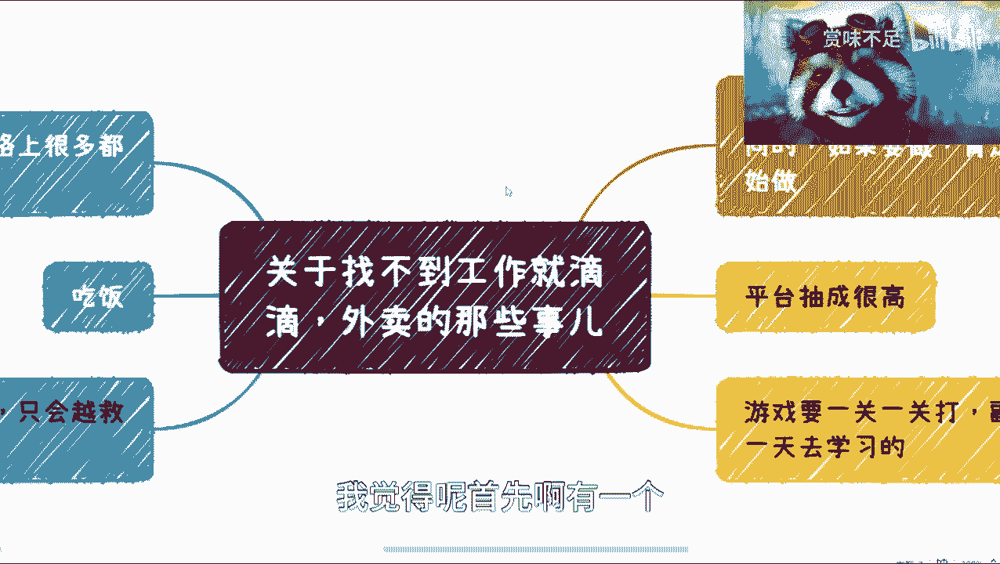
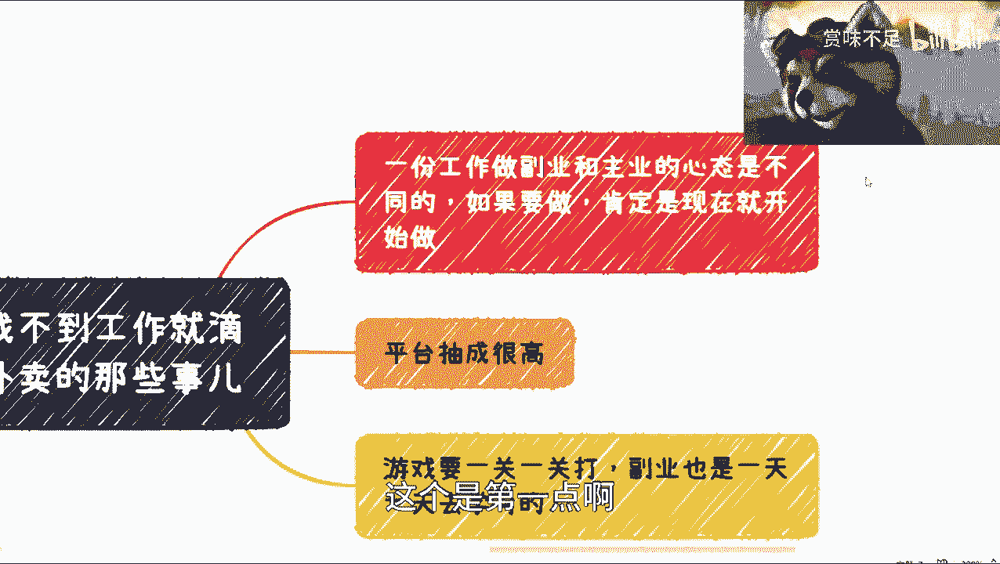
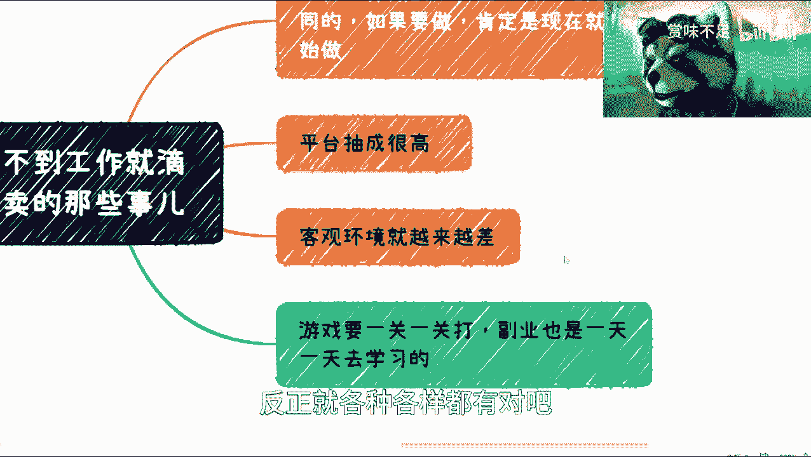
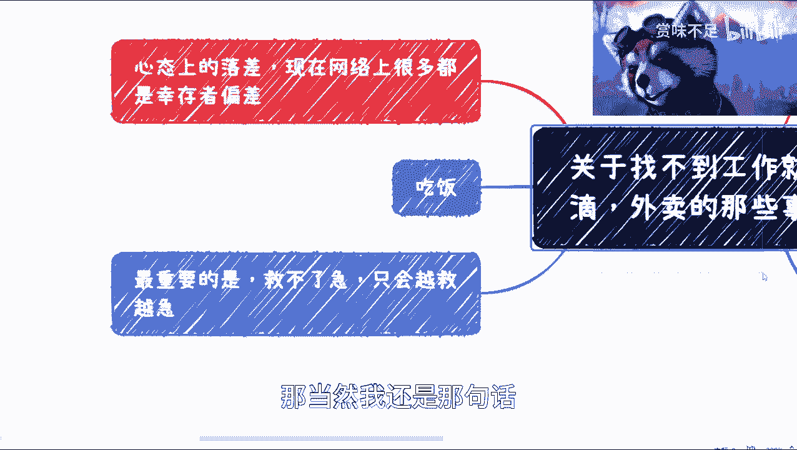
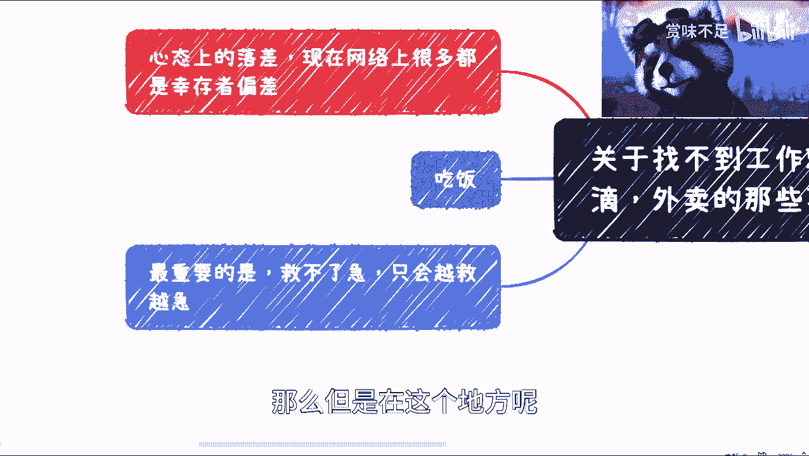
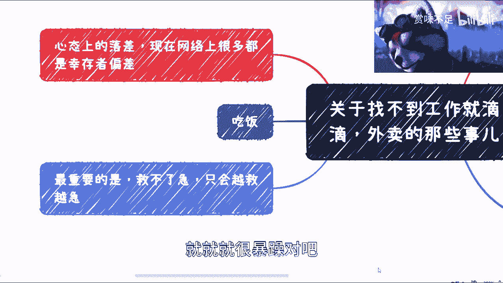

# 关于“我找不到工作就做滴滴、外卖等”这事儿 - P1 - 赏味不足 - BV1rk4y187fn

好啊大家好呃，根据上几期的内容呢，我对吧，就这一期还是先讲一下，这个关于找不到工作对吧，就找滴滴外卖的这个事儿啊，呃我呢之前是注册过那个滴答对吧，就那个顺风车啊，我是注册过的嗯。

但是呢我在这个地方得要说一嘴啊，这个虽然滴滴外卖我也的确没做过，但是呢这个对应的一些这个内容啊，包括我路上就跟别人聊下来，我也略知一二啊。

所以我就分享一下，如果有讲的不对吗，反正大家评论区可以说一下。

我觉得呢首先啊有一个大的前提啊，大的前提是什么呢。

就是说我们千万不要觉得你说啊实在不行，就去对吧，兼职对吧，就是怎么样，这个话呢，其实网络上舆论很多，但是没有必要。

就是说因为网络上这个东西呢，呃我这个地方也写了，我说网络上这个东西很多是幸存者偏差对吧，什么意思呢，就是说他总归会把那把1%的东西，放大对吧，让让大家忽略那99%的可能性对吧。

你就好像这个这个这个你你看啊，最近这个新闻上面都会说啊，九五后零零后对吧，说什么到老家了啊，然后什么辞掉了什么什么工作啊，然后做做了一年什么什么东西啊，然后年收入怎么样怎么样怎么样对吧，这个没有问题啊。

但是你说是不是比如说我们所有人都能这样，那肯定不是啊对吧，这就像很多人我跟很多人说，我说我说你们说我创业对吧，我说你们看到的成功的那是多少啊对吧，人家背后这失存遍野对吧。

躺在那边这死的透透的还有多少啊对吧。

我我说你们得要这么去想啊，那么这个是一方面，第一个方面呢就是说你一个工作啊，你当他副业的时候，跟主业手心态肯定是不一样的啊，就你如果要做，我觉得呢你现在就可以做了啊，你不要说你等到什么失业再去做对吧。

你也不要说等到什么，比如说啊失业前两三个月再去做，我跟你们讲来不及的，你们心态肯定是不一样的对吧，这就好像你说我现在做那个作风工作啊，我有房贷对吧，你说我要没房贷啊，我躺平哎，我做啥工作不做对吧。

你爱咋地咋地，你就不能帮我开了，那你说我有房贷，那心态能一样吗是吧，那就不一样啊啊啊。

我觉得嗯是吧，这个是第一点啊。

第二点呢就是我跟很多这种司机聊下来的，这平台出身很高，的确很高，而且吧就是嗯按照他们的跟我的说法呢，在疫情期间，或者来说像就是现在可能人流就是出差啊，或者人流量也不是说非常高的情况下面啊。

那么他们就觉得就是说其实一天跑下来，可以跑呃，但是呢好像就是说他们的这个所在公司呢，对他们也会有一些额外的要求，其实这也很正常嘛，就资本家对你这个这个劳动力的压榨嘛对吧，但是呢按照他们的说法呢。

他们意思就是说，往往呢一天如果来说这个单子接的不够多啊，呃他其实还是倒贴的，因为它为什么倒贴呢，是因为在这个里面他还得计算上他的，比如说邮费啊，包括他吃饭的钱包怎么样对吧，那当然你们也可以说啊。

你说啊我减肥对吧，我可以不吃对吧，或者怎么样，就你一天两天没问题啊，但是你要明白就是做滴滴，做外卖或者做别的，第一个就这就是个日程，那个长期的一个事情对吧，那你不可能长久都是这样子的啊。

你总归会有一定的成本在这里面的啊。

然后这又是一块，然后还有一块呢就是大家可以到网上去看一下，就是别人做外卖，美团啊，滴滴啊这些经验你们可以去看啊，就是还有很多的这种就是坑在里面啊，比如说什么你一定不能提前这个点送达对吧。

你一定什么一定要高热呃，这个高峰的时候去送对吧，一定要熟悉，就千万不要去送一些商场对吧等等等啊。

对我在这个里面其实少写了一个哎呀，我再写一下啊，就是这个客观环境诶，客观环境其实呃就越来越差吧，可能嗯我先继续先说这个就是这个东西呢，你会发现其实你的学习也是可能，从目前网上爆出来的情况呢。

我估计得有个一两个月啊，你得怎么样就有很多这种叫做小细节啊，然后呢他差不多给出来一天的这个收入呢，差不多是在呃五六十块钱，那五六十块钱，那么你算一下五六十块钱，30天你天天都做，那差不多是诶不对呀。

他一天就五六十块钱好吧，那那可能是一开始做的问题，anyway啊，那不管怎么样，就是说呃其他我也看到过，就是他有过一个月大概是1万多对吧，1万1万0几，1万2000多也有的。

但是呢1万0几1万2000多，他也说了，就是你可能一直在送，就忙成狗的那种对吧，那我觉得这个可能也是也是一方也是一块对吧。

另外一块呢就是说你其实是有心态落差的，这个我觉得不得不说就是我相信所有的人啊，你们去做，包括我去做，我觉得都可以去做，但是所有人的心态落差，其实这肯定是有的对吧，你心里面肯定是有这个落差的对吧。

那么是不是说所有人都能克服这个落差呢，这个我就不好说了对吧，所以我觉得大家就自己也可以就评估一下对吧，就不能说啊。

这个好像感觉有条后路对吧，或者怎么样，然后呢就是我觉得这个地方我写了个吃饭吃饭，这个东西呢其实呃也蛮难的，就是你到底吃什么，怎么吃对吧，然后你是不是能按时吃对吧，你身体还是第一位的对吧。

这是漫展的蛮难的，包括因为现在你吃饭吃什么，就是你你你可能很多地方，就是比如说他没有那种工作餐对吧，就是那种起步费，就是那种什么十几块就20块钱的，那你肯定也不舍得对吧，当然你现在是舍得的。

你到时候去做滴滴外卖，你肯定就不舍得了对吧，然后还有你说前两天我还看那个视频，说老相机老乡鸡，现在老乡都吃不起来是吧。

老乡鸡越来越贵了对吧，然后还有一点呢，我说这个客观客观环境是指什么意思啊，你们可以去看，就最近呢其实关于这种外卖啊，呃滴滴其实还好，就外卖的这种新闻其实很多，就是最近又说了。

就是说什么什么地下商场不让进了对吧，然后什么什么某某小区不让进了对吧，怎么样，就这种呢，虽然你说这个社会上歧视啊，不能有歧视对吧，但是这种歧视你没办法，但门口保安都不让你进，你怎么办呢，对吧。

你说你现在就要送个单单，这个单马上就要超时了对吧等等等，那这种呢我觉得可能嗯，我个人觉得可能在往未来呢，他可能这个环境越来越差，就这个环境并不是只说这个这个政策上面，会对外卖不利对吧，或者怎么样。

但是而是说那种商城啊，或者其他的，他可能就越来越卷，他就是就是就是说啊我们要这个美名其曰对吧，说好这个这个这个这个维护治安对吧，保护环境啊，各种各样的原因，反正就各种各样都有对吧。

他他就不会说歧视你对吧，反正就这么个情况，然后我这边在写呢，其实最重要的一点是什么呢，就是本质上啊，其实我觉得大部分的呃这个同学啊，也不见得一定会去。

那当然我还有那句话，这个不是说呃骑士滴滴或外卖，因为我觉得很多人的确不适合做。

他做不了啊，他做不了，那么但是在这个地方呢。

我觉得还有一点就是一定要明白，最重要的是，如果你不是一个熟练工啊，如果你不是一个经验丰富的啊，我意思是那么你要明白他是救不了级的啊，他救不了级的，你不能说啊，我今天比如说啊一下子家家里面有些事情啊。

你说我急用钱对吧，那么我可能就是说啊，这个可能当下比如说找不到合适工作。

那我就去做了对吧，那你会发现你心态是个很焦躁的心态。

你去做这个东西，你会越做越急啊，你越做越急，越做越就是说这个就觉得不太行啊，或者自己不适合对吧，就就就很暴躁对吧。

所以呢其实其实我是觉得，尤其是呃就是现在共享经济的这一部分的副业，他往往就是要做到什么呢，就是说你得尽心的去规划你的路线，你得静心的去看你到底怎么，因为因为我觉得这个巨大区别在哪里。

就是你能不能找到一个你跟别人的区别点对吧，那你说你要是也是说大家就是拼呃，人海战术对吧，你说我也是拼时间，那你一天就24小时，对方也是24小时，那你凭什么比对方赚的多呢对吧，然后你说你说你比对方努力。

那我也不认为，你说我们这种以前做坐办公室的或者上班的，你说你后来去做，你能比人家努力，我也不相信啊。

我真不相信对吧啊，所以我是觉得呢就是说就是为什么做这一期呢，是因为微就是微博上有很多人，包括网上有很多人，他觉得这件事情是一件非常轻松的事情啊，但是事实上其实根据我们的聊下来，并不是这样子的。

而且反而就是说呃道道坑也很多啊，所以千万不要去觉得好像那个什么好像就说啊，这个不行啊不行，我就滴滴对吧，但大不了就是就是那种就是你看我能屈能伸，不好意思啊，不好意思。

我真的不认为很多人能能做到能屈能伸啊。

