# 课程：关于“找不到工作就做滴滴、外卖”的思考 - P1 🚗🍱

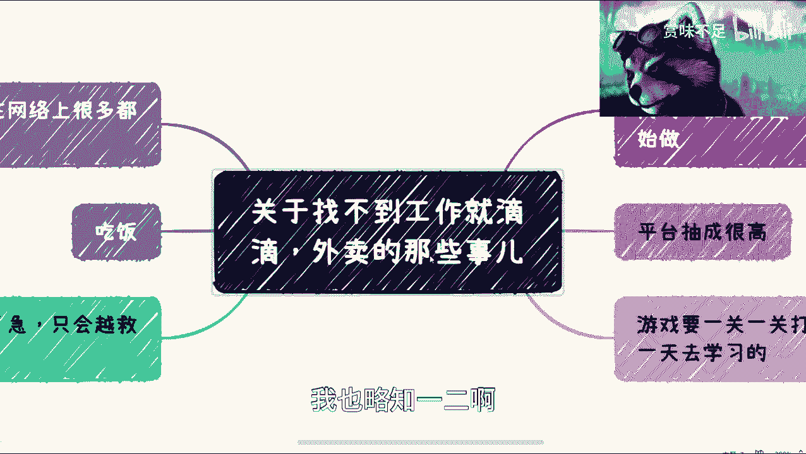

在本节课中，我们将要学习关于将网约车司机或外卖员作为失业后备用职业选择的现实考量。我们将分析其背后的前提、实际收入、潜在成本、心态挑战以及客观环境，帮助你更全面地评估这一选项。

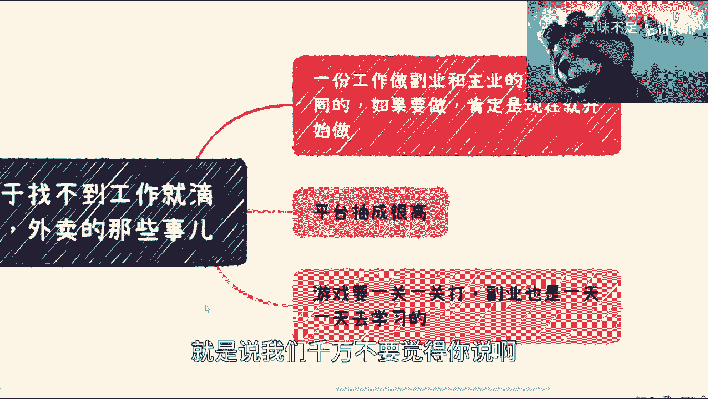

---

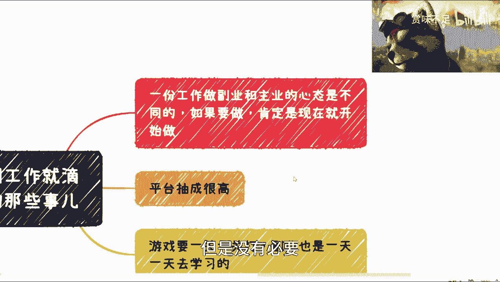

## 核心前提：破除“幸存者偏差” 🎯

上一节我们介绍了课程主题，本节中我们来看看讨论此事的一个核心前提。

网络上存在一种普遍观点，认为“实在不行，就去兼职开滴滴或送外卖”。这种舆论很多，但我们需要理性看待。网络信息往往存在**幸存者偏差**，即人们倾向于关注和传播那1%的成功或特殊案例，而忽略了99%的普通或失败情况。

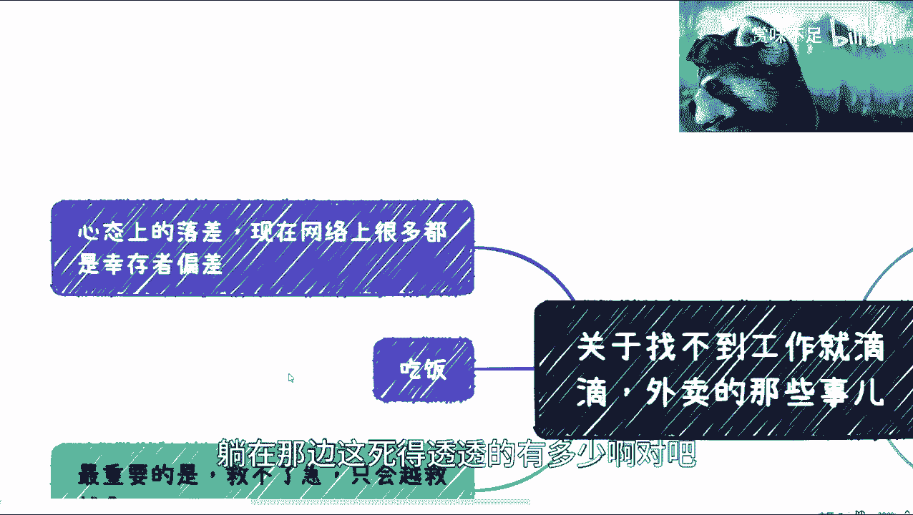

例如，新闻常报道“95后、00后回老家，辞去工作从事某项事业后年入百万”的故事。这本身没有问题，但绝不意味着所有人都能复制这种成功。这就像创业，人们只看到成功的少数，而忽略了背后“尸横遍野”的失败者。

因此，我们首先需要破除将此类工作视为“轻松退路”的幻想。

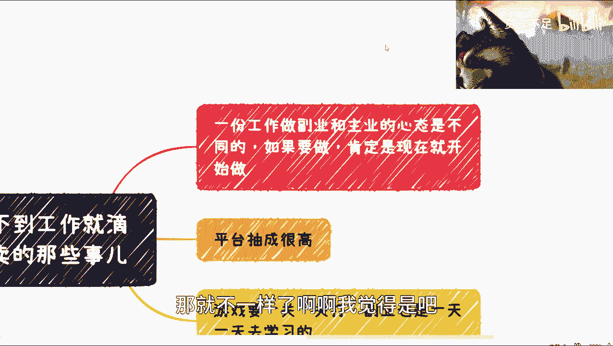

---

## 副业与主业：心态截然不同 💡

理解了前提后，我们来看看从事这类工作的第一个现实挑战：心态。

一项工作作为**副业**和作为**主业**时，从业者的心态完全不同。如果你考虑将其作为失业后的选择，那么现在就应该开始尝试，而不是等到失业后再做。提前两三个月准备也可能来不及，因为心态已经因经济压力（如房贷）而改变。

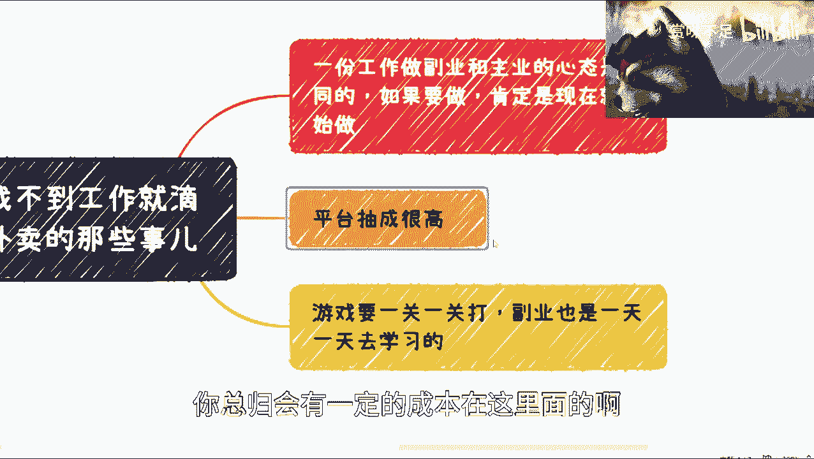

**心态差异公式**可以简化为：
`有经济压力时的心态 ≠ 无经济压力时的心态`

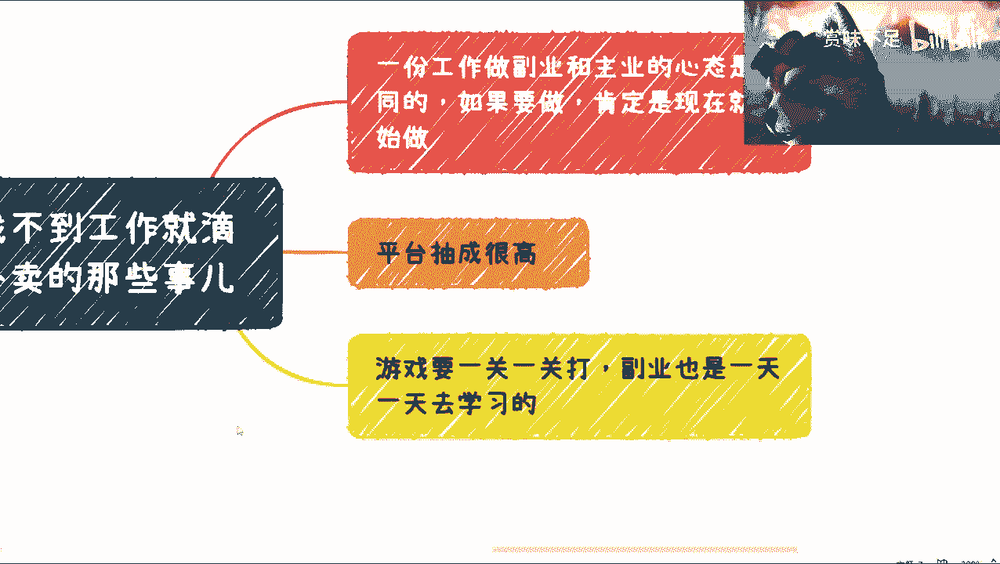

当你有稳定的主业收入时，从事副业是“可做可不做”的放松状态；而当你依赖其维持生计时，就变成了“必须做且要做好”的焦虑状态。这种心态差异会直接影响你的工作体验和持久性。

---

## 实际收入与隐藏成本 💰

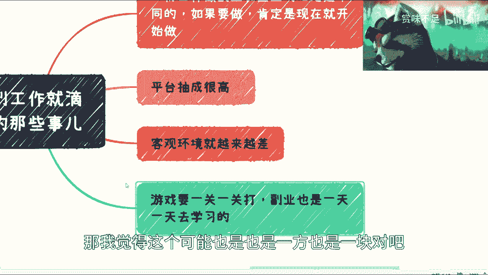

接下来，我们深入探讨从事滴滴或外卖工作的实际经济账。以下是基于与从业者交流总结的关键点：

以下是关于收入与成本的核心分析：

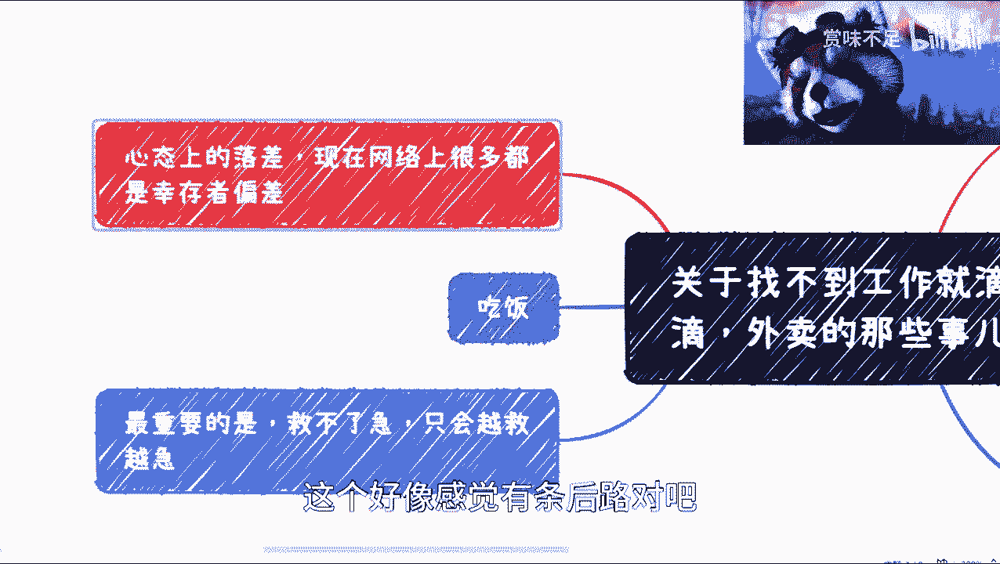

1.  **平台抽成高**：平台对每笔订单的抽成比例相当高。
2.  **收入不稳定**：在非高峰时段（如非疫情期间、出差淡季），订单量可能不足。有时跑一天下来，扣除成本后甚至是**倒贴**状态。
3.  **必须计算的成本**：收入必须扣除显性和隐性成本，主要包括：
    *   **油费/电费**：车辆运营的能源消耗。
    *   **车辆损耗**：保养、维修、折旧费用。
    *   **餐食费用**：工作期间的饮食开销。长期来看，这是一笔固定支出。
4.  **学习曲线与初期低收入**：根据网上分享的经验，新人需要1-2个月熟悉路线、规则和“坑点”（如不能提前点送达、要熟悉高峰时段和复杂地点）。初期日收入可能仅有**五六十元**。
5.  **高收入伴随高强度**：月入过万（如一万一、一万二）的案例确实存在，但这通常意味着每天“忙成狗”式的高强度、长时间工作。

**简单收入模型**：
`实际到手收入 ≈ 订单总收入 - 平台抽成 - (油费 + 车辆损耗 + 餐费 + 其他杂费)`

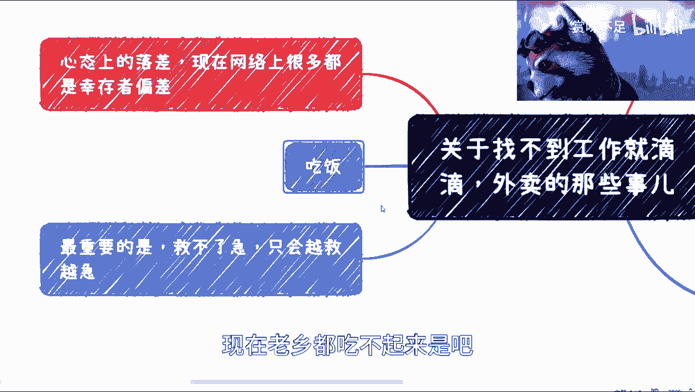

如果订单量不足，这个模型的结果很容易变为负数。

---

## 必须面对的客观挑战 🧱

算清了经济账，我们还需要审视外部环境带来的挑战。

以下是几个关键的客观困难：

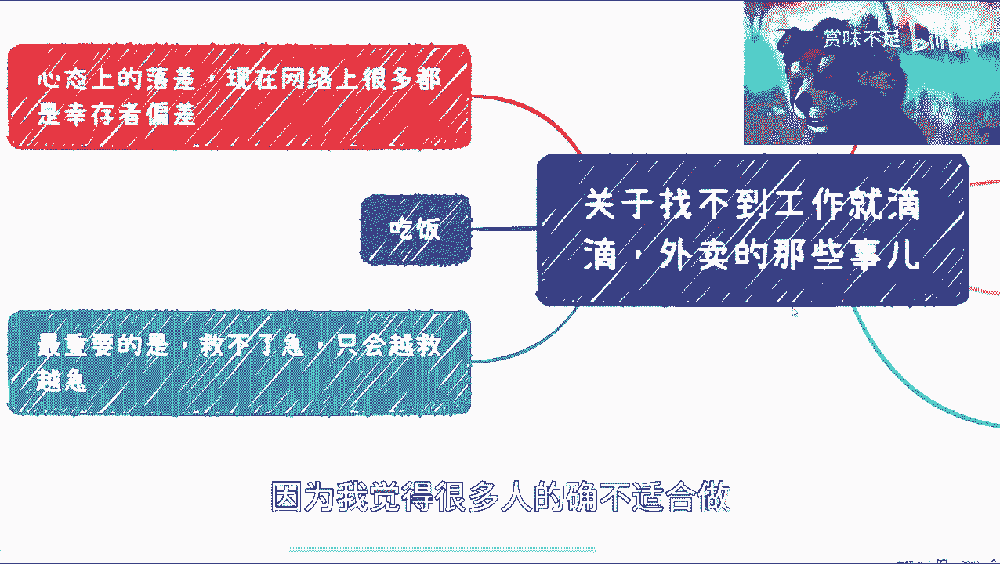

*   **心态落差**：从办公室白领转为体力服务者，心理上的落差是必然存在的。并非所有人都能顺利克服这种落差感。
*   **用餐难题**：工作节奏不固定，很难按时吃饭。考虑到成本，也未必舍得购买20元以上的工作餐。长期下来，对身体健康是一大挑战。
*   **日益严峻的客观环境**：尤其对于外卖员，进入某些场所（如高端商场、封闭小区）的限制越来越多。保安可能以“维护治安”、“管理需要”等理由拒绝进入，导致送餐困难甚至超时被罚。这种隐形歧视或限制在未来可能增多。
*   **行业“内卷”**：从业者众多，单纯拼工作时间（人海战术）很难脱颖而出。你的一天只有24小时，与其他人无异。对于中途转行的人来说，在体力和经验上往往不如长期从业者，缺乏核心竞争优势。

---

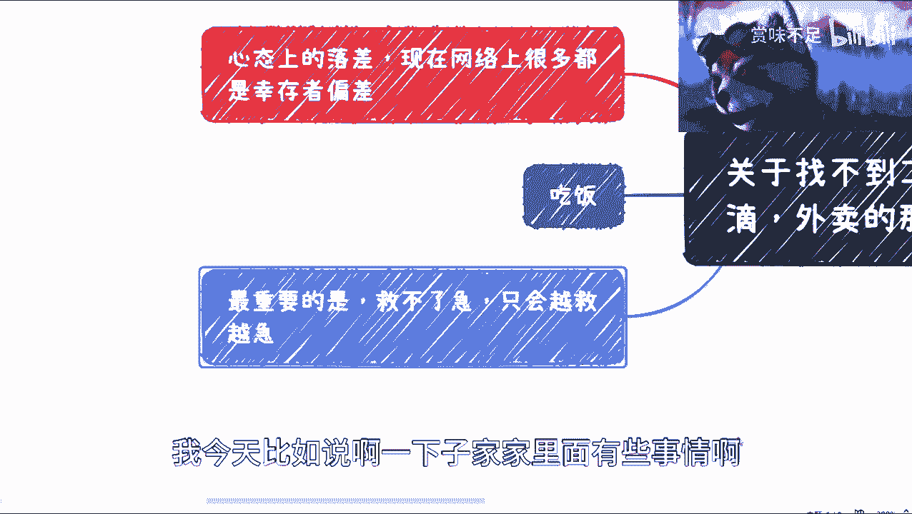

## 核心结论：这不是“救急”的捷径 🚨

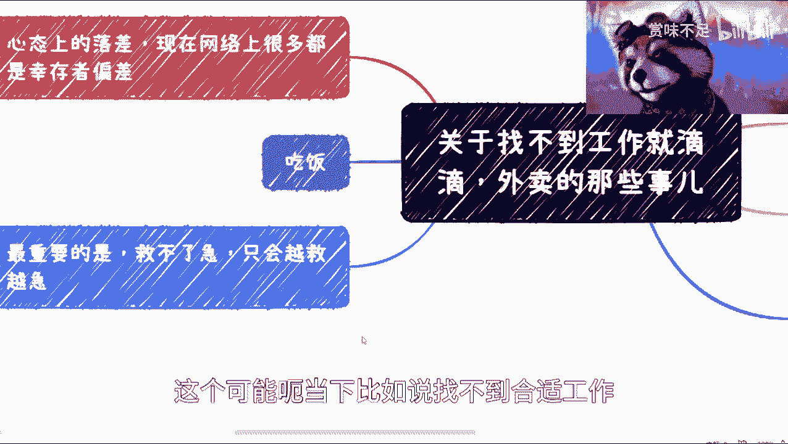

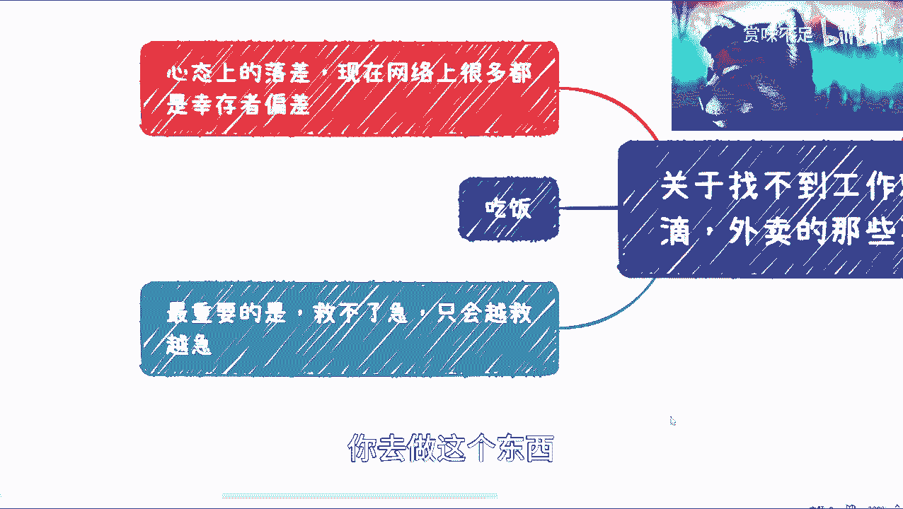

综合以上分析，我们来到最重要的结论部分。

本质上，大部分考虑此选项的人未必真的会去做。这并非歧视这些职业，而是认识到很多人**并不适合**。最重要的一点是：**对于非熟练工而言，滴滴或外卖工作救不了急**。

如果你因为急用钱而带着焦躁的心态仓促进入这个行业，你会越做越急，越做越觉得自己不适合，容易陷入暴躁和挫败的情绪中。共享经济类的副业，恰恰需要你**静心规划路线、耐心积累经验**，找到差异化优势（而非单纯拼时间），才可能获得尚可的收入。

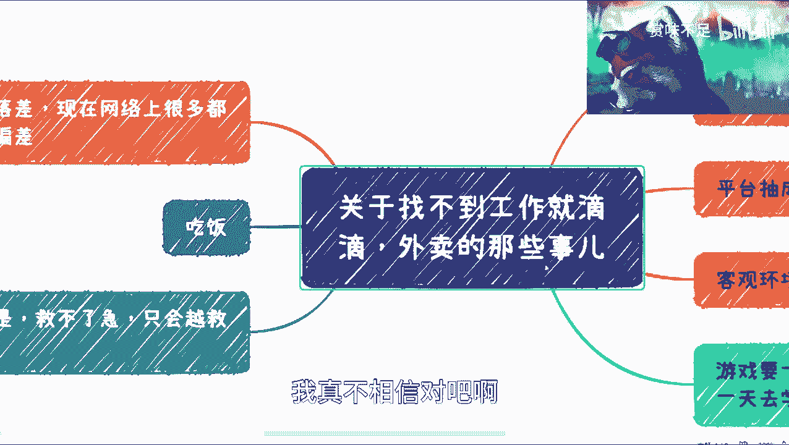

---

### 课程总结 📝

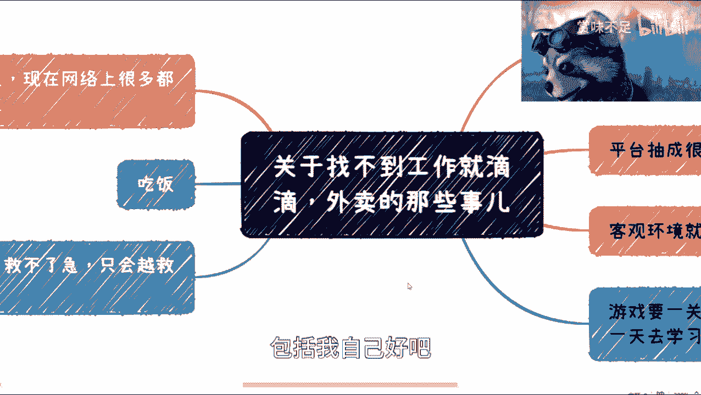

本节课中我们一起学习了将网约车或外卖作为职业备选方案的现实图景。我们分析了“幸存者偏差”的前提，探讨了主业与副业的心态差异，计算了实际收入与隐藏成本，并列举了心态、生活、环境等多重客观挑战。最终结论是：这并非一条想象中的“轻松退路”或有效的“救急”捷径，而是一份需要正确心态、体力付出和策略规划的正经工作。在做出决定前，务必进行全面的自我评估和现实调研。