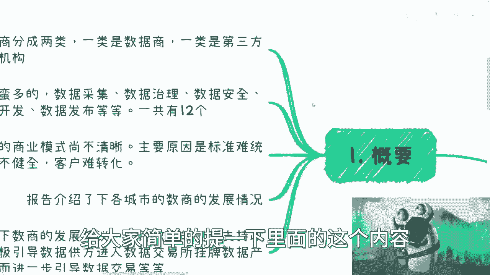
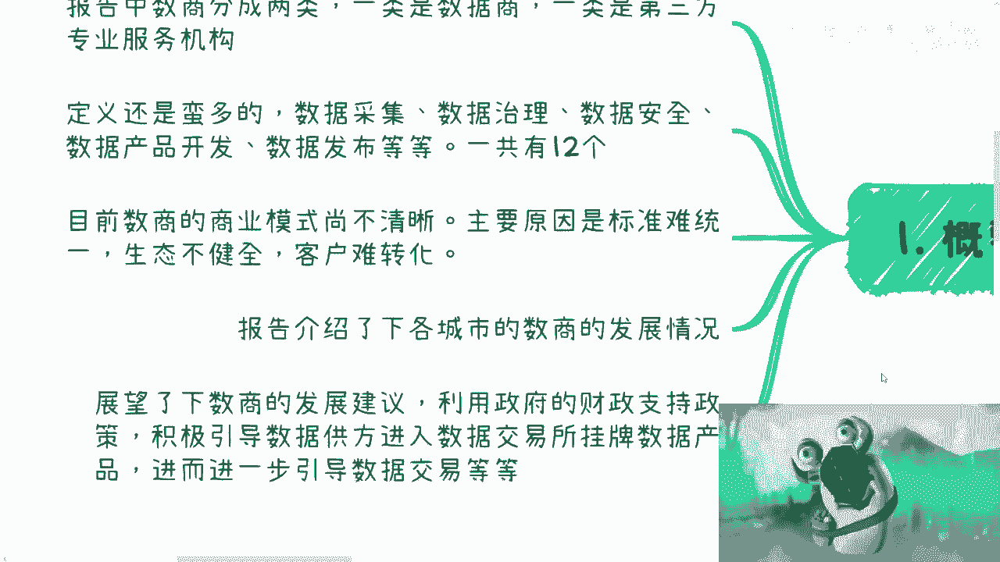

# 关于2023年全国数商报告 - P1 - 赏味不足 - BV1bi4y1h7Rg

好啊大家好啊，好久没有来发这个充电视频，咳咳嗯，这一次呢主要是看了一下这个2023年。

全国受伤的这个报告呃。

大家可以回头去下载来看一下，好吧，我就在这个地方给大家简单的提一下。

里面的内容，首先第一个呢就是说报告中，这个书商呢分成两类，一类是数据商，另外一类是专业服务机构，在整个的这个数上定义上面还是蛮多的啊，他有采集啊，治理啊啊安全啊等等等，反正有12个。

反正相信你们可以到报告里面再去看，那么目前受伤的这个商业模式呢，他不是很清楚嗯，嗯主要原因还是因为所有的这些东西，我刚起步啊，标准也没有统一生态啊，客户啊也都不确定，但是从目前来看，从目前来看呢。

就是说政府政策方向啊，就做数商这一块，包括这个呃，跟各地方的数据局交易所合作难，属于一个大势所趋，嗯然后呢是展望了一下这个书商的发展，建议利用政策的财政支持，积极引导数据供方啊进入数据交易所挂牌。

然后是形成这个数据资产，进而进一步引导这个数据交易，那么就如我之前一直跟大家讲的，就是说呃并不是说24年往后方向就这一个，而是说目前比较明确的啊，可能就这一个呃，嗯就如我之前在上海这边跟书交所聊的时候。

也是一样的，就是说呃，个人企业在这里面能做的东西还是很多的，就是它可以作为一个粘合剂，它也可以作为书商本身，这个东西就看每个地方对于书上的定义。

你比如说啊上海的话有这个数据经济，新赛道啊，推动数据要素产业，然后2023~2025，对吧，那么上海对于书商分类呢，主要是啊这个数据资源类书上啊，比如说金融啊，航运啊这一类，那么比如说那个技术驱动型啊。

比如说知识发现数量结合隐私计算，那么第三类呢就是服务方，比如说数据合规，质量评估，资产评估，数据交付啊，离岸数据，那么你从这上面可以看到，就是说啊不管是有拥有数据资源的啊，然后是技术驱动里类的。

还是说第三方服务，就是说不管你个人或者说这个主体，拥不拥有数据本身，你都可以成为这个书上的一部分，那么深圳这边我们看到有深圳市，数据和数据交流交易呃，第三方服务机构暂行管理办法。

那么数据商呢它可以从事资产开发额，数据发布，数据销售，然后第三方服务机构呢可以依法从事法律服务，数据资转化服务，安全评估等等等对吧，那么这个也是一样的，就是说，就不管是个人还是第三方服务机构。

其实都可以从这个呃就数据类啊，或者说培训培训咨询，安全评估等各方面来切入这么一个服务，然后就是那个广东，广东这边呢有这个叫数据经纪人，那么数据经纪人分成三类，就技术赋能型，数据赋能型。

还有就是委托是委托型，那么在这里面其实也看得出来嘛，就是说嗯你可以技术为主去驱动做服务，你也可以数据驱动啊，做服务，你也可以受委托来做第三方服务，那说白了就是说目前来看呃。

整个书商的定义规划还是比较的广泛的啊，那么呃如果来说个人，或者说你们通过一些呃这个注册公司啊，或者其他的这种服务的运作，基本上第一步呢就还是要跟交易所，跟数据局这边去做这个合作啊。

那么包括就是说受伤既然有了定义，咳咳咳，也就意味着它一定是拥有，就是说乘位数上的这么一个标准，那么怎么成为书上怎么申请，书上肯定跟各地方的交易所，跟这个数据局是有关的，那么第三个就是各类的这个试点。

你比如说广东探索这个经纪人制度对吧，他鼓励就说呃建设这个社会化数据经纪人机构，然后是规范开展数据要素流流通，这个中介服务对吧，制定数据经纪人分类分别标准啊，那么这里也是刚开始，上海主要是以上。

上海数交所和那个书商协会作为这个主体，上线了这个呃商服务平台，以数商提供资质认证啊，然后业务赋能培训支持的，那么这一块其实也是就是说相对来讲，整个流程也比较清晰，那么还有就是湖北对吧。

成立了这个湖北数据集团，推动湖北成为全国数据资源汇集地，拉动这个跨区域的流通和交易，那么目前这个数商发展的数据呢，在报告里面也有了比较多的这种呃，叫什么可视化的这么一个东西，大家也可以看到。

就上海北京深圳广州，然后南京武汉天津贵阳，等等啊，我没有全部截出来，因为这里面很多，包括就是这个呢是啊，让更多数据火起来的应用类数量占比啊。

那么呃整体来讲呢，就是23年的这个受伤报告呢，他是告诉大家几个点就很简单，第一个就是说书商啊目前的定位是什么，然后这个接下来的职责发展啊啊是怎么样子的，那么包括就是说从各地方的定义来讲。

目前的整个发展是到了怎么样的一个阶段，那么未来是希望有没有更大的啊，一个叫什么就是发展，那么也其实在我看来，这个东西也是相当于告诉大家，有这么一个发展方向，如果感兴趣的，或者说想要成为书上的。

那么肯定是第一时间，跟这个交易所或者数据局啊，或者跟其他的树商，因为这里面的合作关系可以有很多嘛，你你要愿意做，你可以做树上，你要不愿意，你可以做树上的服务方，对不对，就是它里面的关系各种各样啊。

那么你觉得自己到底是啊拥有哪些优势，或者拥有什么样的情况，你希望在这里面分怎么样一一杯羹啊，分多少蛋糕，那这个就是你可以自己去考虑的，但是从这个来讲呢，就是说呃不管是各行各业，你包括直播啊。

分呃这个医疗啊对吧，包括那个跨境贸易啊，进出口啊对吧等等等，那所有的都跟数据是离不开的啊，那么嗯同样的就这个东西呢，可能先做也是从国企央企方面可以先做，但是我们不排除你比如说2425年，国企央企先做。

那么2027年可能就到了各个小微企业，但是你如果现在开始做，那么到那个时候，你可能已经是一个拥有两三年经验，然后整个关系链也打的比较透彻的，这么一个前辈，那么你在这个里面。

你可能在未来就能够有比较大的一席之地对吧，那你说我们做事情没有办法去嗯判断啊，你说我现在做一件事情，未来一定能不能赚钱，不知道啊，但是你就是有一个抓手啊，而且这个抓手是一个呃国家通用的啊。

并且比较高的比较高的这么一个抓手，那你说我在这里面能不能赚到钱，我不知道，但是我通过这个抓手，我能够跟各行各业啊，或者说各个企业的这么一些人打交道啊，产生合作关系，那我觉得其实也是值得啊，好吧行。

大家可以就是有空的话到网上去搜一下。

就是完整的这个报告好吧，可以去看一下，嗯好那就这么着。

