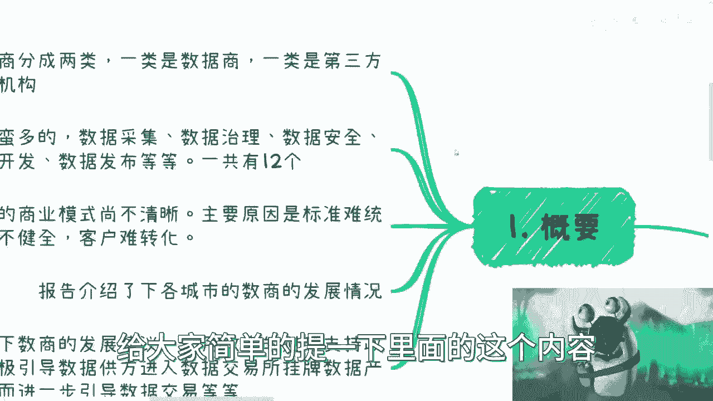
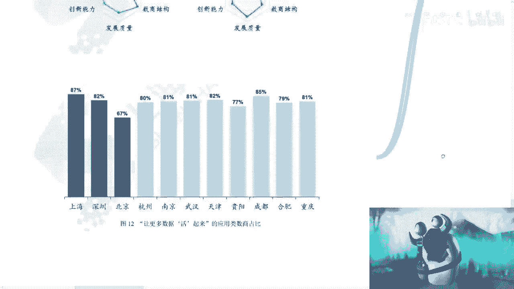

# 关于2023年全国数商报告---P1---赏味不足---BV1bi4y1h7Rg

在本节课中，我们将要学习《2023年全国数商报告》的核心内容。这份报告系统性地阐述了数商的概念、分类、当前发展状况以及未来的机遇。我们将梳理报告要点，帮助你理解数据要素市场中的关键角色与发展路径。

## 报告概述与数商定义

报告首先对数商进行了定义。数商主要分为两类：**数据商**和**专业服务机构**。其定义涵盖广泛，涉及数据采集、治理、安全等共计12个环节。

上一节我们介绍了数商的基本定义，本节中我们来看看其当前的商业模式特点。

## 当前商业模式与政策趋势

目前，数商的商业模式尚不清晰。主要原因在于整个行业处于起步阶段，标准未统一，生态与客户群体均不确定。

然而，从政策方向看，成为数商并与各地方数据局、数据交易所合作已成为大势所趋。

报告展望了数商的发展，并给出建议：利用政策与财政支持，积极引导数据供应方进入数据交易所挂牌，形成**数据资产**，进而促进数据交易。

正如报告所指出，这并非未来唯一的商业方向，但却是当前比较明确的一条路径。

## 各地数商实践与分类

个人或企业在数据要素市场中可扮演多种角色，既可以作为连接各方的“粘合剂”，也可以直接成为数商。具体角色取决于各地对数商的定义。

以下是以上海、深圳、广东为例的具体分类：

**上海市**：在《数据经济新赛道推动数据要素产业（2023-2025）》规划中，将数商分为三类。
*   **数据资源类数商**：如金融、航运等领域的数据持有者。
*   **技术驱动型数商**：专注于知识发现、隐私计算等技术服务。
*   **第三方服务商**：提供数据合规、质量评估、资产评估、数据交付等服务。

**深圳市**：根据《深圳市数据商和数据流通交易第三方服务机构管理暂行办法》，明确了两种角色。
*   **数据商**：从事数据资产开发、数据发布与销售。
*   **第三方服务机构**：依法从事法律服务、数据资产转化、安全评估等业务。

**广东省**：创新性地提出了“数据经纪人”概念，分为三类。
*   **技术赋能型**：以技术驱动提供服务。
*   **数据赋能型**：以数据资源驱动提供服务。
*   **委托行纪型**：受委托提供第三方服务。

从以上分类可以看出，无论个人或机构是否拥有数据本身，都可以通过技术、服务或资源等不同方式切入数据要素市场。

## 成为数商的路径与机遇

对于希望参与其中的个人或企业，第一步通常是需要与地方数据交易所或数据局建立合作。

既然各地对数商有了定义，就意味着存在相应的认证标准。如何申请成为数商，需遵循地方交易所和数据局的规定。

目前，各地已开展多种试点。以下是几个典型案例：

*   **广东**：探索数据经纪人制度，鼓励建设社会化数据经纪人机构，并制定相关分类标准。
*   **上海**：以上海数据交易所和数商协会为主体，上线了数商服务平台，为数商提供资质认证、业务赋能和培训支持。
*   **湖北**：成立湖北数据集团，旨在推动成为全国数据资源汇集地，促进跨区域数据流通与交易。

报告还通过可视化图表展示了数商在全国的发展数据，以上海、北京、深圳、广州、南京、武汉等地较为集中。

## 报告核心总结与行动建议

本节课中我们一起学习了《2023年全国数商报告》的要点。整体而言，该报告明确了以下几点：

1.  **数商的定位与职责**：明确了数商在数据要素市场中的角色和未来发展方向。
2.  **发展阶段**：通过各地实践，展示了当前数商生态的发展阶段。
3.  **未来机遇**：指出了数据要素市场广阔的发展前景。

报告相当于指明了一个重要的发展方向。对于感兴趣的个人或企业，建议第一时间与数据交易所、数据局或现有数商建立联系。你可以根据自身优势（如拥有数据、掌握技术或提供专业服务），选择成为数商或其服务方，在产业链中寻找自己的位置。

数据与各行各业（如直播、医疗、跨境贸易等）都密不可分。虽然当前实践可能从国企、央企开始，但未来必将惠及更多小微企业。现在开始布局，意味着提前积累经验、构建合作关系，有望在未来市场中占据有利地位。

虽然无法保证绝对成功，但抓住“数商”这个国家层面推动的抓手，能够为你打开与各行各业关键企业建立合作的大门，其价值值得深入探索。

建议你搜索并阅读完整的《2023年全国数商报告》，以获取更详尽的信息。