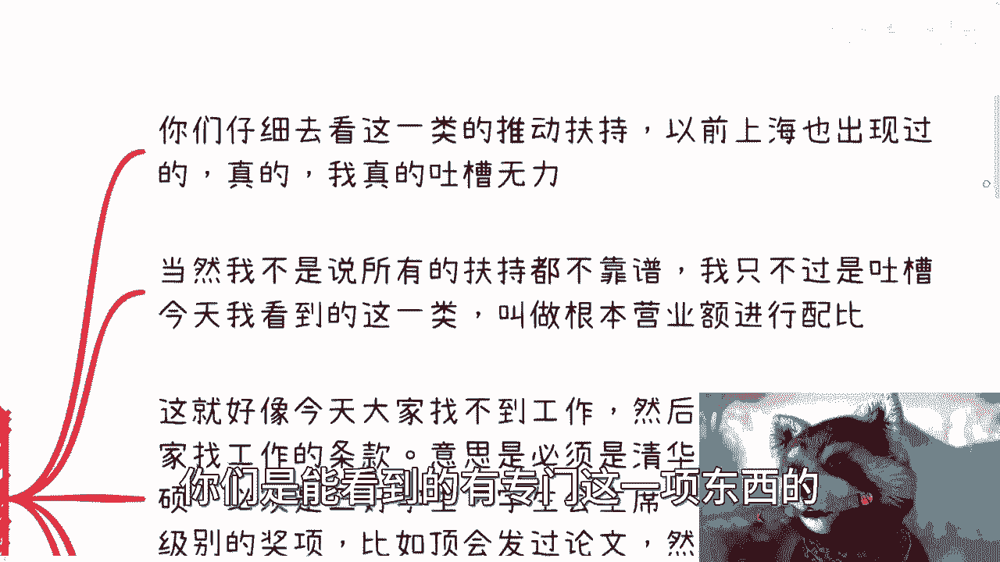
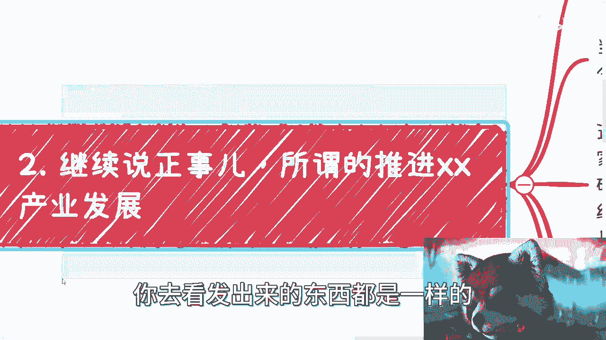
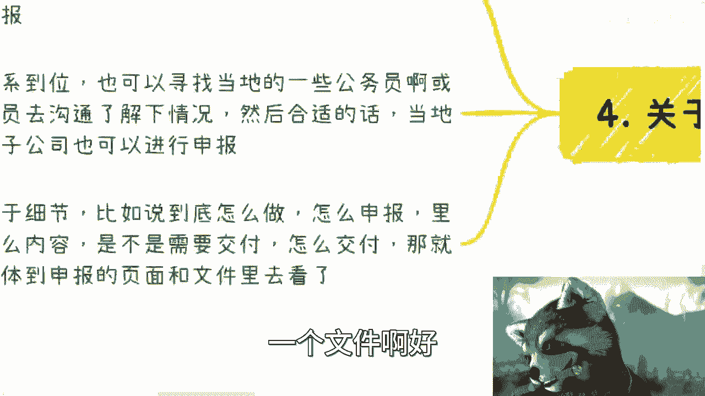
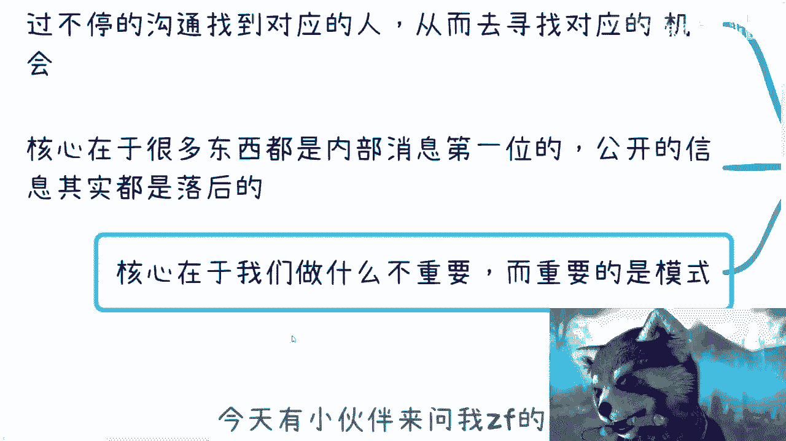

# 关于xx产业发展若干通知的那些事儿 - P1 - 赏味不足 - BV1GM4y1s72t

啊大家好啊，那个今天又晚了啊，今天又晚了，这两天搞活动嘛，对在上海这边啊，然后人鱼由于这个人太多了啊，所以我就把那个场地也换了，因为今天我跟那个场地方叫什么，就跟那个人社部教育那边就沟通了半天。

但是感觉反正就是不太行嘛，就是他那边最多只能容纳30个人，所以我想想算了。

他就换了一个地方啊，然后呃在下周六就是二十九二十九号啊，反正有空的小伙伴还可以再来啊，呃然后今天呢是这样子的，就私信呢有个小伙伴私信我的，关于对吧，就是数字经济发展相关的这个政策啊，一些一个文件啊。

一个网站嗯，然后呢我就想着我要不来说一下，但是我不知道我能不能讲啊，因为上一次我讲这个东西，反正是没让我上传啊，反正这么个情况啊。

呃首先说一下前情提要啊，今天有个小伙伴来问了我关于政府对吧，一一些相关的这个政策，我觉得蛮好的啊，但是我这个手机用浏览器看对吧，我就很不开心，为什么呢，因为以前的那种对吧，这个曾经的叫什么记对吧。

死去的记忆又开始攻击了我啊，嗯然后我们继续来说啊，其实在这个地方呢，我要再说一件事情，就是但凡那大家跟企业和政府合作多了，你们就会明白明白一个道理，就是为什么我一而再再而三的跟你们讲。

或者跟在直播的时候说，我说做什么东西不重要，就包括其实你们会发现你们问我对吧，什么方向啊，什么东西啊，我都跟你们讲，做什么东西不重不重要，你知道吧，就就是嗯包括就是说很多做开发的对吧。

做做做什么土木的对吧，做什么我就会跟他们说，做什么不重要，为什么，因为做什么东西不是重点，重点是怎么去做这个东西以及模式是什么，才是重要的，你比如说啊我们打个比方，比如说这个很多人咨询的时候。

我一直说我说你们会发现一些人对吧，比如说很多年他就做投资，很多年他就做成员，很多年他就是做协会对吧，很多年他都在做一个东西，但是呢他做的这个东西是什么啊，不是很重要，重要的是你会发现它的模式是一样的。

就是简单来讲，就是说今天如果做大数据，那么他会在大数据这个领域CTRLCCTRLV，以便它的模式，比如说今天做数字经济，他会在数字经济里面做他的这个模式，CTRLCCTRLV做一遍对吧。

你比如说明天做区块链，它可以在这上面也是复制一遍，就是对他来讲，你会发现做什么不是很重要，你知道吗，因为本身你去做什么东西，它背后都是怎么变现，然后人怎么合作对吧，商业上怎么去做对吧。

怎么从怎么从0~1是很重要的，至于做什么不重要，就这事我发现大部分大部分大部分大部分的人，他的思想是颠倒过来哦，就像我沟通下来，很多人都会问我吗，他说那你说这个东西不重要，那你又不懂，对不对。

你要去学吗，你要怎么样嘛，你要花很多时间嘛，但是你会发现所谓的普通人，所谓的大部分人对吧，大众为什么会浪费时间，就是因为他花时间再去学习这些东西上面，但是你会觉得学这个东西有用吗，没有用啊。

你学的是它背后的逻辑，你学的是他背后的商业对吧，你学的是他背后是怎么从0~1的，你学的应该是他的模式对吧，就像我们说的，今天如果我去我要去申报一个项目，我到底找谁对吧，我找的是是是这个啊。

这个这个里面哪一条线的对吧，哪一个人对吧，你得把这个东西摸清楚啊，你说你学这个东西有用了，没有用的呀，世界上懂这个东西人多了，你现在去学，我现在去学，难道我们能超越别人吗，不能呀，对不对。

你比如说就像就像很多人别人问我对吧，我就会跟他们讲，我说我现在的模式很简单，就是比如说我给企业做咨询，我给政府做咨询对吧，我给高校做咨询，我给高校出课程，对不对好，那你觉得我讲什么东西重要吗。

不重要的呀，比如说过了5年打比方，过5年过10年对吧，你再来问我，你说刘老师，你还在讲这个东西吗，我肯定会高兴一些跟你讲，我不讲这个东西，为什么我肯定去讲那些赚钱的东西的呀，对不了。

哪些东西政府看重哪些东西，高校看重哪些东西，企业看重我就就去讲什么呀，对不了啊，我非要去啊，非要去讲我自己这一亩1/3的东西啊，有必要，不然没有必要的呀。

是不是你又不是财富自由，用情怀发电啊。

那第二个呢继续来说正事啊，就是所谓推进叉叉产业发展啊，你们在那个呃叫什么政策网站上，你们是能看到的，有专门这一项东西的。

就叫推重叉叉这个发展，我为什么用叉叉来这个这个这个叫什么替代啊，就是因为我跟你们讲啊，就是推进就是我跟你们说啊，你们但凡去看，不管今天不管你就是2010年，2012年，2014年，2016年。

2018年，二零什么几几年，你去看发出来的东西都是一样的。

没有区别的，只不过是这个叉叉被替换掉了，你晓得吧啊嗯瓦嘎鲁啊，我给你马斯克是吧，那你们单仔细的去看这一类的推动服务，推动扶持啊，就以前上海啊，我跟他们对接的时候，就真的我真的无力吐槽啊，我跟你讲啊。

就是当然我不是说所有的服饰都不靠谱啊，就是我只不过是吐槽今天我看到的这一类啊，呃这里面有一项，啊这里面有一项叫什么叫叫做根据，哎呀我写错了啊，气的我连字都打错了，妈的真的是对吧，他们现在叫我含妈量博主。

哈哈叫做根据营业额进行配比，什么意思啊，我给你们打个比方，你们就知道就是这就好像今天大家找不到工作，然后呢出了一条扶持大家找工作的条款啊，意思是什么呢，意思是你们必须是清华北大本校的那个本硕啊。

本校的本硕，那当然啊，我为什么在这个地方会强调北本校的本硕啊，对吧，就懂得自然懂对吧，我就不去说了啊，就而且呢必须是三好学生啊，必须得到省市级别的奖项啊，包括啊这个要在顶会上发过论文啊。

然后呢根据每个人的具体优势啊，给予不同的企业的实习机会啊，你们会看到没有，就是我跟你讲真的什么意思呢，就是你会发现这是一个非常头重脚轻的东西，也就是说他要扶持的人并不是真正的扶持对象。

而他的扶持也非常的无关痛痒啊，好那么我在这地方也写了，我说其实啊大家是真的蛮想做事情的，是真的想要一些扶持的，大家目前比如说不管是现在还是真正的创业啊，要的是生存下去，不是锦上添花啊，不是井上添花。

所以说简直绝了啊，我贴一段，你们自己看好吧，你们自己看啊，引导数字经济领军型企业啊，对当年主营业收入首次超过5亿元，10亿元，50亿元，100亿元的数字经济企业，择优分别给予一次性奖励，50万。

100万，150万，200万啊，企业当年主营业额收入超过100亿后，每上100个亿台阶奖励100万，嘿你你你你们哼，仔细品品，仔细品品是吧，你们自己看吧，我就不多说了吧，我不知道能不能发出来了。

然后呢，但是呢当然也不是也不全是不能做的那种啊，你就比如说各地方的培训啊，它里面也会有啊，叫做什么呢，叫做数字经济相关的人才培养可以做啊，这没毛病啊，可以做这块呢其实就是要引入企业。

因为你在各省市区做一个东西，你必须是当地有企业的，你当地没有企业，你交税不交代当地，你说哪个政府这么傻叉对吧，不现实的啊，引入培训的整个流程就可以做对吧，你你比如说你当地能做，你找我，你找我。

你私信我啊，我这边有全套的东西可以做，好还有就是竞赛，那前两天呢也有小伙伴私信我说，竞赛这个事对我本来想今天说的，但今天这个文件真的看得我气气的，我不行，所以我想就简单先说一下啊。

竞赛这个事呢我会在下一期单独说一下啊，很多人看到竞赛貌似不赚钱啊，然后甚至还跟我说是那个叫什么叫什么，就那个慈善啊，但其实你们要明白，竞赛做得好，真的赚的飞起啊，赚得起飞啊，原地起飞啊。

关于项目评选呢也是在文件里面有的啊，其实这一块也可以做，但这块东西呢需要去沟通，什么意思呢，就是说你可以跟当地的企业沟通，通过当地的企业去套个皮去申报，也就是说申报企业是A啊，但是实际运作人是你对吧。

这可以的，而第二个呢就是如果你关系到位啊，也可以寻找当地的一些公务员啊，或者相关的人员去沟通了解一下情况哦，如果合适的话呢，当地你是住这个子公司，你也进入申报，那就说白了你就申报呗。

反正也没什么成本对吧，你申报也不少块肉，对不对，你就申报呗，能申报申报不能申报吗，拉倒吧，对不对，无所谓的，那当然关于细节啊，比如说到底怎么做对吧，怎么申报里面内容是什么，是不是需要交付，怎么交付。

有没有钱啊，到底是评审出来给钱还是评审出来给民对吧，这就需要到具体的申报的页面，跟文件里面去看了啊，至少今天那个小伙伴给我的，是一个大锅饭的一个文件，好好。

那么当然啊最后一点啊，我们来提一下啊。

当然这些其实并不是核心问题啊，核心的问题在哪里啊，核心问题是我们无论在什么省市区，我们需要的是通过不停的沟通，找到对应的人，因为我发现啊很多人做事情是这样子的，就是我今天啊就是他很希望我今天做一件事情。

我就达到目标，但是这是不可能的啊，如果你们没有足够的耐心，这是就不要去做企业跟政府的这个任何的单子，你们是做不了的哦，就是企业跟政府单子这边的东西，你打基础可能都是按年为单位打基础啊。

但是你要问我有什么好处，好处就是很简单稳定，你别来跟我谈什么经济好不好，你别跟我谈什么什么当下失不失业对吧，当下什么工作好不好找对吧，当下当下经济情况怎么样，不重要，稳定就稳定。

他甚至比你去做公务员要稳定的多，为什么，因为你是一个b to b和b to g的合作，不无论怎么样，你都是稳定对吧，就这么简单啊，但是这些东西而且关键你知道是什么。

关键是你所有的单子你会发现就是像金融本身，金融本身有一个东西叫什么叫金融衍生品，对不对，那其实从那个企业跟政府这边来讲，它有非常多的是你这个今天做了一个单子，可能这单子只有20万，没有错啊。

但是它其实会有很多上下游的东西，你是可以去做的，但是就像我们那天说的，就是你思考不出来，你不知道的东西，你认知外的东西你是不知道的，所以说呢你必须先去赚到那20万，或者先不赚钱。

只把做一遍那个20万的单子，你才有可能知道上下游是什么，否则你怎么知道啊，你你总不可能说啊，请局长吃个饭，他就告诉你了，那不好意思，那那如果是这样的话，那可能对吧啊，这个运作模式就不是这个样子啊。

但大家也不至于这么难啊，那这是第一点，第二点呢就是说核心在于什么呢，很多东西的消息都是内部消息第一位的呃，所有公开的信息其实本质上都是落后的啊，也就是说如果我们真的要去做很多东西。

你比如说今天那个小伙伴给我看的那个文件，是2022年的6月28号发的好，其实你会发现6月28号发没问题，但是其实6月28号发前后，该申报该做准备，该怎么样，其实都已经做过准备了。

呃在这个地方我可能提一点啊，就是哎回头我再我再开一期吧，就是关于这个这个叫什么培训跟申报这个东西，我发现很多人他不明白什么意思啊，就是呃就是企业高校政府，他的申报它基本一般呢都是提前半年到一年的。

也就是说它不是一个什么，它不是一个就是我们认为线性的东西啊，就比如说今天你看到的消息是，2023年7月份对吧，发出来的啊，2023年7月份，但是你看到这个东西，他申报可能是2022年的7月份，你知道吗。

就说它不是一个完全线性的，它是一个就是当你看到这个东西，结果看到一个一个一个宣传的时候，它已经过去一年甚至一年半哦，所以就是这个事情是一个很核心的啊，不是说现在我们看到文件啊，吕老师这个文件我们要做吗。

不是你要做你，你早就轮不到你做了，你知道吗，那么还有呢，第三个就是核心在于核心在于我们做什么，不重要，重要的是模式，你明白吗，就是你会发现，就是如果我今天给你们画张图对吧，就是我会告诉你们哦。

这个东西从比如说科技厅，还是从这个农业厅对吧，是从科技司啊，科委还是哪条线上去找到谁啊，然后呢做项目申报，然后这个申报呢可能是申报一年后或半年后，或一或两年后的，而这个项目呢可能是评选的，可能是给钱的。

可能是给产业园的对吧，但是你会发现这项目里面什么东西重要吗，这不重要啊，就是你当你真的在做这些项目申报的时候，你甚至会发现，你不过就是把去年的申报书拿过来改一下，有什么区别，没有区别的。

你知道吗啊，所以说啊就是最后再提一点，就是我不知道啊，这个视频能不能发出来啊，但是但是我想让你们明白的是什么，就是很多东西不是像大家YY的，脑子里面的那个模式，你知道吗。

就很多东西他真的是CTRLCCTRLV，就真的就是说你知道可能你会去骂娘的，但是但可惜你不知道，好吧行啊，那就这样吧好吧，然后下周六上海这边活动，大家有想法的可以来的，还继续来啊。

然后啊如果这个来不了的啊，然后有个人职业规划的或者别的方向的，也可以私信咨询我。