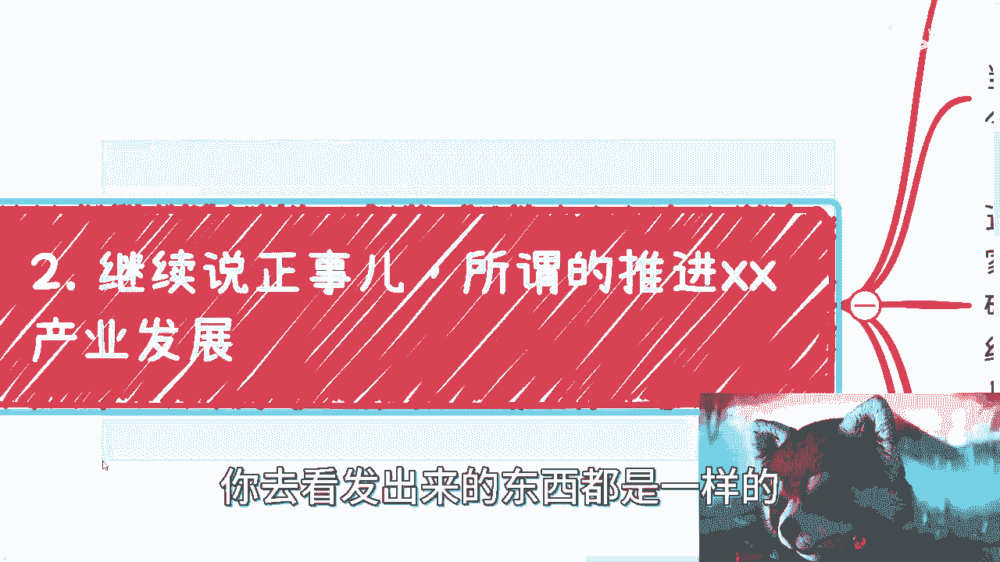
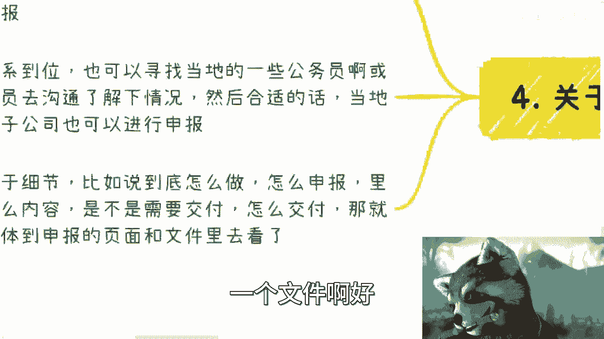

# 课程：解读产业政策通知 📜 - P1

在本节课中，我们将学习如何解读政府发布的产业政策通知，并理解其背后的运作逻辑与商业机会。我们将从一个具体的政策文件案例出发，分析其结构、意图以及实际应用中的关键点。

---

## 概述：政策文件的表面与实质

上一节我们介绍了课程的主题。本节中，我们来看看政策文件的基本特点。

政府发布的各类“关于推进XX产业发展的若干通知”在形式上往往高度相似。核心内容框架通常是固定的，变化的只是其中的“XX”产业名称。例如，2010年、2014年、2018年等不同年份发布的文件，其行文结构和扶持思路可能如出一辙。

**核心模式**：`推进[XX]产业发展通知 = 固定框架 + 可变产业标签`

理解这一点至关重要，它意味着我们学习的重点不应局限于某个特定产业的知识，而应聚焦于通用的政策运作模式。

---

## 政策扶持条款的典型分析

上一节我们了解了政策文件的固定模式。本节中我们来看看一个具体的扶持条款案例。

以下是一项常见的扶持条款示例：

> 引导数字经济领军型企业，对当年主营业收入首次超过5亿元、10亿元、50亿元、100亿元的数字经济企业，择优分别给予一次性奖励50万、100万、150万、200万。企业当年主营业额收入超过100亿后，每上100个亿台阶奖励100万。

这段条款揭示了政策扶持中一个普遍现象：**“锦上添花”而非“雪中送炭”**。其扶持对象往往是已经成功的大型企业，奖励金额相对于其营收规模而言象征意义大于实际帮助。对于真正需要资金生存和发展的初创或中小型企业，此类条款往往门槛过高。

---

## 政策中可行的切入方向

尽管部分条款看似不切实际，但政策文件中仍存在可行的商业机会。关键在于识别并利用那些可操作、能落地的部分。

以下是几个常见的可行方向：

*   **人才培养与培训**：政策中常包含“加强XX产业人才队伍建设”等内容。与地方政府或园区合作，引入企业资源，开展针对性的职业技能培训，是一个可操作的落地项目。
*   **竞赛与赛事**：组织与产业相关的创新创业大赛、技能竞赛等。这类活动不仅能提升影响力，若运作得当，也能创造可观的商业价值。
*   **项目申报与评选**：关注政策中关于项目资助、评选、示范试点等内容。即使作为个体或小团队，也可以通过与本地企业合作（以企业为主体进行申报）或自行研究申报流程来尝试参与。

**核心操作**：`可行项目 = 研究具体条款 + 寻找本地合作方（企业/园区） + 按流程申报`

每个方向都需要深入研究具体的申报指南，明确交付物、评审标准和资金支持方式。

---

## 运作模式的核心：关系与信息

上一节我们列举了几个可行的切入方向。本节中我们来看看成功运作这些项目的底层逻辑。

与企业和政府（B2B/B2G）合作，有三个超越具体项目内容的核心理念：

1.  **长期沟通与关系建立**：这类合作无法一蹴而就。建立信任和了解需求往往需要以“年”为单位的时间投入。其好处是能带来**极其稳定**的业务流，抗经济波动能力强。
2.  **信息的时间差**：公开的政策信息通常是滞后的。一个2023年7月发布的通知，其申报准备工作可能在2022年甚至更早就已启动。**内部消息和提前布局**至关重要。
3.  **模式的复用性**：具体做什么产业（大数据、数字经济、区块链）并不重要，重要的是掌握“如何做”的**模式**。这包括：
    *   了解申报流程从哪个部门（如科技厅、经信委）哪条线发起。
    *   知道如何撰写和修改项目申报书（通常是基于往年模板的更新）。
    *   理解项目周期（可能为未来1-2年布局）。

**核心公式**：`成功 = (长期关系 + 超前信息) * 可复用模式`

掌握这个模式后，你可以将其复制到任何新兴的产业领域。一个项目的价值不仅在于其本身，更在于它能为你打开上下游产业链的机会，但这些机会只有在你亲身完成一个项目后才能真正感知。

---

## 总结与提醒

本节课中我们一起学习了如何解读产业政策通知。

我们首先认识到政策文件在结构上具有高度重复性。接着，我们分析了一个典型扶持条款，指出其往往倾向于“锦上添花”。然后，我们找到了政策中真正可操作的几个方向，如培训、竞赛和项目申报。最后，也是最关键的部分，我们揭示了运作这类业务的核心不在于产业知识本身，而在于建立长期关系、获取超前信息以及掌握一套可复用的商业模式。

**最终结论**：不要陷入学习具体产业知识的陷阱，而应致力于理解和掌握**与政府及企业打交道的通用方法和商业逻辑**。这比任何临时学习的具体技术或政策条文都更有价值。

---
*注：下周六在上海有相关线下活动，感兴趣可参与。如有个人职业规划或项目具体咨询，也可通过私信联系。*