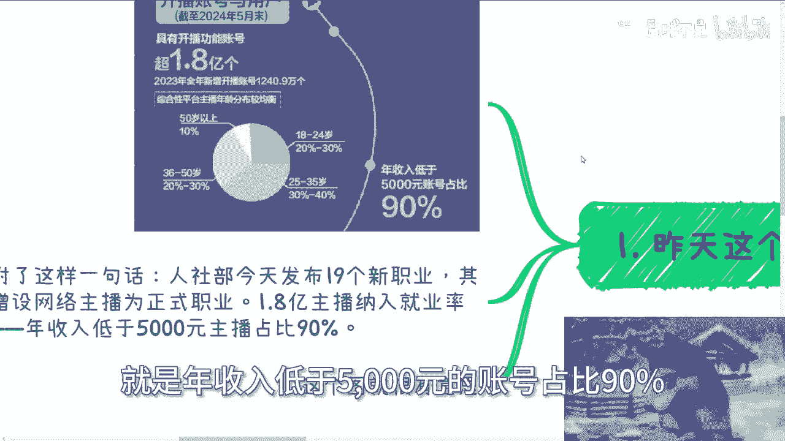
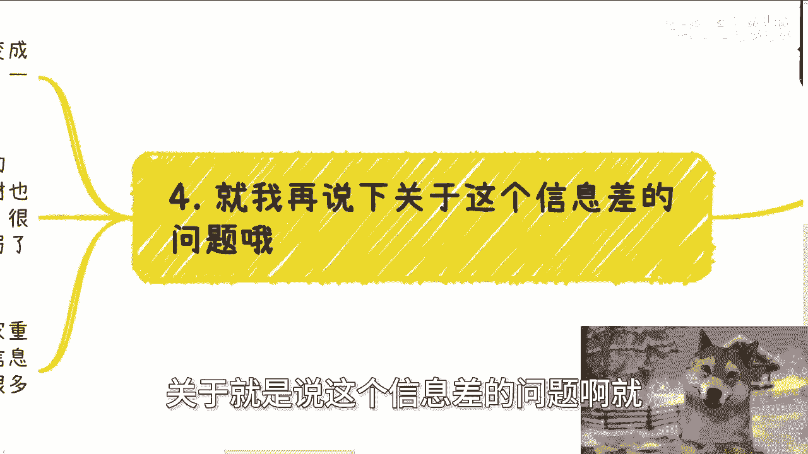

# 关于人社部增设网络主播为正式职业这个事儿 - P1 - 赏味不足 - BV1Ni421a7xY

好大家好啊，这个今天晚了啊晚了，所以我就只能给你们录一个了啊，明天再说吧啊呃首先我们今天聊的这个呢，就是昨天这个网络上发了很多嘛，就关于这个人社部增设，增设这个网络主播为正式职业的这个事情啊。

我正好也可以跟你们聊一下，呃。

然后那个活动下一期活动我已经定了，就下周日好吧，也就8月11号在长沙啊，在长沙，因为之前去年有很多小伙伴在说嘛，然后我也一直没定下来，但是后来想想嘛，这次因为9月份定在上海，所以正好会有个空档期。

而且呃长三角珠三角我跑了一圈了，我我也不想重复再跑，所以我就正好诶么长沙啊，或者之后西安啊，这边我觉得都可以来一下呃，大概主题的话呢，一方面是围绕不同的企业的一些offer的一些选择。

另外一方面就是围绕啊，每个人个体来做这个自媒体跟跨境电商啊，然后最后呢就说我帮大家展望，展望这个哼接下来的一些发展啊，那么报名或者了解详情呢，你们可以私信我啊，首先我先说这个事情啊，昨天这个图出来啊。

嗯哼铺天盖地，我不知道你们有没有看到啊，额说是呢，这个截止到2024年5月末啊，具有开播功能账号超1。8亿个，妈，中国14亿人超1。8亿个，什么概念，就是每七个人当中他妈的有一个人在在做主播，对吧啊。

然后2023年全年新增开播账号，1240万个啊，那么我们看啊，5%呃，50岁以上10%啊，36岁到50岁，20%到30，18岁到24岁，额20%到30啊，这两边比较平均，剩下主力军呢是百额。

25岁到35岁的，就30%到40%啊，那么最最好玩的啊，是这样子的啊，你看啊上面有一句话啊，这个这个是一个哼叫做什么，这个怎么说呢，就是媒体是个艺术啊，就是年收入低于5000元的账号占比90%。

哎我操这句话牛逼啊，首先啊呃昨天发布还附了这么一句话，叫做人社部今天发布了19个新岗位，其中增设网络主播为正式职业啊，1。8亿主播纳入就业率啊，记住啊，1。8亿主要纳入就业率啊，就业率啊。

年收入低于5000，主播占比90%啊，我跟你讲这句话很有意思，为什么我们以前有个笑话，笑话就是哎问你哎，你年收入多少啊啊啊我年收入哎呀，一点也一个亿差一点啊，一个亿差一点，什么意思啊。

那我年收入1000块钱也是一个亿，差一点，你管我对不对，2000块钱一个亿差一点，我年收入我甚至没有收入，也是一年一个亿，差一点怎么了呢，所以说低于5000元账号占比90%，那么这50%呃。

90%的账号，他收入到底是4999还是499，还是99，还是没有收录诶，我们不知道啊，但是啊那么他这边写出来的啊，那么低于5000什么意思呢，就是说他可能统计出来90%的账号里面。

他的上限啊是按5000，基本上都是在5000以下，但是到5000到底多么以下。

不知道啊，我们至少我们不知道嗯，第二从增设能看出什么来呢。

能看出的是，首先这个行业的人群基数极大对吧，那我们也看到了，就是增增增加了1。8个亿嘛对吧，那肯定人人数基数很大，这和以前区块链这种岗位不一样，就是人社部，就人力资源社会保障部的这个岗位啊。

有的是国家从上往下推的。

而网络主播这个东西明显是从下往上去推的，不是从上往下推的啊，那么网络主播这种东西，明显是属于基数大的而出现的，那么最直接的其实还是补贴啊，还是那种还是补贴，那么补贴呢你们但凡去了解过就会明白，补贴。

尤其在人力资源社会保障部上面，它有很多种模式，人社部的补贴有的是个人补贴，有的是企业补贴，有的是竞赛补贴，还有的是教育那个教育附加税的一些补贴，肯定都是一大堆补贴啊，那么从老百姓角度来讲。

老百姓其实是不懂什么职业不职业的，你别来跟我讲这些东西，老百姓就感觉卧槽，是不是这个东西要上岗证对吧，是不是这个东西变成了一个新的职业，卧槽牛逼啊对吧啊，就听上去好像高大上啊，那么他们就会大面积去考证。

这就是老百姓啊，那么这个时候补贴就还是很猛的啊，当然培训费考试费才是大头，像，之前呃一些城市专门设立了抖音的直播产业园，一个抖音的直播产业园里面，可能就能够成百上千的岗位的产出，那么你想想看。

成百上千的这种岗位产出里面嗯，呃那个培训费跟考试费，那这个量就不得了了，而且是每一年甚至每半年啊，那么第三其实也算个不错的切入点啊，因为如果你有意向呢，记住啊，记住啊，不要去考证书。

考证书不是你们要做的事情，因为我们要做的是什么，与各个城市的人社部的，叫什么授权的能力鉴定中心达成合作，如果你有意向去赚人社部的这个岗位的，补贴的钱的话，那么你可以借着这个网络主播的势头。

以及其他的包括人工智能训练师啊，大语言模型啊等等等啊，这些都在人社部新增的岗位里面啊，那么速度去找当地的职业鉴定中心合作，大家把一些课程啊，考试题目都凑出来，将岗位申请到当地，因为你们要记住。

人社部的岗位只是中央发布的国标啊，然后是不是到各地方现在还未知，你们可以呃，你们可以跟各地的那个人社部的呃，叫什么职业鉴定中心去聊啊，因为现在只是发布这个新岗位，要真的增设到各地方，可能还要很长时间啊。

那么就可以你们一旦在当地审批下来之后，就可以在当地去开展培训考试竞赛等项目，这个是个不错的机会啊，那么通过这个岗位呢，其实也可以跟人社部的这个合作方啊，就是包括鉴定中心啊，包括家各个方面呃。

建立各种关系，从0~1，然后接下来呢就是说啊，每一年都会有所谓的新岗位，那么你只要把上下游的这个关系打通，你只要把上下游的这个这合作方打通，那么以后每一年换汤不换药嘛，我管他他妈的呃，出什么新岗位呢。

对不对，反正我就管我继续培训，管我继续考试啊，那么大家继续做钱就继续赚啊。

这个逻辑就是这样子的啊，那么第四啊就是我再强调一下，关于就是做这个信息差的问题啊。

就是说很多人看到这个信息，其实都在说哎呀要变成个正式岗位啦对吧，很多人还调侃，就说哎呀，怎么样怎么样啊，就是这个事情我们作为老百姓，你说开开玩笑没关系，但是如果你要去赚赚钱啊。

那么你就得明白这些东西推出来的背后是什么，背后就是国标其实也写了很久了，教材也写了很久了，审批也过了很久了，包括这个岗位的试运营，这个证书的培训呃，考试试运营也至少试运营很久，也就是说这个事从背后来讲。

他至少啊到现在为止真的不值得，真的在那边要赚这笔钱的那种幕后的那种组织，或者那些人他起码已经是布局两三年，也就是说起码两三年前，他们就已经都开始做这些事情啊，而不是说很多人觉得啊。

这个东西做的人多啦对吧，国家重视了，不是的啊，所以我才说我们网络上看到的信息真假，我先不去论啊，但就算是真的一定也是过时的。

你明白吗，很多东西网络这个东西只是为了来做宣发的，那我们千万不要觉得卧槽，今天我们看到的信息啊，这个信息好像代表了什么，不是的，你要记住一点，网络上你看到的信息代表什么，代表着早就落地了。

或者甚至已经过时了，甚至都已经就是他妈的黄花菜都凉了啊，这因为为什么，因为你你要这么想啊，就算你不信我也没关系，我就问你一个逻辑上的问题，你说如果网络上今天有个信息是啊，真的刚起步啊，百废待兴。

网络上发出来了，那我就问你也好，其他的也好，大家同一起跑线去做一件事情，你觉得可能吗，我你就我就问你在国内哪件事情是你，我跟别人在同一起跑线能做的有吗，而且更何况同一起跑线，在网络上拿到的信息有吗。

你拿个出来我看看对不对，摆摊都他妈轮不到我们，我就告诉你，啊所以说就是说你信不信谁不重要，但是你要明白通过逻辑推推看啊，很多东西逻辑就是推不通的，本身就不成立，你就不要硬去这个错误的理解啊。

好那反正这个主题我就跟你们讲到这啊，我反正这个想法我就就都跟你们讲了，也没什么藏着掖着的啊，然后那个剩下的话就是说那个活动，8月11号在长沙好吧，然后就说要报名或者了解详情的，你们私信我。

那另外一方面呢就是说你们自己工作啊，包括跟别人合作啊，在这个过程当中有哪些职业规划，商业规划，包括啊股权啊，分红啊，分润啊，呃股份啊，商业计划书啊，白皮书啊啊包括就是说呃怎么个具体的合作啊。

包括这个合同上有哪些坑啊，包括就是说你们希望通过跟我的一些沟通啊，从我的一些认知啊，包括我的呃我对于当下社会的一些了解，能够给你们在职业上或者商业上面，能够有一些更接地气的一些建议和规划。

或者说能够让你们少走点弯路，弯路的话，那么你们整理好对应的问题跟个人背景好吧。