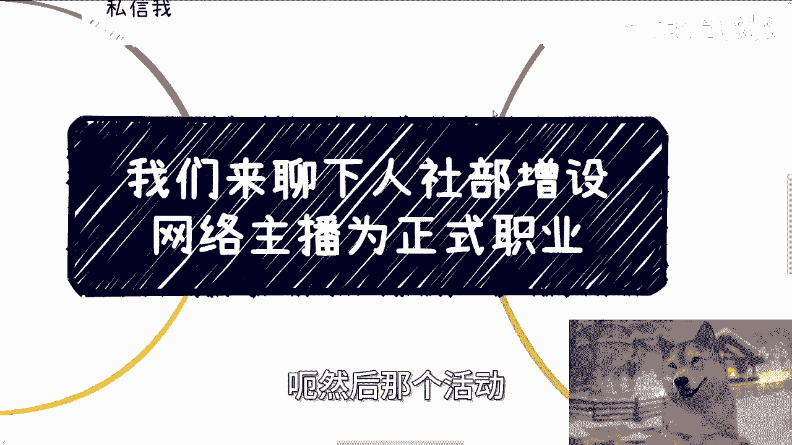
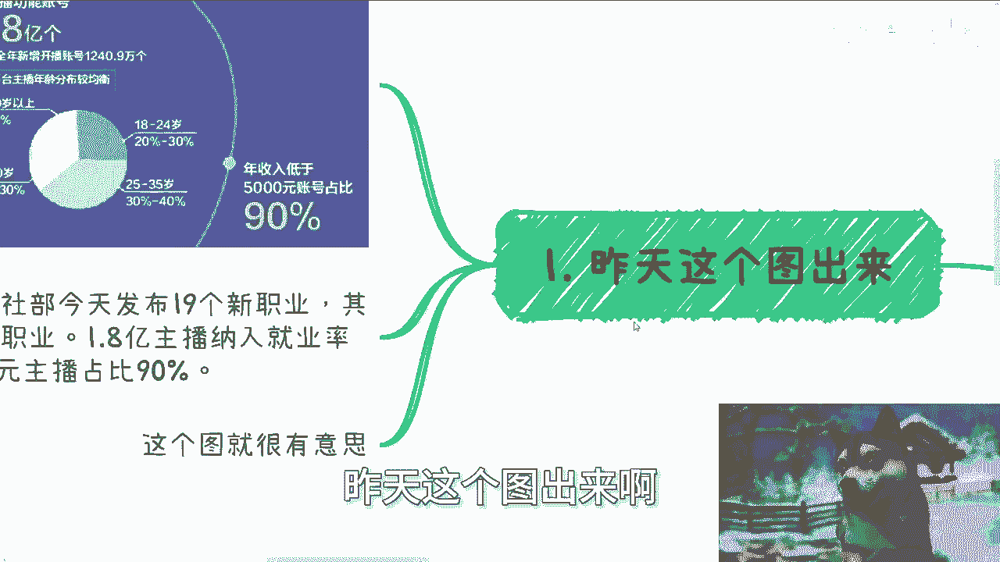
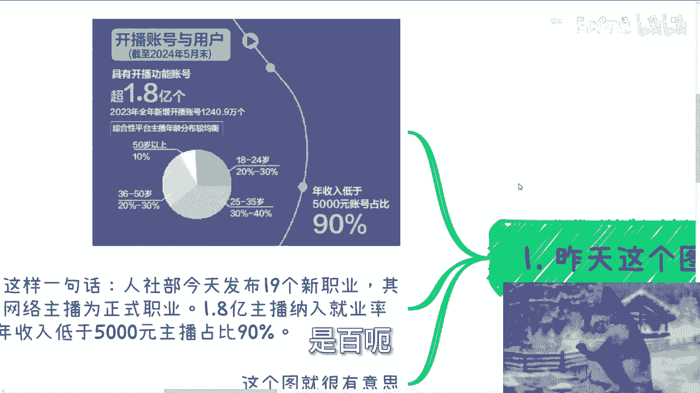
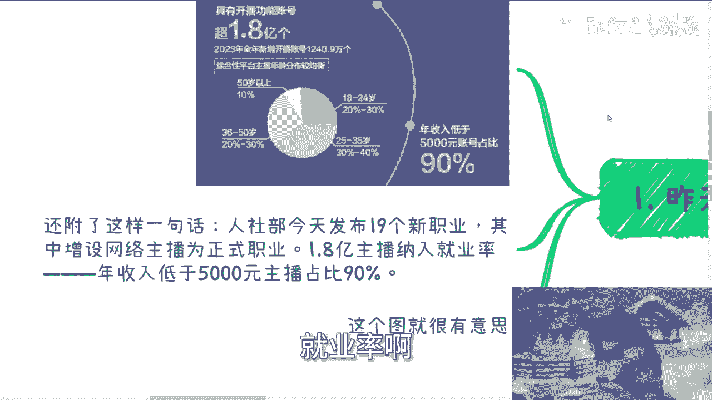
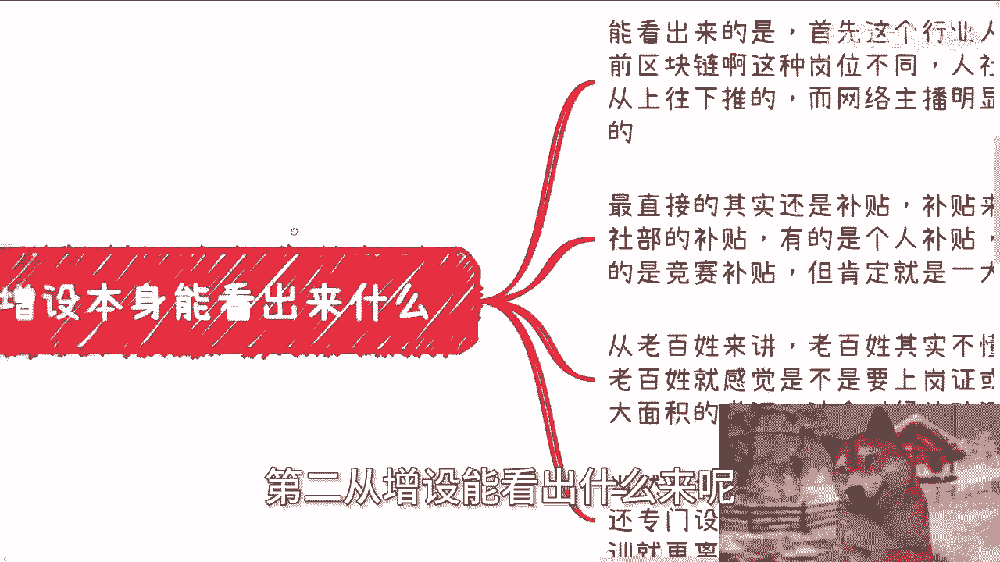
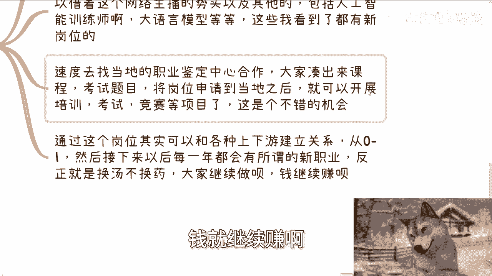
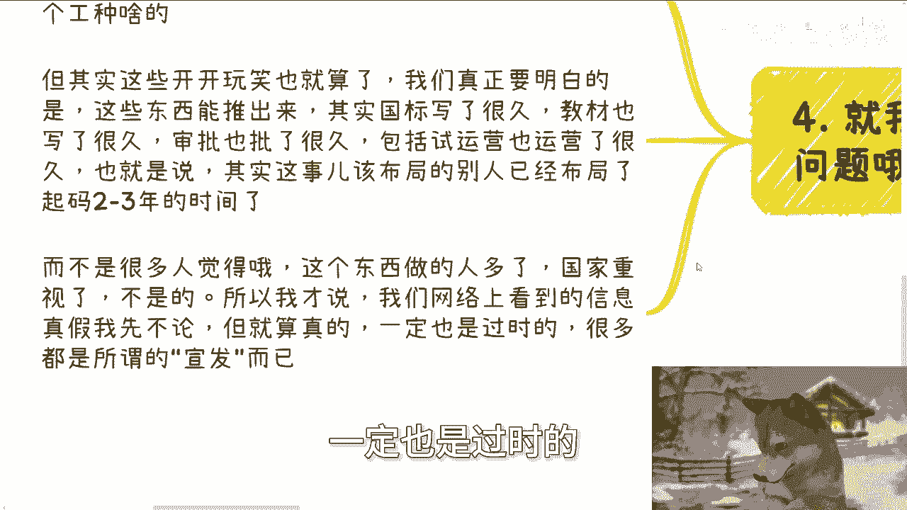
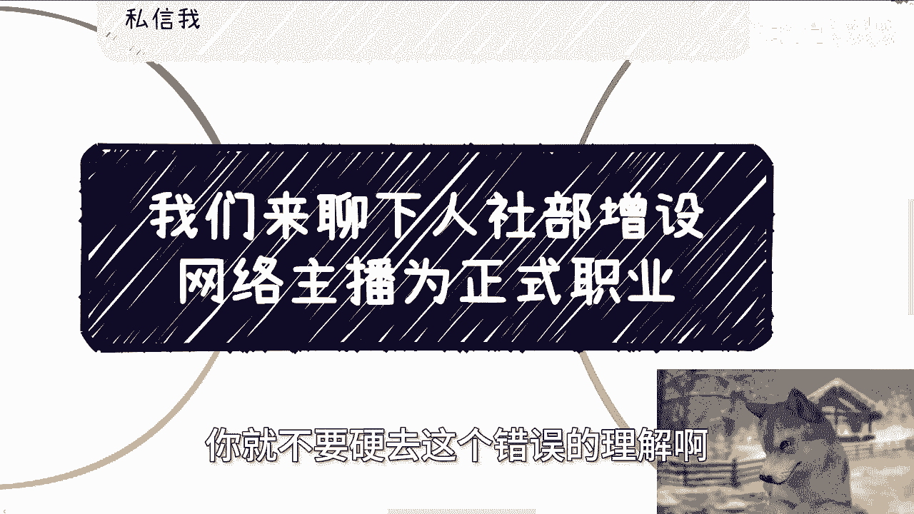

# 课程：人社部增设网络主播为正式职业的解读与机会分析 📺 - P1

在本节课中，我们将要学习如何解读“人社部增设网络主播为正式职业”这一新闻事件，并分析其背后可能存在的商业机会与逻辑。我们将从数据、政策、行业和商业角度进行拆解，帮助初学者理解信息背后的本质。

## 概述：事件背景与数据解读

昨天，网络上广泛传播了关于人社部增设网络主播为正式职业的消息。根据发布的数据，截至2024年5月末，具有开播功能的账号超过1.8亿个。这意味着在中国，大约每七个人中就有一人拥有开播账号。

2023年全年新增开播账号1240万个。从年龄分布来看，50岁以上主播占比5%，36岁到50岁主播占比10%，18岁到24岁主播占比20%到30%，而主力军是25岁到35岁的主播，占比30%到40%。

最引人注目的数据是：**年收入低于5000元的账号占比90%**。这个表述存在模糊性，我们无法得知这90%的账号收入具体是接近5000元，还是极低甚至为零。同时，公告中提到“1.8亿主播纳入就业率”，这是一个重要的统计口径变化。

## 政策解读：增设背后的三层含义

上一节我们介绍了事件的基本数据，本节中我们来看看政策“增设”这一动作背后能解读出什么。

首先，这反映出网络主播行业的人群基数极大。这与区块链等由国家自上而下推动的岗位不同，网络主播职业明显是由庞大的从业者基数自下而上推动形成的。

其次，最直接的影响可能与**补贴**相关。人社部的补贴模式多样，包括个人补贴、企业补贴、竞赛补贴和教育附加税补贴等。对于普通民众而言，“正式职业”可能引发“上岗证”需求，从而带动培训与考证热潮。

第三，这为相关商业合作提供了切入点。但请注意，核心机会不在于个人去考取证书。

## 商业机会：如何抓住政策风口

从政策含义的解读中，我们了解到这不仅仅是个人职业选择问题。那么，对于有意向的从业者或商家而言，真正的机会点在哪里？

以下是几个关键的行动方向：

1.  **与地方职业鉴定中心合作**：人社部发布的是国家职业标准，具体落地到各地方需要时间。可以主动与各地人社部下属的职业能力鉴定中心联系，合作开发课程、考试题目，并申请在当地开展该职业的培训、考试和鉴定业务。
2.  **建立可持续的商业模式**：一旦与地方鉴定中心建立合作关系，就可以开展培训、考试、竞赛等项目。关键在于打通与主管部门的合作关系，形成稳定的上下游链条。这样，无论未来人社部发布何种新职业，都可以沿用成熟的合作模式进行运作。
3.  **理解信息的时间差**：网络上公开的信息往往意味着相关布局早已开始。这个职业的国标、教材、试运营可能已经进行了两三年。因此，看到新闻才想到入场，可能已经错过了最佳布局期。真正的机会属于那些提前洞察趋势并做好准备的人。

## 核心逻辑：信息差与认知差

在探讨了具体机会后，我们需要理解一个更底层的逻辑：信息差。

很多人看到这个信息，只是在调侃或讨论职业本身。但若要从中发现赚钱机会，就必须思考信息发布的背后动机。网络上的公开信息，尤其是政策类信息，通常不是起点，而是某个进程的**宣发节点**或**结果公示**。

一个简单的逻辑是：如果某个机会在网络上刚被披露且人人皆知，那么它几乎不可能是蓝海市场，更不可能让大众站在同一起跑线上。在国内，几乎不存在依靠公开网络信息就能与所有人同时起步并成功的商业机会。

因此，我们的认知需要升级：**网络上你看到的有效信息，往往代表事情已经落地或即将过时**。真正的机会在于提前预判、提前布局，或者像本节前面提到的，与掌握早期信息的机构建立合作。

## 总结与活动预告

本节课中我们一起学习了如何深度解读“网络主播成为新职业”这一新闻。我们分析了数据背后的模糊性，解读了政策“增设”的三层含义，探讨了与地方鉴定中心合作、建立可持续商业模式等具体机会，并最终揭示了“信息差”这一核心商业逻辑。

记住，面对此类信息，普通人的视角（考证、入行）与商业者的视角（培训、合作、布局）截然不同。选择哪种视角，决定了你能从中获得什么。

最后，我的下一期线下活动已定于8月11日在长沙举行。主题将围绕企业Offer选择、个人从事自媒体与跨境电商的路径，以及对未来发展的展望。如需报名或了解详情，可以私信我。

此外，如果你在个人职业规划、商业合作、股权设计、合同风险规避等方面需要更接地气的建议，希望借助我的认知和经验少走弯路，也可以整理好你的具体问题和背景后与我联系。