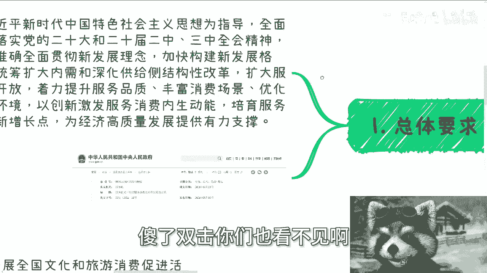
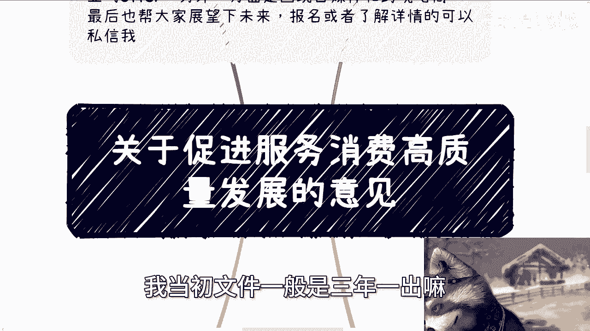

# 关于促进服务消费高质量发展的意见 - P1 - 赏味不足 - BV1YU411U7dP

好大家好，这个今天我们来讲的，这个是政府最近发的这个文件呃，我看了一下7月29号陈的文呃，8月3号发布，那今天就今天几号。

今天8月7号对吧，那那也才还还发了没几天啊，呃我跟大家简单讲一下，然后呢你们也看到了，就我这边会有一个总体的一个要求，然后是挖掘基础性消费潜力啊，然后第三个是呃激发改善型消费活力，然后直接就到第七了。

额当中你们详细的你们自己去看好吧，我就不一一个一个弄了，我大概看了一下这三个东西是比较重要的，额下一期活动已经定了，在本周日好吧，8月11号在长沙啊，在长沙，那么一方面围绕不同的这个企业的一些。

offer的选择，那另外一方面呢，围绕这个个体做自媒体跟跨境电商的一些，建议和发展，最后我也帮大家再展望一下未来啊，展望一下这个接下来可视范围内吧，啊一些情况啊，报名或者详细了解详情的。

你们可以继续私信我，首先第一个总体要求啊，这个文件大家可以看到啊，哎呀我双击了傻了，双击你们也看不见啊。

把这个把这个拉大一点啊，你们可以看到啊，陈文是2024年7月29号，那么发布是8月3号啊。

那么呃总体要求呢是这样子的啊，看到吧，内需啊，深化供给侧结构性改革对吧，扩大服务性服务业开放啊，着力各等等等等等啊，那么以创新激发服务消费内生呃啊，对内生动动能呃，培育服务消费新增长点对吧。

这个是核心啊，这个是核心好，那么我先在这个地方讲一个最最重要的，可能很多人比较关心的是什么，就是教育，教育和培训消费啊，这个东西可能很多人有有有关啊，你看啊几个，一个叫推动高等学院，科研机构。

社会组织开放优质教育资源，满足社会大众呃，大众化化啊，大众多元化个性化学习需求对吧，好什么意思，这个东西我们能看到这是第一个句号嘛对吧，那高等院校我们知道对吧，科研机构我们也知道社会组织。

社会组织这个东西就就很广泛了啊，那么简单来讲就是说OK我们是鼓励高等院校，科研机构，社会组织来让自己的，比如说老师啊，课程啊能够去open出来啊，能明白吧，简单来讲就是说OK大家可以去see啊。

大家可以尽量去see，当然你你得有好的名头对吧啊，第二推动职业教育题呃提质增效，建设高水平职业学校跟专业啊，这个是第二个句号，这个句号也很简单嘛，就是说啊职业教育提本身要提高质量，另外一方面。

这个呃那个职业院校跟专业，得要得要有这个高水平的一些这个建设，那么在这里面我们就说校企合作，就我们说的校企合作各个方面，他肯定有很大的这个这个这个切入点嘛，因为还我我还是那句话嘛。

学校本身他是没有这个能力去做所谓的，提质增效和建设高水平职业的，而如果来说他有这个水平的话，他妈早就做了对吧，那么所以说这个东西是很依赖于社，会化合作的啊，这个是第二个句号啊。

第三个推动社会培训机构看到没有，推动社会培训机构面向公众需求，提高服务质量，这个是第三个句号对吧好，那么核心点就是说鼓励啊，社会培训机构要向公众啊，满足公众需求情况下面，去做这方面的这个这个这个培训。

当然你说最后这个服务质量怎么评估，这是一个玄学对吧啊，那么最后指导学校按照有关规定，通过购买服务等方式，引进具有相相应资质的第三方机构，提供非学科类优质公益客服，看到没有。

这个就跟我一直跟你们讲的那类校企合作，是很很一样的对吧，那么我们就说具有相应资质，什么资质不知道，因为每个城市每个地方，每个学校肯定是各地方自己去弄了对吧，不可能的对吧，但是这一点也很重要。

就是各地方有这个叫做非学科类，优质的公益课呃，客户的服务，那么这个东西就是说这里面有很大的操作空间，那么最后鼓励与国际知名院校，这个东西就是我们相当于内需转外需嘛对吧，就是说我们需要做这个呃。

国内外的这个联谊对吧，那么这个东西大家就能看到，就是非常非常的清楚啊，那么我们就说啊在这里面哦，他的整体这一档叫做教育跟培训消费，那么在这里面我们就说了，就说我党做事情啊。

就是就是政策上面一向只是只说战略，不说战术的，因为你没法定战术啊，哦你说从中央角度他定义一个东西，把所有的中国各城市，各省市区都框住，不可能的，他一定是给一个大的框架，然后你们在这个框架下面去做对吧。

那么我们又反过来来说，我们为什么要来解析这些文件，是因为很简单，就是你们所谓很多人不是要在那边说吗，啊我们要占得先机，我们要去找到机会怎么样子，OK啊这就是机会啊，哦不的。

8月3号出的门禁还不是还不算机会吗，对不对啊。

那么好，那么我们回到和那个一个来说啊，额第一叫做挖掘基础消费潜力啊，这里面提到几个，一个叫做餐饮住宿消费，餐饮住宿消费这东西很简单，就餐饮这边呃写的很清楚，就是叫做培育名菜名小吃，名厨名店对吧。

就说白了就是说你得有特色啊，地方特色对吧，特色小吃集群，打造美食名村啊，美食名镇对吧等等等等，那么另外一个呢就是说是提升住宿，就比如说民宿啊对吧，包括这个高端酒店啊对吧，这个地方也写了啊。

就是说培育培育一批中高端，酒店品牌和民宿品牌，支持住宿业跟旅游闲置房屋融合发展对吧，那这个地方注意啊，这个地方也写了啊，支持住宿业与旅游康养，看到没有康养啊，研学看到没有康养跟研学，我跟你们讲了很多次。

你比如说之前有很多心理疗愈做那种什么啊，这个这个这个心理马杀鸡的瑜伽的对吧，或者怎么样的，这些都算在抗压里面啊，研学就更别说了，他妈的什么什么什么什么俱乐部啊对吧，什么私董会啊，都算原研学啊。

那么这些东西其实就都是老套路啊，第二家政服务，家政服务呢这个东西呢，我觉得更多的一方面是的确本身是需要推进呃，家政服务的，因为家政服务的需求很大，那另外一方面呢，那么这个地方也看了啊。

叫做叫做指导制定啊，家政服务公约啊，优化家政服务信用信息平台跟家政信用查功能，你看啊，这个地方后面这一段，其实在各地方省市区落的时候，就会有很多的软件相关的东西，其实你们不要来老是问我说啊。

这个东西软件有什么关系对吧，或者怎么样子，你要明白一点，就当下互联网的发展，什么东西都是离不开软件的对吧，那么一样的道理，那么我们又又再往前走啊，你说如果来说，到时候有些机构要这个信息化平台。

或者说家用信息信用查或者怎么样子，那大部分前前期你还是可以以培训跟咨询，方式切啊，对不对，你你你所有的逻辑都一样的哦，第三在这个文件里面写的很清楚，叫养老，养老托育对吧，那很简单啊，小的老的嘛对吧。

因为现在整个中国的一个发展人，那人群分布来讲的话，小到老的就是怎么说呢，就是最重要嘛对吧，也是最大的一批量，所以说你会看到这一块文字特别多啊，我就我就不详细说了，你们到时候自己去看好吧。

因为反正我现在也停了，这个地方你们也可以暂停去看，但在这个地方呢我提几点啊，一个是你看啊，嗯加快健全居家社区机构相协调，医养康养相结合的养老服务体系，开展居家和社区基本养老服务提升行动。

推动职业院校加强人才培养，你看到吧，呃加强人才培养，这个就是叫做养老这方面，然后是这个多渠道增加养老托育服务供给啊，然后支持依法依规利用空置场地，新建等等等等等，那么这里面其实这东西就多了去了。

你看到这里面包括什么啊，这个空置场地新建啊，结合新旧小区对吧，要完成改造啊，然后这里面还有什么还有什么呃，那个叫什么叫同步建设，同步验收，同步交付对吧，实现养老托育机构用水用电。

用气用热按居民生活价格执行，巴拉巴拉，那么这些东西都是增量市场，对不对，但是这些东西不一定这么快啊，啊这个我到最后再来跟你们说啊，好那么这个是叫做挖掘基础性消费啊。

好那么接下来就是叫做呃刺激这个改善性消费，改善性消费有哪些呢，呃他写了一些第一个叫做文化娱乐消费对吧，那文化娱乐消费大家就不要说了，什么各种文创啊，文化创意啊对吧，呃我相信那种什么影视啊。

你看这边写了啊，促进电影呃，关联消费对吧，提升网络文学，网络表演，网络游戏，看到没有，网络游戏啊，广播电视和网络视听质量，深化电视层层消费，收费跟操作复杂，整治啊，加快超高电视发展对吧，鼓励沉浸体验。

那么这块东西的话就是说数字化文创啊，数字经济啊，啊包括以前元宇宙啊都能往里面套嘛对吧，这一个东西嘛啊第二旅游消费，旅游消费那就更别说了对吧，你看啊在这个地方写了啊，推动啊多种特色旅游产品，鼓励游轮游艇。

看到没有，游轮游艇房车露营，低空飞行对吧，低空经济啊，低空飞行支持音乐加旅游演出加旅游军，赛事加旅游对吧等等等等等啊，这个增开银发旅游专项对吧啊银银发旅游对吧，适合老化啊，那个适合老化。

舒适化改造对吧等等等等等，反正就是就就就就说白了，就是说我们要有更多的创新，我们要呃更多的这种呃符合这种啊，当下中国这种老龄化的这种特色的东西，以及还要优惠啊，还要就是说就就就翻新对吧啊。

反正就就这么个意思啊，嗯那么体育消费啊，你们看啊，体育消费第一句话叫什么，叫做盘活空空置场馆的这个资源啊，引导社会力量依法改造旧厂房仓库，老旧商场，说难听点，我觉得中央为什么写这个东西，他们也明白了。

就是很多东西其实无论是社会的发展，还是说是是是怎么说呢，就是说是行业的发展，都因为发展很快，很多东西其实都过时了，很多东西都都没人用啊，都是闲置的，所以说这些东西要么你就就就要么拆掉。

要么就是说是怎么说呢，再利用对吧，你不能控制在那个地方，其实很多都是资源浪费啊，那么这个是第二，第三的话，教育和培训我就不说了，刚刚说过了，第四居住服务消费对吧，鼓励有条件的物业服务企业与养老。

你看到啊，又又再次强调了养老托运啊，托运啊，餐饮家政等企业开展合作，发展物业服务加生活服务模式啊等等等呃，推广智能安防，智慧停车，智能门禁等新模式，叭叭叭叭，那么这一切其实这里面你你看啊。

提所谓的智能安防，智能停车定智能门禁，包括那个提升居住体验对吧，培育标准化设定啊，定制化整装等等等，这些东西不都是怎么说呢，商机嘛对吧啊那么好，那么最后就第七点啊，第七点叫做强化政策保障。

你看强化政策保障里面提了提了几个，第一个叫做强强加强这个财财税金融，你看啊，嗯这里面提了很多很多，我就不一一说了，但是呢这里面也很简单，就是说大家做财务的，包括进那个那个金税四期啊。

包括新的一些财务的政策，包括这里面也写了，就是说给到这个老龄化跟小孩的子女教育啊，赡养老人啊对吧，这一些的这个保险啊，包括其他各个东西，这些东西呢其实都是可以啊，来来就是说通过你们的一些专业知识。

去给到C端做培训，或者给到企业端，政府端做做咨询，其实都是可以做的，对不对，因为你们不要觉得好像自己做金融，自己做做财务做些什么东西，没有什么切入点，有的哦，不是没有。

但这些切入点得你们自己得得卖出去啊，那么第二你看啊，我们我我曾经跟你们讲过，我我党啊出文件，无论怎么出，他一定有个东西是绕不开的，就是人才队伍啊，你看啊，第二个就叫做夯实人才队伍支撑对吧。

持续完善相关学科的专业设置和培训方案，校企合作，你看到没有啊，啊，产教融合是重点，校企合作是重点，工学结合是重点啊，订单式培养呃，服务业紧缺人才，鼓励普通高校职业院校跟企业合作，看到没有，校企合作。

共建开放型开放型区域产教融合实践中心，这个有也是我跟你们说的，比如说实验室的采购，培育复合型应用型技能型服务业人才，完善服务业呃，人才职称评定，职业资格评价职业技能等级，看到没有，职业技能等级啊。

认定等多元化评价方式，鼓励地方发布服务业，重点领域高精尖人才目录和认准标准，完善落户购房，那么这些东西可能在在各个文件上面，你们看到的这个说法其实是大差不差的，但是不管怎么样。

这个东西就是不停的在告诉中国的各地区，政府和相关机构就是人才队伍的支撑，人才培养是永远不会缺席的，你明白吗，就说这块东西只要大家去做，只要大家能够找到那么一两个切入点，我觉得这个东西是有稳定性的啊。

那么最后叫做提升统计监测水平对吧，这个我就不去多说了，比如说呃家当与第三方支付平台，研究机构合力力度对吧，探索适合的应用模型，然后就说这就说白了就是数据怎么清洗，数据怎么归档对吧。

数据怎么样子啊，那么所以说其实从整个的这个意见上面来讲，你说啊嗯咱们就这么说啊，8月3号出的文件，基本上啊就是就是2025年，整个基调肯定是定的对吧，甚至就是说我觉得按照文件的调性啊。

我党出文件一般是3年一一出嘛。

所以说我估计20252026，2027等这个基调也是大差不差的啊，所以我觉得就跟大家想的其实大差不差嘛对吧。

就是说养老托育啊，家政啊，旅游啊。

然后是人才培养啊，然后是文化娱乐，旅游消费，体育消费啊，教培啊，教培，还有这个居住服务对吧，就是说这些东西都是你们的切入点，但是我们作为一个老百姓，我们作为一个个体，我们要做的是什么。

就是先拿着对应的这个东西，找到一个呃这个切入点和你们当地的啊，所在地区，比如说北上广深对吧，或者哪个地方，你所在城市的一些这个这个这个机关单位，或者说一些一些这个商业合作伙伴，你们先去拿这个东西。

先去研究研究，先去讨论讨论，对不对，又不是说8月3号出的文件噢，你说封口，你说这个这个前瞻性，卧槽他妈就急，这两天也不急，这两天对吧，那么按照我按照我党这个这个，这个项目的申报对吧。

或者说很多东西要讨论，也就是说25年的东西，基本上就是24年下半年就要申报了对吧，那么你你整个现在8月份，我觉得还是来得及的啊，跟大众都去聊一聊啊，跟一些机构都聊一聊，看看有没有机会对吧。

有没有什么合作的切入点，如果今年来不及了，那明年上半年再报嘛对吧，那你不要老是在那边说啊，文件嘛我也不看啊，然后看了嘛也也在那边抱怨，说跟自己没什么关系。

那还做个蛋对吧啊，行好吧。

那就这么着吧，然后那个本周日这个活动啊，这个长沙这个活动，反正大家呃在那边的，有机有有有兴趣的好吧，你们继续私信我，我们可以继续聊一下啊，那个另外一方面就是说这个职业规划，商业规划啊，你们自己工作上面。

包括你们跟别人做一些副业，或者自己做一些副业啊，这个额分红啊，股权啊啊分分润啊对吧，像那个合同啊啊相关的这个计划书啊，白皮书啊对吧等等等啊，包括你们希望通过我的一些这个呃对于行业啊。

对于今呃整个的这个市场环境啊，包括对于当下的一些呃行业发展啊，呃结合我的一些想法，结合你们自己的一些个人的背景，跟个人问题的话，你们希呃希望通过呃我跟我的沟通，能够让我给你们一些更接地气的一些建议啊。

以及能够让你们少走一些弯路的话，那么你们可以整理好对应的问题和个人背景，好吧。

