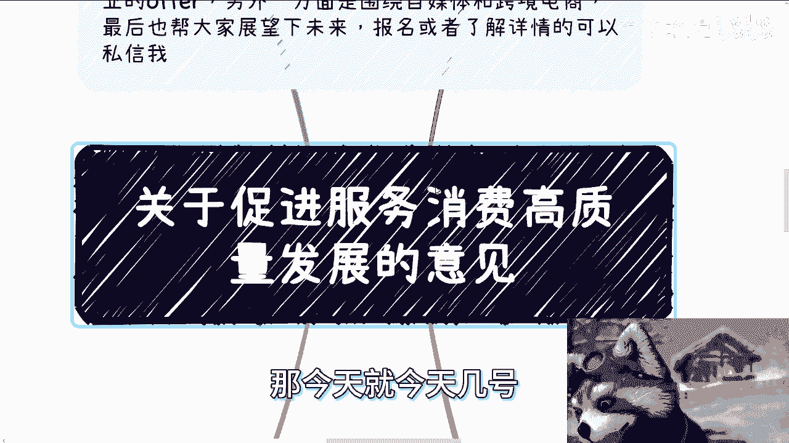
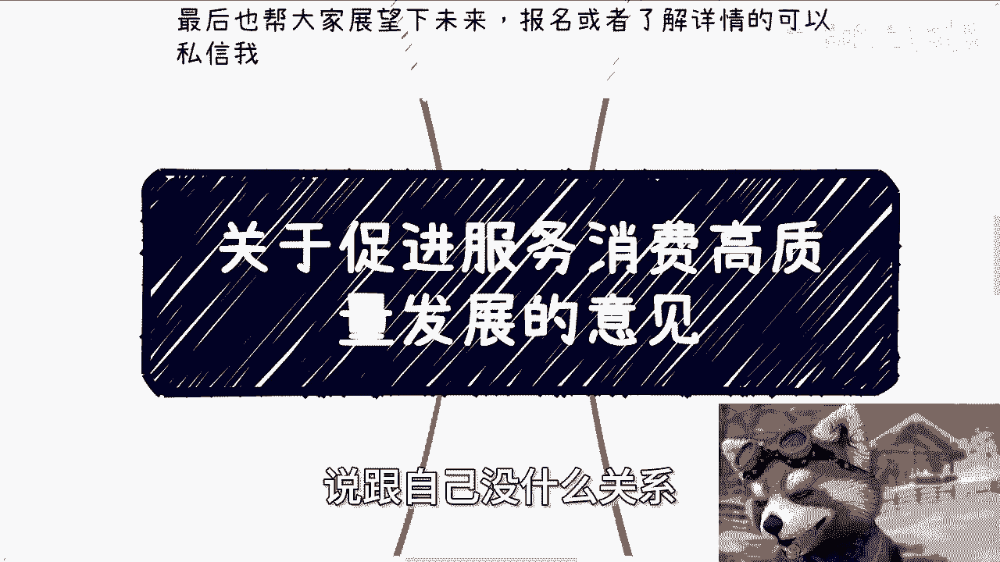

# 课程：政策解读与机遇分析 - 第1课 📚

在本节课中，我们将一起学习并解读一份重要的政府文件——《关于促进服务消费高质量发展的意见》。这份文件于2024年8月3日发布，为未来几年的服务消费领域发展指明了方向。我们将提炼其核心要点，并探讨其中蕴含的个人与企业机遇。

## 概述与文件背景 📄

上一节我们介绍了课程主题，本节中我们来看看文件的背景信息。该文件成文于2024年7月29日，并于8月3日正式发布。文件的核心目标是**深化供给侧结构性改革**，扩大服务业开放，并通过创新来激发服务消费的内生动力，培育新的增长点。

## 核心领域一：挖掘基础性消费潜力 🔍

文件首先强调了挖掘基础性消费潜力的重要性。这主要涉及与民生息息相关的传统服务领域。

以下是该部分提到的几个关键方向：

*   **餐饮住宿消费**：鼓励培育具有地方特色的名菜、名小吃、名厨、名店，打造美食集群。同时，支持发展中高端酒店和民宿品牌，并推动住宿业与旅游、康养、研学等产业融合发展。
*   **家政服务消费**：指导制定行业服务公约，并优化家政服务信用信息平台。这意味着在地方落实时，可能会产生对相关软件系统和信用查询功能的需求。
*   **养老托育消费**：这是文件中的重点。旨在加快构建居家、社区、机构相协调，医养、康养相结合的养老服务体系。具体措施包括支持利用空置场地建设养老托育设施、推动职业院校加强相关人才培养、实现相关机构用水用电享受居民价格等。这为社区改造、设施建设、人才培养等领域带来了明确的增量市场机会。

## 核心领域二：激发改善型消费活力 🚀

在稳固基础消费后，文件进一步提出要激发更具品质和体验感的改善型消费。

以下是改善型消费的几个主要板块：

*   **文化娱乐消费**：促进电影、网络文学、网络表演、**网络游戏**、广播电视等产业发展，鼓励沉浸式体验。这为数字文创、元宇宙等概念提供了政策支持。
*   **旅游消费**：推动开发多种特色旅游产品，鼓励游轮游艇、房车露营、**低空飞行**（低空经济）等新业态。支持“音乐+旅游”、“赛事+旅游”等融合模式，并开发适合老年人的“银发旅游”产品。
*   **体育消费**：重点在于**盘活空置场馆资源**，引导社会力量依法改造旧厂房、仓库、老旧商场等闲置资产，实现再利用。
*   **居住服务消费**：鼓励物业服务企业与养老、托育、餐饮、家政等企业合作，发展“物业服务+生活服务”模式。推广智能安防、智慧停车、智能门禁等智慧社区应用。

## 关键切入点：教育与培训消费 🎓

教育与培训消费被单独列为改善型消费的重要一环，其内容具有很高的指导价值。

以下是该部分的具体表述与解读：

1.  **推动高等院校、科研机构、社会组织开放优质教育资源**：这意味着鼓励上述机构将其师资、课程等资源向社会开放，满足大众多元化、个性化学习需求。
2.  **推动职业教育提质增效，建设高水平职业学校与专业**：职业教育的质量提升和高水平建设，在很大程度上依赖于**校企合作**等社会化力量的参与。
3.  **推动社会培训机构面向公众需求，提高服务质量**：明确鼓励社会培训机构以市场需求为导向，提升培训质量。
4.  **指导学校通过购买服务等方式，引进第三方机构提供非学科类优质公益课程**：这为具有相应资质的机构进入校园，开展素质类、实践类课程合作提供了政策依据。
5.  **鼓励与国际知名院校开展合作**：支持国内外教育资源的交流与联动。

**政策特点**：中央政策通常只规定战略方向（做什么），而不规定具体战术（怎么做）。各地需在此框架下自行探索落实路径。解析文件的目的，正是为了提前发现并把握这些方向性的机遇。

## 保障措施与长期基调 ⚙️

任何政策的落地都离不开配套的保障措施。文件第七部分“强化政策保障”明确了支持手段。

以下是两项核心保障措施：

*   **财税金融支持**：涉及税收优惠、金融扶持等方面，例如针对子女教育、赡养老人支出的专项附加扣除等。这对于财务、金融领域的专业人士而言，意味着可为个人或企业提供相关的规划与咨询服务。
*   **夯实人才队伍支撑**：这是所有政策文件中几乎不会缺席的一环。重点强调**产教融合、校企合作、工学结合、订单式培养**。鼓励校企共建实践中心，完善服务业人才的职称评定和**职业技能等级认定**体系。这再次确认了人才培养领域具有长期且稳定的发展机会。

此外，文件还提到要“提升统计监测水平”，探索与第三方平台合作的数据应用模型，这对数据分析、模型构建等领域提出了需求。

## 总结与行动建议 💡

本节课中我们一起学习了《关于促进服务消费高质量发展的意见》的核心内容。总结来说，未来几年的重点发展领域清晰可见：**养老托育、家政服务、文化旅游、体育健康、教育培训、居住服务**以及贯穿始终的**人才培养**。

这份文件为2025年乃至未来几年的发展定下了基调。对于个人和企业而言，当前正是行动的时候：

1.  **深入研究**：结合上述重点领域，寻找与自身专业、资源相匹配的切入点。
2.  **主动链接**：与所在地的相关政府部门、行业协会、潜在商业伙伴进行沟通，探讨合作可能性。
3.  **提前规划**：政策项目的申报往往需要提前准备，现在开始研究讨论，正是为了把握明年及以后的机遇。

政策是风向标，行动才能创造价值。与其观望抱怨，不如主动出击，在趋势中寻找属于自己的位置。