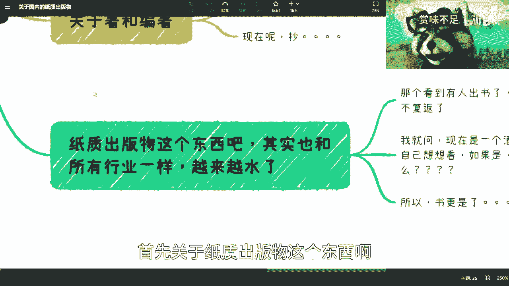
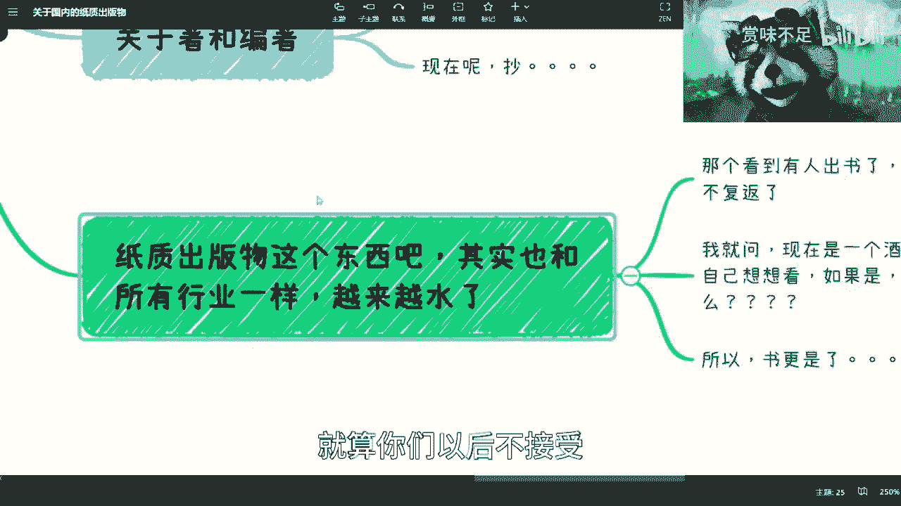
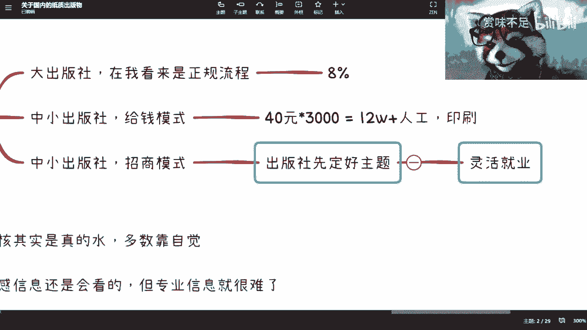
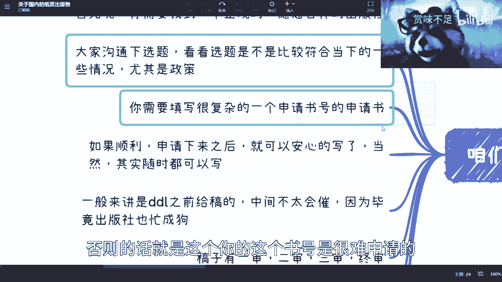
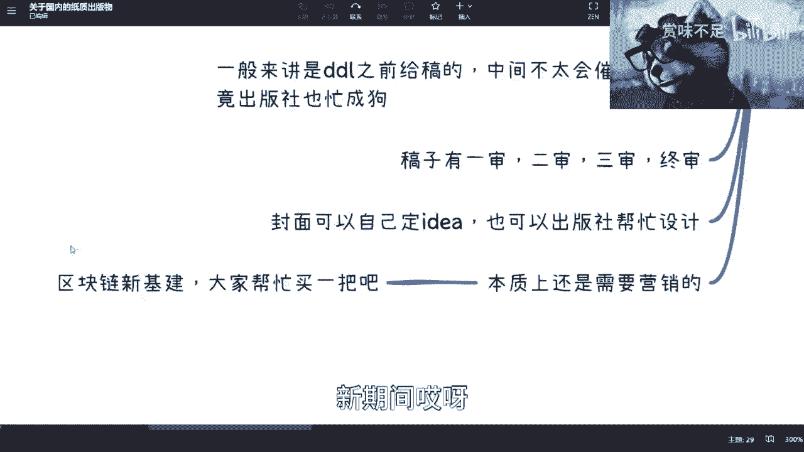
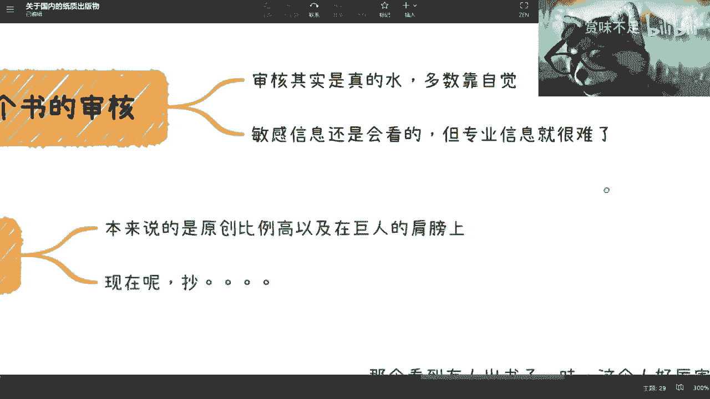
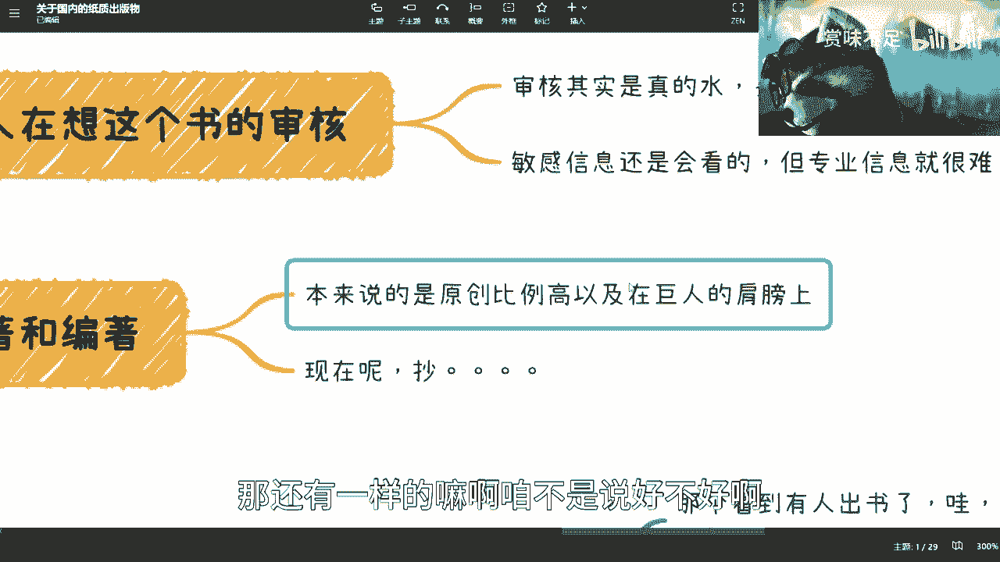
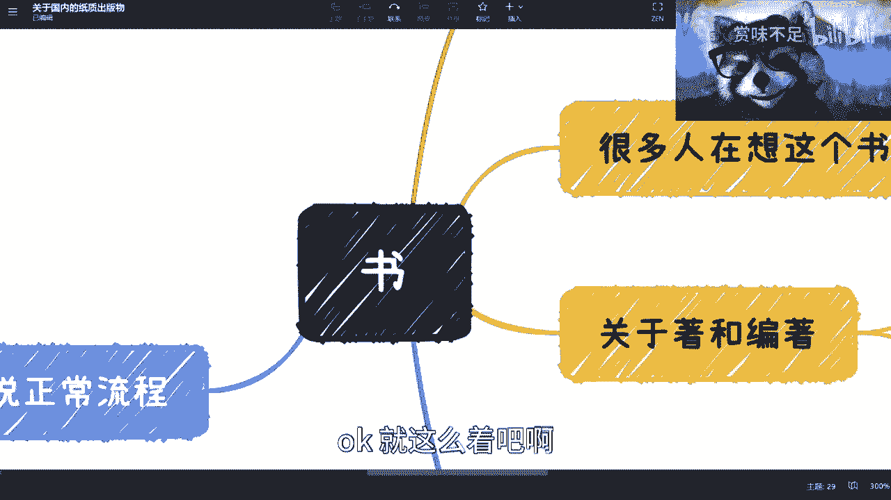

# 关于出版或者买“书”，你必须了解的事儿 - P1 - 赏味不足 - BV1ok4y1x7V2

哈喽大家好啊，礼拜六礼拜六好啊，哎呀我哎呀哎呀，这个眼睛能不能甩下来，嘿嘿好嗯，对我之前呢其实一直想出一期这个内容。

但是我后来忘了啊，因为我今天我给大家补上，就关于这个国内呢叫做纸质出版物啊，其实说是这么说。

但是别的我也不了解啊，其实本质上就是书啊，那么书这个东西呢，我觉得呃大部分人啊对他的理解了解是，可能有一些就这种幻想当中的想法啊，然后包括就是说一些认知啊，但是我可以告诉你们，就是很多东西呢。

就像我一直跟你们强调的啊，就是说我们父母给我们的这个认知，跟我们比如说老师给我们的认知，你说他们对吧，就是也对啊，你说他们错吧，也有很多的毛病，但这个对和错呢，其实主要在于因为时代在发展的。

但是很多人这个知识更新它是就不迭代的，你知道吧，这就好像这个我有很多同学也是一样的，就就我我相当于跟我同龄人啊，就也是一样的，就是就是呃可能我们一起被灌输了很多的思想。

但是呢由于就是说啊我可能就比较接地气啊，那么很多东西呢，我慢慢慢慢发现我以前这个了解的并不对啊，但他们不会啊，他们就一就一直觉得啊，这个2000年的时候，比如说是这么个想法啊。

现在还是这么个想法，首先关于纸质出版物这个东西啊。

其实跟所有行业一样，就越来越水啊，我我今天呢跟你们会把整个的流程啊说清楚啊，这个你们也可以了解了解啊。

就算你们以后不接触，也可以了解了解，至少不至于被骗嘛，对吧嗯，首先呢我跟你们说啊，这个所有人看到这个出书了，哇，这个人好厉害啊对吧，怎么样怎么样，这个时代已经一去不复返了啊，你们想出也可以出啊。

你们找我出发来无所谓的啊，这个都ok啊，如如你们会如果觉得那个叫什么哎呀，我好像写不出来怎么样对吧，不重要，你听我往下讲，然后呢第二点呢是什么呢，就是我就问啊，你们想想看，不管是书还是我对吧。

还有其他人唉，我跟你们讲，哎我跟你讲没啥好看的，因为我以前也做了很多内容对吧，就一直在500粉有啥好看的呢对吧，然后还有人还有这个小伙伴说啊，这个这个内容做的还是蛮好的对吧，那为什么叫什么没有人看。

我说这不废话嘛是吧，你好不好，跟有没有人看，那他完全没因果关系是吧，这就好像我为什么跟你们说，你们一味的去追学历，很有可能未来这个回头还是面临这个问题，然后你们到时候那我这么说吧。

我要是这个时候来跟你们说啊，不重要啊，你们就去工作好，到时候呢你们这个学历低了就骂陈老师是吧，那你们去追的学历呢对吧，这个我跟你们说啊，但凡到时候又没用对吧，这个又找不到工作，我看看你们到处骂谁去啊。

我就问啊，我说现在是不是一个叫做，酒香不怕巷子深的时代是吗，你们想看是不是我就不用我说是吧，你们自己都知道，我跟你们讲，但凡但凡如果是的话，那现在b站也不可能有这么多的up主推荐对吧，我跟你们说。

我看了很多视频啊，为什么他们说退战，我基本上总结出来，他们说的只有一个原因是什么呢，就是劣币驱逐良币嘛对吧，就是比如说他们辛辛苦苦剪辑啊，做了很多东西，然后可能啊有个5万10万的播放量。

但是还不如人家扭个腰对吧，这个这个叫什么跳个舞是吧，那怎么办呢，不就这个样子嘛，对吧啊，然后我跟你们说啊，就是互联网时代的东西啊，这样子这个书就更是了啊。

真的是更实了，我们来往下看啊。

嗯从模式上来讲啊，一般我了解的呢就三种模式啊，应该是套不出这三种模式都在这了啊，呃第一个呢就是大出版社啊，所以你们但凡真的要去看东西呢，你们第一步肯定还得看出版社，因为出版社还是会去做蛮多的。

这个怎么说呢，就是正规和不正规还是有蛮大区别的啊，大出版社呢他会走正规流程，流程是什么，我待会给你们讲的好吧，这第一个第二个呢就是说中小出版社呢，它会有一个给钱模式，什么叫给钱模式呢，呃记住啊。

不是他们给你钱啊，他们不给你钱啊啊啊对对对，我说一下那个那个收入的事情，一般是8%啊，一般是8%，但是呃这个一般也不是固定的，会按照销量来走，就我举个例子啊，比如说5000册是8%对吧。

比如说1万册是9%对吧，当然我举个例子啊，也不是这么一个阶梯啊，但是8%这个数据我可以告诉你们，这个是正规的啊，这个是正规的，那么出版呃，那个给期末是什么意思呢，就是说啊你今天我举个例子。

你说你想出本书啊，你找一个中小型出版社啊，然后他就会跟你讲啊，我我怎么来收费呢，比如说这本书定价40块钱啊，40元，然后呢他会跟你说，你要先踩过3000册，那采购3000次是多少呢，是以12万，对不对。

12万，那么这个里面呢你还得加上他们的人工，人工成本啊，印刷成本对吧，印刷成本等等啊，那一般来讲呢我估计3000册差不多吧，差不多啊，所以你一般呢就是可能给他们预支啊，差不多在15万左右。

我估计啊这种啊，那么这种的话呢是什么概念呢，就是说我觉得流程上面其实很多，都是走走形式的，因为它主要是钱啊，主要是钱，就是你可以理解为你用钱去买一个身份对吧，那还有一种模式是什么呢，是招商模式。

什么叫招商模式呢，就是说呃出版社先定好主题啊，那比如说啊我们我们比如说这个电话主题，说好，对吧好啊，这个时候呢，这个主编啊他会到行业里面各个人啊，比如说找我对吧，找其他人啊，就说好，你看啊。

我们现在封了12张好，大家来啊，谁愿意谁愿意栏里面的，比如说三张对吧，谁愿意负责里面的时长对吧等等等啊，那负责那负责那也不可能给你白负责对吧，好负责呢，他又回到了第二个就是陈老师，你要不要来做啊对吧。

哎这本书蛮好的啊，你要不要来负责啊对吧，这个里面比如说呃，百分之七八十的内容都你出啊，但是呢诶我要收费诶，这个时候我跟你们讲啊，招商模式的收钱比这个正常的给球模式还要贵，还要贵。

你比如说这边是预支3000册对吧，40块钱，比如说12万，他这种呢很有可能就是说单纯一张，你只要加入啊，他当然了，他会这么跟你讲，他说哎陈老师，你看啊，我们这边已经找了很多大咖了，对吧啊。

这个你进来对你也是有好处的啊，怎么样怎么样，那当然了呃这个说不好听点，他们有没有我也不知道对吧，反正就是空手套白狼，左手套右手，右手套左手是吧，那么这种价格呢很有可能一张问你要个10万，20万的。

也也有可能啊，一般10万左右吧。

我估计20万过分了啊，10万左右对吧，好啊这个到此为止呢。

你们应该已经大概对吧，就整个轮廓大概又了解了啊，又了解了好，那么接下来是这里啊。

我们就说说正常流程对吧，坏的我就不教你们了啊，教咱教好的是吧，首先你需要找到一个正规的啊，愿意合作出版社，比如说对吧，你像清华大学出版社跟我合作了有个10年了，都快10年有吗。

正好肯定到23年，正好10年啊，正好10年，因为我写的也比较早，我大概毕业2年左右就开始写了，写第一本书啊，啊当然啊，我跟你们讲啊，我为什么一直要来说这些视频，是因为我跟你们一样，我跟所有人都一样。

都是个普通人啊，我没有任何背景，我没有任何家庭这个什么支持，我没有任何东西啊，nothing啊，什么都没有，诶这是什么，我朋友给我发了个什么奶茶吗，对吧，然后呢就是是这样子的啊。

然后呢就是说啊那有很多人就跟我讲了，他说呢陈老师你你你扯淡了对吧，哪里有人这个毕业2年去写本书的是吧，我跟你们讲啊，我可能咨询我的人，我都会跟他们说的，就是我跟你们讲，为什么我会写，是因为我没有办法。

为什么我没有办法，是因为我在工作第1年的时候，我跟你们说，我就评估了我的能力非常差，就是就是我跟很多人是这么说的，我说我的下限很高，但我的上限很低，你知道吗，就我这种人就是很对吧。

因为你下限很高意味着什么，你你你你你太要脸对吧，你做不了很多的这种这种赚钱的事情，你上限很低，代表什么，代表着我很难往上走啊，我觉得我第1年就认清楚这件事情了，你知道吗，就是就是就很多人跟我说啊。

我双飞对吧，我我我叫什么，就是呃三神三和大神对吧，我我不是一样的吗，有什么区别呢对吧，那很多人就跟我说嘛，他说他说你2年去写写啥呢，我说我是不知道写啥，但是但是就是说我不是抱着一个说我呀。

我要来教教大家的心态，我就来跟大家分享的对吧，我甚至我就说我跟大家分享对吧，我比如说对于当下这个社会的一些一些迷茫，对吧，我找不到工作对吧，怎么样子，有什么不可以的对吧。

而且我当时这个毕业那个时候的确呀对吧，2011年吧，那个时候就是就是跟其实跟现在差不多，但是比现在会好一点，因为现在的确是就真的很差，你知道吗，那个时候就相对还好，但是也很差，你知道吗。

那那那怎么办呢对吧，然后我当时跟出版社的编辑是这么说的，就当时我在清华大学里嘛，跟他们见过一面，然后当时是这么说的，我就说我说我就很想这个做做一些，就是说我不想在公司里做。

我说我就很想做一些有影响力的事情对吧，但是我说我不知道怎么做，我也不知道该怎么开始，然后那个出版社的编辑嘛就跟我说，他说他意思是说呢，他说纸质出版物是个很好的方向，但是我就跟他讲，我说我什么都不懂。

你让我写，我是不可能的，写出来肯定要被喷的是吧，但是呢我后来回来我回上海之后，大概想了三个月，我觉得没有别的路可以走啊，我能怎么办呢对吧，那后来我还是硬着头皮去写。

然后呢第二步呢就是大家沟通一下选题对吧，你说啊，比如说你想做个写个摆摊对吧，然后看看选题合不合适。

记住啊，这合不合适，主要是政策层面是不是合规。

是不是敏感啊，第三呢就是说你需要写一个很复杂的申请书，申请书这里面的内容很多很多很多很多，比如说我给你们举例子，比如说书的名字对吧，截稿日期多少字，几个作者对吧，然后书的介绍，书的所有的明确的三级大纲。

以及你怎么营销，你为什么觉得这本书卖得出去啊，你跟别的同类型的书，你的优势在什么地方，就是所有地方都需要写清楚的，否则的话就是这个你的这个书号是很难申请的。

当然啊咱还是说正规流程不正规流程随便对吧，你只要给钱就可以啊，给钱就可以啊，那么那么再往下如果顺利的申请之后呢，就可以，你就安全写了，但是呢本质上呢其实你写不写，跟这个申不申请也没关系。

反正你先写嘛对吧，没有说话你也可以写啊，不代表你一定有书号才能写嘛是吧，你随时都可以写啊，然后呢一般来讲呢在deadline之前会需要你给搞，但是中间不太会催你，为什么呢。

因为出版社的编辑又不是围着你一本书，赚人家111年可能几百本输对吧，忙成狗不会来催你的，但是deadline就会来催你，我跟你讲啊，deadline一定会来催你的啊。

那么那么稿子这边呢有一审二审三审终审啊，肯定都有审的，那么你就你就得不停的改，而且改呢有一些是措辞上面的，有一些是格式上面的，但是它很细，因为你想嘛你一本书再这么低这么低。

152000 10万字总共要的嘛对吧，那你所有的配图啊对吧，包括出处啊对吧，这个就跟你们学论文一样的嘛对吧，但是要研更可能可能更严谨一点吧，或者来说也不是更严谨，更贴近，就是说社会大众一点。

因为论文可能比较学术化啊，那么封面呢其实可以自己定id，就你比如说你你说你想要什么样式的对吧，你可以啊，但是呢一般来讲的设计不会用，你设计的出版社可以设计啊，但是但是咱客观点说啊，就出版社设计不咋地啊。

不咋地，你不用指望说他这个做得非常好啊，60分啊，60分啊，然后呢本质上我跟你们说啊，就是就像我说的，就是说酒香呃，那个还是需要营销的，因为酒香现在就是怕巷子深的啊，所以说呢我觉得大家要是支持呢。

你们可以去买一下啊，我我去年出的就疫情期间出的，只要区块链新期间哎呀。

你们可以支持一把啊，不支持也无所谓了好吧。

然后这个我们来说这个审核啊，就是说审核呢我跟你们讲，现在审核是非常水的啊，多数就是靠自觉，靠作者自觉，不是靠出版社自觉，出版社没啥好自觉的是吧，这个审核本身呢还是看敏感信息的啊，敏感信息敏感信息会看。

但是专业信息就不看了，你你你你你说你出个什么什么厨师啊对吧，这个美食啊这种也就算了，你出个专业内容，你让出版社的专编辑去给你审核，他能审核的，出个屁来。

你说是吧啊，你就别别指望了啊，所以说呢就是呃你们但凡看过国内的，就是那种门槛相对比较高的，比如说技术类的，或者来说就就不是说那种自传，因为自传本身你就是写个故事嘛对吧。

你要是说门槛相对比较高的硬核一点的书，你会发现其实水的很多很多非常的多啊。

那么最主要的关键点在于哪里呢，在于这个点就在于现在的柱跟边柱。

因为以前来讲啊，就是说一般来讲你们到呃google上面可以去看，就一般而言呢住呢指的是说你的原创比例很高，或者全部是原创啊，边住呢其实指的是说你站在巨人的肩膀之上啊，那么说的好听一点是这样子啊。

那么编著的话我给大家举个例子，比如说住呢你就是说一个一个字码对吧，然后呢你就是自己的想法，有点跟大家去讲故事啊，包括你自己就是就是开发一些案例啊对吧，就是就是比如说代码的一些这个demo啊。

对吧等等等啊，那编著的意思是什么呢，就是说哎我比如说啊我举个例子，比如说哎有人觉得哎，陈老师这个视频做的都不错，对吧好，我就等啊哎呀，我感觉我就给自己挖坑是什么，他说我就等啊等啊等陈老师这个视频呢。

出道出的差不多了啊，我在里面截一些内容啊，每个地方接一些啊，我凑个10万15万字对吧好写，那他这个就叫编著啊，他这个就叫编著，那有更过分的是什么呢，就是我直接百度百科抄呗，对不对。

我我就这边抄抄那边抄抄，对不对，你们会发现有很多，为什么cheat gbt刚出来对吧，第二天就能有人出书，为什么，因为他就抄嘛，就是15万字，你不要说15万字，150万字，我一晚上都能给你抄出来是吧。

要编著啊，我跟你们讲，就说到这里，你们应该心里面也应该有数了，就是中国现在的植质出版物啊啊就是大，除了那些非常大的出版社，剩下出版社其实都很水对吧，那为什么都很水呢，哎又人人又要输了，他说哎呀。

这个跟我以前想的好像不太一样对吧，为什么这么水，为什么这么帅啊啊出版社干嘛做慈善的，不要赚钱的啊，你们想想看就知道了呀，这这这不还不是利益驱动吗，欧为什么，因为钱啊啊你你你你要这个都这叫什么。

就是啊众人皆醉，你独醒，那你独醒你就饿死对吧，你就这破产，对不对。

那还有一样的嘛啊咱不是说好不好啊，但是我就告诉你们啊，就现在就这么个情况啊。

你们回头可以再去审视一下好吧，当然了，这个出版社我也认识很多啊，你们但凡要出的，你们也可以找我，一呢我不收钱，二呢我也不难回扣好吧，我会给你们稍微介绍一些靠谱的啊，但是其实我也不觉得有什么靠谱的。

因为在现在除了像人民邮电啊，清华啊，机械工业啊对吧，还好一点，剩下的我觉得你就就就那样吧，好吧啊行，那个无用的知识又增加了是吧，嗯拜拜拜拜啊，对，有事那个啊这个欢迎大家有什么咨询我对吧嗯。

因为我觉得是这样子的，就是我在这边还提一点啊，就是说不是说啊拥有有一些朋友在朋友啊，在评论区说嘛，就是说啊500块钱一个小时对吧，他们能咨询些什么，现在资源比较多的呢。

都是个人的当下职业发展和未来的一些发展，以及啊创业的一些问题，但是为什么我不在视频里面讲，我跟你们说的很清楚，不是因为我一定要去赚这个钱对吧，一呢知识是有价值的，经验也是有价值的，二呢就是有太多东西。

我是不可能公开去讲的对吧，我这咱不说有人背后捅不捅，我倒把这个按古代来讲就是招引杀身之祸，你说是吧，何必呢。

