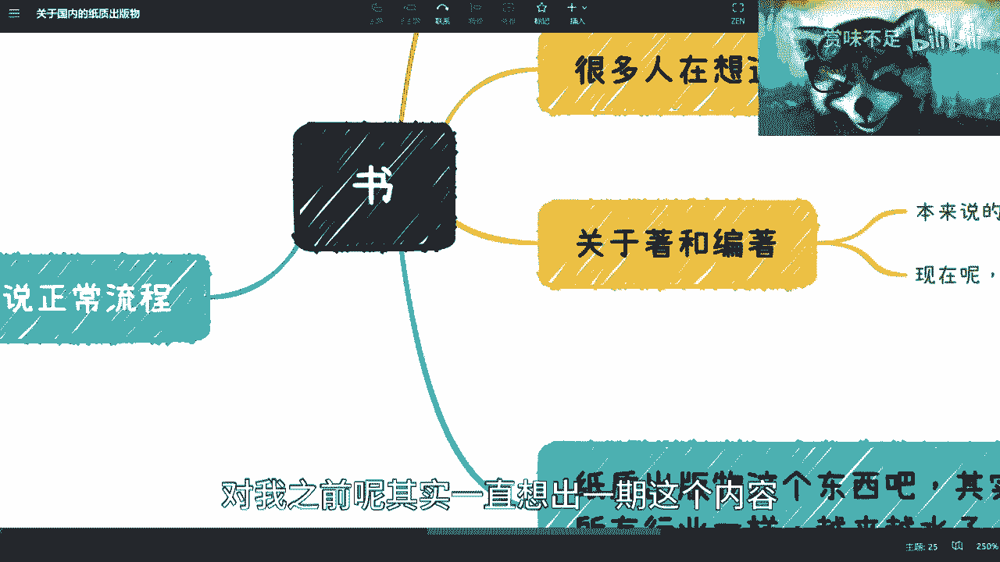

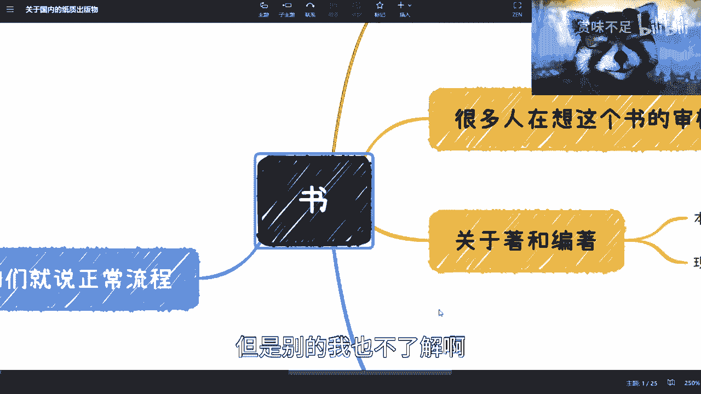

# 课程一：关于出版或购买“书”，你必须了解的事 📚

在本节课中，我们将要学习关于纸质出版物（通常称为“书”）的行业现状、出版流程以及一些常见的认知误区。我们将以简单直白的方式，为你揭开出版行业的面纱。

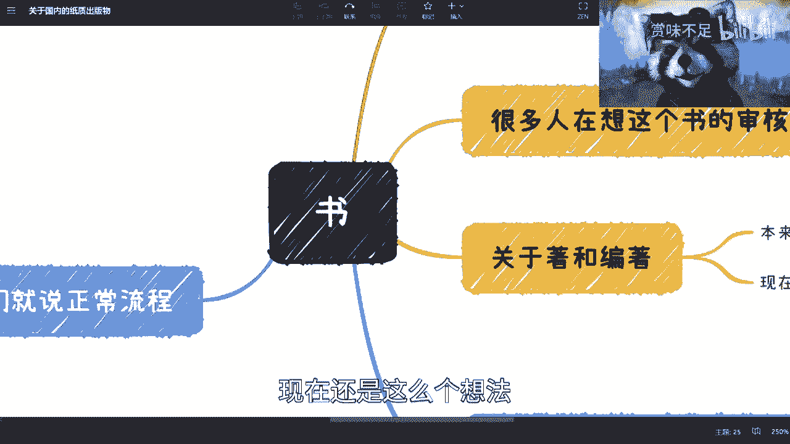

---

## 概述：对“书”的传统认知需要更新

很多人对“书”的理解可能停留在过去的幻想或固有认知中。然而，随着时代发展，许多知识并未同步更新。这导致人们对出版行业的看法可能与现实存在偏差。本节将帮助你建立更符合当前实际的认知。

---

## 出版行业的现状：光环不再，门槛降低

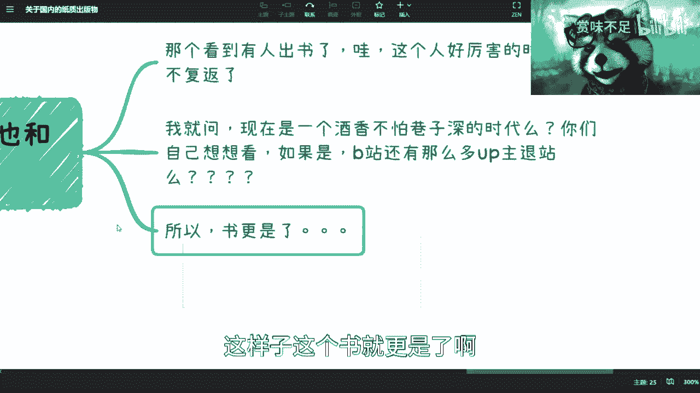

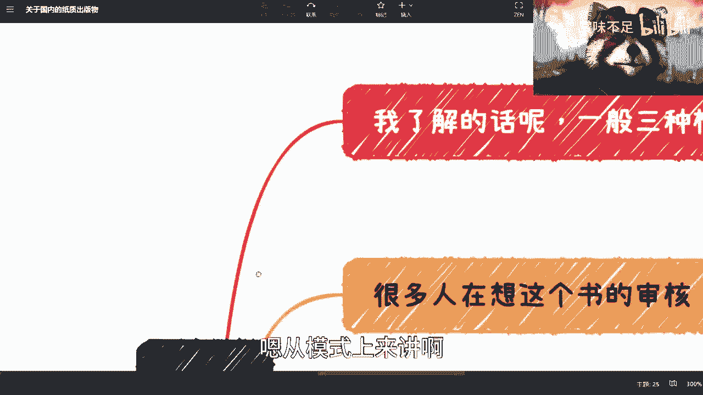

上一节我们介绍了认知需要更新的背景，本节中我们来看看出版行业的现状。

过去，人们看到某人出书会认为“这个人好厉害”。如今，这种时代已经一去不复返。出书变得相对容易，其背后的光环效应已大大减弱。

这与互联网内容的现状类似：**酒香也怕巷子深**。内容质量与传播广度没有必然的因果关系。在信息爆炸的时代，营销和曝光变得至关重要。

---

## 三种主要的出版模式

以下是当前市场上常见的三种出版合作模式。

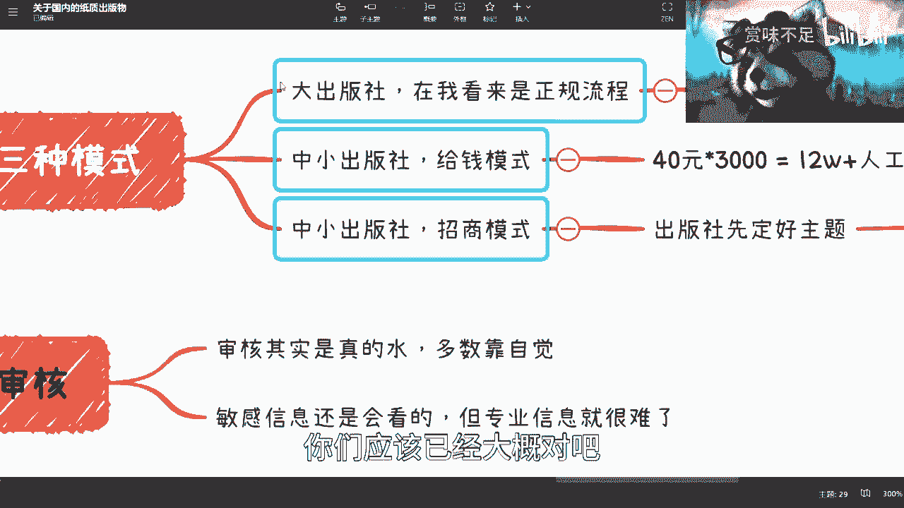

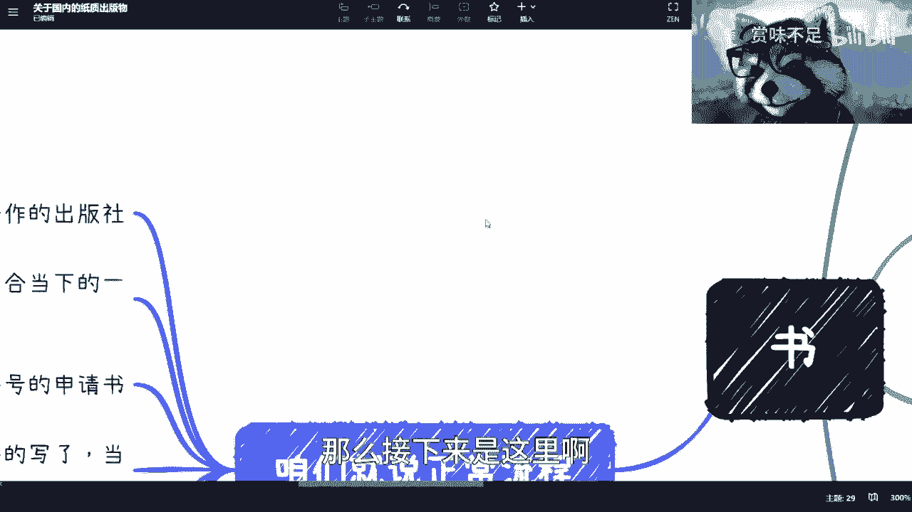

### 1. 大型出版社的正规流程
大型出版社会遵循正规、完整的出版流程。作者通常能获得版税收入，版税比例一般为销售额的 **8%**，并可能随销量增加而阶梯式提升（例如，销量达到某一阈值后，版税升至 **9%**）。

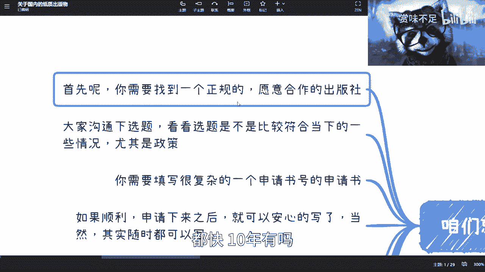

### 2. 中小型出版社的“给钱”模式
在这种模式下，作者需要预付费用。例如，一本书定价 **40元**，出版社要求作者先“采购”3000册（即 **12万元**），此外还需承担人工、印刷等成本，总预付金额可能在 **15万元** 左右。这实质上是作者用资金换取一个“出书”的身份。

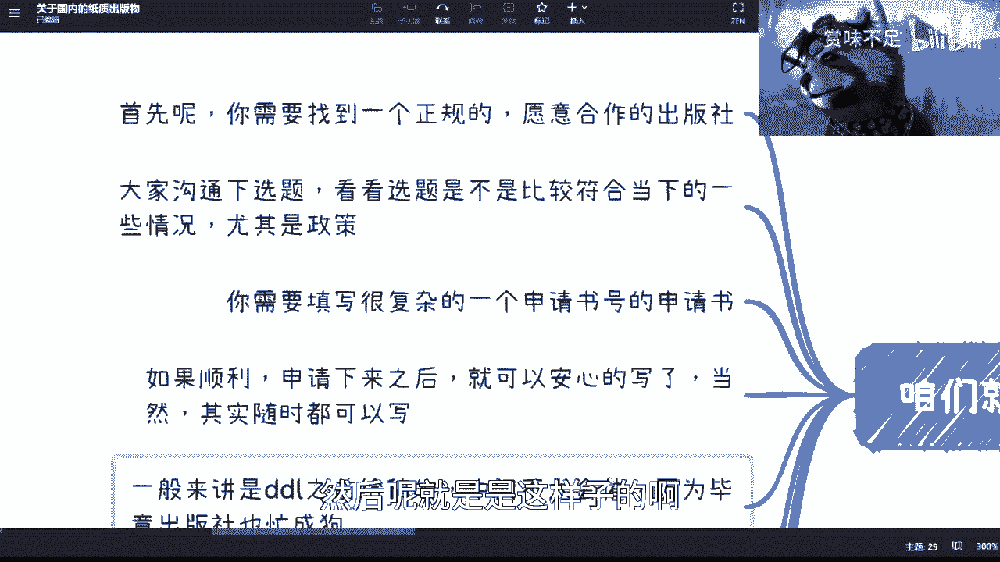

### 3. 招商模式
出版社先确定一个主题，然后邀请行业内的不同人士“认领”部分章节。参与同样需要支付高额费用，可能单章费用就达 **10万元** 左右。这种模式常被描述为“资源整合”，但其中可能存在信息不对称。

---

## 正规出版流程详解

上一节我们介绍了三种出版模式，本节中我们来看看如果你想走正规流程，具体需要怎么做。

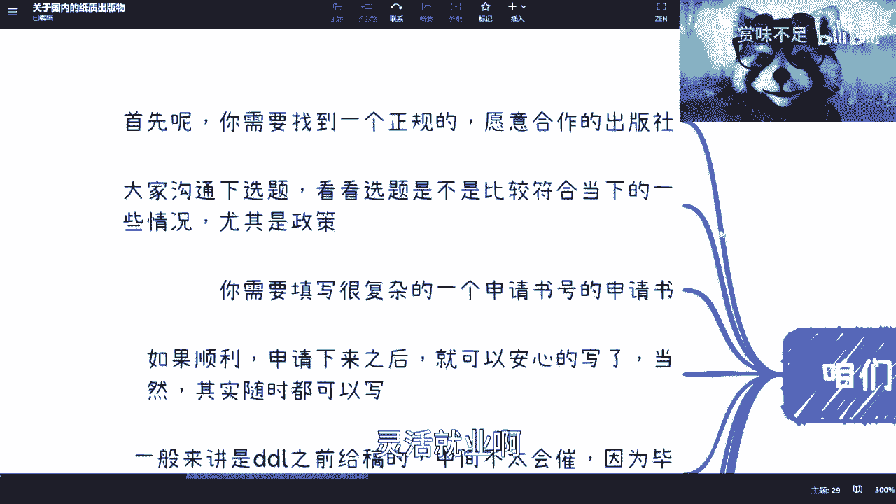

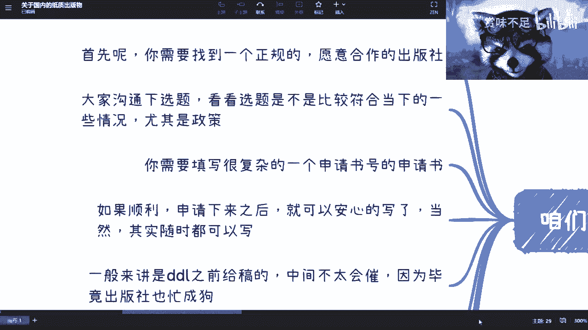

以下是正规出版的主要步骤：

1.  **寻找合作出版社**：你需要找到一个正规且愿意合作的出版社，例如清华大学出版社、人民邮电出版社等。
2.  **沟通与确定选题**：与编辑沟通你的写作想法。选题是否合适，首要考量是**政策合规性**与**内容敏感性**。
3.  **提交详尽的申请书**：申请书内容复杂，需包含：
    *   书名、截稿日期、字数、作者信息。
    *   书籍介绍、完整的三级大纲。
    *   营销计划、与同类书籍的竞争优势分析。
    *   这些材料是申请**书号**的关键。
4.  **写作与交稿**：在截止日期前完成书稿。写作可与申请流程并行。
5.  **多轮审核与修改**：稿件会经历一审、二审、三审乃至终审。你需要根据审核意见，在措辞、格式、配图出处等方面进行反复修改。
6.  **封面设计与最终出版**：封面设计通常由出版社负责，作者可提供想法，但最终效果可能仅达到“及格”水平。书籍出版后，营销工作至关重要，否则很容易淹没在书海之中。

---

## 当前出版物的质量与“著”和“编著”的区别

上一节我们走完了正规流程，本节中我们来探讨一个影响书籍质量的核心问题。

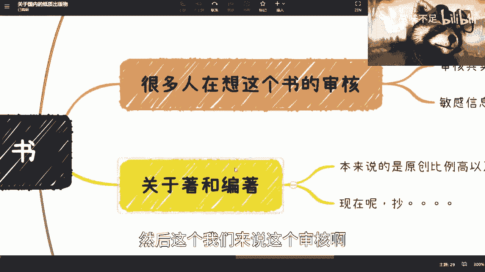

当前许多出版物的审核较为宽松，专业内容的审核尤其依赖作者自觉。出版社编辑很难对硬核的专业知识进行实质性把关。

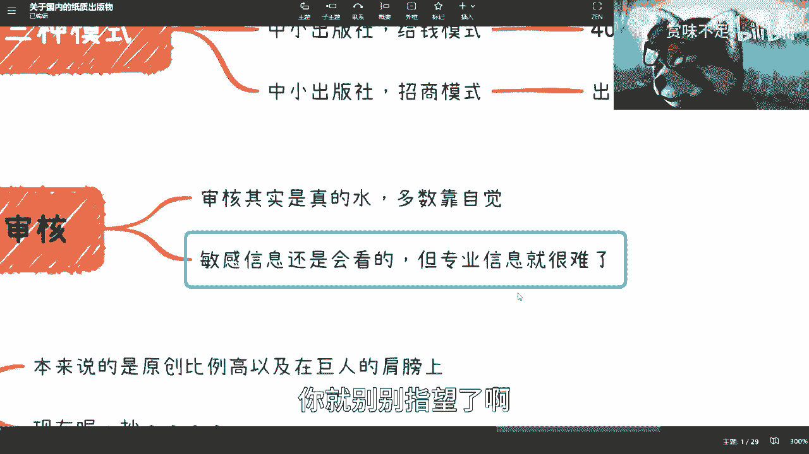

这导致书籍质量参差不齐，其中关键区别在于“著”和“编著”：

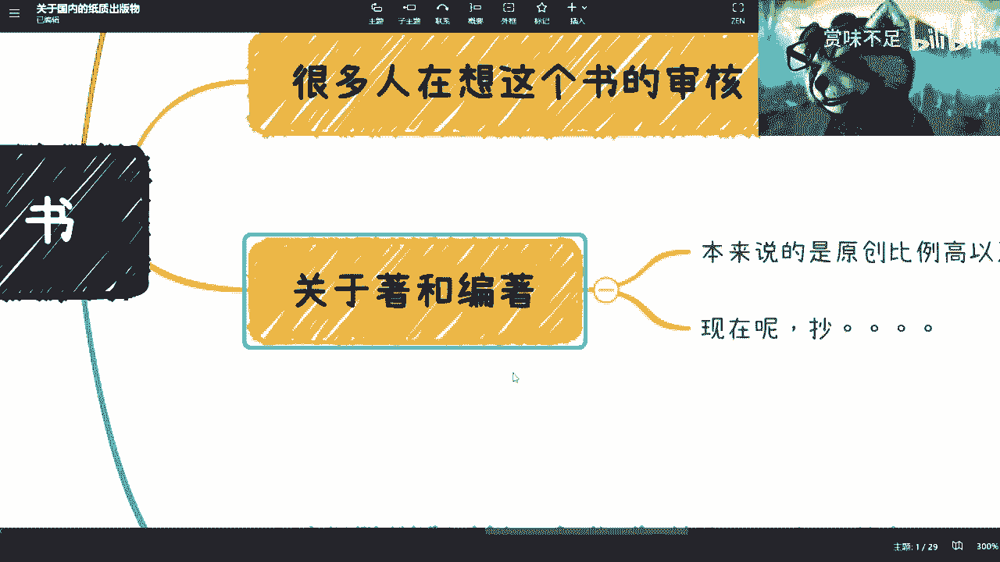

*   **著**：指原创比例很高或全部原创的著作。例如：`作者独立构思并撰写的全部内容`。
*   **编著**：指在整理、汇编他人成果基础上形成的作品。例如：`汇编多个网络公开资料和视频内容形成的书籍`。

更极端的情况是直接抄袭拼凑，这解释了为何某些热点话题（如ChatGPT）能在极短时间内出现相关书籍。这种现象的背后是利益驱动，出版社也需要盈利生存。

---

## 总结与建议

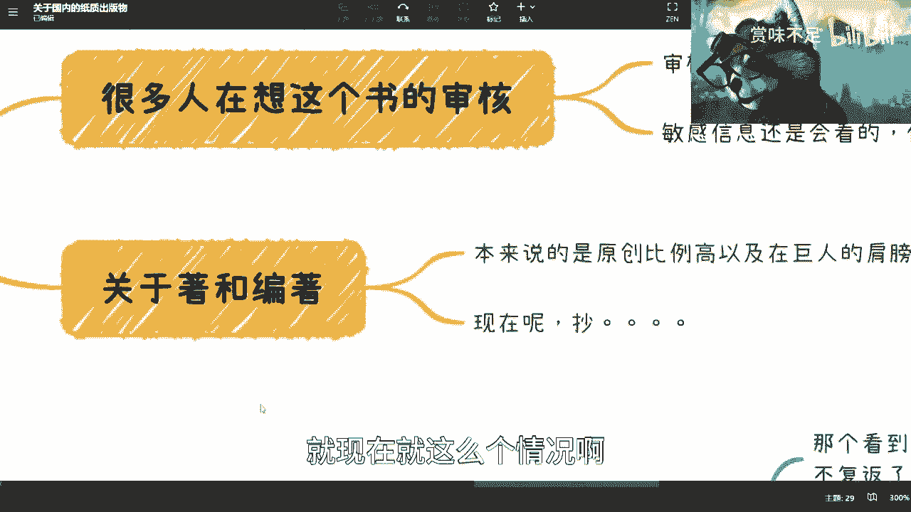

本节课中我们一起学习了关于纸质出版的行业现状、三种主要模式、正规出版流程以及影响书籍质量的关键因素。

总结如下：
1.  出书的光环已大大减弱，变得更为普遍。
2.  出版模式主要分正规流程、付费出版和招商合作三种。
3.  正规流程严谨但复杂，核心在于选题合规与申请书号。
4.  书籍质量需谨慎甄别，“编著”类书籍的原创性可能较低。
5.  在信息时代，无论出版还是阅读，都需要我们保持批判性思维，理解行业背后的运作逻辑。

希望这些知识能帮助你更理性地看待“书”，无论是作为潜在的作者，还是作为读者。