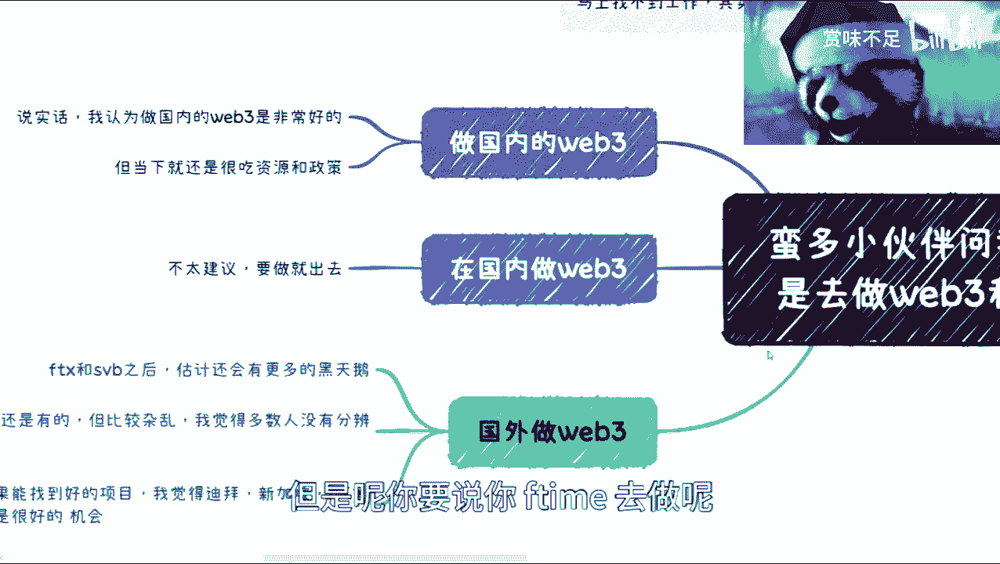

# 区块链与Web3从业指南 - 课程01：现状分析与路径选择 🧭


在本节课中，我们将要学习区块链与Web3领域的从业现状，分析国内与海外市场的不同环境，并为初学者提供清晰的路径选择建议。

## 概述：为何关注区块链与Web3？


许多人对进入区块链和Web3领域感兴趣，主要原因是认为传统互联网已成为存量市场，竞争激烈。大家希望寻找新的、有潜力的技术方向，而区块链和Web3看起来与互联网技术挂钩，似乎是一个可行的选择。


上一节我们介绍了大家关注此领域的普遍动机，本节中我们来看看具体的市场环境。


## 第一部分：国内区块链/Web3环境分析 🏙️

当前国内区块链与Web3的从业环境非常严峻。虽然从长远看，数字经济的发展方向是明确的，但关键在于从业者能否坚持到行业成熟的时候。

当下的核心问题是市场需求不足。政府端、散户端和企业端都尚未形成稳定的需求。没有需求就没有甲方，没有甲方就没有资金流动，行业就难以发展起来。

以下是国内市场的几个关键点：


*   **政策与资源依赖性强**：行业的发展很大程度上依赖于政府推动、资金扶持和政策引导。
*   **市场容量有限**：虽然竞争不激烈，但市场规模本身不大，机会相对集中。
*   **主要机会领域**：目前的机会可能集中在为政府提供咨询、技术服务、培训，或与高校进行新技术合作等方面。但这些领域通常存在较高的资源壁垒和供应商白名单制度。


因此，在国内全职从事纯粹的Web3项目非常困难。更可行的方式是将其作为兼职或项目制（Case by case）的工作，例如参与运营、推广或智能合约开发。


## 第二部分：海外区块链/Web3环境分析 🌍


与国内相比，海外的区块链生态更为活跃。黑客松和技术活动较多，例如近期澳大利亚就有相关活动。


总体来看，海外互联网及Web3领域虽然也存在竞争，但激烈程度远低于国内，且机会更多。当然，出海本身对许多人来说存在门槛。


这里需要区分两个概念：“做国内的Web3”和“在国内做Web3”。




*   **做国内的Web3**：指业务围绕国内政策、市场和需求展开。这要求深入理解各地区政策，并能够整合资源。如果能获得相关项目，前景较好且竞争压力相对较小。
*   **在国内做Web3**：指身处国内但参与国际化的Web3项目。这通常面临较大不确定性，更考验对全球项目和圈子的判断力。

对于希望在全球Web3领域发展的人，需要融入国际圈子。目前，迪拜、新加坡、香港等地是较为活跃的中心。需要注意的是，行业在经历FTX等事件后仍处于波动期，项目质量参差不齐，存在各种风险。


## 第三部分：给初学者的行动建议 💡

在考虑进入该领域前，请先进行清晰的自我评估。你需要明确自己的城市、年龄、当前技能、兴趣以及未来3-5年的发展规划。

以下是具体的行动建议：


1.  **降低焦虑，灵活规划**：互联网行业正在回归常态，并非没有机会。降低预期，总能找到工作。职业路径不是非此即彼的，可以在`全职工作`、`兼职项目`、`轻量创业`之间灵活配置，制定`Plan A, Plan B, Plan C`等多套方案并行尝试。
2.  **国内从业策略**：如果瞄准国内市场，应密切关注**政策红头文件**，寻找与政府、国企或高校合作的技术服务、咨询或培训机会。避免全职投入国际Web3项目，可考虑以兼职形式参与。
3.  **海外发展路径**：如果条件允许，考虑出海。可以关注海外公司的远程职位或直接前往Web3活跃的地区。核心是**融入圈子**，建立人脉，以获取信息和机会。
4.  **技术学习方向**：如果对技术本身感兴趣，可以深入研究**智能合约开发**、**共识机制**、**预言机（Oracle）**、**零知识证明（ZK Proof）** 等核心领域。例如，一个简单的Solidity合约框架如下：
    ```solidity
    // SPDX-License-Identifier: MIT
    pragma solidity ^0.8.0;

    contract SimpleStorage {
        uint256 storedData;

        function set(uint256 x) public {
            storedData = x;
        }

        function get() public view returns (uint256) {
            return storedData;
        }
    }
    ```
5.  **风险意识**：无论是国内还是海外，都要对项目进行仔细甄别。这个领域存在各种意想不到的风险，只有保持谨慎，才能避免损失。

## 总结与展望 🔮


本节课中我们一起学习了区块链与Web3领域的现状。我们分析了**国内市场的政策依赖性与有限机会**，以及**海外市场的活跃度与更高门槛**。关键在于根据自身情况，在`关注政策`、`融入圈子`、`深耕技术`和`灵活尝试`之间找到平衡点。

记住，没有一成不变的成功路径。坚持就是胜利，但坚持的方向和方法需要根据环境和自身变化不断调整。在做出决定前，请务必进行充分的调研和自我评估。