# 关于大家想从业区块链和web3方向的事儿，我拆成海内外说下 - P1 - 赏味不足 - BV1UP411o7Q9

好大家好，又是我对吧，先说几个事儿啊。

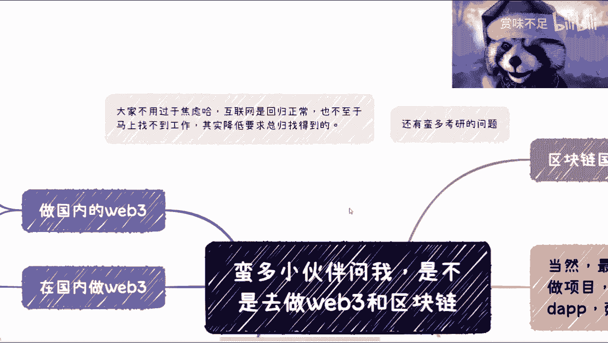

一个是我觉得我再强调一下，我觉得大家不用过分焦虑，为什么呢。

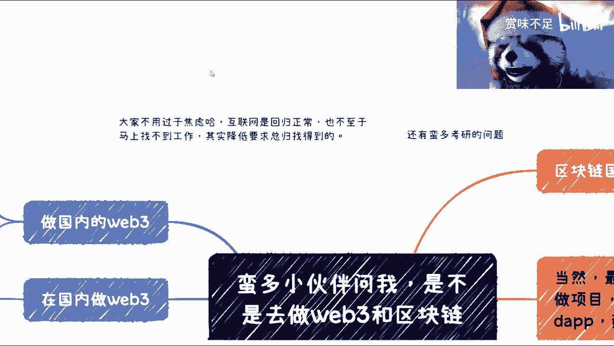

因为互联网只是回归正常，他不是说互联网就没有了对吧啊，然后也不至于说马上找不到工作，所以说其实我觉得大家这个降低要求，总会找得到的好吧，我觉得呃其实不是说我们要去卷啊，但是我们也没办法。

这就不得不卷，你说是吧，然后呢还有很多呃，那个小伙伴我看到问这个考研的问题啊，我觉得是这样子的，呃我客观的说在我的认知里面，考研这件事情呢是一年不如一年的啊，就是它本身的价值是一年不如一年的。

但是呢也本身取决于你所做的这个方向，跟整个的一个一个行业对吧，我觉得是这样子的哦，就是嗯大部分我说实话做计算机呢，嗯其实啊都都大差不差大差不差，然后还有很多小伙伴呢，我在这个地方这个忘记练了。

就说我这个双飞对吧，双飞然后我考研，然后我是不是在读计算机怎么样，呃然后呢这个计算机呃读出来之后呢，是不是说啊做个什么行业比较赚钱对吧，或者前前景怎么样，呃我在这里统一说一下，我觉得是这样子的。

你但凡是做计算机，你是去打工的，对我来讲啊，我认为都是螺丝钉，没有区别的，就是你进入一个好的行业和进入个不好的行业，赚不赚钱是老板的事情，你还是正常的对吧，所以你不用去考虑，不用太去考虑这件事情。

然后就是说这行业有没有前景呢，在我看来做那个那个那个coding的啊，都很卷啊，你随便去什么地方都很卷啊。

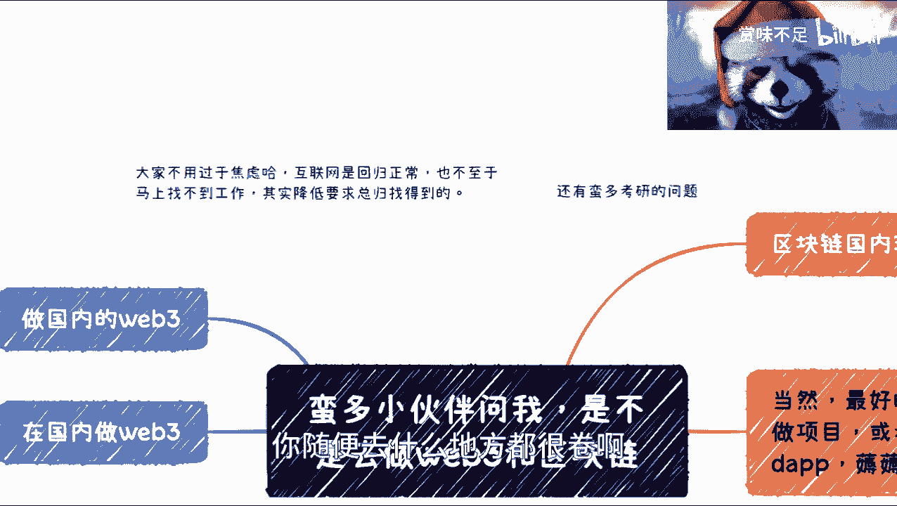

我就明确跟你们讲好吧，然后我所以说我觉得你们考虑问题，就就不就不能这么考虑啊，换个角度考虑。

那么这一期我想说一下，就昨天前几天吧，就有人跟我说了，就是那个啊说我是不是做web3啊。

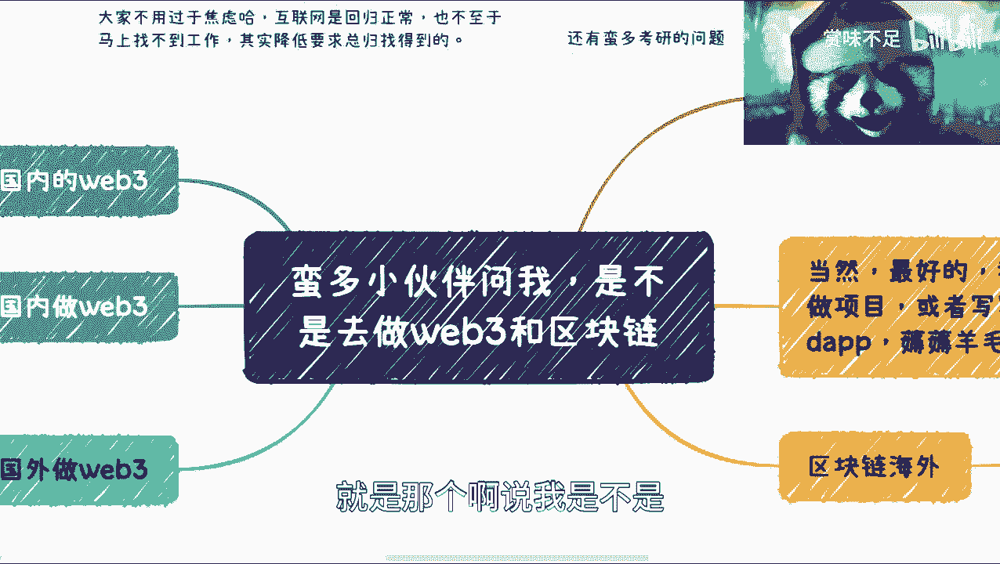

做区块链啊对吧，我觉得是这样子的啊，就是大家为什么这么想，我也很清楚对吧，因为大家觉得这个是存量市场卷不动了啊，那我是不是去一些新的行业对吧，那芯片医疗对吧，这个新能源碳中和对吧，很多人也不懂对吧。

门槛太高，然后看来看去哎web3可以啊，区块链可以啊对吧，反正跟技术有关对吧，跟互联网也挂钩是吧啊这个我懂啊。

懂懂懂懂懂，然后我觉得是这样子的，客观来说啊，首先我跟你们这么讲，国内目前环境下非常恶劣啊，非常恶劣，我用非常恶劣。

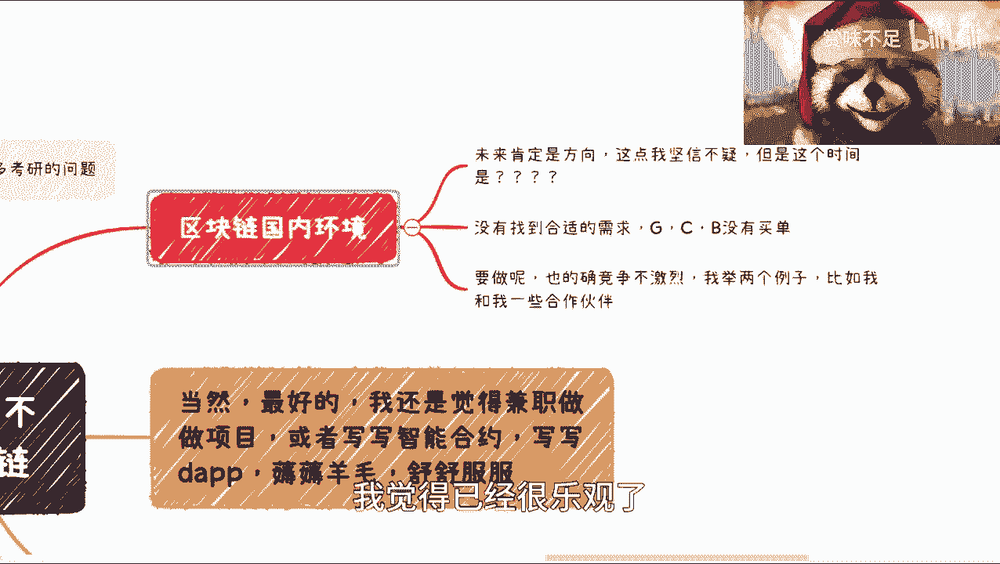

我觉得就很乐观了，这个词非常恶劣啊，然后呢是这样子的，就是呃首先我呢是非常肯定未来方向的，因为昨天数字数字经济的时候也说到了嘛，对吧，肯定是我坚信不疑啊，但是关键是你能不能活到那个时候。

你能不能苟到那个时候对吧，我说的很直接啊，你能不能苟到那个时候，那守约这低一点，当下的情况是什么呢，就是如果你们出来之后去做这个方向，你们可能还苟不住啊，不带你们苟不住，我觉得大部分人可能都苟不住啊。

那我觉得这是第一点，第二点是什么呢，就是说当下呢还没有找到比较合适的这个需求，就是政府端，散户端，企业端都没有，那么你没有需求，他就没有甲方，没有甲方的就没有买单对吧，没有买单他就没有资金流动。

没有资金流动，这行业怎么做得起来是吧，所以说呢其实当下最直接的一个方法是什么呢，就是政府要开始推动啊，政府开始说拨资金啊，政府开始做扶持啊，那么这个是第二点，那么第三点呢，你真的要做呢。

我觉得也不是不行啊，而且的确竞争也不激烈对吧，因为毕竟我就在做这个东西啊，这个这个竞争也不激烈啊，那么但是有一个很大问题呢，就是说竞争虽然不激烈，但是它的整个市场没有那么大啊，没有那么大。

就是说他能做的，可能就目前来讲有有有那么几块啊，那么我跟大家举个例子，比如说你说啊我给政府做咨询对吧，我给政府做这个技术服务啊，做培训，那OK啊，那我其实今天就问一个问题嘛，我去做对吧。

也许政府愿意给我单子，那你们去做，那请问谁给你们担子对吧，那大家熬一两个月没问题，那熬一两年熬的动嘛对吧，熬不动呢，你像我熬这么多年，那也不容易的是吧，那还有一块呢我觉得也有前景的，就是高校啊。

其实我之前也说过，就是各高校不管有没有区块链，新技术啊对吧，相关的一些合作，那话又说回来了对吧，高校合作人家都是有这个白名单供应商的，那请问人家为什么不找你们呢，请问人家为什么找我呢对吧。

所以呢我觉得就是说当下竞争是不吉利啊，没毛病啊，你们进来我可以打保票，你们进来坐，但凡进来做对吧，呃只要做一些这个技术相关的培训相关的，我敢打赌对吧，35K呢你们总会遇到到我的，也就这么个情况对吧。

但是问题是就难呐对吧。

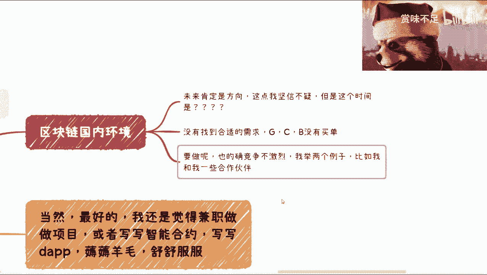

因为你你你单子就那么些嘛，坑就那么些嘛是吧，那我觉得这个是第一个，而且这件事情大环境来讲啊，我可以告诉大家不知道多久会改变啊，所以你们真的要路难蛮难的啊。

蛮难的，这是第一点啊，第二点呢就是关于区块链海外。

海外呢其实我看了一下黑客松也蛮多的，像最近澳大利亚就在办对吧，技术的也蛮多的，呃我觉得海外是这样子的，就互联网这边我可能漏掉一块就是海外啊，海外我觉得总体来讲呢卷是卷的，但没有国内那么卷。

而且远远没有国内那么卷啊，而且海外机会是蛮多的，但是只有一点海外可能对于很多人来讲呃，门槛有点高，或者说你像对我而言，我也不是说呃也有个人说出去就出去的对吧，所以说我觉得就是可能这一块呢。

就大家可以看一下，我给大家一个选择啊。

就当当下还是可以的哦，是可以的，而且海外当下华人也很多嘛对吧。

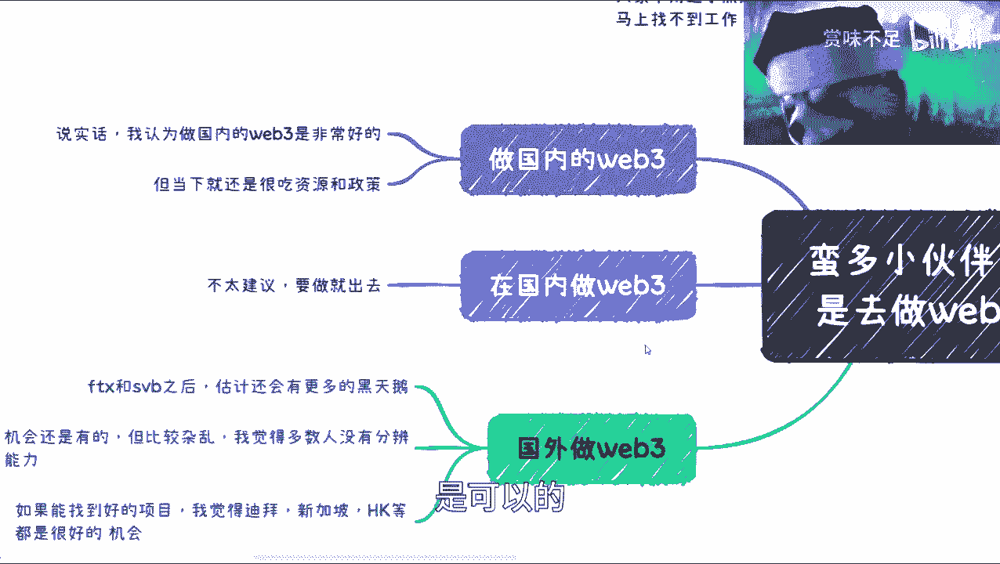

其实其实也没有什么很大障碍啊，嗯然后呢我这边分开来了啊，叫做做国内的web3和在国内做web3啊。

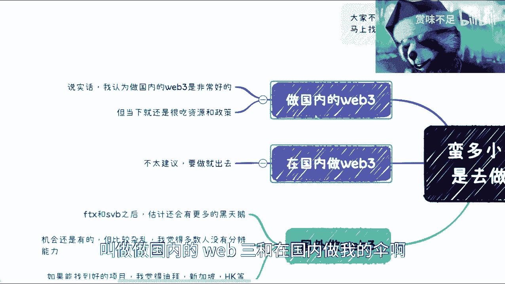

这个还是很不一样的啊，做国内web3呢，哎大家看得清啊，我看一下啊，做国内web3呢，我觉得认为我认为是非常好的啊，毫无疑问，为什么，因为你你套概念啊，对不对，你只要套套政策，就像我说的，我跟你们说。

你们可能还年轻哈哈，你们可能还年轻，你们可能还不觉得就是说啊，各地区政策啊对吧，红头文件你们可能不会看，我年轻时候也不会开啊，但是呢我可以明确告诉你们，你们往后走，但凡想走的长远，你们必须看啊。

而且你们必须迎合我跟你们说，你们哎这个做过就懂了是吧，真的做过就懂了啊，然后就是说当下还是很吃资源跟政策，什么意思呢，就是说这个东西方向是好的，而且我可以告诉你们，kiss也是有的啊。

但是这个case能不能落到你们头上，这个是最大的问题，但是但凡落到你们头上，哎我觉得前景就是很好做的，很肯定很能能做的不那么卷，同时做的还很舒服对吧。

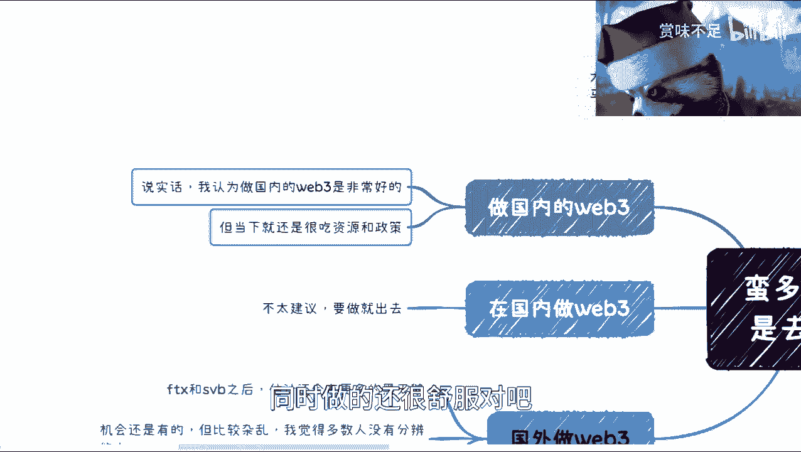

那我觉得这个是一定，那在国内做web web3点，我觉得没必要啊，没必要，因为有很多以前咨询的，就新加坡那边的，包括呃可能国内现在也是的，就我一般会跟他们这么说，我说你们实在没办法呢。

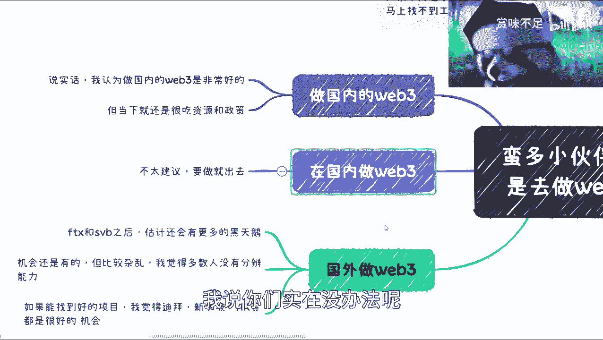

你们在国内做做对吧，但是做呢就不要说你你负time做，你就是就是做做兼职对吧，Case by case，就项目制的对吧，比如说做做运营啊，推广啊对吧，合约开发啊对吧，那可以的对吧，谢谢DP啊。

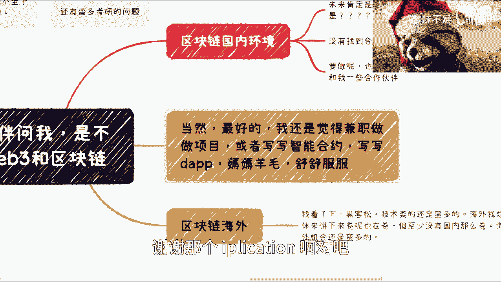

谢谢那个decision as a pication啊对吧，好好养毛啊对吧，然后那个呃你你可以做做那个公链的技术支撑，好好GRT对吧，那技术都是蛮好的，但是呢你要说你敷time制作呢。

我跟你们讲，你们就肯定要出去，为什么，因为web3，说白了说就是就是你抛开表象去看本质，他说白了还是圈子对啊，因为我以前在在线下做活动的时候，我以前说过，有很多人问我，他说他说哎我我想做web3。

那我怎么切入呢，我就跟他们说，我说哎呀你们你们别想这么多，你们太墨迹，你知道吗，就是我跟你们讲什么叫做web3，做web3最好方式是什么，就是你们出去混圈子，混的越熟越好对吧，第一时间告诉你们。

哎这个是种子轮，这个是私募轮，买完买完之后上上交易所，上完马上就跑，不要抱有任何幻想，我可以保证你转对不了就结束了，哪这么多废话呀，你说是不是，那剩下那些当然了，剩下那些你要说这个叫什么。

你你你你说我对技术感兴趣的对吧，我对这个共识机制啊对吧，这个预言机oracle啊啊这个这个这个leo two啊对吧，这个灵芝证明啊啊变云计算哦，感兴趣，那没问题啊，你慢慢研究呗对吧。

但是你要说你这个但凡要赚钱的，我跟你讲就那一种方式对吧。

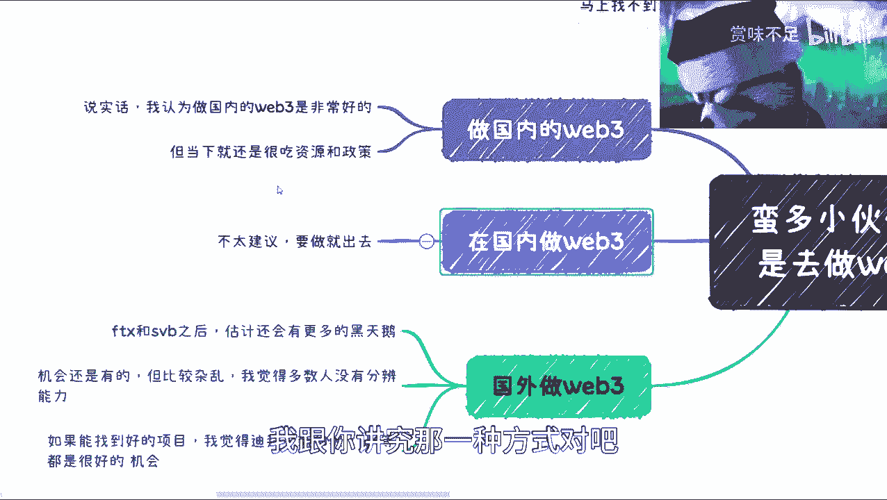

看看伊能静就知道，哎这个我也不敢Q别人是吧，Q别人怕别人骂我对吧，一轮进去了不会骂我啊，然后那个国外做web3呢，我觉得是这样子的，目前情况也不是很乐观对吧，就FTX和SBSBB之后呢。

我说实话黑天鹅都觉得看不下去了，你知道吗，就黑天鹅都觉得这个频率越来越高了对吧，就未来到底怎么样，我觉得是蛮困难的啊，这第一个第二个呢，我觉得web3机会肯定还是有的，而且蛮多的，只不过目前比较杂乱。

就比如说你们啊，你说你你毕竟不像我啊对吧，我靠我他妈在这行业混了这么长时间了对吧，我觉得大家但凡进去了，你们很难去判断一个项目好坏啊，你们也能也很难判断这个这个人的这个呃，靠谱与否，我觉得这么说吧。

就是呃你们你你们没被坑过是吧，你们他妈被坑过，你们就知道，哎呀这个真的是就只有你想不到被坑没有，就是那种就是就是就是就是只有你想不到的，坑你的方法，没有那种不会坑你的，就各种各种坑你方向全部都有啊。

呃然后呢，还有就是说我觉得就如果真的转的好的项目，或者好的合作方呢，就你去迪拜啊，新加坡啊，香港啊，然后呃呃其实日本也蛮好的，因为日本之前就比较压抑啊，然后最近我感觉日本可能是啊。

有点想要朝web3方向发展啊。

有一说一啊，我觉得这个可能是个趋势啊，所以说呢我觉得是这样子的，就是说啊大家反正就按照我这个说法做啊，按照我这个说法做，这个这个已经是最最客观的情况了啊，所以说你们可以自己判断啊。

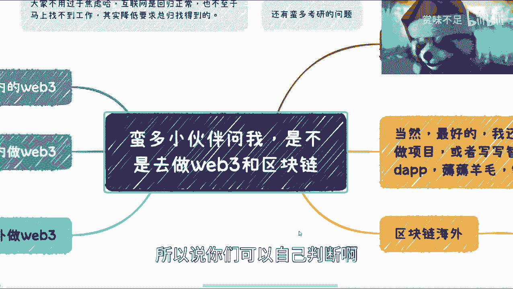

自己判断啊，但是呢我觉得还是那句话，就是大家去这个问我的时候，就尽量要说清楚，就是说比如说哎我是在什么城市对吧，我大概当年多少岁了对吧，然后我可能做的是什么对吧，我当下能力怎么样对吧。

我觉得就是很多东西呢，评估你自己能力和评估你的这个呃兴趣爱好，以及未来发展方向还是非常重要的啊，因为每个人情况真的很不一样对吧，嗯你你就好像说，我觉得大家现在可能都比较关注的是。

我怎么苟住未来的3年到5年，哎我不用5年吗，未来3年对吧，那我其实还关键问题是你就算苟完3年，然后呢这3年之后大家又不是不活啊，你说是吧对吧，我觉得就唉就大家还是要多多考虑对吧。

就3年后自己可能做什么方向对吧，怎么样子，当然了，我我最后再提一点。

其实方向好不好与否呢，取决于你做什么，就像我一开始说的，你但凡要去做一些，比如说呃投入产出比高的兼职创业的哎，这个东西我回头再跟大家讲吧。

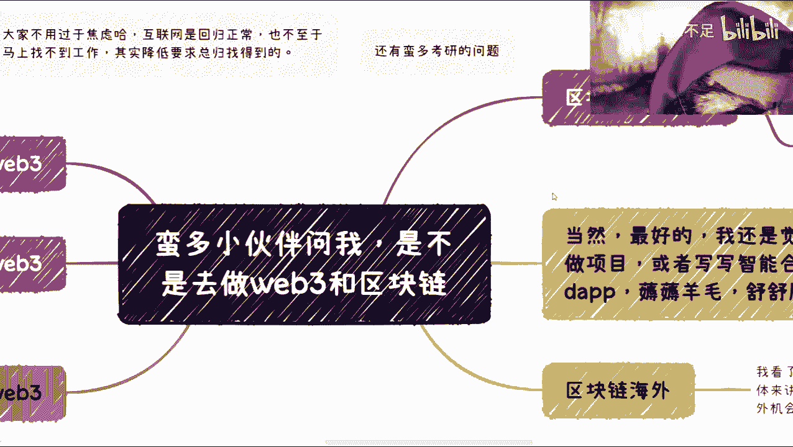

其实创业有很多种创法，不是大家想的说啊，我我必须的吧，注这个怎么注册家公司对吧，然后要要什么啊，财务法务对吧，然后做个产品不是，就我昨天其实跟很多小伙伴私信的时候，我也跟他们说了，我说我给你们练啊。

那plan a plan b plan c对吧，你先做plan c不行，你设置个deadline不行，你在排练N和plan b并行对吧，等等等，就就一定要灵活一点啊，千万做事情千千万万啊。

不要觉得就是只有全职跟兼职，也不要觉得只有打工跟创业，就就就就这里面啊水分很多的，水分很多的，好吧行吧，我觉得这个我其实说的蛮清楚了啊，坚持就是胜利啊。

