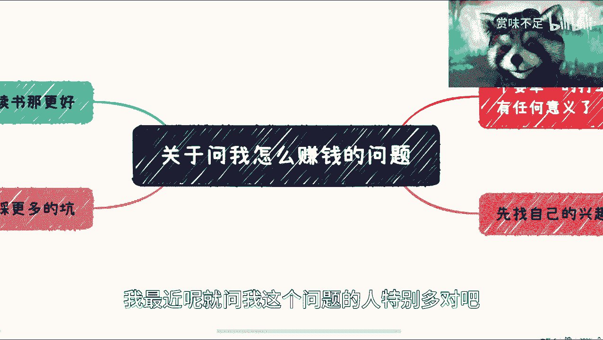
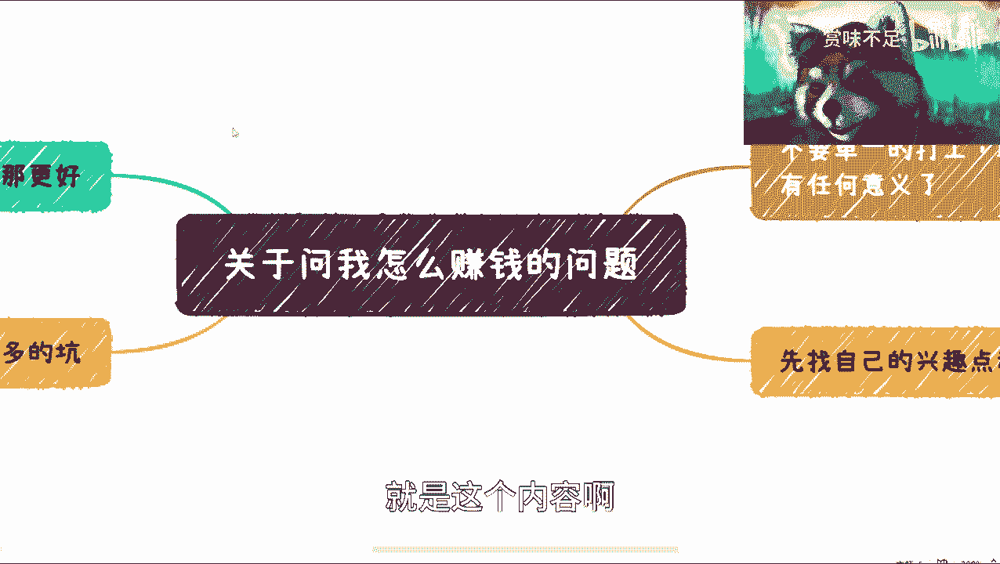
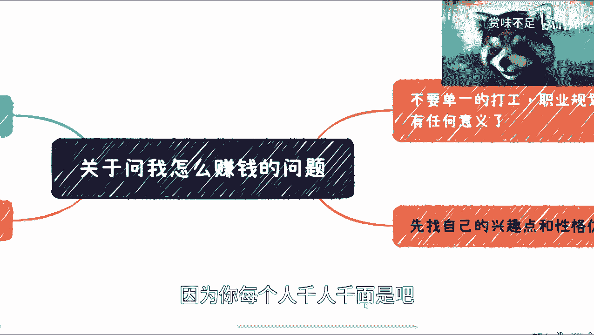
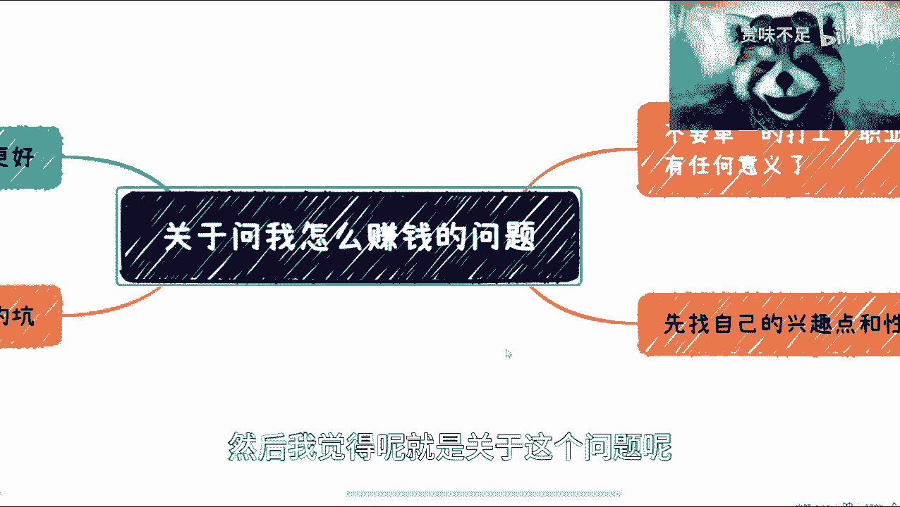
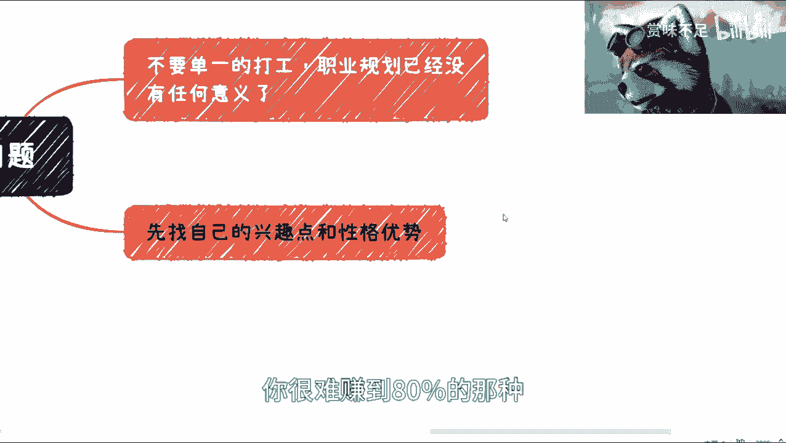
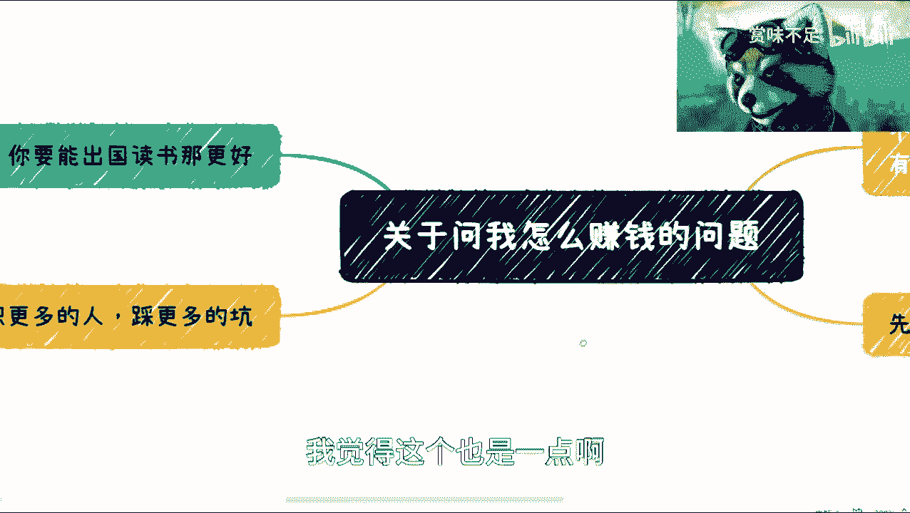
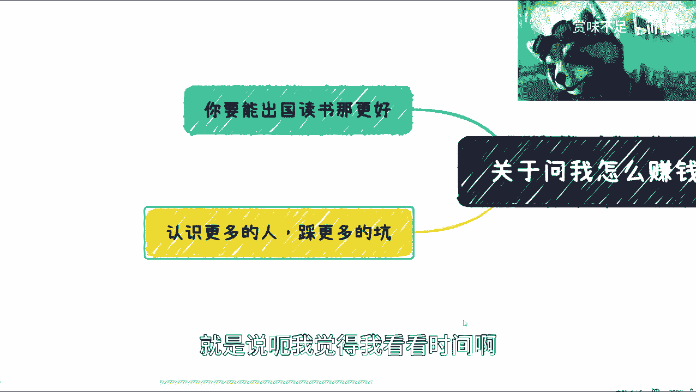

# 关于好多人问我怎么赚钱这件事情 - P1 - 赏味不足 - BV1HM41147V7

好啊这个大家好啊，我最近呢这是问我这个问题的人特别多对吧。

但是关于嗯怎么赚钱是吧，首先啊我觉得是这样子的，我先说一点啊，就是，付费咨询的我肯定也愿意收钱对吧，这是给我钱，我肯定愿意收对吧，但是问题是啊，咱们说这个来讨论啊，这个之后赚钱对吧，怎么赚赚多少钱。

这个我肯定没法打保票是吧，你要说打保票吧，这是这个钱我就没法收了是吧，我觉得呢是这样子的，就是这个内容啊。

呃也有很多人会说呢，他说我这个讲的内容嗯不够实际。

那那我学习不了啊对吧，因为你每个人千人千面是吧。

每个人擅长的地方，每个人性格也都不一样，我比较希望的我倒是比较希望是什么呢，就是说啊这是大家根据自己的情况，可以先去找对吧，比如说啊这个找些人聊聊天啊对吧，这是挖掘挖掘自己的潜力啊对吧。

看看自己这是适合做什么对吧，你说然后啊我举个例子，比如说你说好，我现在有一定的竞争力了啊，这个竞争力不管是这个大小啊，不重要，然后呢你跟我说，你说啊陈老师对吧啊，我现在比如说有个什么东西啊。

这个大大小没关系啊，然后你说你有没有什么资源对吧，有没有投资方啊，有没有什么渠道啊合作诶，这个倒是可以的对吧，这个我觉得就kiss by kiss对吧，我们跟你聊聊啊，我我肯定也不收钱。

你像最近有好多创业者，你知道吗，就拿那个创业的idea啊对吧，因为人家也说了嘛，就这个东西不能外传啊，就大家看看对吧，那我给他评估评估啊，难道我看看人家跟PDF评估下来，我问你200块钱太low了。

哈哈是吧啊，那反正我觉得核心是什么呢，就是说大家能赚钱，那我最开心对吧，你要但凡你们赚钱，我在当中能帮个帮上个一星半点的对吧，那么你们回头回头再给我个咖啡钱也行啊是吧，我现在也没指望说大家给我钱是吧啊。

然后我觉得呢这是关于这个问题呢。

我就单独再说一下，第一呢我觉得根据上一期的内容啊，我说的很清楚，我说就结论啊，就是不用不要单独再去打工对吧，不要去单独打工，然后呢也不要再去想职业规划，因为当下这个情况，职业就规划已经没有意义了啊。

当然这也不是绝对的，除非你说你是一个非常优秀的人，那我觉得没有问题啊，没有问题，包括你觉得就说啊你现在所处的这个行业，因为我们做任何东西不能一棒子打死嘛对吧，你做你，你比如说所处行业对吧。

你做的东西的确有非常大的竞争力，或者说解决很大的痛点，那我觉得你可以无视这句话对吧，但我觉得大部分的互联网从业者，以及大部分的普通民众，我觉得都适用的对吧，就是说你当下这种经济情况和，接下来的几年情况。

你所有的职业规划其实已经没有意义了，因为职业规划这个东西好是好，在说整个大环境好和经济形势好的情况下面，你可以去做啊，而且有很多的路径，包括你说你一开始做做产品经理啊，做开发后面做manager对吧。

什么什么怎么做管理对吧，包括可能什么做咨询做了几年之后怎么样，但是我们现在面临的问题可能是3年内，5年内对吧，我们要想办法赚钱啊，我们很有可能连连工作都找不到，就更不要说职业规划了对吧。

一切在在这种情况下面都是泡沫啊，然后呢就是在这个地方，我呃我想想我在另外一个内容里面，我可能提到过一句，就是说呃你也可以选择打工没问题，但是呢你可以选择打多份工对吧，你说哎啊你比如说你你就拿我来讲对吧。

你你你比如说你说哎跟我一样对吧，你说我这大概两三家三四家公司挂职对吧，那这边挂两个顾问，那边挂两个顾问对吧，这边可能有些单词，那边有些单词也行啊，对吧也行啊，我觉得这是你可以去找，这是核心的结论。

就是你去找多个渠道对啊，多个渠道去赚钱，我不呃你你包括你，你还拿我来讲，我我还有那个义乌那边做直播的对吧，然后我还有这个政府解决方案呢，这是我属于什么呢，我属于就是说各个信我都会拉，然后呢我就坐在家里。

然后我就看哎每天有哪些线打到我对吧，那我觉得也行啊对吧，也不是说一定要出去摊煎饼果子是吧啊，当然我没有这个鄙视煎饼果子意思啊，我的意思是说煎饼果子或者其他的，这是各种各样的，这个比较比较难啊。

我待会回来也跟大家讲啊。

这是第一点，第二点呢就是说我觉得呃，大家这个也不用太焦虑，因为什么呢，因为现在还有时间点啊，还有时间窗口，那我觉得就是说一定要先去找自己的兴趣点，跟性格优势。

因为这就跟最近那个chi GB t大家也都知道嘛，就那个AI嘛对吧，这个就跟国外去做出cheat，cheat gp是一个道理，什么意思呢，就是说在你没有太多经济收入，在你整个经济形势不好的情况下面。

你能坚持去做一件事情，往往一定跟你的兴趣点，跟性格优势是有关系的啊，千万不要去跟风，因为你去跟风，你会觉得你很苦，而且我觉得我觉得就我们普通老百姓来讲，你们可能是坚持不下去的啊。

这是做一做一个可能就这是解不了解对吧，也可能没有兴趣点，只不过觉得哎这个东西可能赚钱，那你坚持不下去的啊，而且你很有可能就是说你只你只能做做，就是说水面上的那百分之呃，这是20的苦力活。

这是我们叫做辛苦钱啊。

你很难赚到80%的那种，就是说啊四两拨千斤的钱对吧，我觉得这是一点啊。

然后第三点呢就是我倒是觉得呢，大家因为年龄层次我也不知道啊对吧，就是大家如果能出去读书，那最好，我我的个人观点就是说你也不用管你出去读书，读的好不好，水不水，我觉得这倒不重要。

重要的是你出去读书呢是可以，这是相当于就是说熬过或者说避开那几年，可能最最嗯形势不好的时候，我觉得这是可以的，这是可以，咳咳，到时候再回来卷，或者来说在外面卷也行啊，但是不管怎么样，我觉得相对啊。

因为因为有好多人我相信可能会说啊，你这个不对对吧，出去很苦的对吧，不要以为出去怎么样怎么样，我我就说相对啊对吧，因为你你现在这个情况，你不能跟经济盛世比啊对吧，你不能跟最好的时候比，这是最好的时候比。

我肯定会说我说你不要出去读对吧，你在国内卷，随便卷个年薪一两百万都可以卷对吧。

那那那那不一样啊是吧，然后呢我觉得还有一个点呢，就是说呃一定要现在开始去更多认识人啊，啊我我我我觉得不一定只认识啊，就更多的说啊可以合作对吧，怎么样，因为人这个生物很多时候你不合作。

你是不知道他什么样子的啊，很多时候大家没有一起赚钱，你也不知道他什么样子的，那么这些呢呃往往都是你要踩的坑，那么我为什么在这个地方说呢，是因为呃你与其在当下这个时间点踩呃。

呃你与其到到这是整个经济形势很不好的时候，比如说你失业了对吧，你再去找人合作，再去踩呃，这个还不如现在去采，因为到那个时候踩你的这个这个成本成本啊，包括你的付出成本会更更高，你可能更无法接受对吧。

那也有人会说啊，他说他说那我不踩行不行对吧，那那那那那你怎么知道我一定会踩呢对吧，那就根据啊，就根据大家作为一个普通人啊，你说你你你你你是富二代对吧，那我无话可说啊，就从普通人来讲。

大部分的人呢我觉得都是要踩坑的，这是我踩完的，你们都会踩一遍，你们采完的所有其他普通人也都会踩一遍，只不过是运气成分，只不过就在于你踩的好多和不多啊，就是呃多和不多对吧，不存在你少踩，我跟你讲。

这是不现实的，你知道吧，就是这是我们随便啊，我们随便扯些蛋啊，这是这是你想想看，你这是过程啊，比如说你要去做生意对吧好，那这是做生意里面你得找渠道吧，那渠道很有可能坑你啊，你的合伙人很有可能坑你啊对吧。

你做公司法务，财务这些地方都是坑对吧，包括交税，包括走账对吧，包括就是说这个商业模式到底怎么走通，包括啊我我再提一点，包括这是你们可能到网上会去寻求，像我这样的人对吧，那那我也可能坑你们啊对吧。

那我就废话不多说了，每人先收一半是吧啊，这我觉得坑很多很多啊，尤其是在当下，这种再往未来情况一定是越来越多的，毫无疑问啊，所以呢我是觉得嗯反正就这么个情况嘛。

就是说呃我觉得我看看时间啊，对就就也差不多，因为我今天这个视频呢，我主要想跟大家说总结一下，就总就就说一个观点，就是说啊我给不出太具体的结果啊，我给不出太具体的建议啊，你们最好是有具体的东西啊。

然后呢你比如说需要我签些资源的牵线的，那可以啊，然后呢你说我给点建议啊，这个具体比如说你们想做什么，那可以对吧，你你你你你千万不能说啊，我什么都不知道对吧，然后就说你也给具体建议，我给不了哈哈。

哎你你你今天给我钱，我也不敢收好吧，就就就就这么个情况好，那下一期，下一期我来讲一下，那个大家比较关心的什么什么，比如说做滴滴啊对吧，做美团啊。

