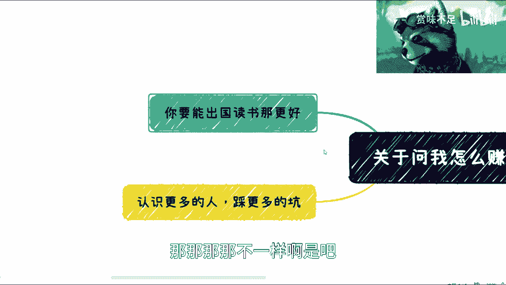

# 课程名称：如何赚钱 - 第1课 💰

在本节课中，我们将探讨在当前经济环境下，关于如何赚钱的一些核心思路和策略。课程将分析普遍存在的困惑，并提供几个关键的行动方向。

---

最近，很多人询问我关于如何赚钱的问题。

关于如何赚钱，首先需要明确一点：我无法提供保证能赚钱的付费咨询。因为赚钱的结果因人而异，无法打包票。

很多人认为我讲的内容不够实际。

这导致他们觉得无法学习，因为每个人的情况和特长都不同。我更希望的是，大家能根据自己的具体情况，先去尝试和探索。例如，可以多与人交流，挖掘自身的潜力。

看看自己适合做什么。举个例子，假设你现在已经具备了一定的竞争力（无论大小）。然后你来找我，说你手头有一个项目（大小无关），问我是否有相关的资源、投资方或合作渠道。这种情况是可以具体探讨的，我们可以根据具体情况（case by case）聊聊，我也不会为此收费。

最近有很多创业者拿着他们的创业想法来找我评估。评估一份商业计划书就收200块钱，这太低级了。核心在于，如果大家能赚到钱，我会很开心。如果在这个过程中我能帮上一点忙，你们事后给我一点咖啡钱也可以。我目前并不指望靠这个赚钱。

关于如何赚钱这个问题，我想单独说明几点。

上一节我们提到了无法提供通用解决方案，本节中我们来看看几个具体的行动原则。

以下是第一点核心建议：

*   **不要只打一份工，不要执着于职业规划。** 根据上一期内容，结论很明确：不要只依赖一份单一的工作。同时，在当前形势下，传统的职业规划已经失去意义。当然，这不是绝对的。如果你非常优秀，或者所在行业及所做事情有极强的竞争力、能解决巨大痛点，那么可以忽略这一点。但对于大多数互联网从业者和普通民众而言，在经济形势不明朗的接下来几年，传统的晋升路径（如从产品经理到开发，再到管理者）可能失效。我们面临的是未来3到5年内如何赚钱、甚至可能找不到工作的问题。在这种情况下，职业规划如同泡沫。你也可以选择打工，但可以考虑打多份工。以我为例，我在两三家、三四家公司挂职，兼任几个顾问，接一些零散项目。核心结论是：寻找多个渠道去赚钱。我还会接触义乌的直播、政府解决方案等项目。我做的就是广泛撒网，然后在家等待哪些机会能联系上我。这并不意味着一定要出去摆摊（比如摊煎饼果子），当然我并没有鄙视的意思，只是说这类体力活比较辛苦，这一点后面会再讲。

接下来是第二点建议。

第二点核心建议是：

*   **不必过度焦虑，应寻找兴趣与性格优势。** 现在还有时间窗口。一定要先找到自己的兴趣点和性格优势。这类似于国外做出ChatGPT的原理：在经济收入不高、形势不好的情况下，能坚持做下去的事情，往往与你的兴趣和性格优势相关。千万不要盲目跟风。跟风会让你觉得很苦，作为普通人很可能坚持不下去。你可能只了解表面，并非真正有兴趣，只是觉得可能赚钱。这样你很可能只能做到最基础的20%的辛苦活，赚辛苦钱。

你很难赚到那80%“四两拨千斤”的钱。

然后是第三点建议。

第三点核心建议是：

*   **考虑出国读书以度过低谷期。** 我不知道大家的年龄层次。我的个人观点是，如果能出去读书，那最好。你不用管读得好不好、水不水，这并不重要。重要的是，出国读书可以帮你熬过或避开国内可能最困难的几年。到时候再回来竞争，或者留在外面竞争也可以。无论如何，相对而言（因为肯定会有人说国外也很苦），在当下，你不能和经济最好的时候比。在经济最好的时候，我肯定会说不要出去，在国内随便努力也能卷到一两百万年薪。

但那是不一样的。最后，还有一点非常重要。

最后一点核心建议是：

*   **立即开始拓展人脉并尝试合作。** 一定要从现在开始去认识更多人，不仅仅是认识，更重要的是探讨合作的可能性。因为人这种生物，不合作你很难真正了解他；不一起赚钱，你也不知道他到底如何。这些往往都是你需要踩的坑。我在这里强调的原因是：与其等到经济形势很差、比如失业时再去寻找合作、再去踩坑，不如现在就开始。因为到那时，你的试错成本和付出会更高，你可能更无法承受。有人可能会说：“那我不踩坑行不行？你怎么知道我一定会踩？”根据普通人（如果你是富二代则另当别论）的经验，大部分人都是要踩坑的。我踩过的坑，你们大概率也会踩一遍；你们踩过的，其他普通人也会踩一遍。区别只在于运气，以及踩的坑多还是少。想完全不踩坑是不现实的。随便举个例子：如果你要做生意，你需要找渠道（渠道可能坑你）、找合伙人（合伙人可能坑你）、处理公司法务财务（这里都是坑）、处理税务和账务、摸索商业模式等等。甚至，你们在网上寻求像我这样的人的建议，我也可能坑你们（比如先收一半钱再说）。坑非常多，尤其是在未来，只会越来越多。所以，情况就是这样。

总结一下，今天这个视频主要想阐述一个核心观点：我无法给出非常具体、保证成功的建议。你们最好有具体的方向或项目。如果需要我牵线搭桥一些资源，那可以。如果针对你们具体的想法给点建议，那也可以。但千万不要说什么都不知道，就让我给具体建议，那我给不了。就算你今天给我钱，我也不敢收。情况就是这样。

下一期，我会讲一下大家比较关心的话题，比如开滴滴、送美团等。

---

本节课中我们一起学习了在当前环境下关于赚钱的几点核心思路：**放弃单一职业路径，寻找多元收入**；**结合自身兴趣与优势，避免盲目跟风**；**考虑通过教育过渡经济低谷期**；以及**尽早通过合作拓展人脉并积累经验**。记住，具体问题需要具体分析，拥有明确的方向是获得有效帮助的前提。