# 关于如果某一天你觉得世界是个草台班子的逻辑 - P1 - 赏味不足 - BV1NN41177Le

好啊，大家好啊，呃昨天广州第一天的那个活动结束了啊，这个活动还是很开心的啊，大家哎呀，我发现真的来的小伙伴呢素质还是很高的，然后各个就是思考啊，各个方面综合情况都是很高的。

所以说呢我觉得大家基本上昨天得到的反馈啊，就大家都会觉得就是说线下的这种活动啊，就给予大家的帮助应该还是很大的，不管是啊跟我沟通也好，还是说是大家相互沟通也好，我觉得还是很不错的。

后面如果有机会要么多搞搞啊。

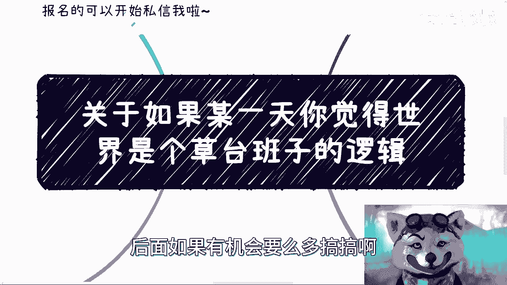

可以啊，我觉得没问题啊，就是大家的呼声嘛，嗯然后第二个就是北京活动。

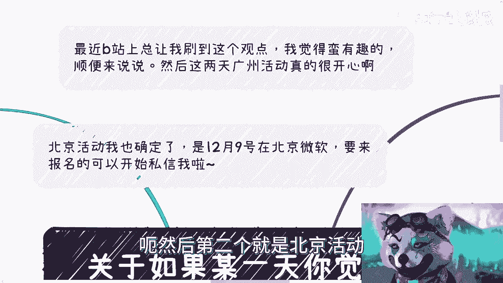

我也确定了12月9号在北京的微软好吧，然后具体地址的话，反正大家找我报名呃，私信我再给大家说一下，然后再拉群好吧，哎呀我本来想前两天就开的，但是哎太忙了。

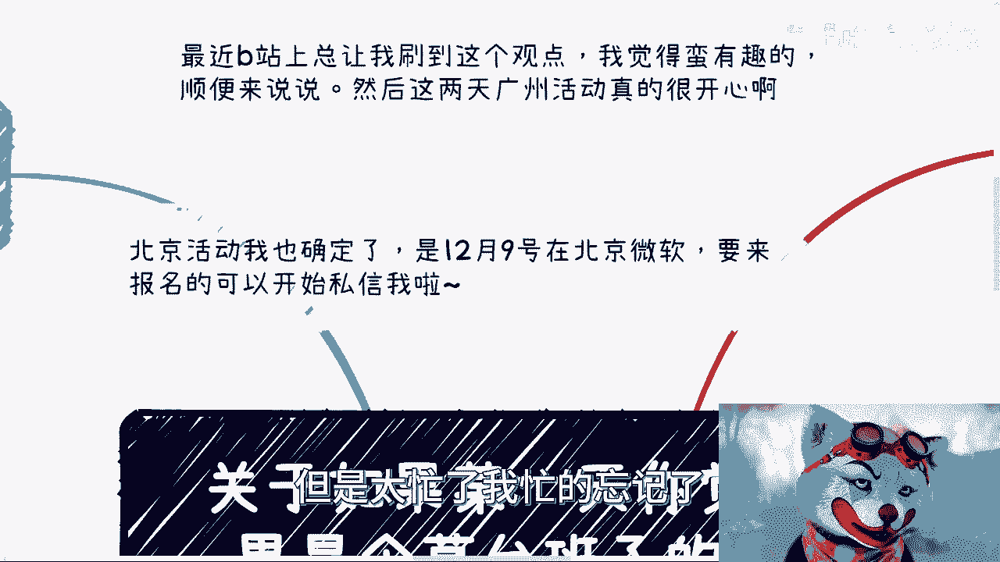

我忙的忘记了，然后我来说一下今天的主题啊，最近B站上面呢总让我刷到有这么个观点啊，我觉得也蛮有趣的。

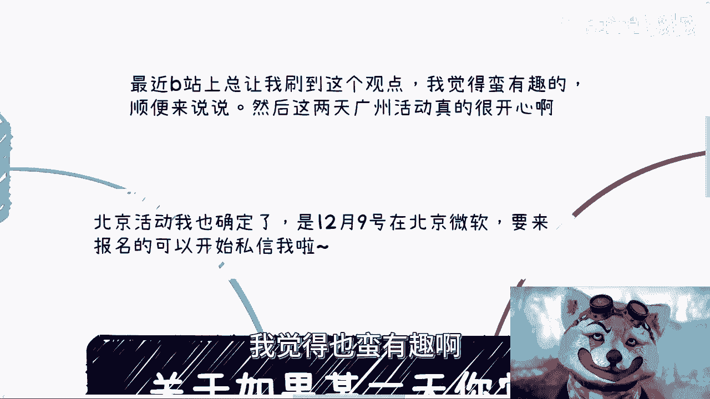

顺便来说一下啊，那么关于呢，你说某一天，你觉得世界是个草台班子的这个逻辑啊，我觉得是这样子的啊，啊世界是不是一个草台班子就可能太大啊，呃我先这么举个例子啊，你们可能早就是我觉得，但凡你们走过一些路之后。

就比如说你们觉得某些公司对吧，某些行业啊可能是高大上的，可能是怎么样的啊，但是呢当你们去了这些行业，去了这些公司之后呢，你们就会发现哦，那无非就是一个坑到另外一个坑啊，所以呢就是你会发现很多时候呢。

他不是说谁谁谁或者什么组织是个草台班子，就是本质上大部分的情况都是草台班子。

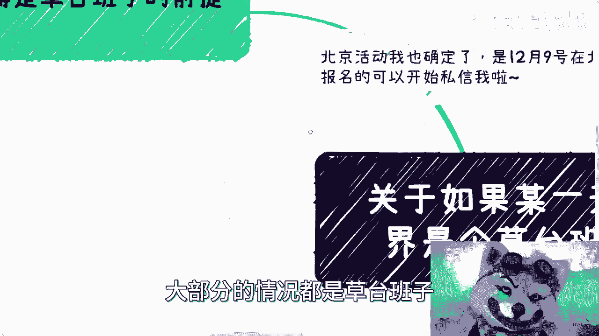

那么你看啊，嗯我觉得你们会觉得是个草台班子的前提。

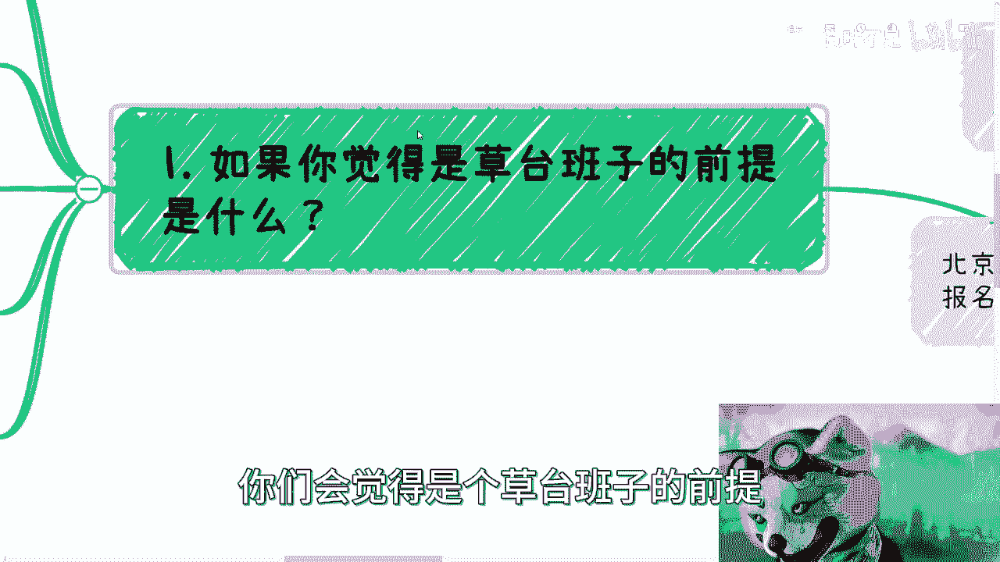

无非就那么几种可能性，第一种是什么，就是你很聪明啊，你可能是相对来讲啊，就是高于50%的，就高于中位数的这么一个存在，那么你也了解很多事情的一些发展规律啊，那么某一天呢你了解到一些情况之后呢。

你发现背后的逻辑跟手段，包括流程以及它交付产品啊，本质上并不是那么高高敏，那也就是说，不管是管理手段，还是所谓的最终交付的这么一种产品，比如说软件啊，硬件啊对吧，或者其他的一些各种各样的东西啊。

就是你可能觉得没什么高明啊，那这是第一种可能性。

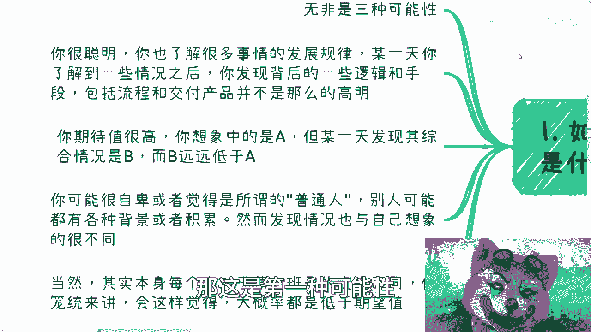

第二种可能性就是说你期待很高啊，你想象当中，比如说各种各样的东西是A，但某一天发现的综合情况是B，而B呢远远低于A，那么你可能觉得草他妈的都是草台班子是吧啊，那么第三个呢就是你可能会很自卑。

也不要很自卑吧，就一般自卑，或者觉得来说就是一直被父母被学校，被网络对吧，被身边的很多人去灌输所谓的普通人啊，然后甚至还会以普通人去灌输别人，那当然啊就是呃，虽然别人可能会有各种各样的背景和积累。

然而发现情况呢呃与自己想象的也很不同，也就是说，可能你虽然已经是有一些DEBUFF在身上，但是你看到某些东西的时候，你依然会觉得的草台班子是吧啊，那么当然啊，其实本身每个人对于炒菜班的定义不一样。

但是笼统来讲呢会这么觉得，大概率都是因为低于了所谓的期望值，那么我觉得在这个地方我们可以把它分开来说，你既可以说低于期望值，也可以说是我们把它想的太高啊。

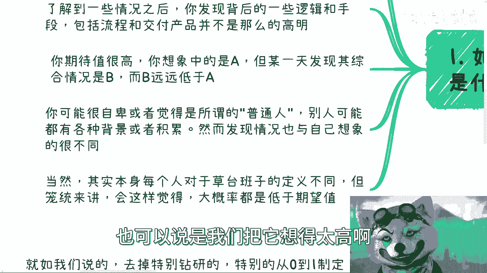

或者说我们YY的太多啊，那这个事情我觉得不怪大家。

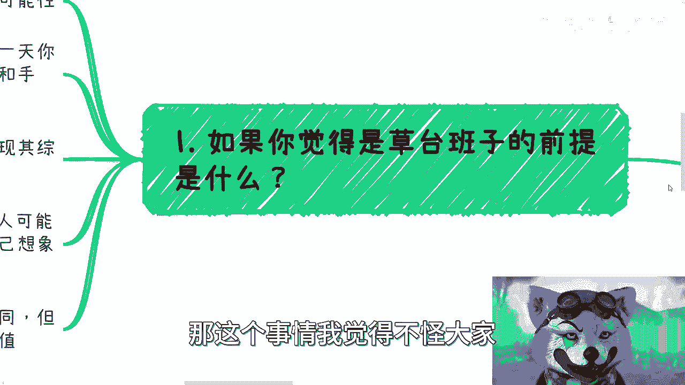

因为很多东西嗯去想的话不了解。

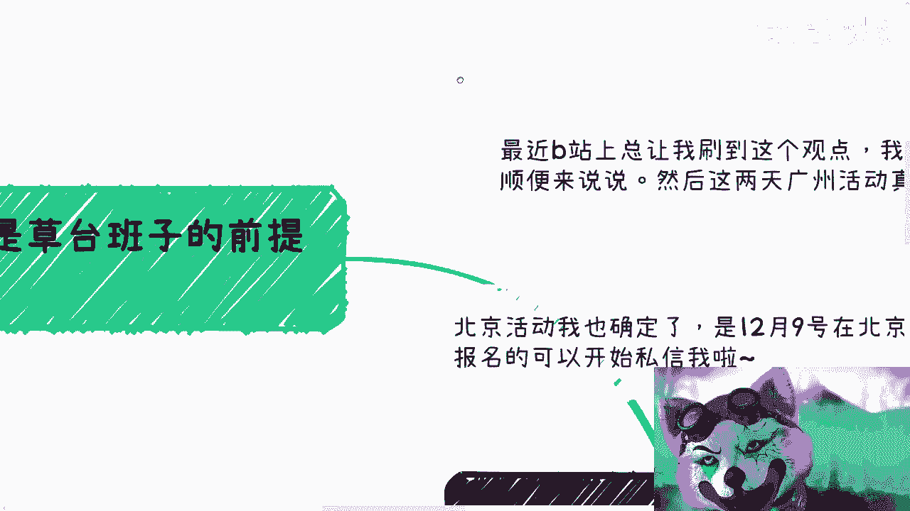

那就就会YY嘛对吧，那没办法啊，那么第二点就关于早台湾的这个事情嘛。

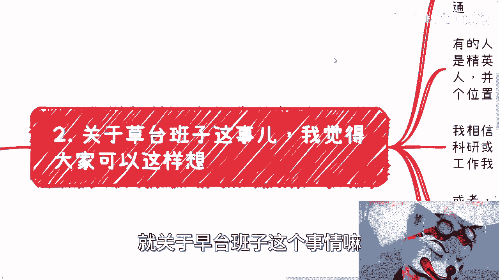

我觉得大家可以这么想，就当一个国家一个组织啊，一个一个一个任何一个行业啊，对他说你没有你没有团队的啊，你说我就一个人对吧，那么这个人可能不是草台班子，当然我也只能说可能啊，也就是说这个人或者这个主体。

它可能不是草台班子的概率大一点啊，但是当其治理参与方越来越多的时候，当其整个管理面越来越广的时候，它的整个的涉及面越来越广的时候，它最终只会趋于草台班子，那为什么呢，因为很简单啊，你看啊。

有的人觉得可能所谓的，比如说官方组织或者团队都是精英啊，都是自己拥有自己的过人之处，但本质上你要明白真正的精英，真正的天才，真正的那些啊就是怎么样的啊，这种人他是很凤毛麟角的。

呃剩下的很多人其实首先他们也是个普通人，对吧啊，并不是说他们比你们强啊，呃只不过呢我觉得他们的机缘巧合。

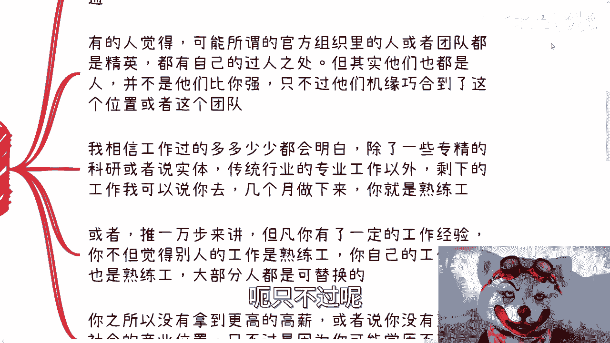

到了这个位置，或者到了某个团队，或者说原由于很多就是跟他们本身的能力，和他们本身的聪明才智没有关系的一些因素啊，然导致他们说哎，我可能今天能能能能到这个位置，或者说我今天做了某些事情啊。

那么我相信呢工作过的人多多少少就会明白，就是但凡你们可能现在还年轻对吧，还没有工作啊，但凡真的去工作过了，我不用多啊，我觉得哪怕你半年一年，你就会明白，就除了一些专精的科研，或者说有一些。

比如说传统行业的这个专业工以外啊，剩下的工作我可以说你去你几个月下来，你就是熟练工，对你就是熟练工，你不你根本就不用关心什么，你是什么行业，你是什么专业，你是什么学历，根本不关心啊。

包括就是说如果真的有可能性，比如说你跟我做对吧，我给你三个月，也是熟练公务员，有什么区别呢，对吧啊，或者退1万步来讲，但凡你有了一定的工作经验，你不但会觉得别人的工作是熟练工。

因为我相信有很多人他是这样子的，他会就可能看不清自己，但是他呢很很很能够去看别人啊，当然我不是说我，我觉得就是说有的人是客观的看，有的人是对吧，就就就找别人茬对吧，但我觉得无所谓啊，你可以去看别人。

你会觉得别人的工作是熟练熟练工，但是反观你自己的工作其实也是熟练工，我也是熟练工，为什么，因为大家大差不差呀，有什么差别了，对不对，大部分人都是可替代的，你之所以没有拿到更高的高薪。

你之所以没有达到某些成就，你之所以没有达到某个所谓的社会的商业地位，只不过是因为你可能硬性条件，比如说你的学历不到，或者说你的关系不到位，或者说就是由于这个社会给予，你就是就是划了一些框框，你没有到。

或者说你没有天时地利人和，但不是说你没有这个能力，也不是你比对方差，你明白吧，就不是说对方不是草台班子，你是草台班子，但不能得出这个结论的。

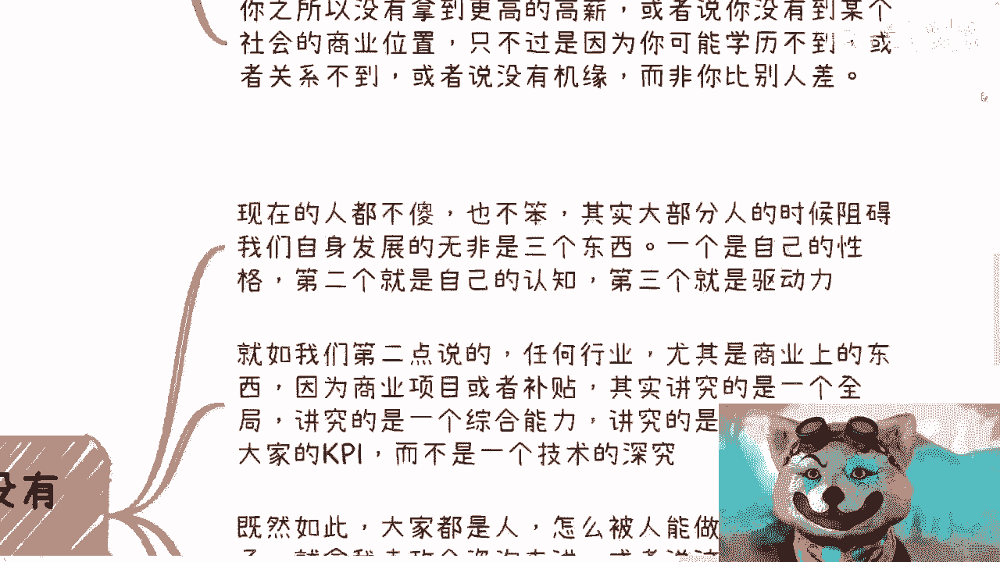

你只是在这个框架下面，你没有达到这个门槛而已，好那么第三点本质上呢我觉得人与人的差别差，智商差本来就没这么大，我觉得这个事情也是那句话啊，但凡你们接触的人够多，但凡你们工作过，但凡你们怎么样。

你们就会发现就这个样子的，就是说智商本身差别没那么大，你说差别大的可能在什么地方啊。

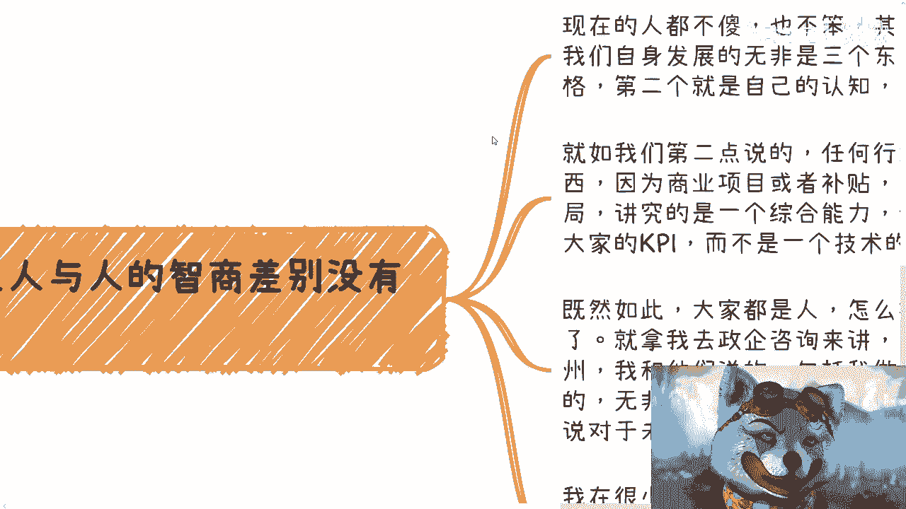

嗯首先啊当下的这个世界环境，我觉得首先人都不傻，他也不笨不笨啊，大部分人他的差别无非在三个东西，一个是他的性格，一个是他的认知，一个是他的驱动力，那就是我们第二点说的啊，就是说任何行业。

尤其是商业上的东西，因为商业的项目啊，包括比如说昨天在广州，今天在广州啊，我们这个活动上面，大部分人你其实你们你们去反思一下，你们去复盘一下，其实大部分人所面临的问题，他是一个硬伤吗。

啊就跑过来说刘老师啊，我今天学历不够，我接下来是不是没法往下走了对吧，或者说啊那个刘老师，我是不是说接下来我我这个性格比较内向，我是不是接下来没法往下走了对吧，或者怎么样，就是但是你得到的结论是什么。

就是我无论你去问谁啊，我可以告诉你，无论你去问谁，他肯定都会跟你说，路有很多种，不会因为你今天手上有什么硬伤，然后他就告诉你啊，不行了，死路一条啊，等死吧啊，不会的呀，所以说为什么。

因为很多的商业项目或者社会上的东西，它讲究的是一个全局，讲究的是一个综合能力，讲究的是一个关系相互满足，相互扶持的一个一个一个一个KPI，而不是说某一个东西的一个技术的深究。

或者说某一个学历的一个一个一个，一个一个框框对吧，那么既然如此，大家都是人，那怎么别人能做，你就不能做了呢对吧，你就拿我去政企咨询来讲，或者这两天我在广州，我就跟他们说的，包括我做咨询。

你有什么不能做的，就像我说的，你做三个月，你也是熟练工，有什么区别呢对吧，无非就是说没有这个机缘巧合，或者说可能你性格上放不开啊，或者说你可能对于很多未知的东西心生恐惧，对吧。

但是你会发现本质这些东西都是能改变的，但不是说哦因为因为哦我说因为我我啊，我智商180，你智商20可能不难，这不现实的呀，啊我在很小的时候，我觉得呢曾经有个人跟我说句话啊，我觉得特别记忆犹新。

因为我以前呢就害怕很多东西啊，哪怕你跟老师对话，跟我同学对话，跟我同学家长对话，我都很害怕啊，那么他就说他说他说你要这么想，你是一个人，对方也是一个人，没什么好怕的，你无非恐惧的东西。

你都是你自己的假想敌，你知道吗，就是你假想出来的敌人。

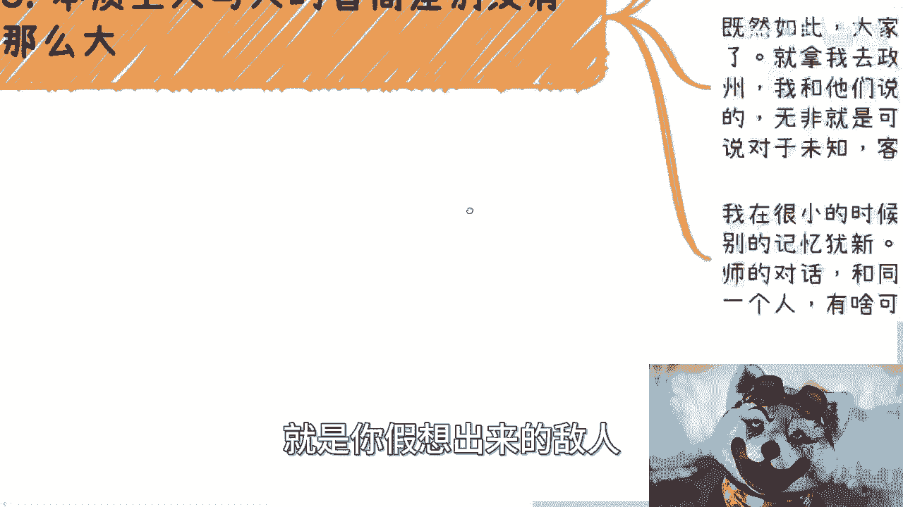

或者你假想出来的这种环境啊，那么最后一点就换而言之，并不是说世界就是个炒蛋班子，而是说大家都是人，没什么特别好或者特别不好的。

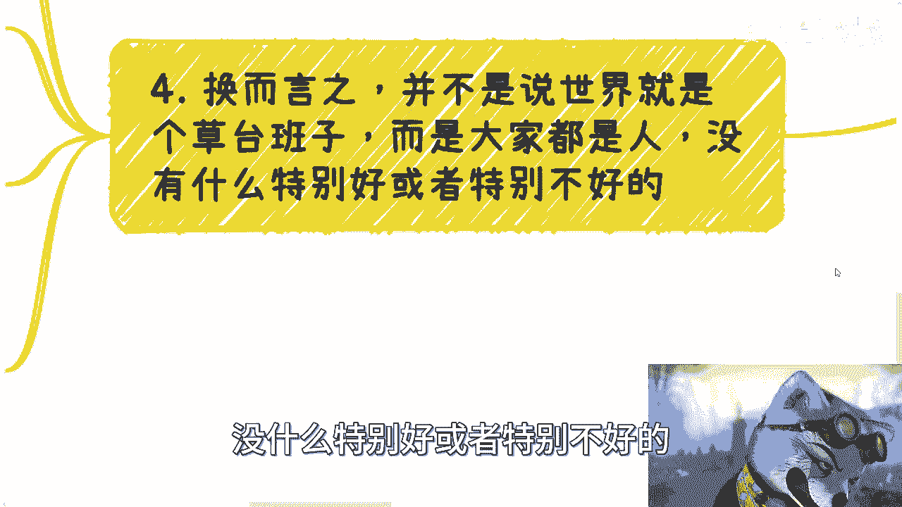

你可以认为大家都是精英，你也可以认为大家都是草台班子，但本质上精英也好，草台班子也好，这不重要，重要的是本质上大家大差不差，你知道吧，那么就是我们说的啊，去掉特别钻研的，特别科研的啊。

有的你们去看很多地方什么，你比如说交通也好，就就人类社会到现在很多东西0~1对不对，天才有没有差别，有认知上有没有优，但是剩下的你要发展下面的落地，还是说把1~100推进下去，其实都一样的呀。

大差不差的呀对吧，也就是说今天哪怕不是他们，我把你们都换上去啊，把你们换到什么协会，商，会把它把你们换到商业上的每一个环节换上去，一个团队全部把血换一下，本质上你可以说他们不见哦。

本上我可以说他们不见得比你们做的就有多好，但是反观我可以说，你们也不见得比他们能做的多好，为什么，因为本质上人都是一样的，我们可以说你3分钟热度，我也可以说你新官上任三把火，对啊。

但是就我来说人与人的差距没有这么大，就是我今天真的比如说你做了某些商业对吧，或者说做了这种治理啊，或者怎么样，就是说你会发现很多困难，有没有有很多困难在不在在对吧，那很多方法就像我们以前说的。

你不是绝对不可能第一个想出来很多东西，你大家可能也试过，你只是不知道，那么所以说你不见得就有多高明的方式，而同样的他们也不见得就有多高明的方式，因为大家脑子都大差不差的呀，啊更何况无论你做什么。

你都是个小齿轮，就是你得有个全局观，对不对，就是说你有一个小齿轮，外面跟你合作的，还有无数个跟你一样的小齿轮，在外面还有更多无数的更大一点的齿轮，可能在外面还有无数的更大更大的齿轮。

那么也就是说我们在做事情的同时，也是被束缚住的，你不是完全放开手脚的，你也不是一手遮天的啊，那么所以说结论来讲。

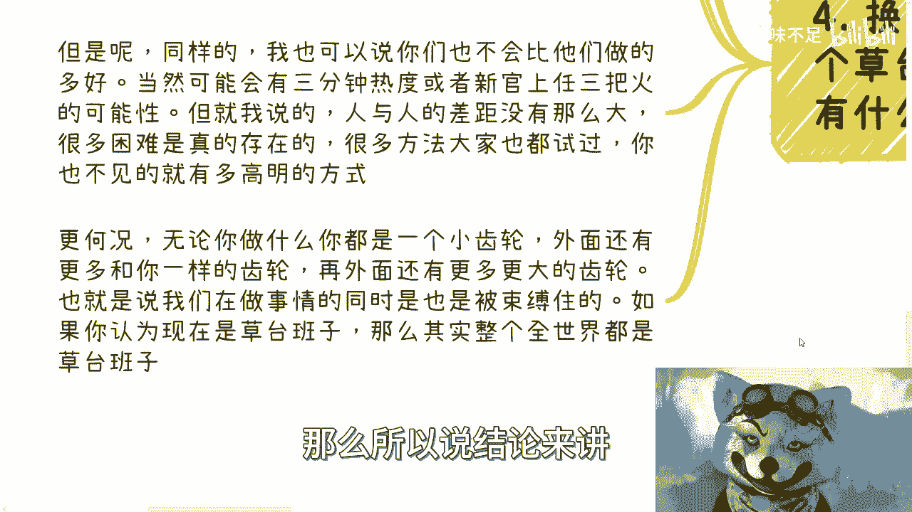

如果你认为现在是草台班子，那么其实本质上大家都是草台班子，没有区别的呀。

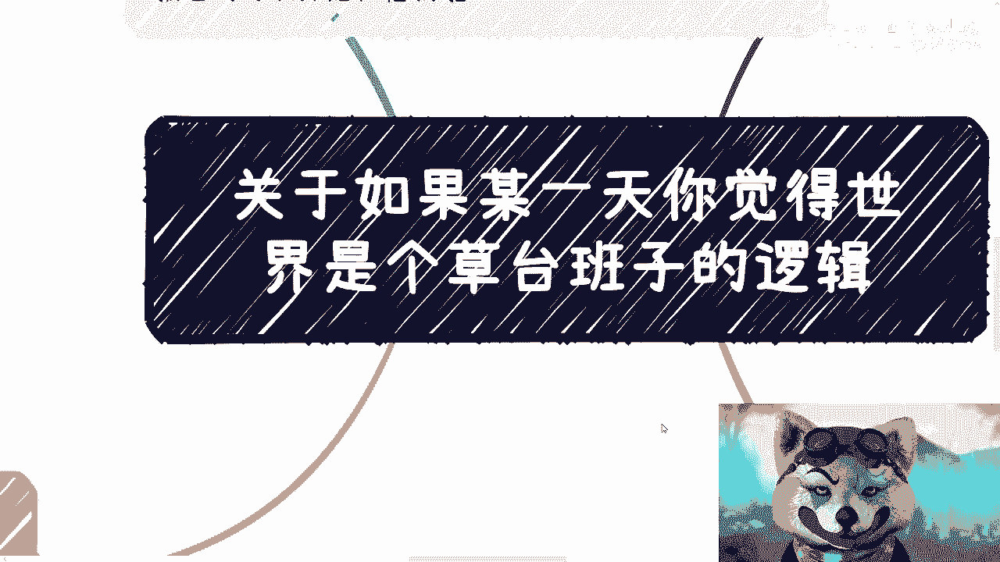

所以啊我们来讲啊，这个逻辑呢嗯很多人因为我看到这个视频呢，是因为他们那当然我没去考考究过，他们说是乔布斯说的对吧，但是呢我觉得这个事情我们去理解，跟乔布斯去理解肯定还是不一样的啊。

因为乔布斯啊他要去做一些事情，他要去改变一些事情，他要去创新一些东西，这个东西就像我们说的，跟他个人的能力，跟他个人的性格，很多东西都有很大关系对吧，你们看过乔布斯传的，你们就会很清楚对吧。

那当然同时也跟这个天时地利，人和整个机缘很有关系，也跟很多的这种这种这种这种国情啊，个人就是教育文化有关系啊，但是我们就说无论再怎么有关系，他都是个例啊，他都是个例，但是你从这个结论上来讲。

它就是整个的各个层面哦，我们去头去尾气各个层面，他就是个草台班子，或者说你不要去太贬低的去看待他们，而是说你就非常平等的去看待他们，就是他们跟你们一样有什么区别，没有任何区别。

有如果你们觉得非要觉得有区别，那只是你们自己去PUA了，你们自己，你们被很多有的没的去灌输了一些思想，从而让你们觉得可能你们比他们低人一等，或者你们比他们差，但其实我就说嘛，你们把你们双方换一下。

三个月，六个月下来有什么区别呢，你也能做，都是熟练工，好吧行，那我觉得这个事呢就这么一个情况，我希望嗯能够看清楚，就是嗯不以物喜，不以己悲，不以己悲嘛对吧，就不要妄自菲薄对吧，这就是核心。

没没什么好那个的，就是就是嗯所有的人在社会上层面，其实都是都是同一起跑线，没什么很大差别的啊，你说这些人有关系，那些人有关系没问题啊，那你让他们有关系吗，对不对，那我们就不要跟他们竞争嘛。

我们就是就是我们自己能做的东西呗，总归能做的啊，行那就这么着吧好吧，然后大家待会儿下午就第二场活动了啊，嗯啊对北京，然后有有有那个要来的，可以私信我，然后同样的有什么问题。

有什么商业其他东西你们整理好啊。

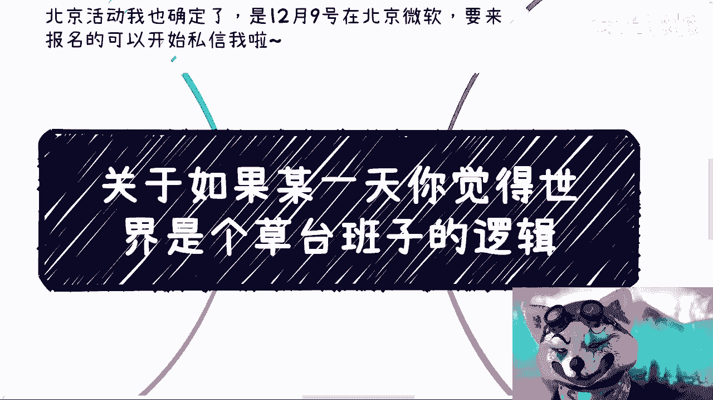