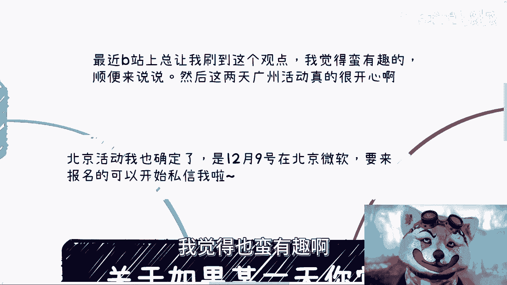
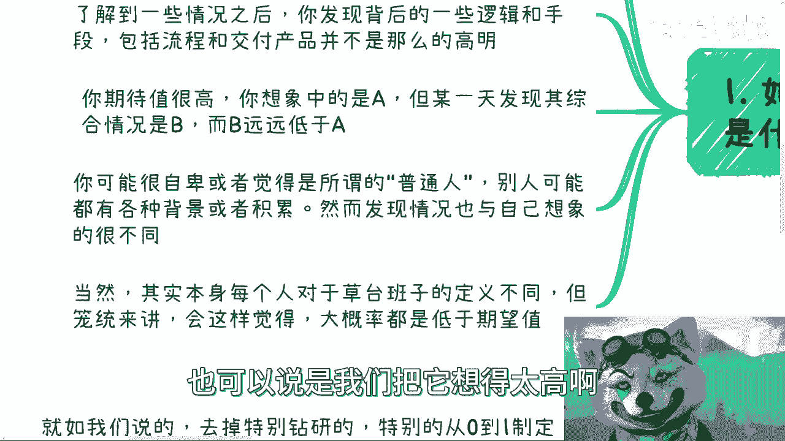
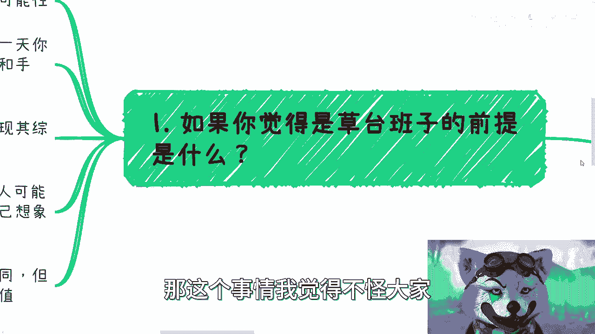
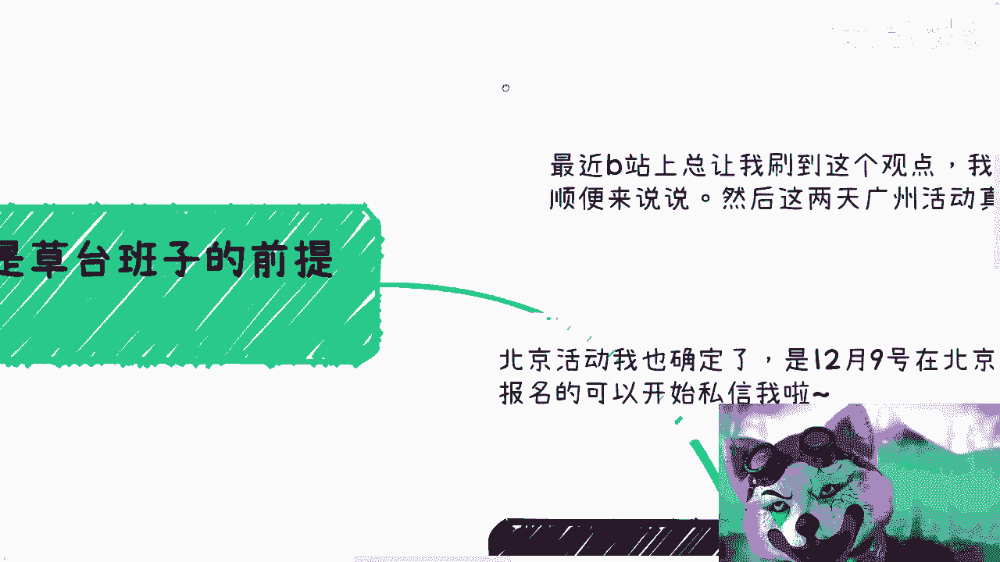
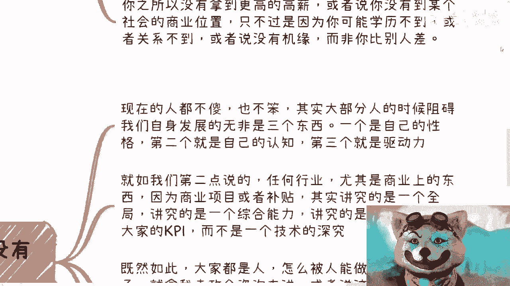

# 关于如果某一天你觉得世界是个草台班子的逻辑---P1---赏味不足---BV1NN41177Le_n

在本节课中，我们将要学习一个在网络上流行的观点——“世界是个草台班子”。我们将深入探讨这个观点背后的逻辑，分析人们产生这种感受的原因，并最终理解其核心本质。课程内容将帮助你以更平和、客观的视角看待社会组织和个体能力。

---

## 活动通知与引入主题

首先，分享两则线下活动信息。广州的首场活动已顺利结束，参与者素质很高，交流反馈非常积极。未来的线下活动会考虑多举办。

其次，北京的活动已确定于12月9日在微软举办。具体地址和报名事宜，请通过私信联系我。

现在，我们来讨论今天的主题。最近在B站上，一个观点频繁出现：“某一天，你觉得世界是个草台班子”。这个观点很有趣，值得我们深入分析。

---

## 为何会产生“草台班子”的感觉？

上一节我们引入了“世界是个草台班子”这个流行观点，本节中我们来看看人们产生这种感觉的几种常见原因。

笼统来说，产生这种感觉，大概率是因为现实情况**低于了期望值**，或者说，我们把事情想象得过于美好。

以下是三种具体的可能性：

1.  **你相对聪明，洞察了本质**：你的认知水平可能高于中位数，了解事物的发展规律。某天你深入了解到某些组织背后的运作逻辑、管理手段或最终产品（如软件、硬件）后，发现它们并非想象中那么高明。
2.  **你的期待过高，现实落差大**：你想象中的事物是完美的状态A，但实际接触后发现是状态B，且B远低于A。这种巨大的落差会让你觉得一切都是“草台班子”。
3.  **在“普通人”框架下，依然感到意外**：你可能一直被家庭、学校或网络灌输“普通人”的概念，甚至有些自卑。然而，当你接触某些看似“高大上”的领域或人物时，发现实际情况与你被灌输的认知也很不同，依然会感到意外。

---

## “草台班子”现象的普遍性逻辑

理解了个人感受的成因后，我们需要从一个更宏观的视角来看待这个问题。为什么“草台班子”的感觉如此普遍？

**核心逻辑是：当一个组织的参与方和管理面越来越广时，其运作最终只会趋于“草台班子化”。**

原因如下：

*   **精英与天才凤毛麟角**：真正的精英和天才极为罕见。组织中大部分成员本质上是普通人，他们的位置可能更多源于机缘巧合、家庭背景等非能力因素，而非绝对的智力或能力优势。
*   **大部分工作是“熟练工”**：除了少数尖端科研或需要长期积累的传统工艺，现代社会中的大部分工作岗位，在经历数月到一年的实践后，都能达到“熟练工”的水平。这与行业、专业甚至学历的关系并不绝对。
*   **个体的可替代性与框架限制**：社会中的大部分人都是可替代的。许多人未能获得更高成就或地位，往往不是因为能力不足，而是受限于学历门槛、社会关系、机遇等“框架性”条件，并非你比占据那个位置的人差。

---

## 人与人的核心差异

既然“草台班子”现象普遍，那么人与人之间的真正差别在哪里呢？本节我们将探讨这个问题。

智商本身的差异并没有想象中那么大。在当下的环境中，大部分人都不傻。真正的差异主要体现在三个方面：**性格**、**认知**和**驱动力**。

许多商业和社会项目，讲究的是**全局统筹**、**综合能力**与**关系协作**，而非对单一技术的极致深究。因此：

*   **能力是相通的**：正如政企咨询工作，经过数月训练，很多人都能成为熟练工。别人能做，你理论上也能做。
*   **障碍多可改变**：阻碍你的往往是性格上的放不开、对未知的恐惧或认知局限，而这些通常是可以调整和克服的，并非不可逾越的智商鸿沟。
*   **破除“假想敌”**：恐惧常源于自己假想出的敌人或困难。记住，你是一个人，对方也是一个人，本质上平等。

---

## 核心结论与平等视角

综合以上分析，我们可以得出本节课的核心结论。

**最终结论并非“世界是草台班子”，而是“大家都是人，本质上的差异没有那么大”。**

你可以认为所有人都是精英，也可以认为所有人都是草台班子，但这都不重要。重要的是认识到：

1.  **大差不差的原则**：在去掉顶尖的科研创新（0到1）之后，剩下的发展、推广和落地工作（1到100），不同的人来做，结果可能大同小异。
2.  **系统中的齿轮**：每个人都是社会大系统中的一个齿轮，既受制于更大的齿轮（上层系统），也与其他小齿轮协作。你的发挥空间是有限的，并非完全自由。
3.  **平等的视角**：因此，应以平等的眼光看待他人与自己。如果觉得他人是“草台班子”，那本质上大家彼此彼此。不必自我贬低，也不必过分神化他人。**“不以物喜，不以己悲”**，不妄自菲薄，才是健康的心态。
4.  **聚焦自身路径**：承认有些人拥有先天优势或关系，这很正常。我们无需与他们直接竞争，而是应专注于自己可控的领域和能做的事情上。

---

本节课中我们一起学习了“世界是个草台班子”这一观点的底层逻辑。我们分析了这种感受的成因，探讨了其反映出的社会组织普遍状态，并最终将视角落回到“人与人本质平等”的核心上。希望这节课能帮助你更理性、更自信地看待自身与外部世界。