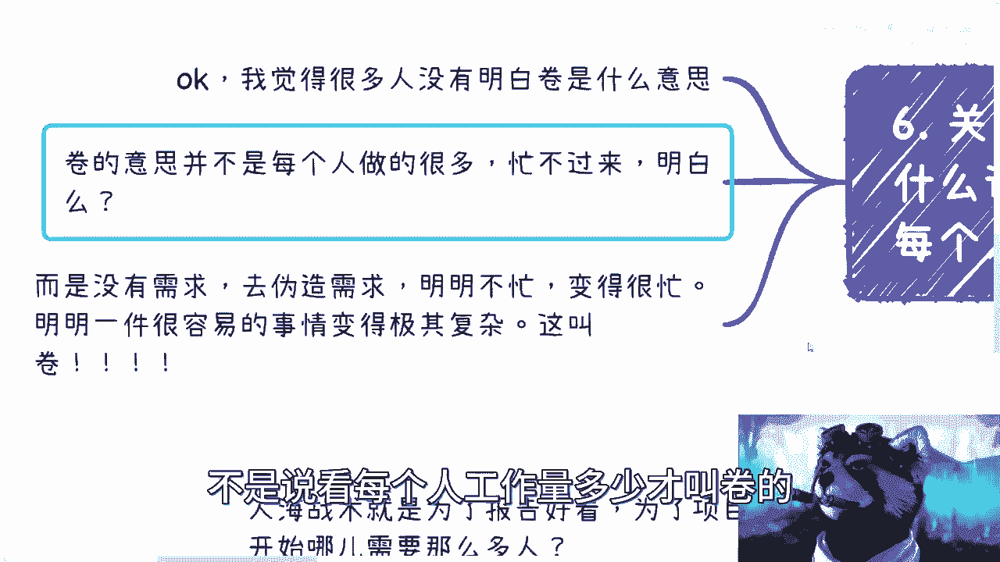
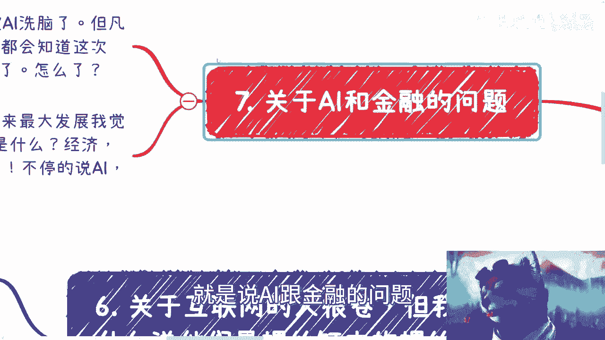
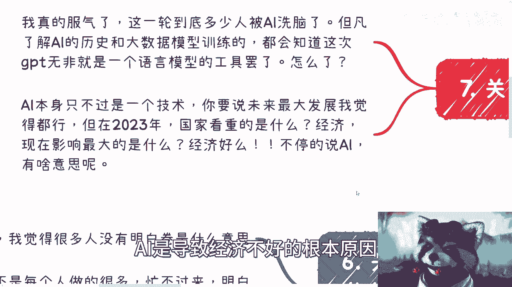

# 关于杭州裁员这个视频的几个问题的回答 - P1 - 赏味不足 - BV1ko4y1T782

好啊，我发现这个杭州裁员，这个视频引起了非常大的关注啊对吧，你这不得不让我叼起两根雪茄，来讨论这个问题啊，我真的是很服气的，首先呢是这样子的啊，这个我一个个来说，第一个啊一呢一在这啊。

很多人说辟谣了是吧，好我跟你们说啊，辟不辟谣跟我没有关系，我根本就不在乎这件事情，为什么你对一个我在上海对吧，当时说疫情不封闭的人，你跟我说辟谣啊，再说了，辟不辟谣怎么讲呢，在我看来有什么区别呢。

我最早的时候我就说过了对吧，整个金融经济全球的情况就这个样子，包括整个中国接下来做很多的事情，包括他的裁员啊，包括其他各种各样的原因，他都是有前提条件的，不是说啊就大家看到说啊，就这个经济不好了对吧。

然后什么收入不好啦对吧，怎么样了，然后说i就辟谣了，今年招更多的人了，很有意味了，怎么样呢，跟你们有什么关系啦，对不啦，还是某公司他妈的自己在那边组织的人，在这边在这边搞啊啊，我也会莫名其妙了。

真的是为了股价不择手段是吧啊，然后另外真的笑死了笑死了，就所有事情开场就是辟谣，辟谣跟我有什么关系啊，我退1万步来讲，我只说杭州裁员，我他妈甚至都没说哪家公司，这公司狗家中真的是很好是吧啊。

我什么都没说，就开始到我这里来刷刷什么东西啊是吗，这第一个啊，第二个我说他们很多人被裁了之后对吧，这些人其实本身没什么能力啊，然后呢我也说他们很卷对吧。

很多人我看到有些小伙伴不理解啊，首先抱歉抱歉，我跟你们说啊，他们的确没什么能力，至少匹配不上他们这么高的薪水，这是第一点，第二点，你说他们会不会卷，我告诉你，他们很会卷，为什么。

因为他们在公司里面学会最多的就是如何填，上面如何pv下面，这就是他们卷的原因，对不对，第三个，当然我们也不能一刀切对吧，我也相信有好的，但大家自己看吧，反正我觉得比例是很少很少的对吧。

但是大环境本来就是越来越卷的，不就他们词裁不裁员。

本身也也会越来越卷，这个不是一个这个充分必要条件是吧，好然后第三个啊，然后说我看到有这个评论说啊，互联网被我说成了击鼓传花的行业是吧。

我也是笑了，难道不是吗，哎我就不明白，难道不是吗，到今天难道不是吗，啊我就奇了怪了，互联网一开始的确不是啊，我早就说过，2000年开始，门户网站网后面有非常多的产品是很有用的，没有错。

但到后面不就是被完全击鼓传花，击鼓传花了吗，有什么区别呢，啊我也不明白了，真的是你要么老百姓接盘，要么资本不停的接，要资本接盘，其实最终还是老百姓接主，要么政府接，政府接盘，最终还是老百姓接是吧。

怎么不是了呢，你们告诉我，互联网到今天还有多少产品是有初心的对吧，有很多就是我假装伪造出了一个需求，干掉了一个原本存在的行业，然后造出一个新的行业，然后跟我们说好，这个行业是垃圾。

我们造出新的是好的对吧，互联网原本的初衷是什么，是不是普惠，我早就说过了普惠普惠了吗，对吧，我跟你们这么说啊，滴滴也好，饿了么也好，美团也好，非常多的产品是互联网在发展过程当中，必然会出现的。

不是说一定要投100个亿，两个亿，300个亿进去砸钱才能出现的东西，你们明白吗，就算没有资本，没有这些这个击鼓传花的东西，它也会有今天的发展，只不过可能不叫这个产品，不叫这个名字对吧。

可能也不会像现在这么黑心，哎呀我真的也是绝了是吧。

第四个啊，那会说是因为赚不到钱了才裁员的，不是互联网环境不好，我跟你们讲早就说过了。

我说互联网环境不好的根本原因是，因为我从很早就知道政府不愿意，有很多地方政府不愿意再去给补贴，给扶持资本，也不愿意投资对吧，不愿意再给更多的一些这个基金，这个是它的核心原因，是因为整个互联网饱和了。

你赚不赚到钱，这只是今年或者去年的问题。

这跟我所讲的整个观点没有任何的冲突，但是也没有关系，你知道吗，是吧啊，这是第四点，第五点关于人海战术有问题啊，是这样子的，为什么我说互联网最早啊，互联网就喜欢人海战术，是因为人海战术。

它本身最早的时写互联网企业在立项，在开创这个企业的时候，非常多的项目，它是需要通过项目的汇报，通过人数的汇报去去做，去要钱的，你们但凡去申报国项目，就会明白人数是非常重要的，多少人日是非常重要。

非常重要的对吧，最开始哪需要这么多人啊，有吗没有呀，但为什么要这么多，包括资本a轮到b轮，我早就说过了，你a轮到b轮，你你你给我一个什么50个人，100个人能融到能容新人能能能能有多少。

什么日活的能能做不能做的呀，对不对，那我们会退1万步来讲好了，那为什么滴滴美团，饿了么，互联网这么多企业做到后面都他妈去做贷款了，为什么都去都去qc做小件，大家为什么，那就莫名其妙的，真的是是吧。

这本质就是这样子的对吧，然后还有人跟我说什么，还有人跟我说t本质是代码，我靠我他妈笑尿了，真的笑尿代码，你要点脸好吗啊代码又能成为本质，现在马龙应该是最受尊敬的人，我是他妈的躺在上面数钱的人。

还他妈996007，你妈唉唉真的也是绝了，我真不知道，b站现在他妈的就产产出这些言论来对吧。

到底是这个某公司的一些狗呢，还是说是真的。

就是说这个我国这个教育真的是令人堪忧是吧。

第六个就是关于互联网人很卷啊，但我为什么说他们是这个螺丝钉当中的螺丝钉。

每个人做的很少，首先我觉得很多人没有明白卷的意思啊，什么意思呢，就是说卷的意思并不是说，每个人一定要做的很多，忙不过来，你知道吗，这不叫卷，卷的意思是已经没有需求了，所有的东西该做做完了没有。

没有任何可以做的，人，在没有需求情况下想办法去伪造需求，明明很不忙，变得很忙，明明一件事情很容易，事情变得极其复杂，这叫卷，你知道吗啊，明明就是大家可以两个人干的很好的，他非要去举举报，你这叫卷。

你懂吗啊，不是说看每个人工作量多少才叫卷呢。

哎呦我的天呐，真的是全都要我科普对吧。

然后还有还有最让我最最让我无法理解的，就是说ai跟金融的问题了。

我真的服气了啊，他说这我真的不知道这一轮下来，多少人是被g p t跟ai洗脑的，但凡你们去看一下ai历史，跟所有真的需去懂深度学习跟大数据模型，是用电台这些人，我跟你说，你们但凡去去找一个懂技术的啊。

他都会告诉你，这次gp t无非就是个语言模型的工具，怎么了呢啊怎么了呢，ok你就就算我认同ai未来是有很大发展的，这个是我认同的，但是在2023年这个时间点，我就问你全球看中什么国家看中什么啊。

你在这个地方说ai哦。

要替换人了，ai是导致大家辞职，这个裁员的根本原因，ai是导致经济不好的根本原因。

我的天哪，是吧。

好吧我还是那个观点啊，辟不辟谣跟我没有关系，某公司也不要到我这里来刷，没有任何意义对吧，我所有的观点从我最早的时候就说的很清楚了，不是说今天因为这件事情啊，然后包括就是这边所有我列出来的对吧。

你们要用表面的表面的信息对吧，来迷惑大众，那随便对吧，我所说的所有的都是背后的本质，那爱信不信是吧，然后所有的不要在我刷刷了，我一律拉黑啊。

