# 课程01：关于杭州裁员视频争议的深度剖析 🧐

在本节课中，我们将深入探讨围绕“杭州裁员”视频引发的几个核心争议点。我们将逐一分析关于辟谣、被裁员工能力、行业本质、裁员原因、人海战术、内卷现象以及AI影响等关键问题，旨在揭示现象背后的深层逻辑。

## 关于“辟谣”的讨论

上一节我们概述了课程内容，本节中我们来看看第一个争议点：“辟谣”行为本身。

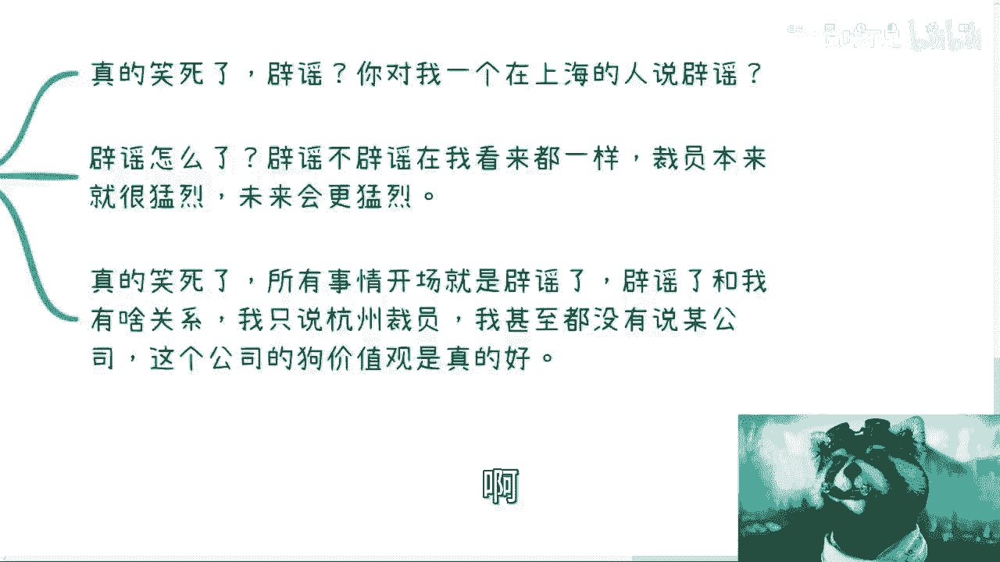

视频发布后，出现了针对裁员消息的“辟谣”声明。但需要明确的是，辟谣与否与本次讨论的核心观点无关。讨论的重点不在于某条消息的真伪，而在于其背后反映的宏观经济与行业趋势。

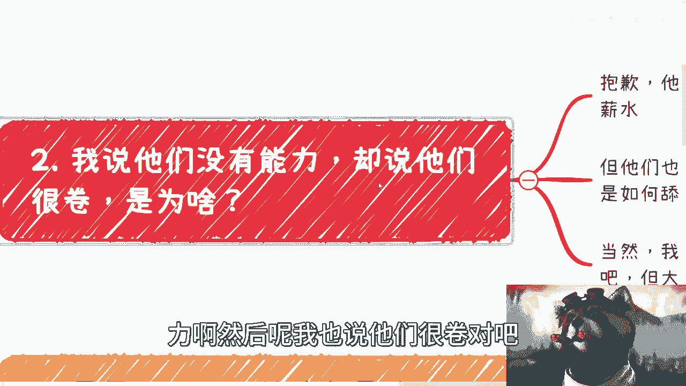

*   **观点独立性**：讨论基于对全球及中国金融经济整体态势的观察，不依赖于任何单一公司的具体声明。
*   **动机存疑**：某些“辟谣”行为可能出于维护股价等目的，其真实性有待商榷。
*   **范围界定**：讨论泛指“杭州裁员”现象，并未特指某家公司，因此针对特定公司的辩解并不适用。

## 被裁员工的能力与内卷

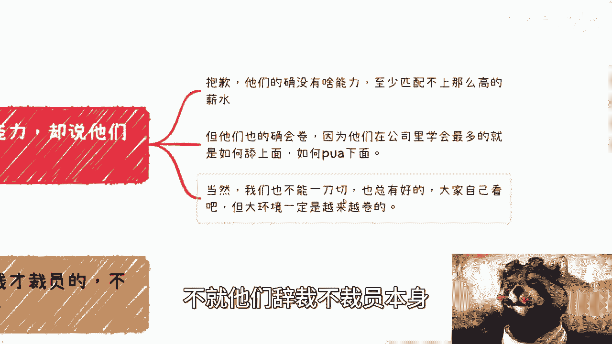

在澄清了“辟谣”问题的无关性后，我们进入下一个话题：对被裁员工能力及其工作状态的评价。

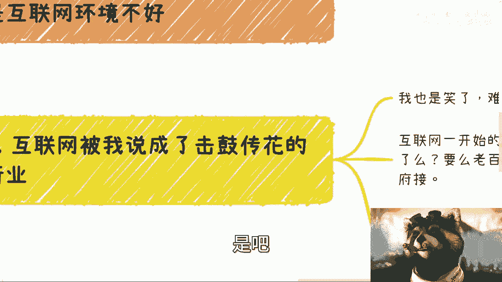

以下是关于此点的具体分析：

1.  **能力与薪酬错配**：部分被裁员工的实际能力可能无法匹配其此前所获得的高额薪酬。
2.  **“内卷”技能**：他们在职场中学到的重要技能往往是“如何填写报表”、“如何向上管理（PUA上级）”以及“如何向下施压（PUA下属）”，这构成了他们“卷”的主要方式。
3.  **不能一概而论**：当然，其中必然存在优秀个体，但这部分比例可能较小。同时，整个就业市场的大环境正在变得越来越“卷”，这并非由单次裁员事件导致，而是一个普遍趋势。

## 互联网行业的“击鼓传花”本质

接下来，我们探讨一个更根本的问题：互联网行业是否已演变为一场“击鼓传花”的游戏？

答案是肯定的。互联网早期（如2000年左右的门户网站时代）确实产生了许多有价值的创新产品。但随后发展模式逐渐异化，其本质变成了一场资本游戏。

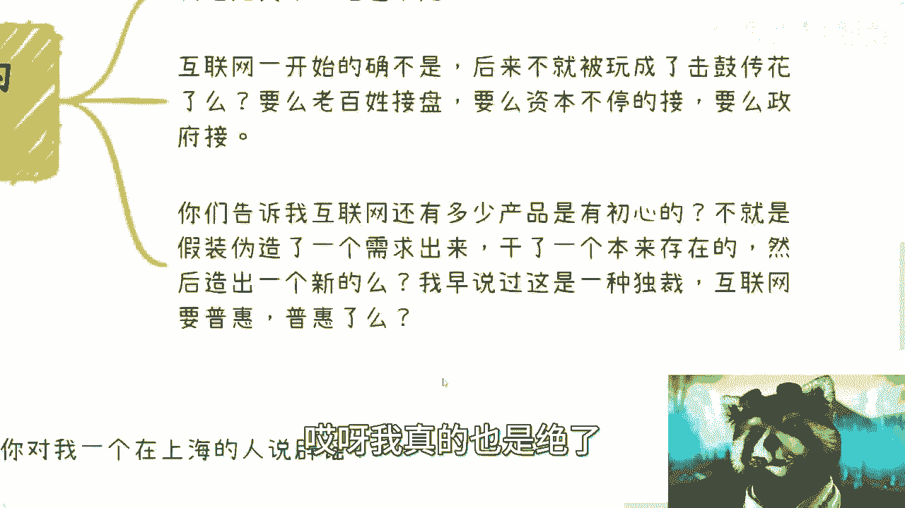

*   **模式定义**：**“击鼓传花”** 指的是一种资产或概念在投资者之间不断转手，价格被推高，但最终需要由终端用户（老百姓）或政府接盘，价值基础薄弱。
*   **偏离初心**：许多互联网产品不再以“普惠”为初心，而是通过伪造需求、颠覆传统行业来创造所谓“新行业”，但其社会总价值未必增加。
*   **必然性与资本扭曲**：像滴滴、美团这类服务，本是互联网发展的自然产物。但资本的巨额投入（数百亿）扭曲了其发展路径，催生了垄断和诸多弊端。没有资本泡沫，这些服务依然会出现，但形态可能更健康。

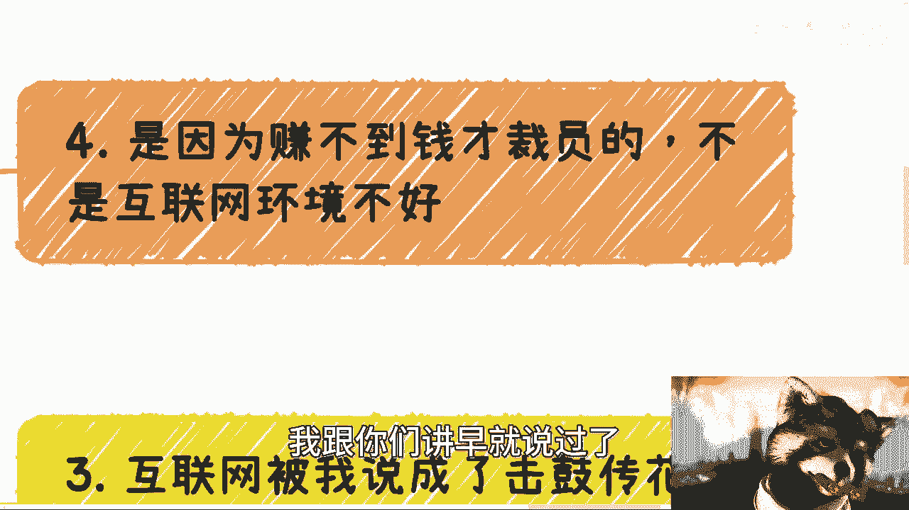

## 裁员的根本原因与“人海战术”

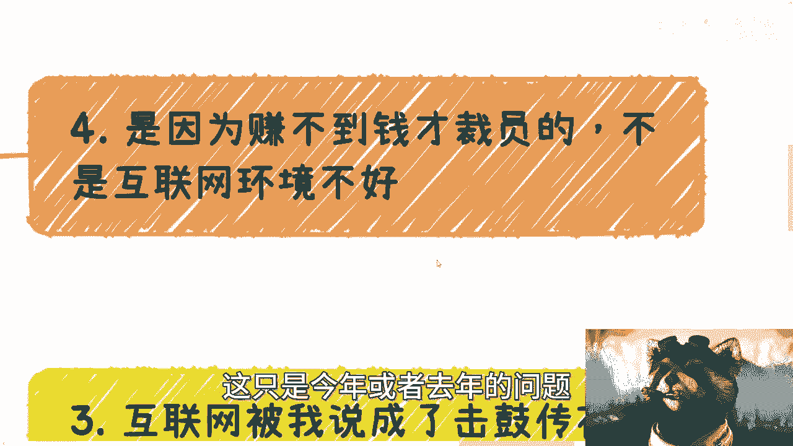

那么，裁员潮的根本原因是什么？这与互联网企业长期奉行的“人海战术”密切相关。

有人认为裁员是因为“赚不到钱了”，但这只是表面原因。更深层的原因是：**互联网行业已趋饱和，政府与资本不愿再提供大量补贴和投资**。盈利困难是结果，而非原因。

“人海战术”的盛行有其历史背景：

*   **融资与汇报需求**：早期互联网公司为获得融资（从A轮到B轮）或政府项目支持，需要靠庞大的团队规模（人日）作为实力证明和汇报资本。
*   **业务异化**：许多互联网企业最终都涉足金融贷款业务，这暴露了其主业增长乏力、需要寻找新盈利点的窘境。
*   **技术本质辨析**：有人认为互联网本质是代码。但代码只是工具，真正的本质是商业模型和资本运作。将代码奉为本质，是对行业理解的错位。

## 何为真正的“内卷”？

我们之前提到了“内卷”，现在需要正确定义它。

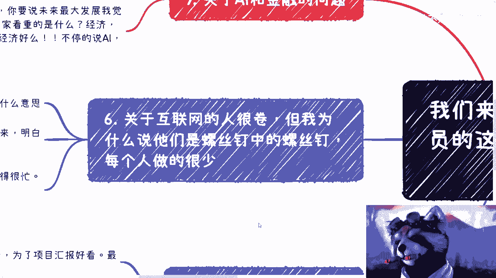

“内卷”并非指个人工作量饱和。其真正含义是：**在缺乏真实增长需求的情况下，通过制造虚假的复杂性和竞争来消耗资源**。

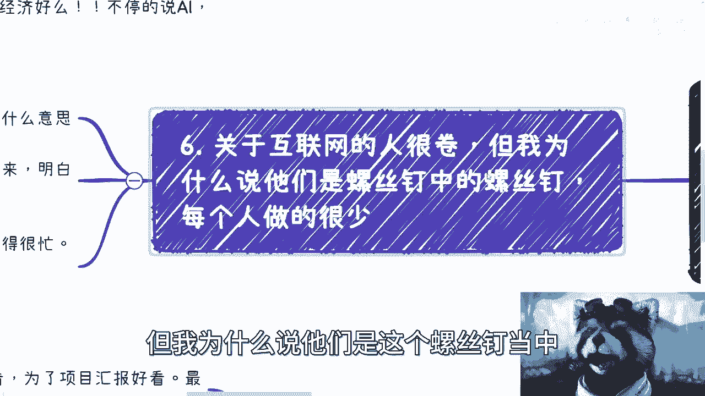

*   **错误理解**：忙不过来、工作量大。
*   **正确定义**：事情本可以简单完成，却人为制造复杂流程；两个人能胜任的工作，非要安排五个人并相互竞争；通过“举报”等非生产性行为进行内部竞争。
*   **结果**：个体成为高度精细化、可替代的“螺丝钉中的螺丝钉”，从事着价值有限的工作。

## AI与当前经济困境的关系

最后，我们审视一个流行观点：AI（如GPT）是导致裁员和经济下行的主要原因。

这个观点在2023年的当下是站不住脚的。

*   **技术定位**：以GPT为代表的大语言模型，本质上是强大的工具，是技术进步的自然延伸。
*   **时间错配**：虽然AI有长远发展潜力，但将当前周期的经济困境和裁员潮主要归因于AI，是混淆了长期趋势与短期波动。
*   **核心原因**：当前问题的核心仍是宏观经济周期、行业饱和及资本退潮，而非技术替代。

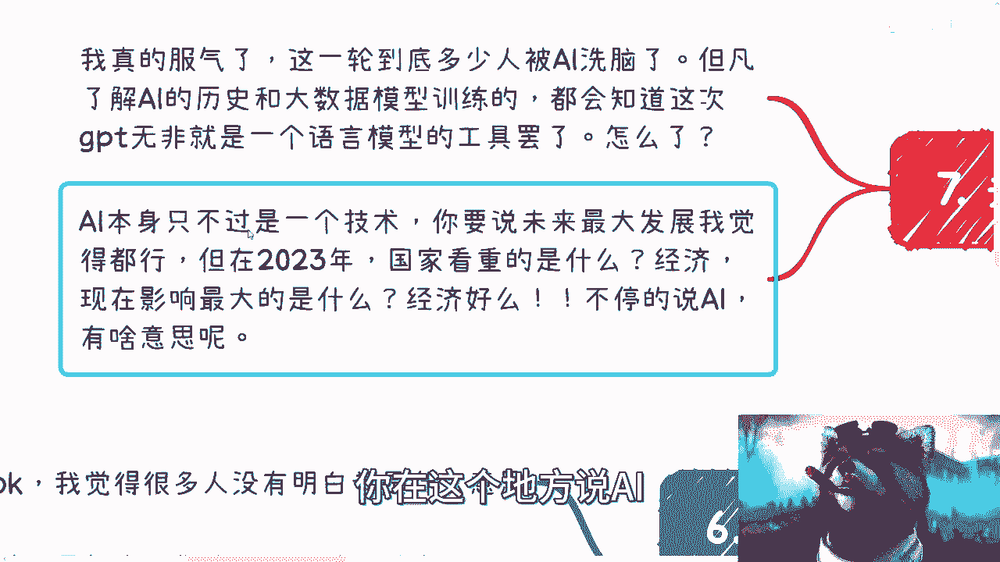

## 总结与立场重申

本节课中，我们一起学习了围绕杭州裁员现象的多个争议点。

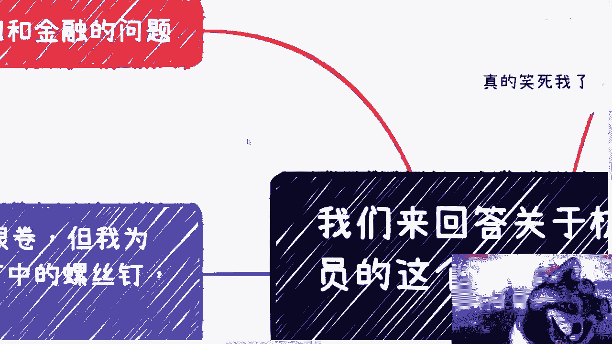

总结核心立场如下：
1.  讨论不纠结于具体事件的“辟谣”，而关注宏观趋势。
2.  部分被裁员工存在能力与薪酬不匹配、技能导向内卷化的问题。
3.  互联网行业在许多领域已异化为资本“击鼓传花”的游戏，偏离普惠初心。
4.  裁员的根本原因是行业饱和与资本退潮，而非短期盈利问题或AI技术。
5.  “人海战术”是特定发展阶段的产物，反映了行业的浮躁。
6.  真正的“内卷”是创造虚假忙碌与竞争，而非工作量大。
7.  将当前经济问题主要归咎于AI，是对因果关系的误解。

所有分析均基于对行业底层逻辑的观察，与表面信息无关。观点明确，不再回应无意义的刷屏争论。