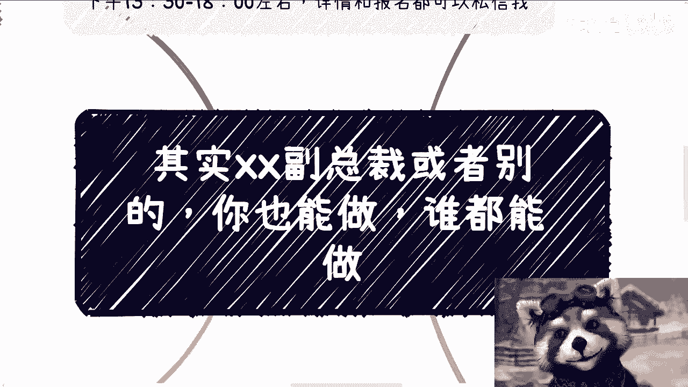
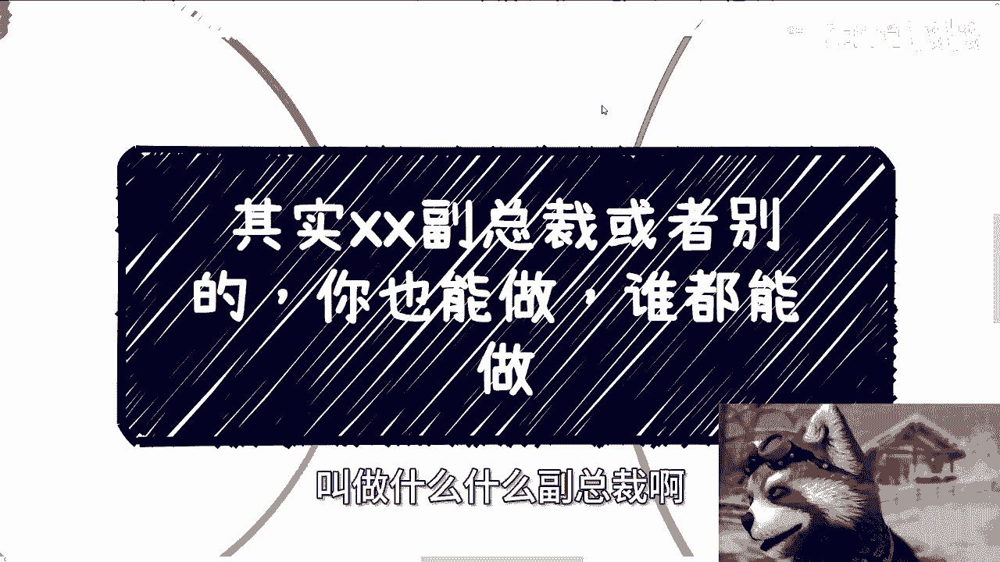
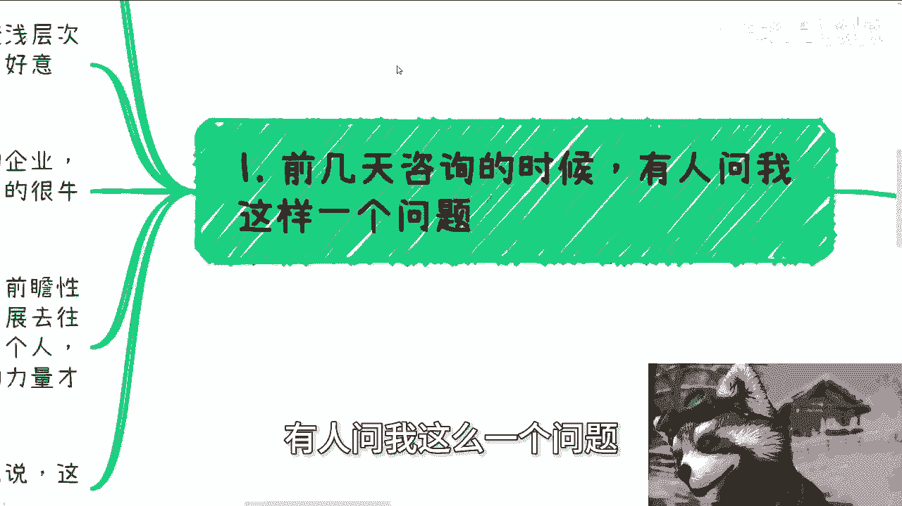
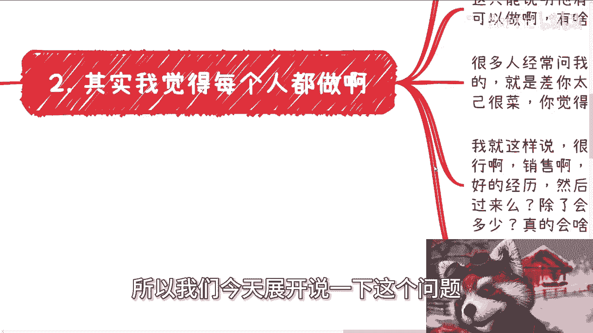
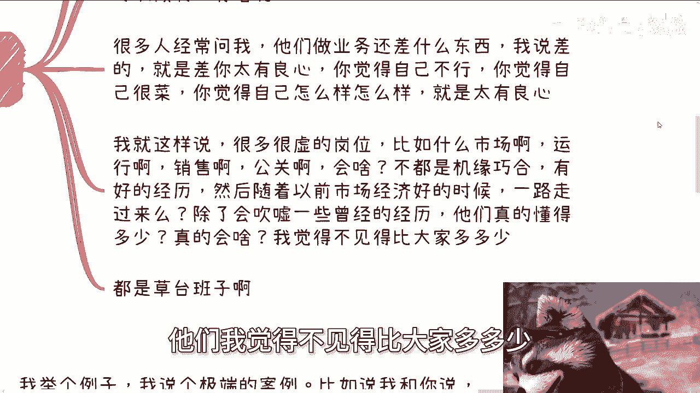
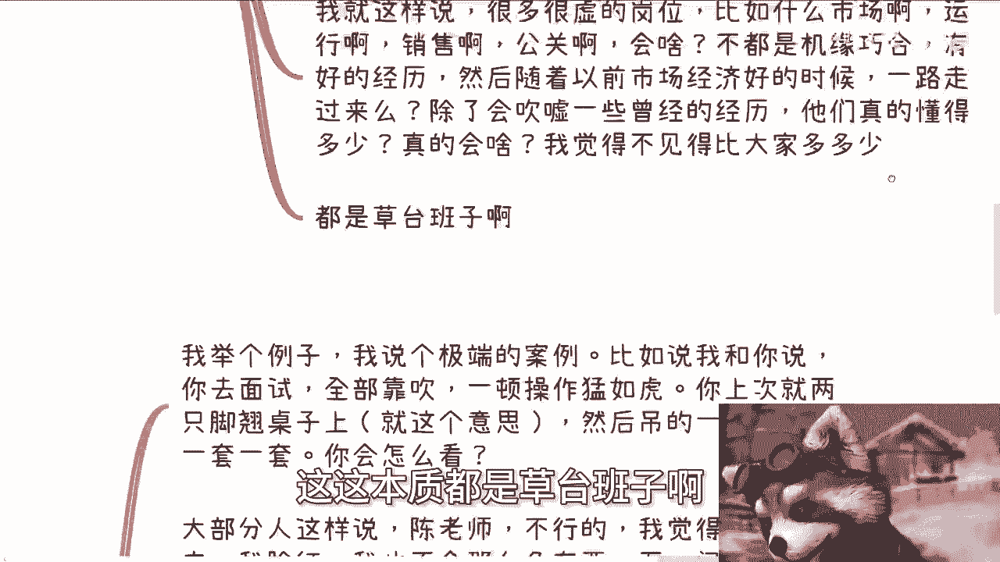
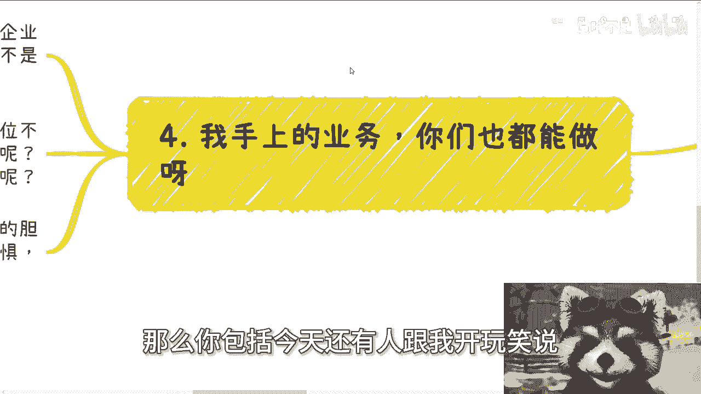
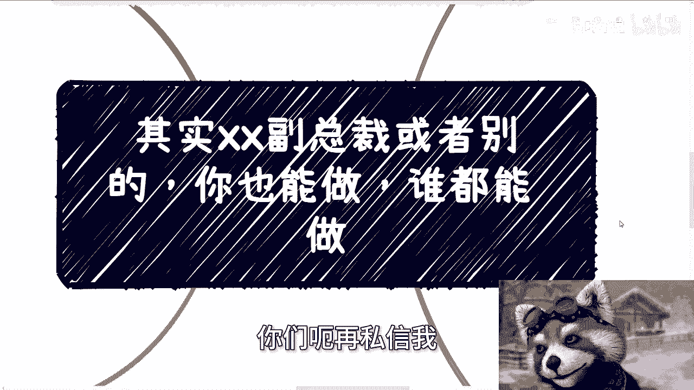

# 课程一：草台班子理论：为什么“副总裁”谁都能做？👔

在本节课中，我们将探讨一个核心观点：许多看似高端的职位，其本质可能并没有想象中那么神秘或高不可攀。我们将通过分析“草台班子”理论、个人成就的构成要素以及社会运作的底层逻辑，来理解为什么“你也能做”。

---

## 概述：从一则网络热点说起

课程从一个网络热议事件引入。该事件涉及某公司副总裁，引发了广泛讨论。我们以此作为切入点，探讨职位与能力的真实关系。

武汉线下活动已确定于本周日（5月12日）下午1:30至6点左右举行。详情与报名请私信。已报名的同学请耐心等待，活动群组通常于周五前后建立。

## 第一节：系统的本质与“同流合污”

上一节我们提到了一个社会热点，本节中我们来看看个人与组织系统的关系。有人曾咨询：进入某个组织或地方，是否需要与内部人员“同流合污”或“出淤泥而不染”？

答案是肯定的。如果你是一个“例外”，你就不可能真正进入那个系统核心。这是一个因果关系。**公式：例外 → 无法进入核心；进入核心 → 必然“同流合污”**。

“出淤泥而不染”只存在于浅层合作或作为“工具人”被利用的阶段。一旦需要深入参与并拥有一定地位，必然与系统内的人利益深度绑定。伪装会导致内心不适，难以持久。

## 第二节：“伟大系统”是血肉堆出来的

之前还有人认为，许多企业或政府的系统和治理逻辑非常复杂，设计者绝顶聪明。这个观点只对一半。

任何复杂的系统都不是一蹴而就的。它们都是随着时代发展，靠无数人的经验，甚至是教训积累而成的。说得直白些，**所有进步都是靠“血肉堆出来的”**。无论是电动车、新能源还是其他领域，都是靠一个个鲜活的案例和人推动的。

从历史角度看，任何个人或团队的贡献占比都不会太大。这是历史发展的必然积累。

## 第三节：人人皆可“副总裁”的草台班子理论

最近网络热议的某公司事件，让很多人感觉自己也能当副总裁。这个感觉是对的。

任何人达到某个位置或成就，都是**天时、地利、人和**共同作用的结果。核心原因在于你没有遇到那个特定的时机和环境。除非是获得诺贝尔奖或发表顶级学术论文这类依靠顶尖个人能力的成就。

对于大多数企业岗位或公务员职位而言，只能说明当事人身处一个“草台班子”，只是他比你这个“草台班子”多了些机缘。本质并无不同。如果有相同的机缘，你也可以做到。

很多人问做业务还差什么。答案是：**差在太有良心**。总觉得自己不行、很菜，这种自我怀疑就是有良心的体现。许多虚的岗位，如市场、运营、销售、公关，具体会什么？大多是机缘巧合。一些销售岗位的核心甚至无关专业能力。在经济上行期一路走来的人，除了吹嘘经历，未必比普通人懂得更多。

**本质都是草台班子**，区别只在于遮羞布有没有被扯下来。

## 第四节：面试是门“搏概率”的学问

既然都是草台班子，那么在天时地利人和中，**面试**绝对是一门关键学问。

我们举一个极端的例子：面试全靠吹嘘，态度张扬。大部分人可能会担心被揭穿或态度不妥。

但有的人就能这么做。他们一顿操作，广撒网，搏概率。假设两人有同等的工作经历和学历：

*   **循规蹈矩者**：最多找到平跳或涨幅10%-20%的工作。
*   **猛如虎搏概率者**：有可能找到实现质变或更高级别的岗位。

假以时日，后者就会成为别人眼中“有能力的人”。尽管你们都是草台班子，甚至你可能更优秀，但这掩盖不了在世俗评价体系中他比你“厉害”的事实。

## 第五节：关系链是唯一的“门槛”

有人开玩笑说，我做的业务（高校、政府、企业对接）他们也能做。答案是肯定的。

你们缺的不是能力，而是**关系链**。只要有这层关系，谁都可以做。几个月后，任何人都会成为熟练工。所有岗位本质上都是熟练工。

我现在能讲课、做咨询，也是因为成了“熟练工”。毕业时我也做不到。即使有差距，花点时间学习就能弥补。九年义务教育培养的就是学习能力。

你缺的是胆量、是对社会规则的认知，以及因自身位置而产生的恐惧。如果未来某天信息差被抹平，你们可能会更理解我每期视频背后想表达的真正含义。在当前框架下，有些话只能点到为止。

## 总结与活动信息

本节课我们一起学习了“草台班子”理论。我们探讨了系统的同化本质、成就的机缘属性、以及面试与关系链的核心作用。核心结论是：不要神话任何职位，许多光环背后，是**天时、地利、人和**的叠加，以及一层未被戳破的窗户纸。

最后，再强调一下活动与咨询服务：
武汉线下活动继续接受报名。
此外，提供以下领域的咨询：
*   商业与职业规划
*   公司分红与股权融资
*   商业计划书撰写
*   资源盘活与路径设计

如果你手上有牌或不知如何出牌，希望借助外部认知获得更好规划，可以整理好问题后私信我，进行一对一咨询。