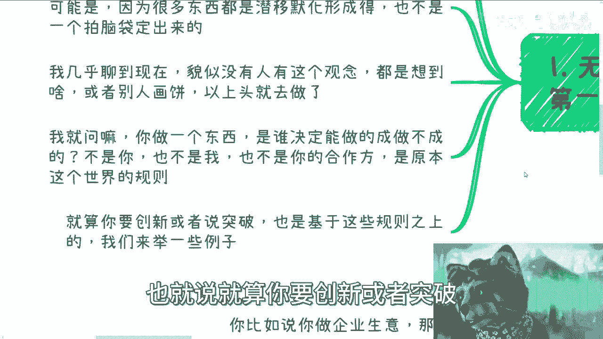

# 再来说下原本存在的商业规则和逻辑是什么 - P1 - 赏味不足 - BV1mQ4y1x7od

好好大家好，我来给大家解释一下，这个我们一直说啊，就是要呃遵循啊，原本的这个存在的商业规则和逻辑啊，呃这个事情我来给大家解释一下，我觉得就很多人到现在为止他是没明白啊。

没明白，第一啊就是说无论我们做什么呢。

这都是我们第一优先教学那个了解的呃，为什么你你就这么想嘛，就相当于说呃你本硕博对吧，读书啊，你读完你对整个的呃上到下里到外的合作逻辑，你是一无所知的啊，你是一无所知的，那么这个时候。

你说我不管你是国内赌还是海外赌，你说我对一个东西毫无了解啊，然后我就我我我你就跟我讲，你说我要去创业了，我要去干了，那不用我说嘛对吧，你自己去想想看你的成功率是什么对吧，这就像一个baby。

然后跟我说啊，我要去清华读书了，有什么区别呢，没有区别的，你没有任何的基础，没有任何的认知，然后你渴望你成功，这怎么可能呢对吧，这就跟我们打游戏，你们了解任何一个东西。

你打游戏之前不得看说明啊啊哪个是跳，哪个是攻击，哪个是滑铲对吧，哪个放技能你不得看哪哦，你什么背景都不看你，你所有技能组合也不看，你所有东西也都不看，你就打，比方说你打王者荣耀对吧。

你说那些世界排名的对吧，或者说打比赛的人家怎么打的，就像你要去打比赛一样，你不得去看别人高手怎么打吗，哦你什么都不了解，你说好，我他妈自己练牛逼对吧，因为什么，因为我们不是规则的制定者。

我们也不是高手对吧，而且每个个体的可能都不是，因为很多东西它是潜移默化形成的，也不是一个人拍脑袋拍出来的啊，我几乎聊到现在，我就发现几乎貌似没有人他有这个观念，就是说他都是想到啥是啥啊，或者说别人画饼。

然后就一上头他就去干了啊，就是那种就是就是你现在一级对吧，什么装备都没有，你说好，然后有个人跟你说两句，你一上头走，我们把对方的这个叫什么水晶跟泉水冲啊，你冲个屁啊，怎么冲啊。

对啊，我就问你做一个东西是谁，决定能做成还是做不成，但不是你，那也不是我，也不是你的合作方，是原本的这个社会或者这个国家，或者这个社会的，而这个世界的一些规则来决定这个东西。

做做不做得成啊，也就是说就算你要创新或者突破。

也是基于这些规则之上的，对吧好，我先来给你们举例子，我把四先提上来。

先举个例子，你比如说你做企业生意，那么你要先去了解企业是什么吧，对吧啊，然后比如说一家50小于50人，小于等于50人企业，他每一年做哪些事情吧，啊然后你要去了解这些事情，哪些是为了完成政府KPI。

哪些是要赚钱做的，哪些是营销做的，哪些是为了秀肌肉做的，哪些是里子工程，你都要去了解吗，有很多人要说了，那我可以不了解你不了解是吧，好可以好可以好，那我就问你做一家企业，是你你围着政府转呢。

还是你围着国家转呢，还是国家政府围着你转，你自己想想看对吧，你不做这些对吧，可以的，没问题的，我就问你钱哪里来，陈大爷来，金主爸爸来嘛，那你去找金主爸爸，你找得到算你本事没问题的啊。

而不是说一上来就说啊，我要买卖产品，卖服务啊，然后呢一顿操作猛如虎，就跟我说啊，我觉得我的产品解决了什么痛点，我觉得我觉得有什么问题啊，我觉得很牛逼，没有用的呀，你觉得牛逼有什么用呢，没有用的呀对吧。

你还有一些小伙伴跟我说要开实体的生意啊，开咖啡馆，开酒吧，开店吧，好没问题啊，我就问你先了解一下实体店，你去了解一下跟你一样这个规模的对吧，比如说什么十个人，20个人位置的对吧，两个小包房啊。

你先去了解一下每年收入如何，但凡真的做的很好的那些到底靠什么赚钱的，你不是说在那边说，哎我发现人家谁做了对吧，一年赚个几千万，那你先去问问看看怎么赚的呢，咳咳对吧，你每年需要打理那些事情。

打理需要花多少钱，回本需要花多少钱等等等，而不是说我现在就开个店啊，然后就跟我说哎呀，我比如说现在年轻人喜欢对吧，在上海这边开个咖啡馆啊，上海人喜欢喝咖啡对吧，怎么样子，没有用的呀。

你这些逻辑我觉得是个普通人都能想得出来，那凭什么你能赚钱呢，一你但凡动点脑子就能明白，对不对啊，包括还有什么，还有做一些业务，它是需要依赖上下游的，你知道吧，就比如说他可能需要依赖一些企业，甚至医院啊。

或者其他机构，那么我就说啊，你们但凡觉得要依赖一些这个机构或者企业的，或者合作的，你就先去聊聊看对吧，你就是说就是说你早晚都是要去聊的嘛，你要做一件事情，你早晚都是要去聊的嘛对吧，那么包括供应商对吧。

包括你说我做咖啡，咖啡豆等等等，那么你先去聊这些机构是否愿意合作，在你的思考当中，这些链路上下游是不是都能走通，你先去试对吧，而不是说你今天想一个东西，然后你就默认哎都能走通的，我一定满足他们需求的。

没有用的啊，我给你们打个比方啊，今天有小伙伴做咨询。

就是的就是他的说法是什么，他说他能够给别人带来流量，那我就问嘛，别人为什么要你这个流量哦，你给别人带来流量，别人就要了，凭什么呢，没有道理的呀对吧，而且我早就说的很清楚了，中国做事情啊。

安全稳定大于一切啊，别别来跟我说钱。

钱不是主要，安全稳定是大于一切的啊，你别什么都谈钱，没谈都谈钱没有用的，你钱再多，你如果不安全不稳定啊。

没用啊，那么好，那么我们来看啊，任何各行各业每一年每时每刻。

其实他都在运作，也都在赚钱，什么意思呢，我们首先要了解的是，政府企业，产业园协会，高校等所有的社会机构或者政府机构，每年在每个领域到底怎么运作的，他们怎么去定KPI的，他们怎么下发任务的。

大概都有什么任务，大概都是什么比例，大概都是怎么交付的，然后怎么汇报的，这个是我们要去了解的，你不了解你怎么做，你告诉你怎么做啊，啊你活在一个社会当中，活在一个规则当中，你说我不了解我他妈自己做。

你怎么做对啊，我们就这样说，不管今天你做什么东西，我做什么东西，这些默认存在的商业逻辑跟利益链路，永远是存在那边的，只不过你不知道，你不知道并不代表它没有对吧，而且我跟你，我们肯定只能围着他们转对吧。

你不可能别人围着我们转的，凭什么呢，很多人会觉得啊，他说我就专门做个C端生意，那这些我不用关心对吧，好我就这么跟你讲啊，你去了解一下什么叫b two b two c。

什么叫b two b two c对吧，他不是一个道理啊，就是你很多时候你的目标也许是C端，你做的可能是C端的生意，但是你在整个商业链路合作关系上下游上面，你还是要跟企业政府挂上钩的呀。

那你依然要去了解呀对吧，而且我们退1万步来讲，你放着很多成熟的模式，不了解人家赚到钱的模式，踩过坑的模式，你不了解，你说我自己想这什么逻辑啊对吧，我就觉得就是就是很多人读书就读的嗯。

让我觉得毫无逻辑性啊，我们要做的就是，尽可能想办法去成为原本，商业链路和闭环的一部分，而不是说狂妄自大的觉得我们不了解这些，我也不用了解我自己就能做出东西来，然后整个社会规则还能接纳我们，你觉得可能吗。

来不可能的呀。

对啊，那么好，有很多人要说了，他说好，我要给你举例子了啊。

饿了么点评对吧，B a t，那首先啊首先我们就这么说，任何一个大厂能做起来，能做到你们整个老百姓都能够听到的，这个大厂的这个level的时候，你觉得他能离得开政府吗，离得开企业吗，啊哦是独立于社会规则。

独立独立于野蛮成长到现在的可能吗，对不了，可能吗，你想想看就知道了呀对吧，你从小到大你真的去做了，做任何一件东西，你从小到大你背后得多少关系啊，多少利益啊，因为这才是世界的原貌啊。

你又不是活在一个乌托邦的理想世界对吧，而且另外一方面，2000年到现在，很多东西的确是百废待兴的，就是的确是很多东西它是有待创新的啊，而且在这个当中其实是呃用户企业，政府大学对吧，四端都是在共同摸索的。

相辅相成的，最后形成了现在很多固定的商业模式跟链路，但是现在没有这些机会了呀，对不对，现在有没有这些土壤的呀，现在还有啥啊，现在几乎很多创新，在我看来可能更多的就是应用上，应用层上的上的创新。

它没有任何的颠覆性，而且在我看来非常多的创新，他是为了创新而创新的，他就是挖空心思在里面瞎搞啊，而不是说真正的满足用户的需求对吧，你你你你说整个很多论文，很多这个这个鼻涕拎出来，这他妈什么玩意儿啊都啊。

所以说现在我觉得大家但凡有去做，不管你几岁啊，我们现在能做的就是先了解这个庞大的系统，然后去介入，去了解你真的要创新，或者说颠覆式的创新没问题，那也是等你了解完了，翅膀硬了，关系硬了再说嘛。

那么你现在就跑出来说，的，老子我要搞一个什么东西，这个东西啊，这个世界上没有的，可能吧啦啊，人人都想做埃隆马斯克，对吧。

更何况海外跟国内的国情还不一样啊，你把埃隆马斯克扔到中国来看看对啊，所以呢就是我跟你讲啊，就是我们就算不做商业。

做任何别的东西也是一个道理对吧，你说你打个比方，你说你要落户口对吧，你要什么买那个学区房，你未来还是要教育对吧，要学习你做任何的安排，这个世界上在你你绝对不是第一个做的，你也不是最后一个做的。

那么你就先去了解大家怎么做的对吧，你一定是选择最优解啊，而不是说你自己拍脑袋哦，我觉得这么做没有用的呀，对了这都一个道理啊，就我就觉得就就大家可能还是年轻对吧，做事情冲动啊，这么一拍脑袋就干啊。

然后不了解啊，就觉得就是说我干了，我就下一个马云，下一个马化腾，这个唉不科学，你知道吧，就是做事情不科学啊，既然就是说我觉得大家读了那么多书，他就应该科学一点啊，好吧，所以我就希望就是说就是说大家明白。

就是世界其实是就是很多不同的东西，在这个地方，而我们要去了解啊，当然了，就很多人要说我怎么了解，那这个就看你们本事了，那怎么办呢，我也不是说每个人都能就百分之百都能了解到，那你说现在为什么信息差。

信息差，他不就是因为这种信息差越来越大吗，对不对，那不大的话，我相信我相信以大家的认知和智商的，也不至于不了解啊，对不对，好吧行，那就先这么着吧啊嗯，嗯对，然后那个16号上海的活动呢。

要来的也可以继续报名，然后其他的话反正有什么嗯合作的，或者说其他的你们想找我合作，或者其他的。

