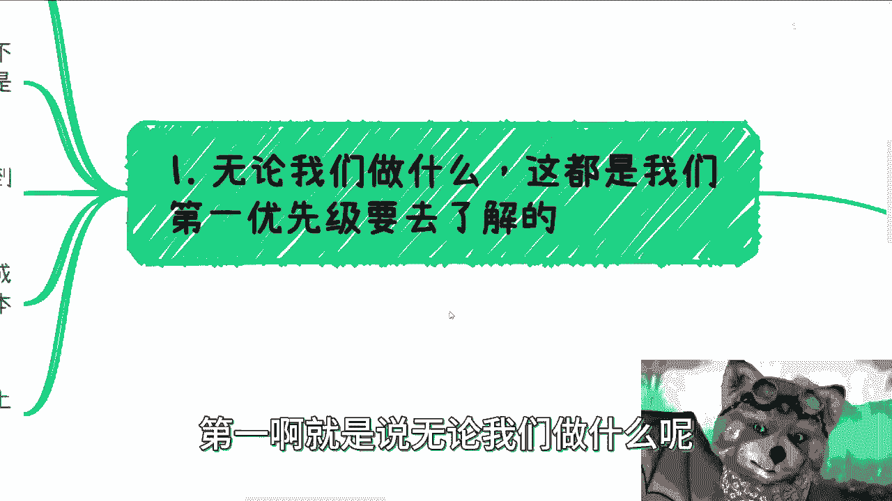
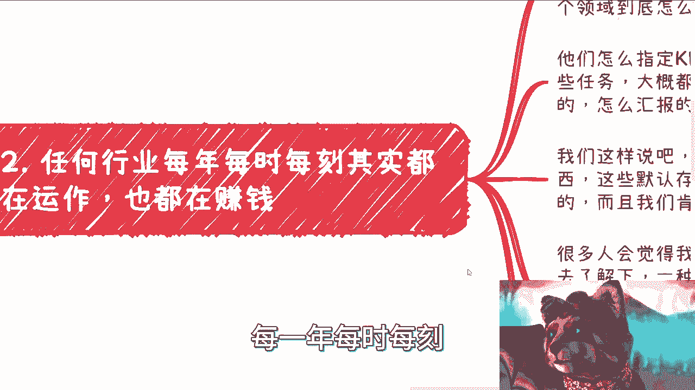
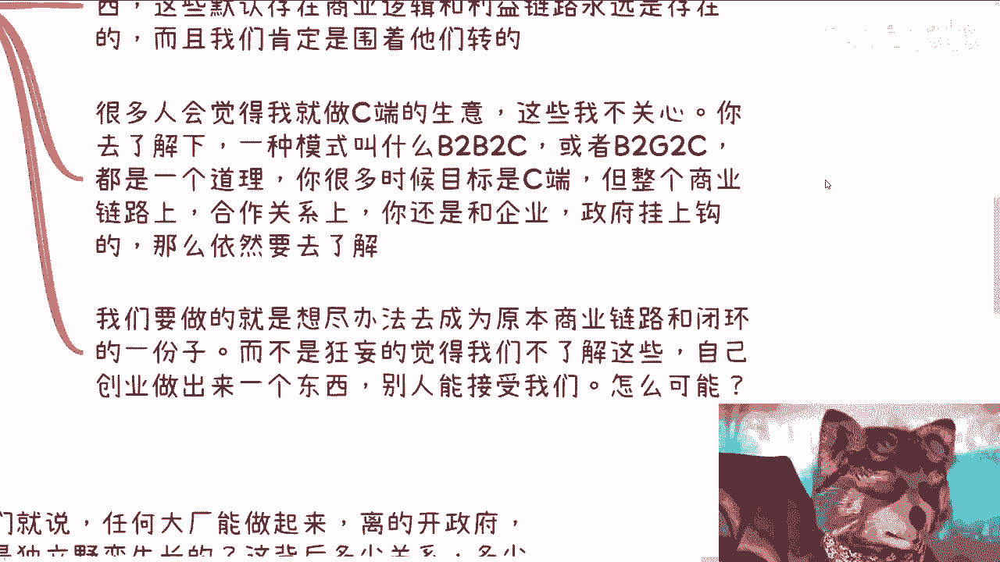
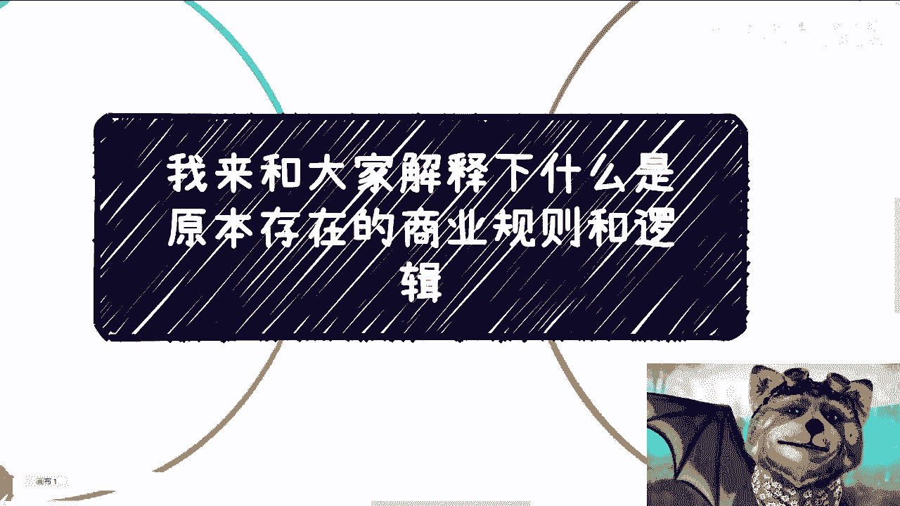

# 再来说下原本存在的商业规则和逻辑是什么---P1---赏味不足---BV1mQ4y1x7od_not




在本节课中，我们将要学习一个在商业活动中至关重要的基础观念：理解并遵循既有的商业规则与逻辑。许多创业或商业尝试的失败，往往源于对现有商业环境、社会规则和运作逻辑的无知。我们将通过具体例子和分析，阐明为何这是成功的第一步。

## 优先理解既有规则

无论我们从事何种商业活动，第一优先事项是理解既有的商业规则与逻辑。这就像一个人从本科读到博士，如果对行业的上下游合作逻辑一无所知，那么无论在国内还是海外创业，成功率都极低。这如同一个婴儿声称要去清华大学读书，缺乏必要的基础和认知。

在游戏中，玩家需要先了解操作说明、技能组合和高手策略。商业世界同样如此。我们并非规则的制定者，许多规则是长期潜移默化形成的，并非个人拍脑袋的产物。然而，许多人缺乏这个观念，常常想到什么就做什么，或因为他人“画饼”而冲动行事。

**核心公式：**
```
成功概率 ∝ 对既有规则的理解深度
```

## 规则决定成败


决定一件事能否做成的，往往不是创业者本人或其合作方，而是社会、国家乃至世界的既有规则。即使要进行创新或突破，也必须基于这些规则之上。


上一节我们强调了理解规则的重要性，本节中我们来看看规则如何具体决定商业活动的成败。


### 以企业运作为例

如果你计划开展企业级生意，首先需要了解企业的基本运作。例如，一家少于或等于50人的企业，每年需要完成哪些事项？这些事项中，哪些是为了满足政府KPI，哪些是为了盈利，哪些属于市场营销，哪些是“里子工程”？你必须了解这些。

许多人可能认为无需了解。那么，请思考：是企业围着政府和国家的规则转，还是国家政府围着你的企业转？如果不遵守这些规则，资金从何而来？除非你能找到愿意承担风险的投资人。

许多人一上来就谈论买卖产品或服务，认为自己的方案解决了某个“痛点”，但这往往没有实际作用。你觉得“牛逼”并不重要，关键是规则和市场是否认可。

### 以实体生意为例

计划开设咖啡馆、酒吧等实体店？以下是需要优先了解的步骤：

1.  **调研同行**：了解与你规模相近（如10-20人规模、带两个包间）的店铺，其真实年收入情况。
2.  **分析盈利模式**：研究那些真正做得好的店铺，靠什么核心方式赚钱。不要只看表面现象。
3.  **计算成本与回本**：清楚了解每年需要打理的事项、相关费用以及投资回报周期。

不要仅凭“年轻人喜欢喝咖啡”或“上海咖啡文化盛行”这类浅显逻辑就贸然行动。这些是普通人都能想到的，不足以构成你的竞争优势。

### 以依赖上下游的生意为例


许多业务依赖于上下游企业、医院或其他机构。如果你计划开展此类业务，必须提前验证合作可行性。


以下是关键行动步骤：


1.  **提前沟通**：尽早与潜在的机构、企业或供应商进行沟通。
2.  **验证链路**：在你的构想中，整个商业链路是否都能走通？必须通过实际接触来验证。
3.  **摒弃假设**：不要默认所有环节都能自然满足你的需求。例如，提供流量服务的咨询业务，需先问“对方为什么需要你的流量？”



在中国，做事情的首要原则是 **安全与稳定大于一切**。不要只谈钱，如果业务不安全、不稳定，拥有再多资金也无用。

## 洞察系统运作规律

任何行业每时每刻都在既定规则下运作和盈利。我们要做的，是洞察这个庞大系统的运作规律。

上一节我们探讨了规则在具体业务中的体现，本节我们将视角提升，学习如何系统性地洞察商业环境的运作规律。

我们需要了解的是：政府、企业、产业园、协会、高校等所有社会或政府机构，在每个领域是如何运作的？他们如何制定KPI、下发任务、进行交付和汇报？比例如何分配？这是我们开展商业活动前必须了解的背景知识。



只要生存在社会中，这些默认存在的商业逻辑与利益链路就永远存在。你不知道，不代表它不存在。我们只能主动去适应和融入这个系统，而非让系统来适应我们。


有人认为只做面向消费者（C端）的生意就无需关心这些。但请了解 **B2B2C** 模式。很多时候，你的最终用户虽是C端，但在商业链路中，你依然需要与企业或政府端打交道。因此，你仍然需要了解系统规则。


放着成熟的、已验证能赚钱或踩过坑的模式不去了解，却执着于自己空想，这是缺乏逻辑的表现。我们要做的，是尽可能想办法成为**原有商业链路和闭环的一部分**，而不是狂妄地认为自己可以在不了解规则的情况下创造新事物，并期望被社会规则接纳。这是不可能的。

## 关于创新与现实的思考

许多人会举出饿了么、美团或BAT（百度、阿里巴巴、腾讯）等成功案例。但任何能做到家喻户晓级别的大厂，都不可能脱离政府、企业和社会规则而“野蛮生长”。它们的成长背后是复杂的关系与利益网络，这才是世界的原貌。

从2000年至今，许多领域的确处于百废待兴的状态，用户、企业、政府、高校四方共同摸索，相辅相成，形成了许多固定的商业模式与链路。然而，当下的市场环境已不同往日，那种颠覆性的创新土壤已大大减少。

当前许多所谓的“创新”更多是应用层上的微创新，甚至是为了创新而创新，挖空心思“瞎搞”，并未真正满足核心需求。许多商业计划书或论文中的构想脱离实际。


因此，无论年龄大小，我们现在能做的首先是**了解这个庞大的系统，并尝试介入**。如果你渴望颠覆式创新，那也应该在深入了解规则、积累足够资源和实力之后再进行。在毫无基础的情况下宣称要创造一个世界上没有的东西，人人都想成为埃隆·马斯克，这是不现实的。更何况，海外与中国的国情截然不同。


这个道理同样适用于商业之外的领域，例如落户、购买学区房、子女教育等人生规划。世界上总有前人实践过，你绝非第一个也非最后一个。你应该先去了解通用的、最优的解决方案，而不是自己拍脑袋决定。

## 总结与行动建议

本节课中，我们一起学习了理解并遵循既有商业规则与逻辑的重要性。我们探讨了规则如何决定具体业务的成败，如何系统性地洞察商业环境，以及对创新应有的现实态度。

**核心总结如下：**
1.  **成功基础**：深入理解既有规则是任何商业尝试成功的先决条件。
2.  **系统思维**：商业活动存在于一个由多方机构构成的复杂系统中，必须主动了解并融入。
3.  **现实创新**：真正的颠覆性创新应建立在深刻理解现有系统的基础之上，而非凭空想象。
4.  **科学方法**：做事情应讲究科学方法，通过调研、验证来替代冲动和臆想。

信息差始终存在，并且可能越来越大。克服它的方法，就是主动去学习和了解你所在领域的“游戏规则”。这需要付诸行动，而非空想。



---
*注：本教程根据原视频内容整理，旨在提炼核心观点与方法论，供初学者建立正确的商业认知基础。*