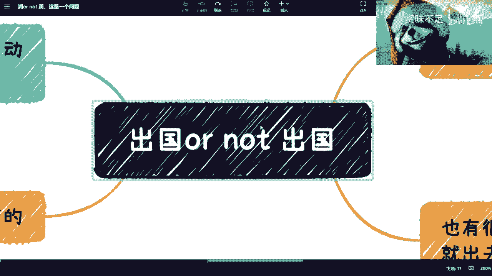
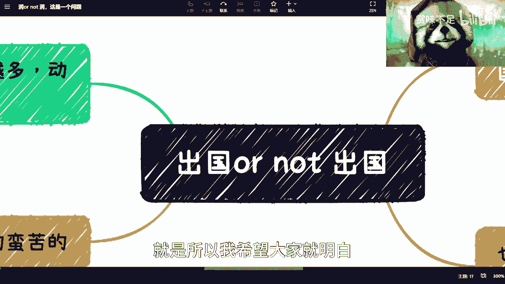
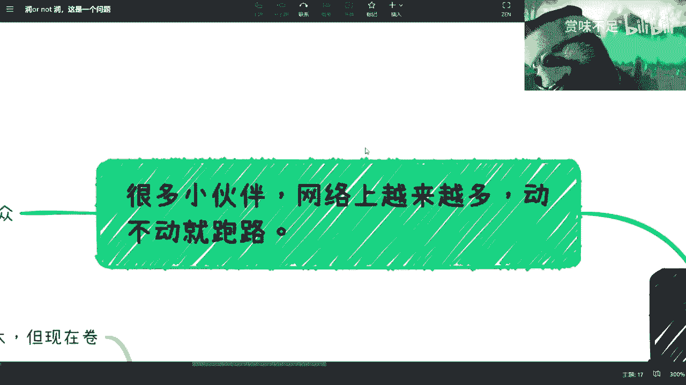
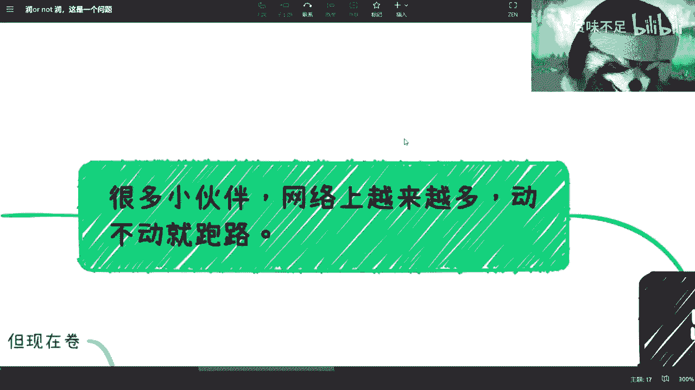
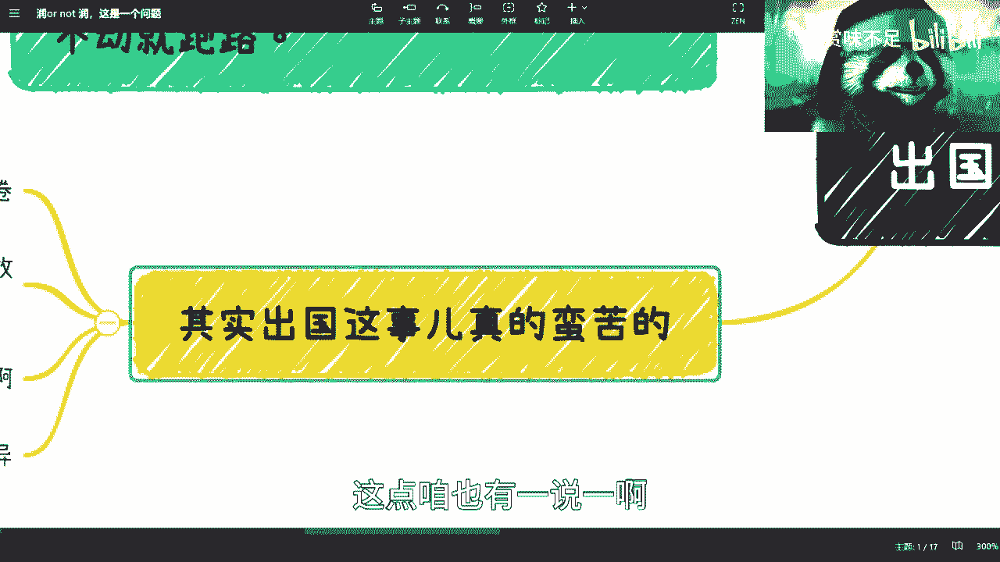
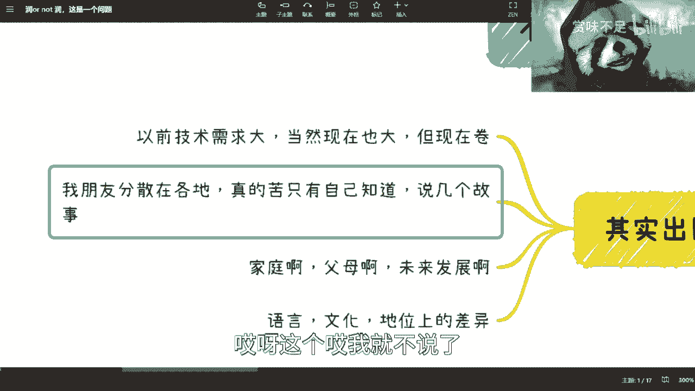
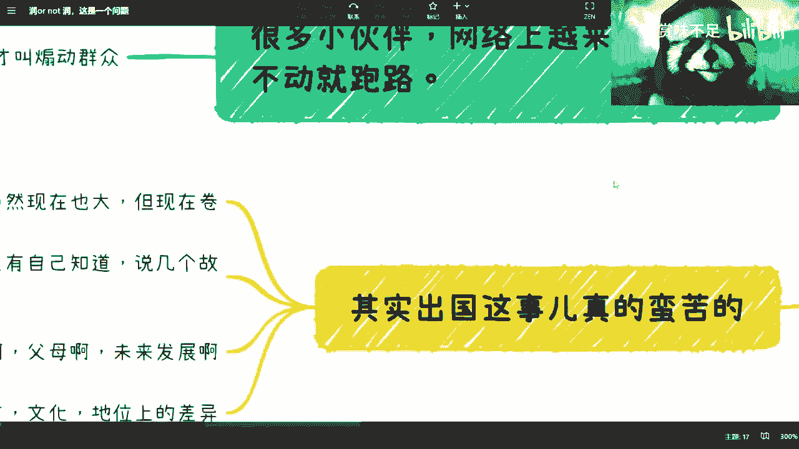
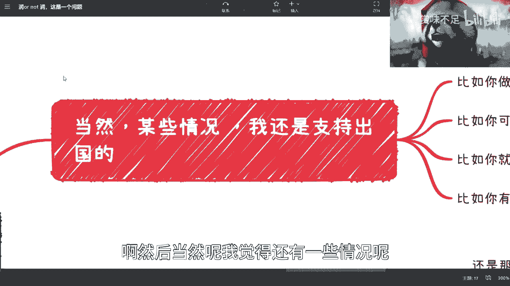
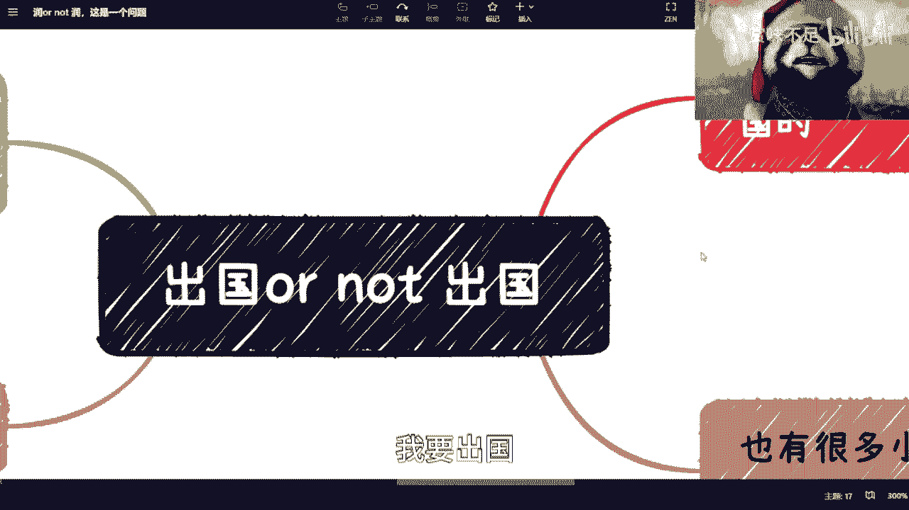

# 出国or not 出国，这是一个问题 - P1 - 赏味不足 - BV1Fc41177N4

好我看到很多小伙伴很关心这个问题啊，我就这个单独来说一下，然后也有很多小伙伴说，之前那个小小丑太丑了是吧。

我们把它换掉换掉换掉。

你们看我这个标题对吧，是这么写的啊，但是呢我b站上肯定就是这么写的对吧，我不太敢这么写啊，呃出国和不出国呢，我觉得是这样子的。

首先我觉得先说个大前提啊，我待会跟大家也说一下我几个朋友的故事。

就是先说个大前提，大前提是什么呢，就是所有的观点啊，它不是一成不变的，就是你们想想看啊，你们以前这个很多人会听说什么呢啊，互联网薪资很高对吧，就是钱多活少，死得快对吧，然后呢这个也有很多人说呢。

这个出国啊，出国怎么样怎么样怎么样怎么样啊，呃我觉得是这样子的，首先啊我觉得有个大的观点，大的观点是什么呢，就是呃你们尽量不要去相信网上的东西，因为为什么呢，因为呃我们随便讲啊。

就是比如说你们今天有100个人，100个人都出国了，出国了，你们出国，不管你们就是对外怎么讲，我相信过程总是艰辛的，不会一帆风顺的啊，然后这个钱呢，我估计也是说大家有，这个就是可能比如说父母赞助啊对吧。

各种支持一点啊，怎么样子的啊，那么你们想想看啊，其实出国这件事情，虽然现在海外的华人技术是比较多了，但是相对整个技术来讲，它还是这个比较少的对吧，那么我们说啊就是人呢，大部分啊他其实都有一个怎么说呢。

这种就是炫耀对吧，或者说这个这个这个你说炫耀也好吧，你说就是自我麻痹也好吧对吧，各种原因，他总归是总肯定是希望自己过得好一点的对吧，再加上现在这个小红书啊对吧，b站上面啊。

动不动就是什么什么年薪百万对吧，然后要么就是什么25岁财务自由对吧，要么就是说啊我在海外的生活对吧，每天就是名媛名这个富婆的生活对吧，就是啊就整个网络舆论和风气就这个样子，那么你其实会觉得。

就是说有时候哪怕你过得蛮好的对吧，你可能都会觉得你过得不好，所以说呢其实你会发现啊，就是大部分的人呐，就是他并不是说那你说网上的啥是真实的吧，是真实的，但是他并没有，只是说啊，我只告诉他们啊。

我只告诉大家一个就是说真实的一面，而是说我只告诉大家好的这一面，那不好的不会说对吧，那你说你用换句话来讲，你说我做这个这个区块链对吧，或者我给这个企业啊，政府啊做咨询对吧，那一样的呀。

你说我是我是不愿意跟大家说不好的吗，不是我是不敢在网上说不好的对吧，我跟你们讲，我今天但凡在微博上或者在b站上面，我不说，我不说视频啊，我比如说但凡比如说有个状态对吧，我说了一些不好的，我跟你们说。

我早上说下午网线吧就能打电话来对吧，就这就这个情况啊。

那我们回到这边啊，说这个出国不出国的事啊。

就是所以我希望大家就明白，就是说出去呢都这个很波折的啊。

不要觉得就好像啊对吧，然后因为现在很多小伙伴呢。

网络上面越来越多对吧，但你会发现反正动不动就你润对吧，你跑啊怎么样，不是不是就是这个事是这样子的，这又不是说对吧，你认了你就所有东西，现在比如说你现在都是叠buff，满身的叠满debuff，你认了对吧。

你你你叫什么原地满血满状态满状态复活，不可能的呀，你说是吧啦，就是你用你的膝盖想想就知道不可能啊。

是吧啊，所以呢我觉得我我觉得这才叫山东群众啊。

这个我之前疫情的时候说了很多事实对吧，这个还被民警上门说我煽动群众啊，我他妈也是绝了，哎呀是吧啊，我觉得就是说你们一定要理性看待这个问题，而且这是第一点啊。

第二点呢，其实我跟你们讲，出国这事是蛮苦的，因为什么啊，我倒不是说现在年轻人越来越玻璃心啊，而是我觉得大家抗压能力的确不如以前啊，的确不如以前，因为这个事，我以前哎我以前其实其实跟别人讨论过。

我说这个事儿呢，你得客观的看，什么意思呢，因为以前呢我觉得很多人，比如我们父母这一代啊，或者再上一代啊，就可能都是苦日子过来的，所以他们也不觉得说啊，有什么抗压不抗压的事情啊，我觉得现阶段是什么呢。

现阶段就是说呃，一方面抗压能力可能是降低了啊，第二方面呢，我是觉得就的确现在的压力也比以前大，就是以前的确没这么卷啊，这点咱也有一说一啊对吧。

所以说呢我是觉得呃这个有几点啊。

就是第一个呢就是以前对吧，因为现在有很多人说，我要出去都是什么技术移民对吧，技术这个这个工作签啊，但是呢我跟你们说啊，就说以前还是那句话，以前技术需求大对吧，以前的基数少啊，这些都是客观原因。

你说现在大不大也大，但是你要明白现在人很多，你知道吧，因为时代是在进步的，你千万不能拿，比如说前几年的这个这个观点套到现在去，就我跟你讲，你们现在去澳大利亚，去加拿大，去新西兰，去去去硅谷对吧。

去那个啥新加坡香港，哎呀我跟你们说，抬头不见低头见对吧，十个人里面起码有6~7个都是华人，你卷你一样的，你换个地方卷有什么区别呢，对不对啊。

当然你要是财力足够强，那随便对吧，然后呢我我先说下面啊，就是第二点呢，就是你考虑这个事呢，你不能以节点来考虑，就是你还得长远考虑，因为你出去又不是说出去旅游，你说是吧，你出去这么一两天回来了。

不可能的是吧，你你你你出去你还得想好，就是说呃未来的发展啊，包括这个这个家庭啊，父母啊对吧，各种各样的东西你得去想它是吧，你你你啊，这个是那个还有呢就是这个语言文化，我跟你们说。

哎呀我跟你们讲这个事儿呢，我也真的是也也无济无语了，就是就是你要明白啊，就是有很多人这个电视剧啊，电影上面都说要叫叫什么，我命由我不由天对吧，叫逆天改命，对不对，不是这个话没有错啊，但是你你要这么想。

你在一个你的土地上，你土生土长，你的文化相对还match的这么一个地方，你可能都比较吃力对吧，我客观的说啊比较吃力，你说你去了一个语言不通，甚至文化不一样，甚至你在华人。

在当地地位都不如你在中国的这么一个情况下，面，你说我能够满血满状态，满满全身的这个buff加满，然后满血复活，你觉得你会信吗对吧，你觉得我会信吗对吧，我我我信不信不重要，你自己都不信是吧啊。

所以说呢我说啊就是这个事儿，要考虑好真的考虑好这个这一步其实蛮大的，它不像说你转个行对吧，换换个岗位，这一步蛮大的，嗯然后我跟大家说一下这个故事吧，就是因为我很多朋友在外面嘛，在外面我真是说实话啊。

就是呃孤独肯定是孤独的啊，而且就是很多时候也不那么安全啊，也不那么安全，因为相对来讲，我觉得中国治安的确还是很好的啊，还是很好的，那么这是第一点，第二点呢就是说你会有很多时候，你觉得你的父母。

因为每个人家庭不一样嘛，你会觉得你的父母啊，你的亲朋好友啊，不那么支持你，或者不是说不支持你吧，不理解你，就是就是因为你的很多的文化啊，语言啊，很多的一些经历啊，其实跟大家呃是有一定的这个差异化的。

但是我觉得差异化并不重要，重要的是可能你的上一辈对吧，你的这个家庭这里面的一些这个清洗，他可能不理解，那么慢慢慢慢的你就会觉得心很累，你知道吧，然后嗯这是一块，然后另外一块呢。

就是说你很多时候你没有人可讲，因为很简单嘛，就是你并不知道谁会坑你，而且其实在外面哎我怎么说呢，就是很多都是自己人喜欢坑自己人对吧，我我这个也不太好说啊，但是呢就是说的确你有很多东西呢。

你不知道从这个找谁倾诉，你说我有很多朋友吧，就是我们其实也不太联系，可能美国两三周啊，一个月可能会联系一下，然后一打电话呢嗯打了可能两三个小时，但是呢其实你就会发现就是从我个人了。

其实我就会发现就是说大家既然聊了对吧，其实他也没必要一直跟我说，他多苦多苦，你说了也没用对吧，但是呢可能更多的是需要有一个人聊，就是大家能够诶就是就是有有的没的对吧，就扯扯淡啊。

然后可能聊些有的没的也开心，开心就调解调解情绪，你知道吗，因为在外面我是我，我个人总结啊，我是觉得在外面比在国内还要压抑，而且压抑的很，就是这种压抑可能是不一样的，你知道吧。

所以呢我是觉得大家别把这个事儿想的，就是说嗯好像是一根救命稻草，这个真不是啊，真不是你们听我一句哦，就这个事情没有这么多的这个这个这个叫什么，就是好处在这里面，嗯那当然啊就是话又说回来啊。

就是咱不是劝退啊，就是如果你有你自己的规划对吧，你你你，你觉得你这个暂时，比如说23年不想在国内卷对吧，你说我出去读个书，那我觉得还是ok的啊，那是ok的，这我觉得问题不大啊，问题不大。

而且而且我是觉得吧有很多人我聊下来啊，其实我会发现他们的dna，就他们的这个性格风格就适合在国外，你知道吧，因为什么呢，因为哎呀这个哎我就不说了。

不知道怎么说。

啊就简单来讲，就是他们在国内肯定要被坑死的啊，就这么回事，那在海外吗还好一点啊。

就这样啊，然后当然呢我觉得还有些情况呢我是蛮支持的。

你比如说啊你比如说你说你要去做web 3对吧，因为之前有很多这种新加坡啊，或者说呃香港啊，然后深圳啊这些小姐姐对吧，打电话给我，因为大大二大三吧，然后就说要去做web 3，我说是这样子。

你真的想要去做web 3啊，记住啊，web 3不是互联网三点啊，web 3是我们说的以区块链为底层的，公链的生态啊，公链的生态，那么我说你但凡去做web 3，你就必须出国，为什么，因为你很简单啊。

你有很多东西不是法律和不回归的问题啊，你是要录就是要两只脚踏进去对吧，你要入圈，那这个圈在哪里呢，圈肯定不在国内啊对吧，你在国内做可以吗可以，但是你在国内永远是那种隔岸观火，观观火的对吧。

那那你做个屁啊，这个永远是边缘地带，你不被骗就不错了对吧，那这是一块，第二块就是说你觉得你可以去藤校卷，那我觉得也可以啊，我我见过有些学霸的去藤校卷，可以的，那你去卷吧是吧，然后第三个呢。

就比如说你说你很想当老师或者做科研，我觉得这一点呢在海外是很好的，而且我跟我的小伙伴说，他们只要做科研，做老师的千万别回来啊，因为唉这个怎么说呢，对吧，你要做的是科研啊，这个对吧，这个第三个啊。

第四个呢，就是说你你要是海外有些特别的赚钱渠道，你说我在非洲啊，开慢啊，迪拜啊对吧，我有我有认识的很好的人对吧，我又有资源，比如说跨境贸易啊对吧，这个这个文化这个叫什么文文化呃，输出啊对吧等等等。

那如果有那最好了对吧，那那完全没问题啊，我国非常支持对吧，去割外面的韭菜对吧，这个毫无疑问的不要割自己人就可以了啊。

我觉得这个一点问题都没有，但是你们得想好，你们有没有对吧。

我觉得真的很多人就一一冲动，你知道吗，我就觉得卧槽，这国内不行了。

我要出国，你出国也不行，我跟你讲啊，然后呢，就是还有很多小伙伴呢说我取个中间状态啊。

就是我出去一会我再回来，你知道吧，就我跟你讲还是这个问题，你做就是我跟你讲啊，你读什么并不重要啊，你你读个学历，什么学历也不重要，你回不回来，我觉得也不重要，重要的是你读完你到底做什么对吧。

你你你我跟你讲，大部分人没想明白，到海外读了3年之后回来回来发现诶，我3年前面临的问题，我3年后还是面临这个问题，你有什么区别对了，我给你们讲，单靠学历和名头在以前是吃得开的，为什么。

因为以前没有这么卷，以前没有这么大的基数，你现在出去一看，我跟你说，昨天晚上我还在跟我朋友讲了对吧，你不是一个m i t辍学的，你都不好意思说自己做web 3呢对吧，你真的是，啊所以这个是第二个吧。

第三个呢我觉得呃国内的崇洋媚外是有的啊，但是这个事情也是看时代的，看看时机的，因为现阶段我不是跟大家讲了嘛，对吧，就是老百姓企业端，政府端都没钱，大家都只会把钱放在刀刃上面，什么叫刀刃上。

刀刃上面就是说能干活，性价比高，你知道吗，不是说我需要一个能干活，然后每每个月问我要10万块钱的一个高材生，说难听点，除非是卡脖子的技术，别的我要他干嘛，我是吃饱了，撑在前面地方用嘛，是不是对吧。

我跟你说，还是那句话，大家都是聪明人，没有就是很多时候在钱这件事情上面，没有人就是太这个这个看不明白，你知道吗，最多就是看破不说破的问题哦好吧，所以说这个希望大家这个考虑考虑清楚啊。

不要太想的太那个啥嗯好吧。

