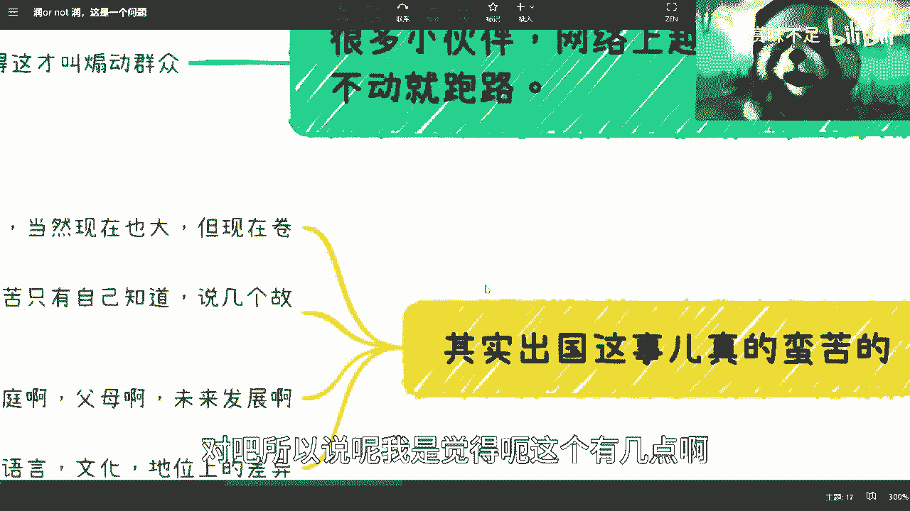

# 出国or-not-出国-这是一个问题---P1---赏味不足---BV1Fc41177N4

在本节课中，我们将要学习如何理性看待“出国”这一重大人生选择。我们将分析网络上关于出国的片面信息，探讨出国的真实挑战与长期影响，并梳理哪些情况适合考虑出国。核心目标是帮助你建立客观、全面的认知，避免因冲动或信息偏差而做出不合适的决定。

---

上一节我们提到了网络信息的片面性，本节中我们来看看关于出国选择需要理解的核心前提。

## 核心前提：观点并非一成不变 📜

所有观点都不是一成不变的。例如，过去人们常说互联网行业薪资高，或者出国前景好。但时代在变化，这些观点需要重新审视。

一个重要的宏观观点是：尽量不要完全相信网络上的信息。

**原因在于**：假设有100个人出国，过程总是艰辛的，不会一帆风顺。经济上也可能需要家庭支持。虽然海外华人技术群体在增长，但相对于整体技术人群仍是少数。

大部分人都有展示自己生活美好一面的倾向，尤其是在社交媒体上。网络风气容易让人产生错觉，即使自己过得不错，也可能感觉不如他人。

网络上展示的信息往往是**选择性真实**，只展示好的一面，而不会展示不好的一面。以我自身为例，如果在网上提及某些领域的负面信息，可能会立刻接到相关部门的电话。

---

理解了信息环境后，我们回到“出国与否”这个具体问题本身。

## 出国的现实：过程波折，并非捷径 🛣️

我希望大家明白，出国过程很波折。不要觉得这是一条轻松的道路。

现在网络上流行“润”（run）的说法，但这并非一个能解决所有问题的“万能Buff”。现实不是游戏，不可能让你“原地满血满状态复活”，这用常识思考就能明白。

大家必须理性看待这个问题，这是第一点。

---

认识到出国的挑战后，我们来具体分析这些挑战体现在哪些方面。

## 挑战一：个人抗压能力与环境压力 😰

第二点，出国本身是一件艰苦的事。

这并非指责年轻人抗压能力弱，而是需要客观看待：一方面，现代人的抗压能力可能不如从前；另一方面，现在的社会压力也确实比过去更大，竞争更激烈。

以下是需要考虑的几个具体方面：

*   **竞争全球化**：以前技术需求大，人才基数少。现在需求依然大，但竞争者也更多。在澳大利亚、加拿大、硅谷、新加坡等地，华人技术群体庞大，竞争同样激烈。这无异于“换个地方卷”。当然，如果财力足够雄厚，则另当别论。
*   **长远规划的必要性**：出国不是短期旅游，需要考虑未来发展、家庭、父母、语言文化适应等长远问题。这一步跨越很大，不同于转行或换岗。
*   **语言与文化隔阂**：在一个土生土长、文化相对匹配的地方生活都可能感到吃力。如果去到一个语言不通、文化不同、甚至华人地位不如国内的地方，期待“满血复活”是不现实的。这一步需要慎重考虑。

---

除了客观环境，出国后的主观心理感受也是一大挑战。

## 挑战二：孤独感与心理压抑 😔

根据我在海外朋友的经历，出国后普遍面临以下心理挑战：

1.  **孤独与安全**：孤独感是必然的，且海外一些地区的治安可能不如国内。
2.  **亲友的不理解**：由于经历和文化差异，家人或亲朋好友可能不理解你的选择和感受，这会让人心累。
3.  **缺乏倾诉渠道**：在海外，人际关系需要更加谨慎，很难找到可靠的倾诉对象。很多时候，压力只能自己消化。
4.  **独特的压抑感**：在海外可能比在国内更感到压抑，这是一种不同的、更深层次的压抑。

因此，不要把出国想象成一根“救命稻草”，它并非充满显而易见的好处。

---

当然，我们并非一味劝退。在特定目标和规划下，出国仍然是合理的选择。

## 哪些情况适合考虑出国？ ✅

如果你有自己的清晰规划，出国是可行的。例如，如果2023年不想在国内卷，选择出国读书，这没有问题。

有些人天生就更适合海外环境，他们在国内反而容易“被坑”。

以下是几种我比较支持出国的情况：

1.  **投身Web3领域**：如果你想真正从事以区块链为底层的公链生态（Web3），就必须出国“入圈”。在国内永远处于边缘地带，容易被骗。
    *   **核心概念**：`Web3 = 基于区块链的公链生态`
2.  **进入顶尖学府深造**：如果你是学霸，有能力去藤校等顶尖院校竞争，那可以去。
3.  **从事科研或教职**：如果立志于科研或当老师，海外环境通常更好，建议留在海外发展。
4.  **拥有特殊的海外资源或渠道**：例如在非洲、迪拜等地有可靠的跨境贸易、文化输出等资源和人脉，可以去开拓市场。“去割外面的韭菜”没有问题。

**关键在于**：你必须想清楚自己是否具备上述条件。很多人只是一时冲动，觉得国内不行就想出去，但出去后可能发现同样面临困境。

---

最后，我们需要探讨一个常见的中间路线：出国深造后再回国。

## 关于“出国再回国”的思考 🔄

很多小伙伴考虑“中间状态”：出国一段时间再回来。

这里的关键问题在于：**你读完书后到底要做什么？**

很多人没想明白，出国留学几年后回来，发现面临的问题和三年前一模一样。单纯依靠“海外学历”这个名头，在当今时代已经不像过去那样“吃得开”。

原因如下：
*   **竞争加剧**：过去人才基数小，海归稀缺。现在竞争激烈，一个MIT辍学生都可能觉得在Web3圈里不够突出。
*   **务实主义盛行**：当前环境下，无论是企业、政府还是个人，资金都更紧张，大家只会把钱花在“刀刃上”——即性价比高、能直接创造价值的人身上。除非是卡脖子的关键技术，否则不会为单纯的名校光环支付过高溢价。

国内的“崇洋媚外”现象依然存在，但已大不如前，且非常看重时机。在钱的问题上，大家都很清醒。

---

本节课中我们一起学习了如何理性分析“出国”这一选择。我们强调了网络信息的片面性，剖析了出国面临的现实挑战与心理压力，列举了适合出国的几种具体情况，并对“出国再回国”的路径进行了冷静评估。核心在于，任何重大决定都应基于全面信息、长远规划和清晰的自我认知，而非一时冲动或对“捷径”的幻想。希望本课能帮助你更客观地思考自己的人生道路。