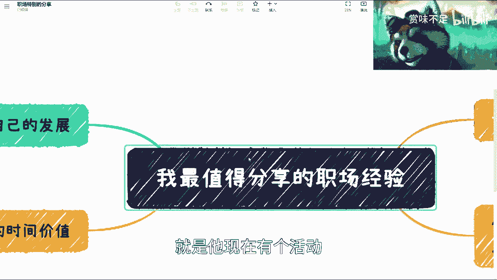
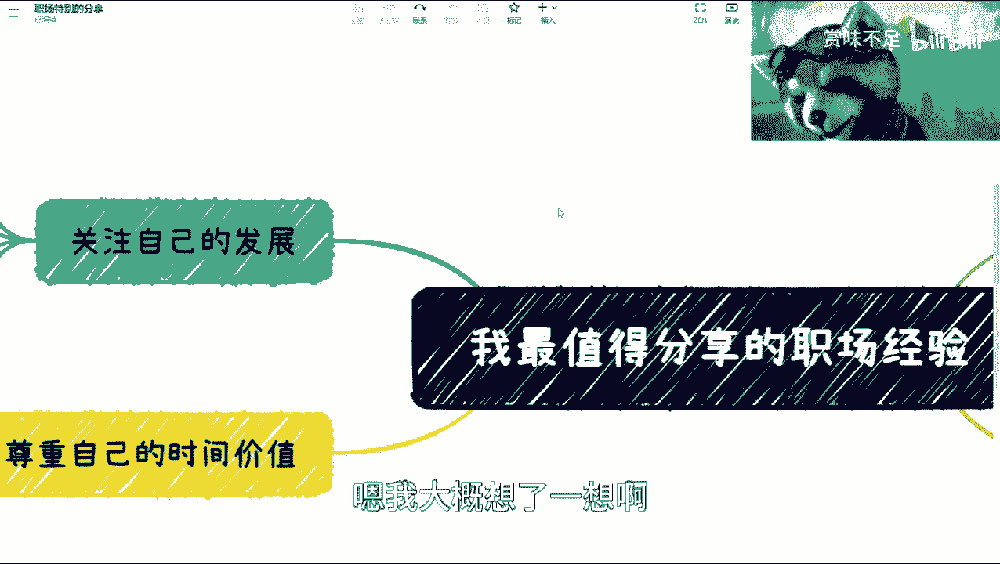
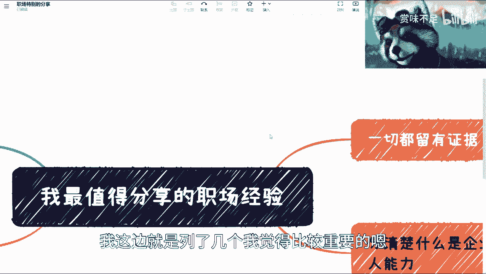
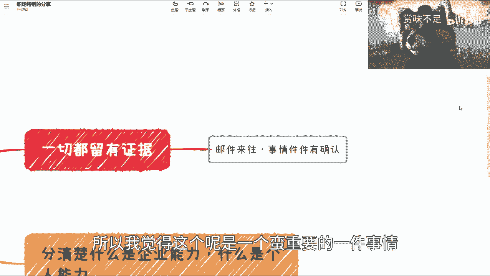
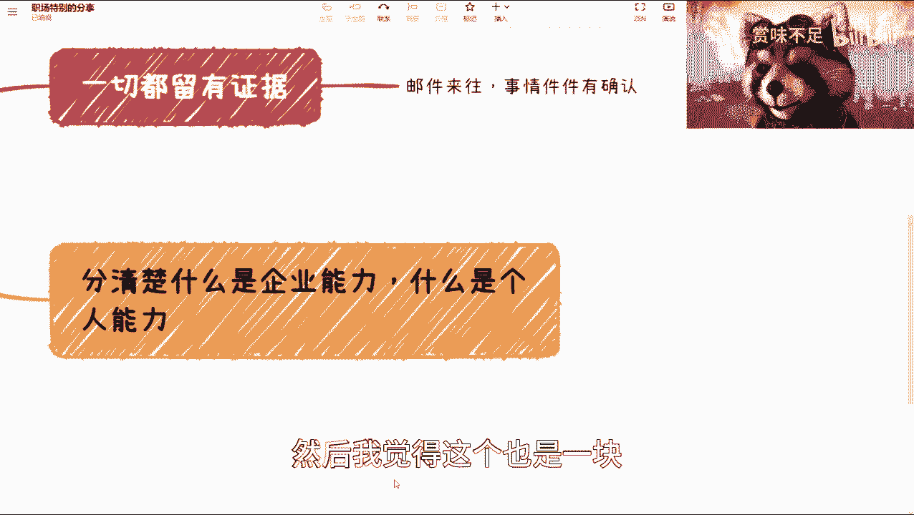
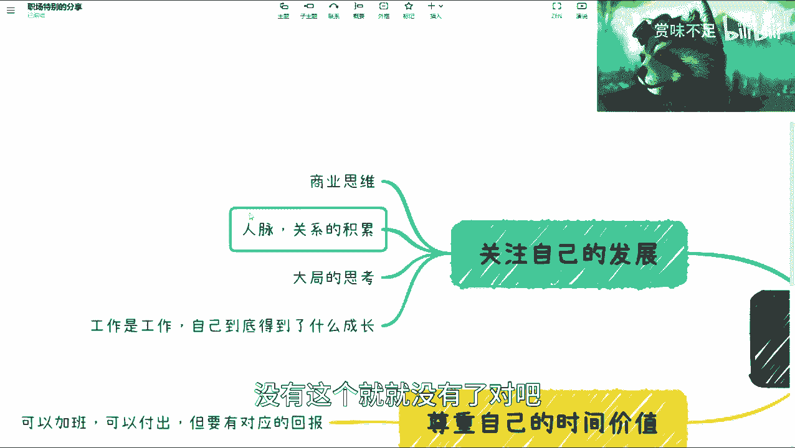
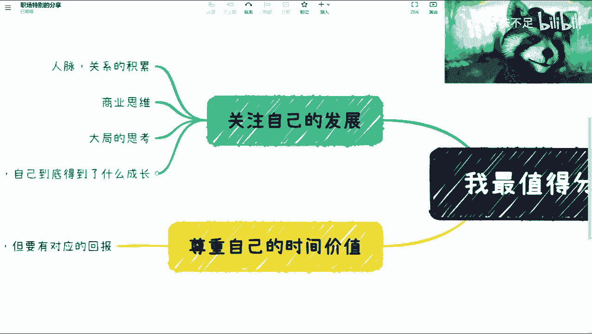
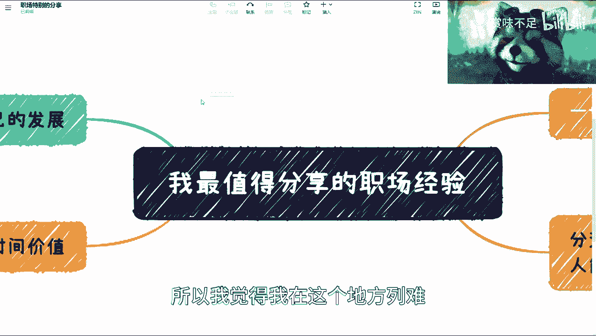

# 分享下大家在工作上最最最需要关注的点 - P1 - 赏味不足 - BV1QM411Y7Cj

好啊，然后我看到正好b站有这么一个活动啊。

正好我因为最近也在谈这个事情呃。

我就另外再开一期啊，另外再开一期说一下，就是他现在有个活动。

叫我最值得分享的职场经验对吧，我大概想了一想啊。

呃核心就那核心就那么几个啊，然后你说什么，这个向上管理向上管理啊，然后像什么嗯什么什么呃，什么企业内的沟通啊，什么什么人际关系啊，这种我觉得都我都不关心，因为什么呢，因为，从整个这个发展上面来讲呢。

我觉得这些都是小事情啊。

都不是那么重要啊，我这边就是列了几个我觉得比较重要的。

我从这边开始讲吧，呃这两个比较简单啊，第一个呢，就是说我觉得一切都要留下这个证据对吧，但是呢这个地方呢我需要。

咳咳咳，就我希望大家呃明确一点是什么呢，就是虽然我说比如说邮件啊，或者说微信啊，或者其他方面对吧，但是啊并不是说所有的琐事你都要去做确认，你所有的细节都去做确认，其实你这个是在甩锅哦，我举个例子。

就比如说你今天写个公众号对吧，你说哎你看啊这个里面内容对吧，大概是怎么个写法啊，你确定了对吧，你确定比如说这里面一定要带上谁谁谁谁啊，怎么样子，就说你可以写完，最终去确认，你没必要一开始说啊。

我每一个细节都去确认对吧，你所有的细节都去确认，其实你就是在甩锅哦，那么在这个地方呢，我觉得就是说但凡呃就是从长远考虑的话呢，我觉得这些都不是很大的问题，我们只需要对这个结果去负责。

但这个负责呢并不是说我要去甩锅，而是说我做完了整个一套事情，我需要给我的manager，或者说这个这个mental去做一个确认对吧，那么这个呢一方面是说，为了更好的明确这个结果，第二方面就是说在咳咳。

其实在这个上下级的关系里面，其实大部分的时候呃，并不是说他就一定想的比你周到，或者他就一定做的比你好，而是说他跟你所掌握的信息是有信息差的对吧，那么你给他确认，其实它是能够从他的这个视角来看哦。

这个结果o o k对吧，所以我觉得这个呢是一个呃蛮重要的一件事情。

所以我也把它列在这个里面啊，然后这是一个第二个呢，就是我觉得这个是很重要的，就是说你得去分清楚哪些是企业能力对吧，哪些是个人这个能力啊，因为嗯很简单嘛，就是现在不管是做开发。

做测试还是做这个叫呃产品经理啊对吧，还有做这个销售啊等等等啊，其实嗯很多时候你的这个做的顺也好，做的不顺也好，都是跟你的整个大局，这不是跟你的大局啊，跟你所在这个企业的整个的管理啊。

包括它的发展是有关系的，包括你的团队的这些成员也是有关系的对吧，也就是说你得去呃分清楚啊，你得去分清楚，虽然你说啊我当下做的是不顺，或者当下做的很顺，但是你得去这个客观的去分析这个顺和不顺，是你的问题。

还是这个你周边的问题对吧，这里面其实最最那个那个直白的一种是什么呢，就是体现在那个销售和市场上面，就是有很多人会觉得我好像很会做运营对啊，或者很会做市场，或者很会做销售，但其实就是说你很会的。

这个大部分原因是因为你的呃企业的背书，以及你的上下游的关系链早就已经啊有了合作，或者说你在别人的白名单供应链里面对吧，那可能但是这个东西呢你得自己去判断对吧，而不是说啊，这个跟你哦。

好像就是说把这些所有的这个buff，加到自己身上啊，然后我觉得这个也是一块嗯。

接下来更重要的，我觉得是这边就是关注这个这个，自己的一个发展啊，然后这里面我列了四点，我们倒过来看啊，首先是什么呢，就是说你做一份工作是一份工作，然后呢你得去判断你自己到底做了什么成长嗯。

这个事情其实从以前来讲吧，我们都会说你做一个员工，或者你是不是做一个持股员工，或者你是不是一个老板对吧，但是从我觉得从你把整个这个时间线拉长了，呃，我觉得这些都不重要，因为你不管做什么角色。

你自己都的成长都是你自己的对吧，就是说你总归是要去关注你自己，你不能说因为今天我不是老板对吧，我也不是持股员工，我就是个员工，我就在那边摆烂对吧，你说你给我5000块工资，我就做5000块事情。

这句话是对的，但是你做5000块的事情，并不代表你得到了成长对吧，并不代表你不要去关注你自己的成长对吧，那么我觉得这是一块，第二块呢就是说你需要有一个大致的思考，这个大致的思考。

就是说就我们可能叫职业规划吧对吧，你说我以后到底做什么对吧，我现在做这些事情是不是对以后有帮助，对吧，然后第三块呢就这个人脉关系的这个积累，这一块呢其实是很重要的，因为这个有很多的这个岗位原因啊。

或者来说这个工作的原因，很多人很难去积累下来自己的这个人脉关系，但是随着这个时间推移，那你未来终究啊还是有很很多的时候，是需要这个别人合作的啊，那么那个微博上也有人说，他说嗯嗯这三点是ok的。

但是他说为什么要有那个商业思维呃，有很多人会问这个问题，他说你说这三点是ok的，但是为什么要有商业思维呃，我觉得所谓商业思维是什么概念呢，就是说你需要去考虑一个业务的这个这个闭环。

就是商业赚钱到底是怎么赚的对吧，它里面的核心竞争力是什么，它闭环是怎么避的对吧，那你说为什么要去思考这些东西，是因为你如果不知道，或者你不思考这个东西，那么下面这个三点，尤其是这个人脉关系的这个积累。

你没有商业思维，你不考虑怎么闭环，别人为什么要跟你合作对吧，你这个积累关系的不是你想积累就积累的，别人为什么愿意跟你合作，这才是根本原因啊对吧，包括就是像这个大致思考这个地方，我也提了，为什么呢。

是因为你就比如说你做一个电商看看时间啊，对你就比如说你做一个电商对吧，你今天做那个公司里面一个螺丝钉，你可以把这个业务走下来，但是你得去思考，说这个电商的这背后核心竞争力是什么，上下游是什么对吧。

毛利率是多少啊对吧，投入成本又是多少，咳咳对吧，那么这些是你要去思考的啊，然后你再去跟别人去谈的时候，别人会明白哦，你对大局，你对全局是有了解的，同时你也知道怎么去赚钱，那么别人才有合作的可能性对吧。

否则你说你没有这个商业思维，那下面这个东西就别去谈了对吧，没有这个就没有了对吧。

那么我觉得最后一个呢，就是你得尊重自己的时间价值，就是呃一样的，就是不管你是一个员工还是事故员工，还是老板还是谁，是不重要啊，重要的是呃你可以去加班，你也可以额外的去付出，你也可以说啊。

就是不图什么回报对吧，但是我觉得这个是偶尔的，偶尔的，但是你得给别人的那个表现出来的态度，就是说我的时间是有价值的啊，你一定要给我对应的回报，如果你不给我对应的回报。

那么我我可以选择跟愿意给我对应和回报的，企业或者个人去合作对吧，那么有很多人这其实每次提到这个东西啊，其实很多人就会说啊，说啊我也没办法对吧，那这个这个我找不到对吧。

我只能在这里被pua或者说忍气吞声对吧，但其实本质上呢就是我觉得也不一样，为什么呢，因为呃从一个个人角度来讲，你能找到工作还是很多的，你能去的企业还是很多的，你终究还是要去找一个说呃，能够明白你价值。

能够给予对应回报的企业和合作方的对吧，因为很简单，就是你现在就是我们说啊，比如说你25岁男人对吧，你30岁能忍对吧，你你但你终究有一天你是忍不了的，而且另外一方面就是说，如果你的付出终一直得不到回报。

或者说一直得不到正比的回报，那其实本质上是你自己不尊重你的价值，而不在于别人尊不尊重你的价值对吧，那么我们回到这个核心点上面，如果你跟我说，ok那么我是尊重的，那么你要去争取对吧，你回头你又不争取你。

你说你自己都不尊重。

那我们就不去谈这个问题了。

对吧，所以我觉得我看看，所以我觉得我在这个地方列呢。

就列了这么几项哦，你说是不是把一些细节以后列出来以后再说吧，嗯以后再说吧，包括一些面试啊，其他东西再说吧。

啊但是核心呢我觉得大局观来讲就是这些好吧。

