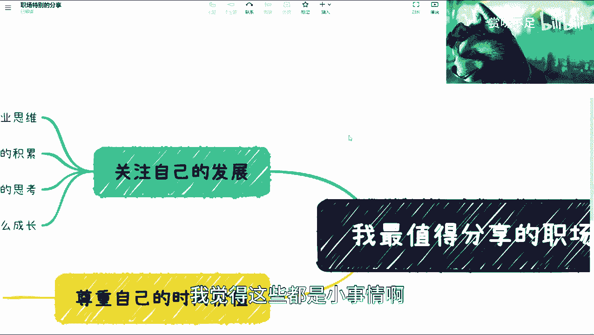

# 职场核心经验分享课 - P1 🎯

在本节课中，我们将要学习职场中几个最值得关注的核心要点。这些要点超越了日常的沟通技巧或人际关系，聚焦于影响个人长期发展的根本性问题。我们将逐一探讨如何通过具体行动，为职业发展打下坚实基础。

## 1. 凡事留痕，但避免甩锅 📝

上一节我们介绍了课程概述，本节中我们来看看第一个要点：工作沟通中保留证据的重要性。

一切工作沟通都应留下证据，例如邮件或微信记录。但需要注意，保留证据的目的不是为了事无巨细地确认所有细节，以此推卸责任。这种做法本质上是“甩锅”。

核心在于对**最终结果**负责。完成一项工作后，应向你的上级或相关方进行最终确认。这样做有两个目的：
1.  明确工作成果，确保符合预期。
2.  利用上级更广阔的视角和信息差，从更高维度审视工作成果是否妥当。

因此，留痕是保障，而确认是对结果负责的关键。

## 2. 区分企业能力与个人能力 🔍

在理解了工作留痕的原则后，我们需要具备另一项关键能力：客观评估自身价值。

必须清晰地区分哪些成就是依托于**企业平台**（如品牌背书、成熟供应链、团队支持），哪些才真正属于**个人能力**。这一点在销售、市场、运营等岗位尤为明显。

很多人会将平台优势误认为是个人能力。客观分析成功或挫折的原因至关重要：问题是出在自身，还是外部环境？避免将所有的“光环”都加在自己身上，这有助于做出更理性的职业判断。

## 3. 聚焦个人成长与发展 🚀

区分了内外因素后，我们自然要关注核心：个人的持续成长与发展。以下是实现这一目标的四个关键层面，我们将从后往前看。

### 3.1 尊重自身的时间价值 ⏳

无论身处何种职位，都必须明确：**你的时间是有价值的**。

你可以偶尔付出而不求即时回报，但必须向外界传递一个明确态度：我的付出需要获得对应的回报。如果长期得不到匹配的回报，本质上是你自己首先不尊重自己的价值。寻找认可你价值并愿意给予公平回报的平台或合作方，是职业发展的必然选择。

### 3.2 培养商业思维 💡

要让他人愿意与你合作，仅仅有能力是不够的，你需要理解价值是如何创造的。

**商业思维**的核心是理解一个业务的完整闭环：它如何赚钱？核心竞争力是什么？成本与利润结构如何？例如，作为电商公司的一员，你需要思考其毛利率、上下游链条和关键投入。

拥有商业思维，你才能在与他人合作时，展现出对全局的理解和创造价值的能力，这是建立深度人脉与合作的基础。

### 3.3 积累有效的人脉关系 🤝

职业发展离不开他人的支持与合作。

许多岗位性质导致人脉积累困难，但必须有意识地进行。未来很多机会都源于过去的连接。而有效人脉的积累，正建立在上述“商业思维”的基础上——别人之所以愿意与你合作，是因为你能看清价值闭环并参与其中。

### 3.4 关注持续的技能成长与职业规划 📈

最后，也是最基本的层面：确保每份工作都能带来真正的成长。

不要因为职位（普通员工、持股员工、老板）而限制自己的成长心态。即使薪资有限，所做的工作也应有助于个人能力的提升。同时，需要有一个大致的**职业规划**，思考当前工作是否对长远目标有帮助，并据此调整行动。

## 总结 📚

本节课中我们一起学习了职场中值得关注的几个核心要点：
1.  **工作要留痕，更要为结果负责**，避免陷入“甩锅”式沟通。
2.  **客观区分平台能力与个人能力**，理性评估自身真实价值。
3.  **始终聚焦个人成长**，这包括：
    *   尊重自身时间价值，争取公平回报。
    *   培养商业思维，理解价值创造逻辑。
    *   有意识地积累基于价值互换的人脉关系。
    *   确保每份工作都能带来技能增长，并做好职业规划。

把握这些根本性原则，将帮助你在复杂的职场环境中保持清醒，实现稳健的长期发展。