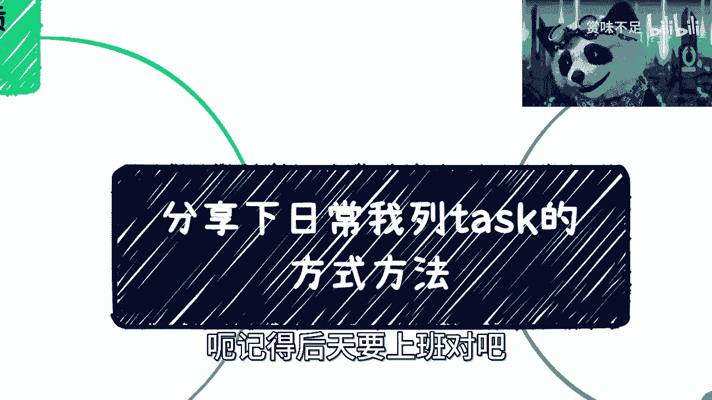
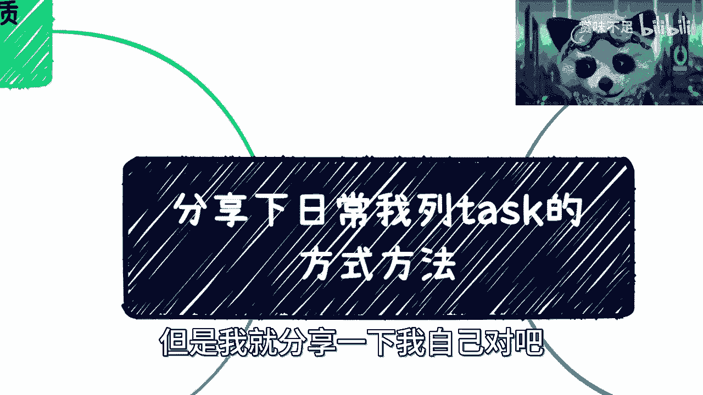
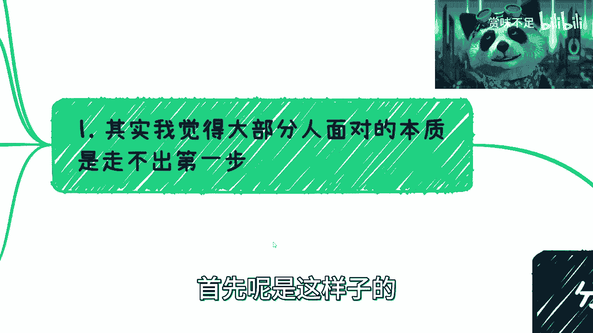
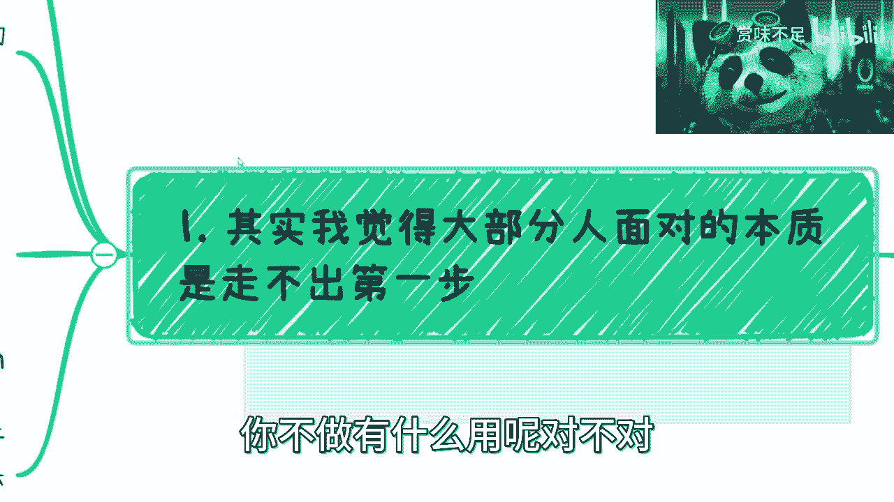
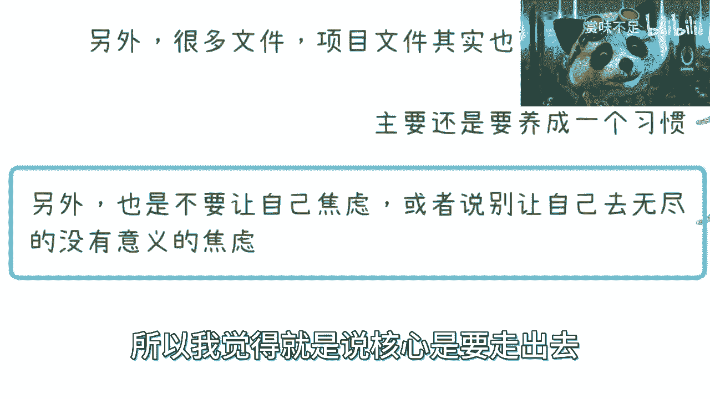
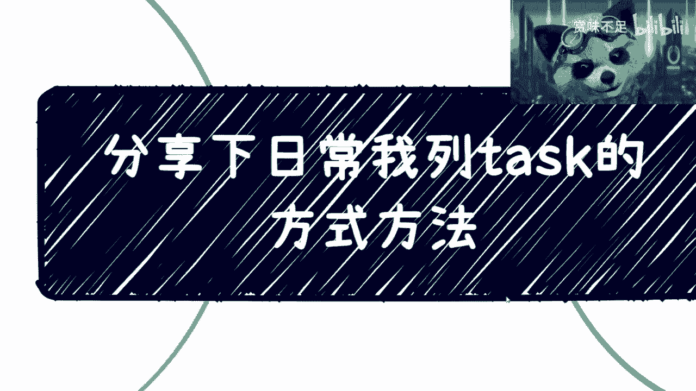

# 分享下我打工、创业、副业的工作习惯 - P1 - 赏味不足 - BV1VM41157r2

好大家好啊，呃记得后天要上班对吧。

首先啊，然后就是总结一下我最近这个咨询下来的情况，就我发现大家还是在问，我就关于这个平时列了task的方式啊，我在这个地方跟大家分享一下，我个人觉得呢这个就是说看每个人的习惯啊。

但是我就分享一下我自己对吧。

你们大家可以参考一下，首先呢是这样子的。

我觉得对于大部分人呢，其实面对的这个问题呢，并不是说用什么工具，也不是这个用什么样的这种方法，就是你知道吗，就是很多人你看啊，以前我去看本书，叫什么叫高效人士的七个习惯对吧，我记得我毕业的时候。

就那个微软那边人就推荐我看，其实我跟你们讲，其实你们也别来问我，什么看什么金融的书啊对吧，看什么东西，我觉得本质上意义不大的，就首先是什么呢，说是你们得要先做，你那到时候看了什么十本书，看了多少东西。

你不做有什么用呢。

对不对，没有用的啊，你比如说啊我说我我说你们要出去认识人，对不对，好，那么我们从一个对吧，两个活动开始对吧，从一天一周一个月开始，你要给自己列task对吧，就每天干嘛对吧，第二天干嘛，第三天干嘛对吧。

然后你这个活动有什么目的对吧，有什么意义，你去了之后要搜集什么信息对吧，你所有东西都得都得列出来的对吧，靠你看我这黑眼圈都看不出我眼睛在哪是吧，这第一个第二个就是说嗯你看哪些要做的对吧。

哪些是正在进行当中的，哪些是已经完成的对吧，哪些是其他你要用的，就是比如说像我这个地方写的，就比如说是什么备注啊，或者重要信息对吧，这个是你们看。

这个是我2017年做的一个这个team bition对吧，这个是我用的那个工具吧，叫team bition，然后这个是当时的那个那个task，你看啊，你比如说我当时办个大会对吧，你比如说朋友圈集赞对吧。

大会海报的主题啊，然后什么banner对吧，然后商务洽谈名片啊，技术社区邀请函对吧，然后是什么回首图片啊，书版讲师对吧，什么什么宣传折页，你列啊对吧，你每天就做啊对吧，你说你你一般如果给自己定的话。

你比如说打个比方，今天是几号，今天4月21号对吧对吧，你比如说4月21号与谁谁见面对吧，参加什么活动对吧，四二十二十二二号与谁谁见面，参加什么活动对吧，然后你点进去点进去干嘛呢，就是里面写清楚对吧。

我见这个人的目的是什么对啊，我需要完成什么样的一个一个一个目标对吧，等等等，那你就给自己列对吧，嗯包括我跟你们讲啊，就是你们比如说真的要去这个对吧，就是就非要刚对吧，那你说你非要做自媒体对吧。

做影响力也行啊，我也不阻止你们是吧，然后你说你要列出来第一天当然了，那么你就要列出来就是每天干什么对吧，达到什么目的，别的烂是什么对吧，然后第二天去复盘对吧，因为因为我跟你讲，你一旦要用这种工具。

因为这种工具很多非书啊，TIMBITION啊对吧，然后什么什么什么terror还是什么，就很多很多这种软件，你知道吧，然后就是你要这么想的，这种东西，其实说白了他都是靠自觉对吧，他只是给你个记录。

就像我跟你讲，就像什么就像什么嗯，什么减肥记录啊，然后什么什么每天什么营养记录一样的，你记录是你要去记录的，复盘也是你要去复盘的，就软件他们能提醒你什么东西呢，你说对不对是吧，所以说就是说很多东西。

你比如说你今天定了对吧，他迭达拉什么时候，那你第二天就得去看看哦，我离得达拉又近了一天是吧，那我到底完成了什么呢对吧，我这两天做了什么呢对吧，那我觉得这个是第一个啊，第二个呢我跟你们说一般分类啊。

分类是什么呢，其实就是说你每天啊，你要把那些鸡毛蒜皮事就行，其实都算进去，你知道吧，因为因为为什么，因为你要这么想，如果你今天觉得你没有东西写，那就说明你其实今天没有什么，没有在做什么对吧。

那如果你今天真的把什么鸡毛蒜皮都写进去了，然后你到时候复盘的时候就会发现哦，这个这个里面就是就是很多内容，其实都是一些鸡毛蒜皮的对吧，没什么用的，那你也要去反省啊对吧，反思啊。

然后去复盘说哦我我做了一些非常没用的东西，对不对，这个嗯，稍等马的，他这个识别老师把我嘴识别歪了，是什么鬼呢，真的是烦死了，然后第二个就是具体项目，你比如说打个比方，你比如说你今天跟驴老师合作对吧。

那么或者跟别人去合作什么，那么你就开一个新的项目，就相当于你每一个项目可以开一个，你知道吧，就当然这个项目是比较大的啊对吧，你说这个项目里面可能是一个两个月，三个月的项目，我里面再细分对吧。

你但凡只是一个什么什么，我们吃个饭对吧，我们什么做个咨询，你聊个天，那你就单纯定个task就可以了，因为task是项目里的子集嘛，对吧，然后比如说这个项目把里面每个task都细分掉，对吧。

那第三个呢就比如说你现在全职或者兼职做，你记住啊，你其实你自己的全职工作或兼职工作，比如说你今天就算不不去那个创业，不去做副业，你就单纯的打工，你也是要用我个人建议啊，你也是要去列这个task的。

因为这个东西的目的，目的是为了让你知道你做了哪些事情，以及让你知道你哪些事情到底在浪费时，是有哪些事情是在浪费时间的，以及让你知道哪些事情里面到底有这个迭代，是什么时候，以催促你把这件事情完成。

你知道吧，就是不管你今天做什么，这是一个你工作效率的事情，你知道吧，然后比如说那个雇佣关系，打工关系，甚至你自己做老板，你也是就是类似方式，因为你得有这么一个习惯，这样你才能效率最大化对吧。

你看我现在每天对吧，又要见人，又得给你们录视频对啊，又得给给给政府录课，又得给一些像广州啊，广东啊那边有些有些什么协会啊，就是粤港澳的证书，还得入客对吧，呃呃这不是粤港澳了。

就是那个叫什么就是啊那个叫什么，就是出版版权书对吧，那边还得录课对吧等等等，就很多东西都得录，你知道吧，那那很多事情都得做，然后还有很多人就找我，可能要谈一些新的业务啊，或者怎么样子的。

那你谈你你每天这么多事情是吧，那么而且你这个事情不是一天节点就结束的，就是说我还得往前去推进对吧，就是说有的事情是我催别人，有的事情是别人催我对吧，但是不管怎么样。

你整个这些这些事情你都得记录下来吧对吧，你否则你怎么你怎么知道这个事情靠不靠谱，你怎么知道你自己靠不靠谱啊对吧，你你全部靠你脑子记吗，那不好意思，记不住的是吧，那这个是第二点，第三点呢我跟你说。

一般定卡兹克的比例啊，就是有很多小伙伴呢，其实在咨询的时候跟我提过，就说哎呀我可能有强迫症对吧，就是不知道哪些这个应该哪些应该去定，哪些不应该定，我刚才已经说了，你所有都往上面写，你也别管他。

别管他那个那个能不能定，你知道吗，一开始你就都往上面写，等你复盘，比如说第二天去看订单，去看的时候，你慢慢慢就会知道就有些垃圾的东西，有些可有可无的东西，你就不应该不是不应该写，你就不应该做，你知道吗。

你自己去复盘的时候，你就去看，你知道吧，这些东西比如对你就没用，对别人也没用，对你也不能赚钱对吧，也不能提升你的任何能力，你做他干什么呢，对不对，就删掉以后就自己知道，就不应该列这种东西。

不是说不应该往上练，而是不应该去做这种事情，对不对，那这第一个，第二个就是说你或呃或者说有很多小伙伴说，我定了task能就感觉一定是要那种完成的对吧，不完成或者没有结果呢，感觉就很自责。

我跟你讲没什么好自责的，为什么，因为你去做很多东西，我就这么说，不管你不靠谱也好，还是别人不靠谱也好，不靠谱是多数靠谱才少数对吧，你按八二原则来说啊，这个靠谱的只有20%，不靠谱的80%，对不对。

那么你想啊，其实我跟你讲没有必要，因为你看我一个日常对吧，就是我日常这种每天记录啊，可能呃一年也不就一年嘛，几个月下来可能有那么几百个task对吧，然后没有完成的肯定是占50%以上的。

甚至占70%以上以上的，为什么，因为你所有做的事情，其实都是在尝试各种可能性啊，你怎么知道他能不能落地呢，对不对，但是你要记住的是什么，就是能推就果断，你知道吧，就是你能推进来就推进。

把迭代line定好，然后你就是严格的去遵循它，你自己遵循他以，你也要让你的合作伙伴遵循他对吧，然后不能做的感觉不靠谱的，你就直接扔到已完成，或者来说放弃，你知道吧，不要去纠结，就是你千万不要什么。

我跟你说，你千万不要什么，今天一个task列好了对吧，好练完熬花了一个小时，然后第二天复盘啊，在那边想哦，这个东西怎么回事对吧，这个东西到底为什么又花了两个小时，我跟你讲，你这种就不要做人。

没有任何效率的，我跟你讲，我每天做task就5分钟就定好哦，我一天大概你一天工作几个小时了，对不对，你你一天能见几个人，你一天能做几件事情，对不了，5分钟不过来啊，定好定好之后，你第二天复盘复盘。

我跟你讲思路清晰一点，你你最多最多花20分钟聊不起来，你知道吧，然后靠不靠谱不靠谱拉对吧，靠谱的你就去追问，微信上追，实在不行，打语音对吧，追问对吧，我现在问东西怎么样了，现在问题怎么样了，不行不行。

他妈的不要合作下一个，对不对，不就这样子嘛，简单明了，你知道吗，然后就说工具呢是用来这个呃提醒你自己的，就是剩下的你所有东西呢就是定期复盘，比如说比如说打个比方，比如说一个月对吧，或者一个季度你去盘。

你比如说这个项目很多task没有做对吧，或者你每天练的很多task都是到了已废弃，或者以这个这个没有完成的，那么你就要去看为什么这么多废弃，为什么这么多没有推进对吧，那这个时候你得去判断。

然后判断之后呢，你还得就是让自己去吸收这个结果，你知道吗，就是说哪些人不靠谱啊，哪些项目不靠谱啊，然后自己有哪些习惯不靠谱啊，因为哎呀，因为就是人嘛，其实都是这么一个这个成长过程嘛，对吧。

你像我以前定塔斯克时候，有很多东西没做完，其实是因为我自己不靠谱对吧，那那那你自己不靠谱，我说直白点，你自己不靠谱，某个项目没完成呢，你没赚钱，那你怪谁呢，对不对，那你得你得你得自己去复盘，你得自己去。

就是说去去进步嘛对吧，那你看啊，最后我们来讲啊，你比如说列task的核心目的是什么，其实是为了逼迫你自己要靠谱，然后让你自己要动起来，你知道吗，当然这个东西也是个辅助，你就像有很多人可能今天练了。

明天也不做，那你能怎么样呢，但我就是我能怎么样，我能把你怎么样，team bj能把你怎么样，就这个软件能把你怎么样，没人能把你怎么样对吧，你就就就浪费是吧，这是第一个。

第二个呢就是说核心要看什么项目不靠谱，哪些人不靠谱，因为你在复盘的当中，其实你一定要吃回忆对吧，或者要你一定要去对这个项目有一个很直，很清楚的认知，就是说这个项目属于那种我们都说嘛，叫做什么事事有回应。

我有回响是吧，然后呢，你会发现很多项目的就属于那种，跟你提一嘴就没声音了，你知道吧，那么你就去看吧，哦这个项目不靠谱，那这个项目给你对接人有哪些啊，那这些人可能不靠谱对吧，你你都你都要筛选好的啊。

然后第三点呢就是说你为了更好的复盘，更好的去工作，每个问题到底问题是在别人身上，自己身上，就是你把所有的废弃的，没有赚钱的，半途而废的项目你都列出来，然后你就去看对吧，具体问题是谁身上。

你的身上你自己改，你要是不记得你在列，task说我要改掉这个什么什么毛病对吧，那如果对方不靠谱，那么你就心里面知道了，就说好这个人这个项目不靠谱，事不过三对吧，我再给你一次机会，如果下次再再不行。

咱们就别合作了对吧，就就就就就就就想什么下辈子见是吧，就这样子啊，那没必要的，有什么必要呢，你妈的人这么多，你你非要跟他合作的，你说是不是，另外还有什么呢，就是很多文件项目文件其实你也可以当做备份。

因为呃你想嘛，你现在很多时候都是微信对吧，或者怎么样，你电脑，然后现在我觉得会把文件归一，就是比较好的，归档的人也也也也少了，也不多，你知道吧，那么你可以拿这么一种工具去作为这种文档啊。

相对应的文件的归档对吧，你到时候比如说啊有些海报，有些什么东西，其实很多东西都可以复用的，但是你要把它就是保存下来，别到处说什么什么文件已过期是吧，什么什么乱七八糟的，嗯所以我一般跟就咨询的人。

在讲这个task的时候呢，我就会跟他说，我说其实本质上这个功能不是很重要，重要的是你要养成一个习惯，你知道吗，因为这个习惯是最重要的，哪怕我们说啊，哪怕我们说今天你没有电脑，没有网络，没有手机。

你你你有了这个习惯，你也会自己去列，就是相当于你的思维模式，也是会这种列task的这种模式，你知道吧，就这种这种样子的情况，你才能有很好的把所有事情都都知道吗，高效的完成对吧。

否则你看嘛有很多小伙伴就问我，他说陈老师，你是不是每天很闲，我说他妈的，我每天做的事情比你们可能一个月做的都要多，对吧，不夸不夸张的说对吧，而且我我可以说从项目的单纯利润来讲。

也肯定比你们的一个月的利润来的高，就当天来讲对吧，但是我要花很多时间嘛，不用了，为什么，因为大家合作就可以了，又不是所有事情都得我做啊，都得我做，那那我我还赚什么钱，不要赚了对吧，对这一方面。

第二方面都得我做，我还打什么游戏也别打了，如果都是我做，那我还成长，什么也不要成长了，那我永远就是个打工的，我永远就是个螺丝，我我没有空去想想的呀，对了哦，然后我我在想着哦，是不是每天晚上有人请我。

某某天晚上有人请我吃饭对吧，然后吃饭的时候给我传传授一下九阳神功是吧，那是不可能的呀，你说是吧，然后最后呢就是另外呢就是我我跟你说，列这种task的主要还有个点，最核心的点呢。

就是说你看到这个task不会让你变得特别焦虑，同时呢就是说能够让你在很焦虑的时候，能明白自己到底还能做哪些哪些事情，因为很简单嘛，你今天面对一个都是task的东西，也许我跟你讲，你还是很焦虑。

但是你的焦虑不会是你现在这种焦虑方式，你更多的是说诶，我知我是知道有很多事情要做，那我可能要去排一个那个轻重缓急对吧，这个是你要去做的，但是你不会焦虑自己没有事情做，你知道吗，同样的就是说。

如果你面对的是一个完全空白task，那么你就得焦虑的是什么，你的焦虑是说我要开始尽快迈出第一步，而不是老师在那边焦虑，说哎这个我我我看到朋友圈啊，这个人怎么样怎么样对吧，我看到AI怎么样怎么样。

我看到什么什么数字经济怎么样怎么样，你不要去想这些，你要想的就是为什么我的task list上面是空的，对不对，所以我觉得就是说核心是要走出去。

但是走出去你也是有方法的对吧，但是这种方法就是，其实是你自己养成的习惯没有，你说有很多人就说嘛。

他说我这个就我我们回到一开始就说看本书，看什么东西有用啊，我跟你讲没有用的，就是很多的逻辑，包括我今天跟你们讲的东西也是一样的，就是当你们还是张白纸的时候，我讲的东西对你们来讲。

可能帮助只有那么1%或5%，但是如果当你们撞过墙了，当你们有一定的经验了之后，你就会发现可能这个东西的，就我讲的东西，对你们帮助可能就已经达到了50%，60%，当你们创过业对吧，当你们就是赚钱了。

你再回过来看我的视频，可能这个帮助就是百分之百甚至200%，你知道吗，这个上面是有一定本来就是有一定区别度的，所以说最重要的不是看书，不是去看别人的东西，而是说你先走出去，第一步，不管你做什么对吧。

然后再回来听，或者回来看这些书，就像我之前跟你们讲的书，这个东西很多人看了它吸收不了，为什么，因为它没有这层境界，所以他吸收不了，他觉得我靠这本书他妈垃圾，其实呢不一定是吧好吧，那么同样的啊。

这个有任何职业规划对吧，然后创业啊，包括啊这个副业啊，各个方面，反正有需求的，你们可以私信我啊，那个走这个付费咨询好吧。

