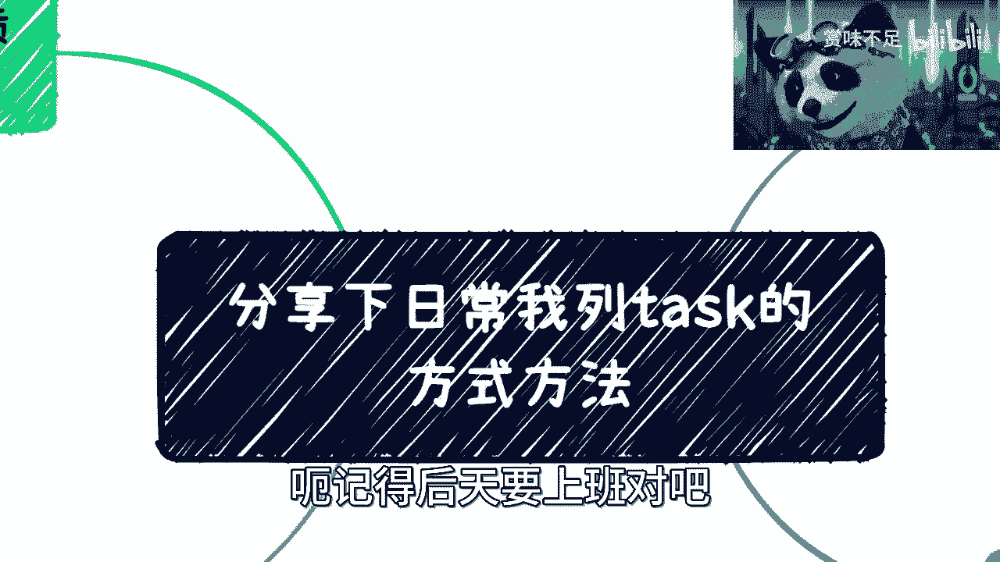
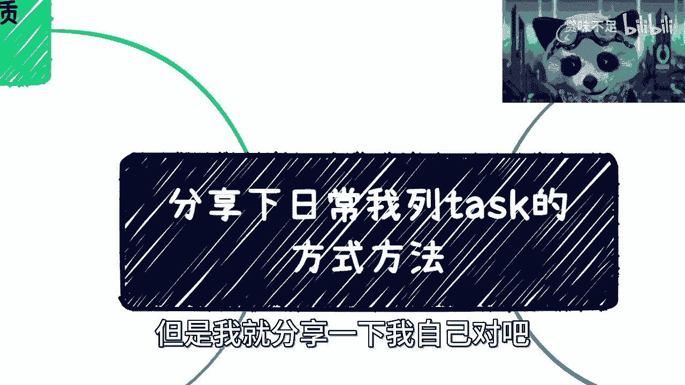

# 分享下我打工-创业-副业的工作习惯---P1---赏味不足---BV1VM41157r2

在本节课中，我们将学习如何通过建立有效的任务管理习惯，来提升个人在打工、创业或副业中的工作效率与执行力。核心在于将想法转化为行动，并通过系统化的记录与复盘实现持续进步。

## 概述：为何需要任务管理

很多人面临的问题，并非不知道使用何种工具或方法，而是缺乏“行动”本身。阅读大量书籍或学习理论，若不付诸实践，则意义有限。任务管理的首要目的，是推动你从“计划”走向“执行”。

## 第一节：任务管理的基本框架

上一节我们提到了行动的重要性，本节中我们来看看如何构建一个基础的任务管理系统。其核心是记录你计划做的每一件事。

### 核心操作：创建与记录任务

你需要为自己列出明确的任务清单。例如，计划拓展人脉，就从每周参加一两个活动开始。每天、每周、每月要做什么，都需要清晰列出。

以下是创建任务时需要包含的基本信息：
*   **具体行动**：例如“4月21日与XX见面”。
*   **行动目的**：例如“了解XX行业动态，寻求合作可能”。
*   **预期目标**：例如“获取至少三位潜在合作伙伴的联系方式”。
*   **所需材料/信息**：例如“准备好个人名片与项目简介”。

你可以使用任何工具进行记录，关键在于养成记录的习惯。这就像减肥记录或营养日记，软件本身只能提供记录功能，而执行与复盘必须由你亲自完成。

## 第二节：任务的分类与项目化管理

仅仅记录零散的任务还不够，我们需要对任务进行有效组织，以便更好地管理和复盘。

### 核心概念：任务与项目

任务（Task）是具体的行动项，而项目（Project）则是由一系列相关联的任务组成的更大目标。你可以为每个重要目标（如“与X老师合作项目”）单独建立一个项目，并在其中分解出所有子任务。

以下是三种常见的分类方式：
1.  **日常琐事**：将所有大小事务都记录进去。如果某天觉得无事可写，可能意味着当天效率低下；如果记录的都是琐事，复盘时就能反思并减少此类时间浪费。
2.  **具体项目**：为每个需要较长时间（如1-3个月）的重要目标建立独立项目，并在项目内细化每个任务。
3.  **本职工作**：即使是全职或兼职工作，也建议使用任务管理。这能帮助你清晰了解工作内容、识别时间浪费，并督促项目进度。

无论身份是员工还是老板，养成这种习惯都能最大化工作效率。面对多项并行事务（如见客户、录课程、谈合作），只有系统记录，才能确保每件事都得到有效推进，避免仅靠记忆导致的疏漏。

## 第三节：设定任务的原则与心态调整

在实践任务管理时，很多人会遇到执行上的困惑。本节我们将探讨如何正确设定任务并保持良好心态。

### 核心原则：先记录，后筛选

初期不必纠结任务是否“值得”记录，应**将所有想到的事情都写下来**。在次日复盘时，你自然会分辨出哪些是“垃圾任务”——那些对你、对他人都无价值，既不能赚钱也不能提升能力的事情。此时你该放弃的不是记录，而是执行这类任务本身。

### 心态调整：接受不完美与果断决策

很多人会因为任务未完成而自责，这没有必要。根据“二八原则”，可能只有20%的事情最终能靠谱地落地。

**公式：任务完成率 ≈ 20% (靠谱) / 80% (尝试)**

因此，面对任务时应做到：
*   **快速决策**：每天花5分钟列任务，花20分钟复盘。思路要清晰。
*   **果断推进**：对靠谱的任务，设定好截止日期并严格跟进，主动通过微信、电话等方式追问进度。
*   **勇于放弃**：对感觉不靠谱的任务，直接标记为“已完成”或“放弃”，不要反复纠结，立即转向下一个。

工具的核心作用是提醒，而你需要做的是定期（如每月、每季度）复盘。查看哪些项目任务大量废弃或未推进，分析原因是他人不靠谱、项目本身问题，还是自身习惯导致，并吸收这些经验用于成长。

## 第四节：任务管理的核心目的与高阶应用

最后，我们来总结任务管理的深层价值，并探索其如何帮助我们优化人际网络与知识管理。

### 三大核心目的

1.  **逼迫自己变得靠谱并行动起来**：这是最根本的目的。习惯本身比工具更重要，它能塑造你条理化、高效化的思维模式。
2.  **筛选不靠谱的项目与人**：复盘时，你会发现很多项目“提了一嘴就没下文”。通过记录，你可以清晰地识别哪些项目、哪些对接人不靠谱，做到“事不过三”，有效优化你的合作网络。
3.  **明确问题归属，针对性改进**：将所有失败、半途而废的项目列出，分析问题是出在自己身上还是对方身上。自身问题就制定改进任务；对方问题则降低其合作优先级。

### 高阶应用：文件归档与知识复用

任务管理工具也可作为文件归档系统。将项目相关的海报、文档等资料统一保存在对应任务或项目下，避免微信文件过期或散落各处，便于未来复用，积累你的数字资产。

## 总结与行动号召

本节课我们一起学习了高效任务管理的完整体系：从**建立记录习惯**开始，到**进行分类与项目化管理**，再到**掌握设定原则与调整心态**，最后理解其**核心目的是为了推动执行、筛选优化和持续改进**。

任务管理的终极价值，在于让你**面对满列任务时不至于盲目焦虑**，而是能理性排定优先级；**面对空白清单时也不会空想焦虑**，而是立刻思考如何迈出第一步。所有的理论、书籍和他人的经验（包括本教程），其效用都取决于你是否已经“走出去”行动。只有先行动，再结合复盘与学习，这些知识才能产生最大价值。

**核心要义：列任务不是为了完美，而是为了开始。现在，请打开你的工具，写下今天的第一个任务。**