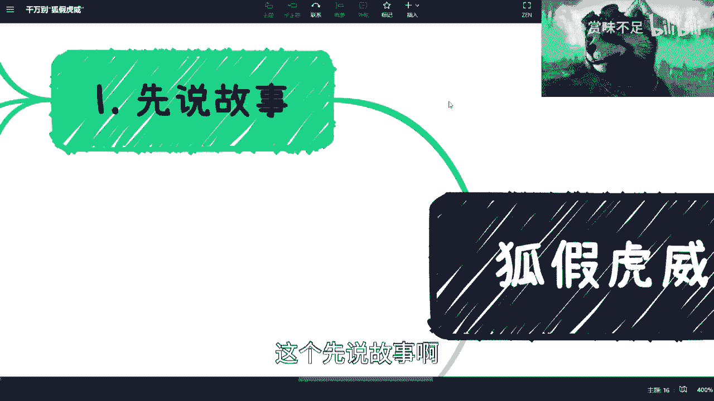

# 课程 P1：切忌“狐假虎威” 🐯🦊

在本节课中，我们将通过一则童话故事和现实案例，探讨职场中“狐假虎威”的现象及其危害。我们将分析其背后的本质，并思考如何在个人成长中避免陷入这种误区，建立真正属于自己的价值。

---

## 一、故事背景与现象引入

首先，我们来讲一个故事。

在我年轻的时候，遇到过一类人。他们自身看上去很普通，但与你交谈时，总会提及自己认识某某重要人物，或与某某称兄道弟，试图以此抬高自己的身价。

这种行为并不可取。后来我还遇到过一些人，他们在对外洽谈业务时，会擅自打着我的名号或我所在公司的旗号。这非常危险，因为如果他们行为不当，最终可能需要我来承担连带责任。

对于这类人，我的建议是谨慎交往。

---

## 二、案例分析：平台光环与个人能力

上一节我们提到了借他人名号的现象，本节中我们来看看另一种常见情况：混淆平台能力与个人能力。

我曾遇到过一位运营兼销售的人员。他心思活络，总想着在公司之外赚取额外收入。对于管理者而言，只要不影响工作，有时会对此类行为睁一只眼闭一只眼，但这并非重点。

重点在于，他入职后参与执行了一些金额可观的项目，便因此沾沾自喜，认为这些成绩完全归功于自己。在被公司辞退时，他破口大骂，声称自己为公司赚了很多钱。

然而，项目的商业逻辑、人脉关系和前期铺垫都与他无关，他只是最后的执行者。这种现象非常普遍，不仅存在于个别人身上，很多职场人也容易陷入这种认知偏差。

例如，在各平台评论区，常有人抱怨公司给的薪资太低，认为自己为公司创造了巨大价值。对此，一个简单的逻辑是：如果你真的认为自己能力远超报酬，为何不选择自己创业或寻找更高薪酬的工作？抱怨往往源于对自身真实价值与平台赋能比例的误判。

招聘销售时，也会遇到类似问题。每个销售都可能吹嘘自己过去的辉煌业绩。但关键在于，你需要判断这些业绩有多少源于他个人，有多少源于原公司的品牌、资源和平台支持。

**核心公式**可以概括为：
**个人真实价值 ≈ 过往业绩 × 个人贡献系数**
其中，**个人贡献系数** 是一个介于0到1之间的值，代表个人能力在总成果中的实际占比。如果这个系数很低，那么脱离原平台后，他的业绩很可能大幅下滑。

因此，招聘时应重点考察销售个人关系的牢固程度，以及客户是看重他本人，还是他背后的公司。

---

## 三、警惕环境带来的认知扭曲

背景故事中反映的现象比比皆是。例如，在一些社群中，成员间习惯于互相吹捧（商业互吹）。时间一长，有些人就会把别人的客套恭维当真，产生自己无所不能的错觉。

我的社群则截然不同，其“宗旨”似乎是时刻提醒我保持清醒，甚至以戏谑的方式防止我膨胀。这虽然是个玩笑，但说明了一个道理：我们需要一个能提供真实反馈的环境，避免活在“楚门的世界”里。

这种现象不仅存在于普通员工或群主中，公司老板或管理者更容易陷入其中。长期处于高位，容易被员工的谄媚和殷勤所迷惑，从而对产品、市场和团队管理产生误判。

即便在大公司，也有人喜欢利用公司光环在外获取仰慕。但你必须明白，短暂的会面或面试，他人无法真正了解你。所谓的“一见钟情”更多是冲着你的背景，而非你本人。

正式员工与外包员工之间也是如此。无论是谁，都不应“狐假虎威”。正式员工不应因此欺负外包同事，外包员工也不必自觉矮人三等。大家都是打工者，内部划分三六九等、互相倾轧并无意义。

面对政府人员、企业老板、管理者等不同对象时，说话方式可以调整，但不要认为对方听不出你的真实意图。大多数人心里都清楚。因此，要么像我一样直来直去，要么就把话说到极致漂亮，让对方即使明白也无可奈何。最糟糕的状态是自欺欺人。

---

## 四、长远视角：职场内卷的终局

上一节我们讨论了环境对人的影响，本节我们将视角拉长，看看“狐假虎威”或盲目内卷的最终结局。

我从不教授如何在职场“内卷”。因为从大局观来看，未来的就业市场是一个**存量市场**。假设岗位数量为 **X**，求职者数量为 **Y**，那么在可预见的未来，**Y 将远大于 X**。

**核心问题**是：你是否有绝对的自信，能永远成为 **X** 中的一员，而不会落入 **Y - X** 的剩余人群中？无论你如何钻研职场技巧，最终很可能还是会败给更年轻的年龄、更低薪的竞争者或现实压力。

职场过程充满不可控因素，单纯依靠“跪舔”或几个技能无法保证长治久安。因此，将全部精力用于职场内卷，从长远看可能是一场空。

---

## 五、本质问题：缺乏独立赚钱的能力

那么，比失业更可怕的是什么？是感觉自己什么都会，却就是不会赚钱。

大部分打工者不关心钱是如何赚来的，他们的收入来源于工资，却不清楚公司为何愿意支付这份工资。他们缺乏的是**商业思维**和构建**商业闭环**的能力。

在大公司，你或许可以呼风唤雨，但那得益于公司的平台、团队、管理系统和各类支持。一旦离开，你会发现一个致命问题：你不知道自己能提供什么独特的价值，不知道社会需要什么，也不知道人们愿意为什么买单。

这就是“狐假虎威”的本质：你的威势来自背后的“老虎”（平台），而非你自己这只“狐狸”。

要打破这一点，关键在于理解：
**你的价值不由你定义，而由市场和客户定义。**
你需要深入了解冰山之下客户未被言明的真实需求，而不仅仅是表面需求。

无论是做产品、做私域流量还是摆摊，原理相通。你必须从一开始就去了解市场和客户，验证你的价值假设。

以AI为例，它历史上经历过数次热潮与低谷。很多人只在热潮时跟风关心，却不了解其背后的商业逻辑和真实需求，这便是在同一个坑里反复跌倒。

我早年工作时，外出也需要依靠公司名号。但现在情况反过来了，合作方更关心我个人的能力和title。这背后的转变是：你必须建立起别人对你个人价值的认可，而不仅仅是对你背景的认可。

**核心逻辑**是：你需要清楚自己提供的独特价值是什么，以及客户为什么愿意为此付钱给你而非他人。

独立运作商业事务（如注册公司、财务管理）远比想象中复杂，这远非在公司执行某个环节任务可比。公司业务由创始人、销售、技术等众多角色共同分担，落到个人头上的复杂度是有限的。

---

## 六、总结与建议

本节课我们一起学习了“狐假虎威”现象在职场中的多种表现。

我们通过故事和案例看到，混淆平台光环与个人能力、沉迷于环境吹捧、盲目进行职场内卷，最终都可能竹篮打水一场空。最根本的问题在于缺乏独立的商业思维和赚钱能力，一旦离开现有平台便无所适从。

**核心建议如下：**

1.  **保持清醒，拒绝自欺**：客观评估个人在成就中的真实贡献率，分清平台赋能与自身能力。
2.  **培养商业思维**：在工作之余，主动思考价值创造、客户需求和商业闭环，不要逃避对“如何赚钱”的本质探索。
3.  **建立个人价值**：努力打造不依赖于任何特定平台的核心技能和市场认可度，让你的名字成为价值的保证。
4.  **直面现实，尽早规划**：逃避是本能，但市场竞争日益激烈，与其拖延，不如尽早面对现实，为长远的个人发展铺路。

最终，真正的安全感来源于你自身创造价值的能力，而非你所假借的“虎威”。