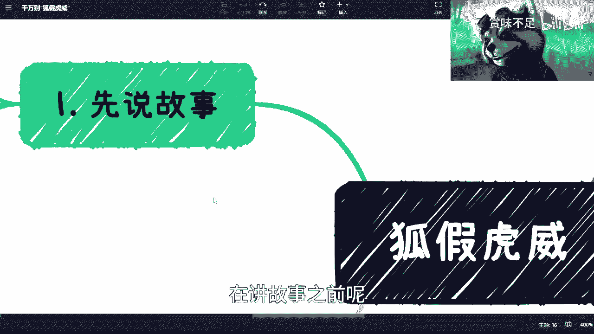
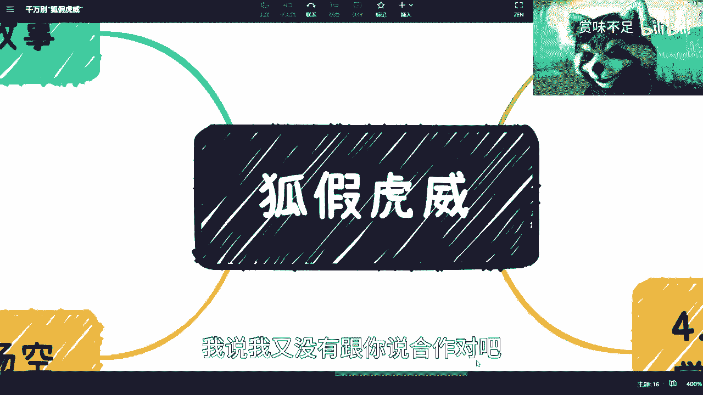
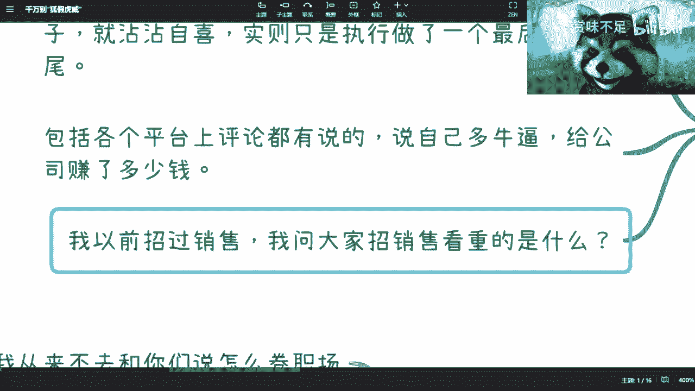
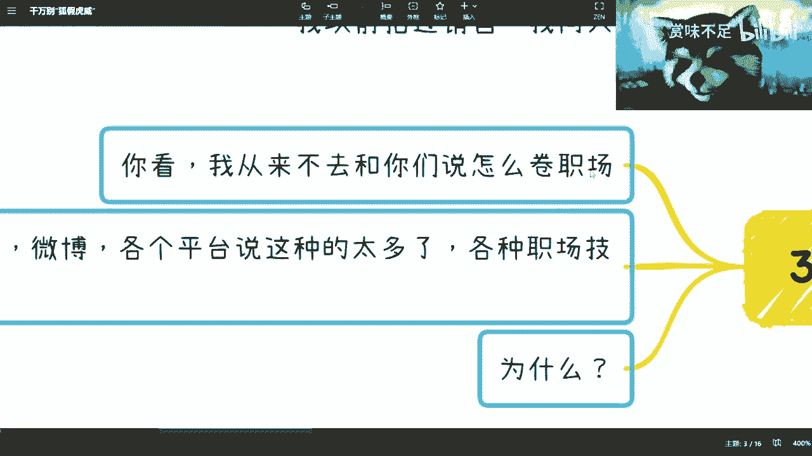

# 切忌“狐假虎威” - P1 - 赏味不足 - BV1EM4y117cx

好大家好啊，今天我们来讲一则童话啊，当然不是啊哈。

首先呢这个先讲故事对吧。

在讲故事之前呢，我先跟大家说一下啊，就是在我年轻的时候呢，虽然我现在我觉得我还是他们很年轻的是吧，呃在我年轻的时候呢，其实我碰到过很多人啊，然后呢有一类人呢就是那种看上去很小很小。

但是呢他跟你说每句话对吧，讲着讲着就跟你说啊，这个谁我认识那个谁，我见过对吧，这个谁跟我称兄道弟是吧，这个谁是我师傅，你知道吧，哎呀不行，我跟你们说啊，就这种人真的不行。

是真不行啊，而且呢就是我后来还碰到过一些人，是什么样的呢，就是那种就是说好像就前两年吧，就是那种他们出去之后呢，就打着就是跟就是就比如说出去谈个业务，他就说那是邵老师对吧，陈老师啊，驴老师的业务。

我说我又没有跟你说合作对吧，你出去打我的这个抬头找合作，那回头你要是坑别人钱，我靠那他们我还得跟你去打官司呢是吧。

我跟他们说这个慎交慎交。

呃呃走不出小姐姐在跟我讲web3的事了，这个先说故事啊。

先说故事，你看啊，以前的我碰到过一个运营兼销售的啊，然后呢自己心里面小九九啊，非常多，叫吃着碗里的对吧，看着锅里的什么意思呢，就是说什么意思呢，笑死我了，什么意思呢，就是说他做事情呢。

就是相当于自己在公司里面做对吧，外面呢可能还想赚点小钱，你知道吧，就这种事呢，我这么说吧，就是你对于管理和老板呢，我觉得大家都不容易对吧，大家也就睁一眼闭一只眼，你不要以为别人不懂是吧。

但是呢我觉得这不是重点啊，重点是他们之前相当于入职之后呢，帮公司就是做了一些单子对吧，做一些单子啊，然后觉得哦这个单子比如说50万啊，那个单子100万是吧，这个单子1000万是吧，哦沾沾自喜是吧。

但其实你说跟他他们有蛋关系对吧，就是他入职之后呢，就是相当于最后去做了一下执行对吧，就整个商业逻辑对吧，这个人脉关系对吧，这个前期的铺垫对吧，跟你半毛钱没有关系，然后呢这位同学很搞笑。

这位同学在被开的时候嘛，就是在那边破口大骂，你知道吗，就说什么就说啊，我很牛逼，我给公司带了很多钱，我给公司赚了很多钱对吧，也不知道他赚了什么钱，哎呦，就我跟你们说，就这种人特别多，当然啊我跟你们讲。

你们别觉得啊，好像这个听上去很有道理，我跟你们说，很多时候你们在自己岗位上面，也很容易出现这种问题的，你知道吧，这是第一个，第二个呢就是说各平台上，我跟你说平台那评论都有，就是说自己多牛逼，你知道吧。

说自己公司给自己的这个薪资太低了对吧，自己给公司赚赚多少钱，那其实前两天B站上面我在评论的时候，我也回过他，我说我说很简单，你要觉得你给公司赚了很多钱是吧，那你自己去做呗，对不了，你又觉得自己很牛逼。

公司给你薪资少了，你又不自己出去做，那你说个逼对吧啊，你看我现在就是呢，就是我从来不抱怨这个别人给我薪资多少，你爱给我给我，不给我拉倒对吧，这个很简单，就是你给我多少钱，我干多少活对吧，我干多少活。

我会去评估这个活对应的是这个值不值，你给我的钱对吧，但凡就是说你给我多少钱，大家不是那种，就是我没有看到里面有更多的利益的时候，很简单，我多一分钱的活我都不会干对吧，你也别出来，你也别来催我。

就大家心里有逼数就可以了，你知道吧，就这么简单啊，然后呢，你看啊，我以前其实面试也招过销售啊，我我我就问你们，你们想想看你们招商招销售看中的是什么，每一个销售过来都可以跟你吹的天花乱坠，你知道吗。

哎呀我以前营业额几千万几个亿是吧，我靠牛逼的很是吧啊，然后呢，我以前在什么公司，你知道吗，我跟你们讲啊，招销售这件事情，好的销售啊，就市场上非常难求，但你招销售呢，你看中的是什么呢，你看中是他口才吗。

不是对吧，你看中的是他们所谓的那些关系吗，不是你知道吗，你看中的是他以前营业额吗，不是为什么呢，是因为你一定要明白一点，就是他所有的成绩不是他的，是他所在公司的，或者说并不全部是他的。

有一部分是他公司的，那么这个时候呢你去招一个销售，你就得去判断到底两者比重是多少，因为很多时候销售占一成，公司占九成，那那你说这个销售以前比如说赚了三个呃，这个有3000万，三个亿的流水。

他到你公司没有了这个九成的加成，还三个亿吗，我说不好听点，他们30万都难，你知道吗，所以呢这个时候你得去判断什么，你得判断的是说这个销售本身的关系硬不硬，你知道吧，本身是就别人看中他还是看重他的公司。

你知道吧啊那么这个是故事对吧，然后呢你看啊这个背景对吧。

背景这个是呢我跟你讲，哎呀老多老多了，你知道吗，我以前我我你想我有700多个群，每群里面很多群啊，他都是这个彩虹屁对吧，每天彩虹屁商业互吹对吧，要按我们说法就商业互吹，但是呢我跟他们说。

有很多人就是这样子的，就是时间一长是呢，就吹着吹着自己就信了，你知道吗，就那种群主对吧，哎呀每天就是彩虹屁啊，牛逼我牛逼啊，我怎么这么牛逼是吧对吧，就是你牛逼，你要能赚到钱就算了，但大部分人都吹水。

你知道吗，就是一个500人群，每天在那边吹水，吹水都不赚钱，哈哈这啊这是第一个对吧，第二个呢哎我跟你们讲我就不一样啊，我的群就不一样，我的群老牛逼了，我跟你们说，我没有新群啊，我先说说清楚啊。

别别拉我拉群啊，我跟你们讲，我我是群老牛逼了，我给你们讲个故事，我操真牛逼，我之前微博有一次是被那个销过号的，就该昵称不存在，你知道吗，有一天晚上我正在吃饭，然后呢他出现了，就是就突然有人跟我。

我当时还在晚上还在一个圆桌上面吃饭呢，然后突然之间有人物跟我说，他说陈老师，你在群里面为什么都在发红包，我说他嗯这不太可能啊，这帮人抠的很啊，然后一看是在发红包，为什么他们红包上面写着庆祝群主禁止。

我说我怎么了，我怎么就进去了，然他们，然后我一看卧槽，我他们的号他们没了，就就此昵称不存在，你知道吗，然后就微博上他们就说啊，公告天下这个人号没了，我说我也没做啥呀，然后我就自此自此之后，我就发现了。

就他们的这个综指南不是彩虹屁，从来没有难，你知道吗，他们宗旨就是把我送进去啊，越越越快越好，哎你看多好对吧，这个时刻警醒啊，然后你看公司老板，我跟你讲，老板也是一样的，因为什么呢，因为老板很多时候对吧。

就是他时间长了，他对于产品的这种把握啊，团队的管理啊，很多时候就是膨胀了，你知道吗，或者来说，就是那种把自己困在这个这个楚门的世界，你知道吧，那么所以说呢，其实这种时候他更需要就是说自己。

不停的去告诫自己说啊，这个事实上怎么样子的对吧，这个员工谄媚你几句啊对吧，这个现几分殷勤啊，你别就他们飘飘然了是吧，而且很多时候呢你不单单是就不仅仅是老板，可能就是说一个经理啊。

那个manager啊其实也会这样子的，那不同场合很多了对吧，互联网还好一点的传统公司不得了了是吧，然后大厂呢我跟你们讲啊，要很很用得开，很吃得开啊，当然了，这个现在可能不太行啊，你放在56年前。

我觉得还是可以的，你知道吗，就跑出去啊，牛逼啊对吧，然后万众景仰对吧，然后这个小迷妹，小小哥哥投来投来羡慕的眼神是吧啊，但是我还是那句话，你得明白就是啊一个面试对吧，或者一顿饭，这个一两个小时。

人家都不一定能对你有多了解对吧，你说哦别人见到你啊，这个见到你第一眼对吧，就叫一见钟情，不可能的呀，你说是不是你对自己有点逼数嘛，你说是吧对吧，然后那个正式员工外包员工也是一样的。

就是啊很多时候呢我觉得没有必要啊，你知道吗，就是你别就是娜娜，别狐假虎威，你知道吗，就是该怎么样怎么样，你也别觉得你是真薛刚，别人是外包员工，你就欺负人家，你也别觉得自己是外包，别人是军训员工。

你就得矮人三等对吧，没有的，有什么关系啊，大家都是来打工的嘛对吧，那又怎么了呢，啊我靠我他们打call还分个369等，那按这就说难听点和打工人何必为难打工人，自己卷自己干嘛，那没有意思的，你说什么呢。

我要是我跟你们说，这这这世界就很扭曲，都是自己卷自己的对吧，我要自己我要跟卷你们，我今天就不来，我就不来讲这些东西了，有啥好讲的，你说是吧，所以我跟你们讲，你们碰到什么人对吧，什么政府啊，企业啊。

老板啊，管理者啊，创业者啊对吧，包括我这种人对吧，你碰到什么样的人说什么样的话，但是呢你别觉得你说什么样的话，对方不知道啊，大概率很多人都清楚，所以你也得清楚，其实对方是知道的对吧，那么你其实就很简单。

你要么就跟我一样对，你看我我就是属于什么直来直去，我不管你的，我管你是谁对吧，你他们说的说的不对，你再牛逼，你也是，我就这么骂你，你知道吗，你要么就是什么呢，你要么就有本事把话说漂亮对吧。

就是属于那种哎对方就算知道了，哎他也难，你没办法啊，要么你就像我这样，我觉得你所有当中的这种还没用。

唉没有用，自欺欺人，你知道吗。

你看啊，第三点我跟你们讲的终究都是竹篮打水一场空，为什么呢，你看啊，驴老师从来不跟你们去说怎么卷职场，你们在微博B站各个平台上面，你们会看各种各样的视频，你知道吗什么，而且很很很吃流量对吧，很喜欢啊。

就教你们职场如何去卷对吧，职场啊什么30岁之前懂得的多少个知识对吧，怎么样怎么样，你们你看我从来不跟他们去讲，为什么没什么好讲，因为你从你要有个大局观，什么叫大局观，就是我早就跟你们讲过了。

未来是一个岗位数量为X对吧，存量市场为Y的这么一个市场，而Y存量的这么呃，就是存量的这么一个求职人员数量为Y，Y远远远远远远远远远远大于X，那我就问你们嘛，你们有任何的本事，有任何的自信。

说你们永远能坐在X上面，而不会成为剩下的Y减X有概率的啦，我就问你们，我为什么不跟你们去，从来不跟他们去卷职场的东西，是因为在我看来，所有人再怎么卷，你们最终还是会败给年龄，败给薪资，败给现实就结束了。

有有什么区别呢，就是当然你说那陈老师照你这么说，死路一条没有啊，我的意思是我从来不跟他们去卷职场，因为在我看来职场他没有中，就是他职场的这个整个的这个这个过程，在我看来我们是不可控的。

而且最终它就是一场空，因为他不可能让我们永生永世很稳定的，在那个地方，你上面所碰到不可预见的事情，跟卷的情况太多太多了，后面来的年轻人总归比你年轻吧，后面来的人要求薪资低的也比你多吧。

后面来人能力比你强的也多吧对吧，那我就说嘛有什么好卷的呢，哦职场就是那种你学会了，你去看几个视频，学会了几个技能，你就能稳坐泰山的有吗，没有的呀，对对对，就是我跟你们说，很多时候你们不是不懂，你知道吗。

就是自欺欺人啊对吧，我要跟你们卷职场有的好卷，对不对，跪舔之术有什么不会的，但问题是跪舔的有用吗，没有用的呀。

是不是呢，第四呢我跟你们说啊。

本质上是什么，本质上是最怕的呢，其实不是失业，你们品一下这句话啊，最怕的不是失业，而是感觉什么都会，但是就是不会赚钱，什么意思，你知道吗，就是我们大部分的人，我为什么一直强调商业思维。

我为什么一直强调赚钱的，这个叫做商业闭环，是因为大部分的人打工，他是不关心怎么赚钱的，因为他的钱是靠工资来发的，但他并不知道对方为什么要给他这个钱，所以你会发现很多时候我们怕的是失业吗，不是失业。

我们失不失业有什么关系呢，说难听点他妈的，在我看来，未来终究都有失业的，你逃不掉的，对不对，但是问题在哪里呢，问题在于你空有一身本事，什么本事呢，就是我们举个例子，比如说你在一家大公司。

自己百度腾讯阿里对吧，京东你会发现你呼风唤雨，无所不能对吧，牛逼的很，但是只有一点不会，你就不会赚钱，为什么呢，是因为你在公司里面，我们为什么这个主题叫做狐假虎威，是因为你在公司里面自己平台，自己团队。

自有管理系统，自己OA，自己HR，你有很多东西是不缺的，甚至自己财物什么东西都不用你操心，但是问题是什么叫不会赚钱，是因为你不知道你到底能提供什么，有价值的东西，同时你也不知道这个社会到底需要哪些东西。

同时你不知道这个社会的人，到底会为什么东西而买单对吧，这个就是最大的问题，你碰到是形形色色的人，我为什么很多人认识我之后就会发现哎陈老师，你为什么这个认识的人跟我们想的很不一样，对吧，三教九流。

什么人都有对吧，真的是什么人都有，为什么，因为你得清楚每一种人他们到底要什么对吧，你得清楚每一种人他们到底会为什么事情掏钱，你和我我之前其实就讲过了，就是无论是你面试也好，你做一个产品也好。

你做私域流量也好，包括你今天出去摆摊也好，没有用的，为什么，因为你得明白一点，就是你首先一开始就得明白一点是什么呢，就是说你的价值，你的这个东西好不好，不是你说的算的，是客户所算的对吧。

是这个市场说了算的，但是问题是客户跟市场，你得一开始就得去了解，你得去了解他，就是我们说冰山理论吗，你得去了解这个冰山下面的那部分，因为所有你能看到都是冰山上面的那部分对吧。

这就好像很多人都在跟我说AI对吧，怎么样怎么样，会不会成为大趋势，我就会跟大家讲，我说这位大哥，AI在以前历史上就有过两次巅峰了，那请问你在两次巅峰之后，你有听到过AI吗。

你有你有对AI有什么起那个关关心嘛，哦你就现在AI开始大家热了，你就开始关心了，那有什么区别呢，没有区别的呀，你知道吗，就是你就在不停的在一个老的坑里面跌，而且不停的跌，不停地打滚啊，然后还不自知。

你知道吗，所以我其实在很早的时候，我就会很多人说，我说你们就是工作归工作，但是工作了之后，你还是得要去看你个人怎么能赚钱对吧，你个人的这个商业到底怎么去做啊，你就像我以呃。

你就像我以前最早前工作前几年对吧，我都是只能打着公司态度出去的，哎我是谁谁谁对吧，我是什么什么公司的，大家买你账对吧，你说我从那个公司出来之后，那你说我是谁谁谁你啊对吧，中国是自己人。

你是谁谁他妈关心你是谁呀，你说是吧对吧，这是一方面，你看现在啊我去做很多单子，比如说政府大企业的会有很多东西诶，我跟你们说，现在其实就反过来了，现在就是说他们只会关心哎陈老师，你还在那个公司吗。

你要么帮我们更新一下你简历吧，更新先更新一下你title吧对吧，就是你要做到的是别人能认可你，而不是认可你的背景对吧，同时就是说认可你的前提是什么，就是他们他知道，或者说你自己要知道。

你到底产出给出的价值是什么，他为什么愿意付钱给你，不愿意付钱给别人，你知道吗，所以说我们说啊就是商业，一个是商业闭环，一个是商业的管理啊，就包括这个这个注册公司也是一样的，你真的要去弄一个公司。

你会发现里面的杂事很多很多很多，你也别觉得就找一个第三方代理的，财务公司就能解决了，也没这么容易啊，这事实里面事实烦的事情多得很，你知道吗，就你以为啊就是这个在公司里面啊，我很累了，我很苦了。

我很我很觉得这个业务很复杂了，但其实也没有对吧，能复杂到哪里去呢，一家公司这么大的业务对吧，我说不好听点，你创始人，你老板给你cover掉大部分对吧，销售cover掉大部分，技术cover掉大部分。

然后呃各个岗位都分摊了一部分，到你手上能有多少啊，对吧啊。

所以我觉得呢就是说这个事儿啊，我觉得就2。1呢，大家别自己骗自己，也自己骗自己，就跟很多人说考研是一样的，就就其实没什么用对吧，就拖了3年，我觉得真的没没必要，你早晚都是要面对的。

而且唉就是我觉得逃避是本能是对的啊，也没毛病，但是怎么说呢，现在这个市场人越来越多对吧，越来越卷，大家早点面对现实，我觉得哎还是会好一点对吧，你到晚一点呢，我说我说难听点，这个可能比如说你又要生孩子啦。

要买房子啦对吧，女朋友不顺啦，老婆也不顺心啦对吧，你身体不好啦，这精力不足不够啦，哎呀我跟你讲问题多的是哎啊呃差不多啊，对我跟你们讲啊，最后提一嘴啊，B站上之前有小伙伴让我讲生孩子的事情啊。

不呸让我讲孩子教育的事情。

