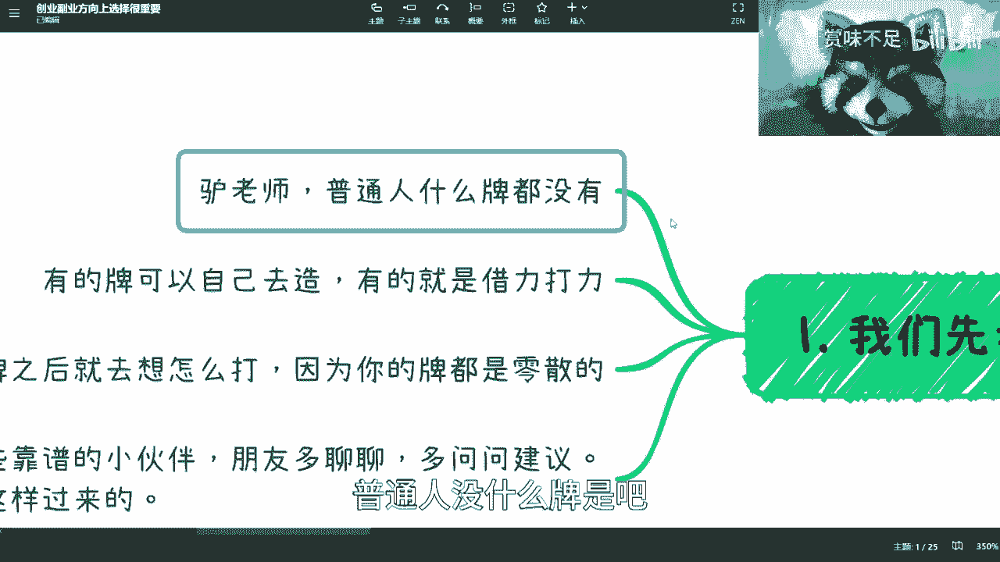
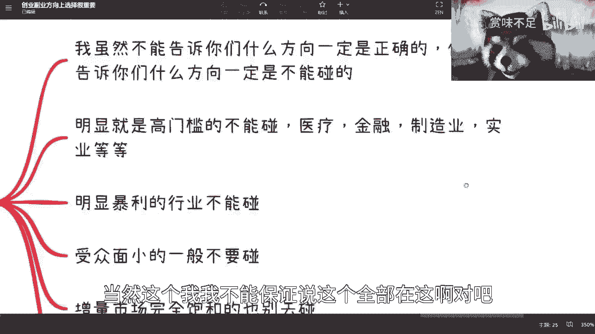
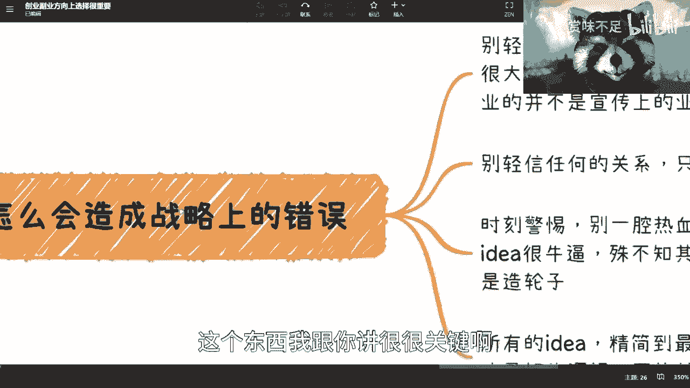
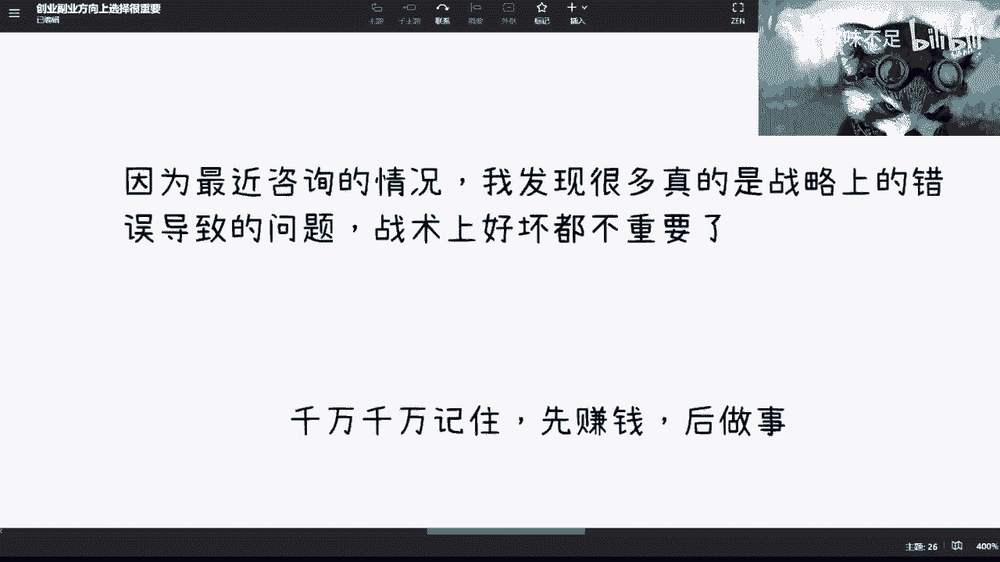

# 创业or副业战略方向的选择很重要 - P1 - 赏味不足 - BV1PT411x7CE

好啊大家好啊，嗯又是我是吧。

因为这两天呢就聊的人比较多。

然后呢，就是我发现，其实很多都是战略上的错误导致的问题，就是就什么叫战略上错误导致这个问题呢，就是一开始这个出发点跟这个切入点就不对，你知道吗，就是在我看来，就是一开始可能就是一个很大的一个问题。

那你说又在这上面，比如说铺了12年或34年，那这个事，就很多人问我怎么办，我也不知道怎么办对吧，你你已经有非常多的这种时间铺在上面了，你要我说就及时止损止损是吧，你又不止损，那就没办法了，这是第一点啊。

第二点呢就是说我们这个主题呢叫创业或副业，上面方向是很重要的对吧。

就大家其实都知道嘛，就是什么呃，呃选择方向比努力重要是吧。

巴拉巴拉巴拉啊，这个都知道，但是呢我觉得啊，就是呃大部分的人在做这个事情的时候呢，他有一个致命的一个点是什么呢，就是一定要记住这个就是我知道啊，这个大家都有这个理想对吧，包括呢有很多的想法对吧。

包括呢就改变世界是吧啊冲向宇宙对吧都可以，但是呢就是你一定要记住，本质上啊，就是你第一步是先赚钱后做事情，你一旦倒过来，倒过来了之后，那么我跟你讲，你就会面临什么问题呢，就是各种各样。

就是你只要记住这个观点啊，我敢保保证你就算踩坑，你踩的也是值得的，坑你一旦倒过来了，你很有可能原本不踩坑，你反而现在要踩100多个甚至200多个坑，而且这些坑对你来讲是毫无意义的，你知道吗。

就是这件事情首先记住，然后呢就是一开始的整个战略上不要错，这个事情是很就是就怎么说呢，非常重要的，而且你回过头千万不要回过头，因为你最近最近你说找我咨询的，有很多人都是那种就是说已经做了蛮多年了。

我也其实蛮蛮蛮难过的，你知道吗，就就怎么弄呢，对吧，你说你说很多事情你放弃吧，可能又不甘心对吧，你不放弃吧，哎呦我跟你讲就真没必要啊，真没必要。

那么这个东西呢首先几点，第一点呢我觉得最重要的是，我们首先先考虑下自己手上有什么牌对吧，那么这个时候呢有有人就要说了。

他说刘老师啊，普通人没什么牌是吧，我跟你讲是没什么牌。

但是呢所谓的牌是这样子的啊，就是你有的牌是可以自己去造的，有的牌是借力打力的，我们举个例子，比如说你的学历是你的牌，对不对，你的这个叫什么，就是你能不能在网上，比如说这个写写报告对吧，出一些东西。

但你不一定要出什么很专业的东西，你出些东西对吧，留些痕迹，那你也算你的牌了，你包装包装也可以啊，对不对，那你比如说你去这个跟一些公司对吧，平时做做交流对吧，线下认识认识对吧，或者怎么样子。

那你也可以说啊，就说我们我们可能这个日常有些合作，或者怎么样，你包装包装也行啊对吧，不是说一定弄虚作假啊，但是你你有些牌你是可以包的，不是说你做任何事情都非常的实诚啊，当下这个情况你实诚是没有用的。

我跟你讲对吧，那还有一种呢就是借力打力，就是说你有很多东西，就像我们之前说的，你有很多东西你可能没有没有没有关系啊，你可以去找别人合作，然后把这个牌造出来，就是你手上有一套牌对吧，有些牌是你自己的。

有些牌是别人的，其实是这样子的，那么我觉得呃还有一部分人呢，就是比如说不是刚毕业啊，比如说工作一段时间对吧，或者你也折腾了很多事情，那么你有了牌之后呢，你得去想怎么打。

因为你会发现你手上肯定有很多零散的对吧，就是这个人嘛可能是有关系的，那个人可能吃过饭的啊，这个人嘛可能以前合作过没赚到钱的对吧，这个人嘛可能是这个做做什么什么业务对吧，跟现在你的主页没什么关系的。

但是呢你得你得把这些牌整理出来之后，去排列组合对吧，这就好像你今天去打打那个这个牌是一样的嘛，对吧，你手上有这么多，那你总归是两两配对对吧，三三配对四四配对，你得在那边去配的。

你否则你每次抽出来抽出一张牌对吧，一个二一个五对吧，一个一个j一个q对吧，那你你不知道这个东西都零散的，你知道吗，所以说呢就是你得去盘哦，你得去盘，把这些东西盘起来。

然后呢还有一点呢就是说在你做一个决策，就是这件事情不管是主业还是副业啊，我跟你们讲，在你们做做一个决策的时候呢，你尽量的这个找一些小伙伴朋友，当然靠谱的，比如说他们是已经是创过业的。

或者说是已经做过商业活动的啊，千万不要去找打工的，其实这个没有用的，你要去找一些靠谱的做过商业的小伙伴朋友，多聊聊，多问问，建议我跟你讲这个事情没有办法的，你千万别盲目自信，因为所有人都这么过来的对吧。

你既然说大家这个定位是个普通人，那你没有人天生对于这个商业活动，就非常的叫什么，就是就是有有想法嘛对吧，所以说呢在这个地方我还是提一嘴啊，就是不见得能给你们非常正确的建议。

但是我至少能告诉你们非常客观的建议，你知道吗，因为你们很有可能再去问别人或者怎么样，有很多人他可能是出于某些私心对吧，或者说怎么样，他可能会有给你一些不那么客观的想法啊，不一定是错的啊，但是呢你们找我。

我跟你们没有利益冲突啊，或者说我跟所有人，我跟c端都是没有利益冲突的对吧，而且对于我来讲，我我所在的行业，我是希望更多的人进来卷，为什么，因为现在没有人进来卷了啊，我也很焦虑啊，你知道吗。

所以说呢就是我不是说一定鼓励你们说啊，这个付费找我咨询对吧，怎么样子，但是没有关系啊，我觉得这个一方面我也不是说呃特别贵对吧，二呢就是说在这个上面，我觉得至少在方向上面。

我能够给你们一个不是那么错误的啊。

一个方向对吧，这是第一个。

第二个呢就是千万不要在就是你做事情啊，千万不要在战略上有错误对吧。

这个我们一开始说的，你看啊，我现在啊，比如说我在这个地方列了一些啊，我说我虽然不能告诉你们，什么方向一定是正确的，这谁呢谁能打保票是吧，但是呢我能告诉你们对于普通人来讲，什么风向一定是不能碰的。

你知道吗，就我最近聊下来，当然这个我我不能保证说这个全部在这啊对吧。

就可能还有个等等对吧，我不一定全部想的全，但你们可以思考一下。

参考一下啊，第一个呢就是明明显就是高门槛的行业，这个高门槛指的是什么，你们一定要记住啊，这个高门槛不一定是我们觉得高门槛，这个高门槛有两种，第一种是就是事实上面，客观上面它的确就是个高门槛。

它是一个比如说不是个人去，很容易切入的一个方向，第二个呢是资本，或者说你的合作方觉得他高门槛对吧，为什么呢，因为很简单嘛，你做一件事情，有时候你肯定是需要合作方的对吧，有时候你肯定是需要资本的。

但是如果今天也就是就是我们再往下说，就是你的合作方也许他很专业，就比如说你你找我合作对吧，也许某在我在某个领域很专业，但是你跟我说你的那个业务的时候，我可能就不懂了，我可能就不懂了。

但是我会不会和你合作，其实取决于我对这个领域的一个片面的认知，那么你要这么想，你今天要去选一个，至少在资本，至少在你的合作方看来不是那么困难的一个领，域，为一个行业，那么对方才愿意来合作嘛对吧。

否则你说你一趴东西还没讲呢，你先讲出来个领域，对方已经被吓跑了，那还合作了屁啊，你说是吧，那么我觉得这个是一方面，啊这个是一方面，然后呃你比如说这个地方写了，比如医疗啊，金融啊，制造业啊。

实业啊等等对吧，就是虽然啊这里面我们说你能不能赚到钱，也许可以对吧，你能不能切入，也许也可以，但是从普通人基本面来讲，我觉得这些东西很难去切，而且你要跟别人去合作，大家一听说啊你要合作这个东西。

那他也会觉得门槛有点高，那么他自然心里面就会去那边想嘛，就是我要不要就花精力，花时间，甚至花钱去合作这个东西对吧，资本就更不要说了，资本看到你要去做，碰到这几页对吧，碰到这几项，你比如说医疗金融制造业。

他首先先问你，你有没有钱对吧，你有没有背景，你有没有院士站台，你有没有背书，你有没有什么东西，而不是说你这个id怎么样并不重要，对不对，实业就更不要想了，我跟你们讲实验，就更不要想实验这个东西投下去。

就简直就是就是无敌呀对吧，就是比如说一个天使轮，一个基石轮，没有个几千万几个亿，你投下去投投什么11啊，不要投，不要走，你知道吧，那这是第一个，第二个呢就是明显暴利的行业，不要去碰啊。

就是很多东西你知道是暴力，我们讲打个比方像那个钻石对吧，或者这个眼镜对吧，或者其他的就有你知道的，就是我们不是说那种很深奥的，就很多老百姓他知道啊，这个东西是个暴利行业啊，但为什么这种东西不要碰呢。

是因为就是说还是那句话，就是他的暴力只是表面的，他本身正因为暴利，蛋糕已经非常分得分分分分的非常干净了，他也不会说剩下什么渣渣来给你做啊，当然如果你说你有关系，你有什么资源可以去做这个暴利行业。

那么对我来讲，你也不是一个普通人对吧，我们就不在这个讨论范围里面，但是普通人千万不能去被这个暴力的表象，所看到对吧，任何一个我告诉你这个利润率，比如说是什么百分之百的，1000%的，百分之百分之几。

这个几百的他一定是有它背后逻辑，而不是他你你看到它表面上面怎么样子的，对不对，那这第二个第三个是什么呢，就是送周边小的，一般不要去喷，因为竖中面小的东西呢，它一定是有核心竞争力的。

就是它一个呢我们可以变相的认为它门槛很高，第二个呢就说明它有一定的垄断性在这个里面，否则他不会说重点小的呀对吧，就不管它的产品逻辑还是它的受众逻辑，就都有很大的这个因素在这里面，你说的你作为一个普通人。

你切一个书桌面小的，你怎么切啊对吧，你你资源没有技术，没有什么都没有，那那切啥，还有一个呢就是增量市场对吧，完全饱和的也别去碰，就是呃你可以去网上搜一些，比如说近2年的这个文档。

就是叫什么就调调调研调研的报告对吧，或者怎么样，你去看，或者说你可以多找些找些人聊聊对吧，就是说这个呃不是增量市场，叫存量市场，我也打错了是吧，就是存量市场，就这些市场呢你可能也不一定特别了解。

但是你一眼就能感觉的到啊，他肯定是一个就发展很多年了对吧，已经完全饱和的，你也别去碰，这个就跟我们现在说互联网其实是一个道理，就是互联网为什么会去这个，就是就是正规。

或者去一个就是跌下神坛的这么一个状态，就是因为它本身趋于饱和了啊，那么其实很多东西也是一样的，你像直播啊，你像这个这个叫什么，就电商啊，这些其实都一样对吧，当然了。

就是说你要去判断这个市场里面饱和的是什么，因为就像我们刚刚讲的，你某一个东西，比如说电商也好，这个叫什么呃，这个数字经济也好对吧，包括互联网也好，你说的饱和是饱和的，但是它饱和的并不是互联网三个字。

去能够总结的，也不是电商这两个字就能总结的，他肯定是里面某几个版，比如说很多的细分领域，现有的就已经饱和了，但是你要这么想，电商也好，互联网也好，或者别的领域也好。

它其实结合新的东西会有很多新的增量市场，而在这些增量市场里面，虽然当下也很卷，但是至少他还没有达到饱和这个阶段对吧，那么这些可能是可以去切的哦，可以去切的，那么还有呢就是你别你不懂的，别去喷是吧。

哎这个就就就老生常谈了对吧，就是你赚不到你认知外的钱是吧，所以呢就是说你其实这句话什么意思呢，就是说你不是说一定要去很懂，但是你得先去做调研，你得先去看适不适合自己去做对吧，大概率说你不懂别去碰的。

意思是说大概率你对一个东西不了解，你去投入钱，你肯定是赚不到的啊，其实就是这样这样子的，而且你就算赚得到呃，他可能是为了放长线钓大鱼对吧，就是你你能赚到小钱，但是你可能后面会亏更大的钱是吧啊，那么等等。

我觉得基本上就是这么个情况。

就是嗯不要去怎么说呢，就是就是非常歪歪的去想说改变很多东西，因为你要明白一点，就是很多时候很多东西不改变，不是因为没有idea，不是因为没有技术，而是因为很多别的原因。

而这些别的原因不是你能改，你说去改变就去改变的。

你知道吗，这个是第二点，第三点呢怎么会造成战略上的错误呢。

这个东西我跟你讲很很关键啊，第一个呢就是你别去轻信任何表面上的宣传，因为现在有很多的什么宣传片啊对吧，表面的营销啊对吧，包括一些这种这种短视频啊对吧等等等，你比如说我们举个例子。

比如说某某某公司业务很多对吧，做的很大，你会发现他的宣传片里面说啊，他是贴合什么什么东西啊，做什么业务啊，达成什么目标啊，然后完成了什么什么什么效果是吧等等等啊，但是呢你要明白很有很有很大概率啊。

就我告诉你们，很大概率很多时候这些业务它是不赚钱的，你知道吗，就这些业务它是赚名，它是不赚钱的，而民在当下商业环境它是很重要的啊，但是你要说赚钱怎么赚的，那么他一定有养活这家企业真正的业务啊。

赚钱的业务，但是他不会在宣传表面上，就或者说你不是什么通过微信视频号啊，什么什么b站啊，就能够知道的，你一定是深入我们说水下，那80%你才能去知道的，所以你不能去轻信这个东西。

因为我发现有很多人跟我聊东西是这样子的，就是啪哈扔过来几个几个这个文档对吧，扔过来几个这个宣传片，然后呢就是跟我说，陈老师，你看啊，人家这个东西做的怎么样怎么样，我说我他妈屁都不行，我一个字都不信。

一个一帧画面我都不信，为什么，因为这种东西我我就是我的核心，对于我来讲，我经过这么多这个公司对吧，这个做咨询也好，这个聊下来也好，我已经知道了，都是两面性的，甚至多面性的，哪他妈的这么简单是吧。

那这是第一个，第二个呢就是别轻信任何关系，你知道吗，就是就是我跟你们讲啊，你们可能有很多朋友对吧，很多的亲戚也有很多的这种商业小伙伴啊，就是你们这就是很简单，就是你们感觉跟他的关系是什么。

跟他真正跟你关系是什么，肯定不是一个东西啊，不用去信任何的关系，我对我来讲，我现在是什么信什么都不信的啊，我跟你们说怎么才算性，就是你给他赚过钱，他才信你，他给你赚过钱，你才可以信他，剩下的都别信啊。

别什么什么就搞的，就说哎呀，我跟那个人关系很好的对吧，然后这个你你只要需要我跟他讲一下对吧，这个到时候能帮忙的，我跟你讲重都不靠谱的，帮个屁啊，真的要的时候人都不知道去哪对吧。

然后第三个呢就是说时刻警惕，时刻你要告诫自己，就是很多时候呢我们觉得你一个idea很牛逼对吧，但是其实本质上啊，我觉得呃，大部分的id，我可以说99。999999%的，大部分id以前很多人都做过啊。

而且你也别觉得就是说别人做的id，跟你很不同啊，虽然是同一个id，但是你们的切入点不一样，也别这么觉得，因为还是那句话，聪明的人很多对吧，别老是觉得自己做的就是全世界，全球第一个这样做的。

别人没这么做过，不是没有这么做过，是别人做了，要么就已经尸骨无存了，那我还是那句话嘛，就是你你看到所有东西都是幸存者偏差，你看所有东西都是幸存，幸存者偏偏差放大的东西对吧，这就是我们一直说创业九死一生。

如果有1000个创业者，其中有一个成功的，那我就请问你们，你们知道那999个人的名字吗，你们不知道啊对吧，但是你们并你们不知道，并不代表那90 999个后面创业故事，创业的道路，创业的付出。

创业的这个投入没有过啊，他不是啊对吧，只不过你们不知道啊对吧，所以说本质上是什么，就是很多时候我们都在重复造轮子，而我们要做的是什么，是明白哦，是明白以前做这些事情的人，他们为什么失败。

为什么就说没有成功，我们不要再去重复踩这些坑，就在我看来，现在的很多的这个年轻人去创业对吧，热情是好的，但是这个做的东西，就就就就就就就都是重复的轮子，而且这都是以前跌过的轮子啊，跌过的坑啊对吧。

还有那个最后一点呢，就是说呃所有的id你记住所有的id，我不管你今天是想造火星，还是说要打造一个什么什么商业帝国对吧，还是说要改变这个全人类啊，随便无所谓啊，但是呢你所有的点你一定要精简到最小。

原子性的一个逻辑，就是你可能要想的这个世界很美好对吧，你要想的这个这个这个商业世界很很好对吧，怎么样啊，你把它精简到最小最小，就这个东西你觉得怎么样能赚钱，得先赚到第一块钱或者进一分钱低一毛钱。

你先赚到这笔钱对吧，而且你赚的这个钱一定是可复制的啊，不是说你今天能赚，明天就不能赚对吧，那么你去赚到这个钱，只有你把这个钱赚到了，他才是最好的逻辑，否则你就是渣渣，你知道吗，就是你都要去验，所谓试错。

你都是要去验证的，你不验证没有任何意义。

你晓得吧啊。

好这个是三对吧，诶四呢哦四诶。

我就标标题忘了，标四就是说你创业也好，副业也好，我跟你们说啊。

核心是你要提升自己的赚钱的效率，什么意思呢，就是说如果你的本质上啊，你你做的这件事情跟你打光的效率一样，甚至更低，那么你其实是没有必要再去做的，因为你就算是这个继续坚持去做，你也做不了做不长久的。

我跟你说，你知道吗，这是第一点，第二点是这个效率跟你做事情的模式有关，因为很多时候你要去做事情，其实第一步是什么呢，就是你先去试错，去尝试把模式走通，走通之后，你就可以让别人来做了，你一定要记住这一点。

你不是所有事情，你必须要这个这个亲自在那边的，因为你所有事情亲自在那边，你整个可持续发展，你是很难可持续发展，而且你也很难这个这个叫什么批量复制对吧，一般是流水化运作，能赚钱就行，见不见得一定要融资。

你知道吗，就是能赚钱就行啊，后面你你其实很简单，就是你可以找一两个人对吧，或者找几个小伙伴，就大家分钱的这种啊，了解小伙伴其实流水化做就可以了，你只要把一开始的这个鹦鹉模式走通。

然后把你的关系牢牢把握在你的手上就可以了，对吧，这是这是第二点，第三点呢就是寻求寻找资源，这个事情呢很多时候啊以与其你一个个去找，不如你想办法让别人来找你，那你想想看别人怎么来找你呢。

其实无非就是说你得去，就我其实一直跟你们说的，就是为什么你们要去做个人影响力，就是个人去做一些活动也好啊，个人去想办法去这个找些协会啊，或者合作也好啊对吧，或者你自己去这个稍微不要脸一点，那当然了。

这个就看你们怎么做啊，你们有干货的，你们就去写本干货的书，没有干货的，你们就不要脸一点去写那本什么书对吧也行啊，反正我我说实话，反正市场现在也这么乱了，我也不差你们1212个这么乱的，对不对。

那你们也可以给自己去加做点加分享对吧，那还有一个呢，就你们也可以申请点专利，因为我这么说吧，你们就其实这么说，就申请专利这个东西它是分成很多层的，一般第一层的那种申请专利，就不需要去很后面落地啊。

或者怎么样的，他只需要有一个idea，一个这种，比如说呃这个项目书对吧，或者说一个方案，这个是可以，我觉得你们也是可以做到多申请一点，你没有就没有什么坏处对吧，那这些其实都是你们的加分项。

其实很多时候就是我们说打造个人ip，打造个人ip其实也不见得一定是打造个人的，这种叫做kl，就是比如说个人的自媒体不是，而是说你得给自己打好标签，就比如说你朋友圈啊，你的各个宣传上面啊。

你得告诉别人你是做什么的对吧，否则就是那别人也不知道你能做什么对吧，而且是一个广安全的一个东西，呃最后就是我刚刚给你们讲的，就是一定要记住所有事情做啊，呃你们时辰也好对吧，这个这个这个就不想画饼也好。

怎么样也好，这个我觉得不重要，重要的是你所有的逻辑，你今天我不管你想做什么，你的逻辑就是先赚钱后再去做事情哦，这个做事情的意思是说你后再去把很多事情，比如说你想做得完善啊，做的完美啊，做的怎么样啊。

你以后再说，你先想办法把你的id也先变现，你先看你的这个想法到底有谁愿意买单对吧。

因为这种东西我跟你们讲很容易的。

你们有一个想法对吧，可以啊，去找c端，找用户，找企业，找资本对吧，我不用多，你每个找个什么十来个吧，15个十个20个资本嘛，找个五个六个，你谈你去聊，你聊下来，我跟你讲，你就知道了。

你知道idea靠不靠谱了，就这么简单，你知道吗，没什么难处的，我跟你们说，你们但凡觉得难，很多时候是因为你们对这件事情没有认知，你们怕你们不知道怎么去找，但其实真的去找了很好找，网上都是信息，你知道吧。

没什么好怕的，也没什么觉得难的，就是我说是直白一点，就是大家在不出钱，就是你不让对方出钱的情况下面，你又愿意付钱，以及你不会去这个这个恶心对方，去骗对方的情况下，比如说什么录音啊对吧，怎么样啊。

你到时候举报啊，就但凡没有这种事情，我觉得当下这个世界别人还是愿意的，你就至少聊一下，别人还是愿意的，不会不愿意对吧，但是你要说啊，我又不敢对吧，我又不愿意付出，我只想白嫖对吧，然后我可能还啊。

这个这个这个有些什么不好的心思对吧，那你就别别怪别人，就是就不帮你对吧，或者就别怪别人，就就就就觉得好像啊这个事情啊，这个好像很难迈出第一步，你知道吗啊，这其实第一部还是很好卖的，你去试错还是很好吃的。

只不过就是说这件事情能不能赚钱对吧，能不能做大，这会是买的好吧，哎呀最近就咨询聊下来，故事蛮多的，但是碍于大家这个叫什么都是保密信息啊，敏感信息我肯定不能在这边跟大家做分享，但是呢就提炼出来。

我觉得最大的一个错误点就是战略上的问题。

