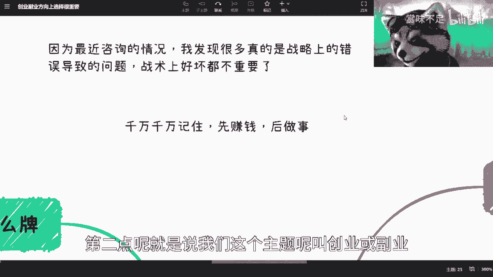
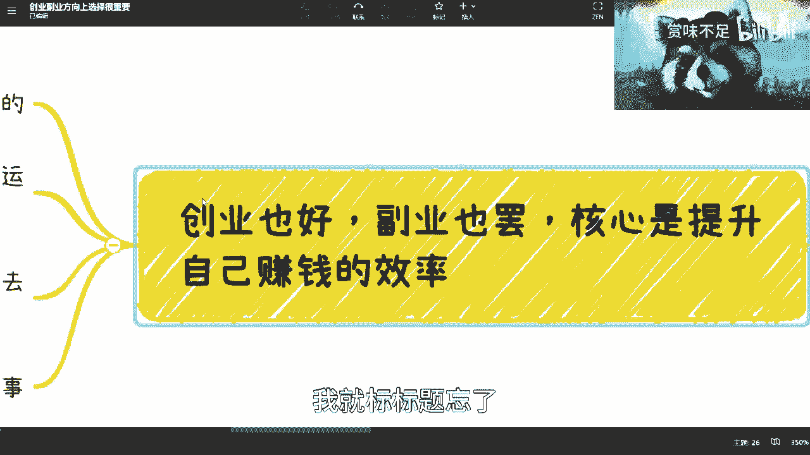

# 创业与副业战略选择指南 - P1 🧭

在本节课中，我们将要学习如何为创业或副业选择正确的战略方向。许多人在起步阶段就因战略错误而陷入困境，导致后续投入大量时间却难以挽回。我们将探讨如何避免这些常见错误，并建立一套清晰的决策框架。

## 战略错误的普遍性与后果

上一节我们提到了战略方向的重要性，本节中我们来看看战略错误的普遍性及其后果。

许多问题源于战略上的根本性错误，即最初的出发点和切入点就不正确。如果在错误的方向上投入了数年时间，再想调整会非常困难。此时，即使建议及时止损，执行起来也面临巨大阻力。

## 核心理念：先赚钱，后做事

理解了战略错误的代价后，本节我们来确立一个核心的行动理念。

选择方向比努力更重要，这是一个广为人知的道理。但在实践中，一个致命的问题是颠倒了顺序。请务必记住一个核心原则：**第一步是先赚钱，后做事情**。

这个原则的公式可以概括为：
**行动顺序 = 实现盈利 -> 完善与发展**

一旦将这个顺序颠倒，你就会面临各种各样无意义的困难。遵循“先赚钱”的原则，即使遇到挫折，也是值得的、有收获的试错。反之，则可能陷入大量无效的困境。

对于已经投入多年却方向错误的情况，调整会非常艰难。但继续在错误道路上坚持，往往没有必要。

## 第一步：盘点与整合自身资源

确立了核心理念，接下来我们需要看看如何起步。第一步是审视自己拥有什么。

最重要的是先考虑自己手上有什么“牌”。对于普通人而言，资源可能有限，但“牌”是可以创造和借力的。

以下是几种“牌”的类型和获取思路：
*   **固有资源**：例如学历、专业技能。
*   **可创造的资源**：例如在网上输出内容（报告、文章）、建立个人痕迹，进行适度包装。
*   **可借力的资源**：通过与他人合作，整合双方的资源。你手上的牌，一部分是自己的，一部分可以是合作伙伴的。

对于已经工作或折腾过一段时间的人，手上通常会有一些零散的资源，比如各种人脉、合作过的伙伴、接触过的业务。你需要像打牌一样，对这些资源进行**排列组合**，将其系统化地整合起来，而不是让它们处于零散状态。

在做任何决策时，尽量找一些有过创业或商业活动经验、靠谱的朋友交流，听取他们的建议。不要盲目自信，普通人并非天生精通商业。获取客观、无利益冲突的外部视角非常重要。

## 需要警惕的战略方向

盘点资源后，我们来看看哪些方向是普通人需要警惕的。虽然无法保证哪个方向绝对正确，但可以指出哪些方向风险极高。

以下是普通人应尽量避免涉足的几类方向：

*   **明显高门槛的行业**：高门槛有两种。一是客观上个人难以切入的行业（如医疗、金融、高端制造业）。二是你的潜在合作方或资本认为门槛高的行业。如果对方一听领域就觉得困难或陌生，合作意愿会大大降低。资本对于这类行业，首先关注的是你的背景、资金和背书，而非想法本身。
*   **明显暴利的行业**：如果一个行业的暴利众所周知（如某些奢侈品、眼镜），说明其利益格局已经固化，蛋糕已被瓜分完毕，不会留下空间给没有特殊资源的普通人。表面的高利润率背后有其复杂逻辑。
*   **垂直细分的小众领域**：这类领域通常有很高的核心竞争力或一定的垄断性。作为资源、技术都有限的普通人，很难切入。
*   **完全饱和的存量市场**：那些发展多年、增长停滞、竞争白热化的市场（如某些传统电商模式），普通人应避免进入。需要注意的是，一个大的行业（如互联网）可能整体饱和，但其与新技术、新需求结合产生的**细分增量市场**，仍可能存在机会。
*   **完全不懂的领域**：老生常谈但至关重要：你很难赚到认知范围以外的钱。在不了解的领域盲目投入，大概率无法赚钱，甚至可能因小失大。

不要幻想轻易改变某个行业。许多事物维持现状，并非因为缺乏想法或技术，而是存在更深层、个人难以改变的原因。

## 导致战略错误的常见认知陷阱

明确了要避开的方向，我们还需要警惕那些导致我们做出错误判断的认知陷阱。

以下是几个关键的认知陷阱：

*   **轻信表面宣传**：不要轻信公司宣传片、营销文案或表面报道。很多光鲜的业务可能只是为了赚取名声而非利润。养活一家企业的核心赚钱业务，往往隐藏在水面之下，不会轻易公开宣传。
*   **轻信所谓“关系”**：不要过度依赖任何未经实际利益考验的关系。商业合作中，可靠的信赖通常建立在“你为他赚过钱”或“他为你赚过钱”的基础上。口头承诺的关系往往不靠谱。
*   **警惕“独一无二”的错觉**：时刻提醒自己，大部分想法都曾被以各种形式尝试过。不要认为自己的切入点全世界独一份。创业是“九死一生”，你看到的成功案例是幸存者，背后有无数失败的尝试。重要的是研究前人失败的原因，避免重复踩坑。
*   **想法必须可被最小化验证**：无论想法多么宏大，都必须能精简到一个最原子的、可验证的赚钱逻辑。核心是：**这个想法如何赚到第一块钱？并且这个赚钱方式是否可复制？** 只有通过最小化验证（MVP）的想法，才值得继续投入。试错的核心是验证，没有验证的想法毫无意义。

## 核心策略：提升赚钱效率

最后，我们来探讨执行层面的核心策略：一切围绕提升赚钱效率展开。

创业或副业的核心是提升你的赚钱效率。如果你的新事业效率低于或等于打工，那就难以持续。

以下是提升效率的几个关键点：

*   **模式走通后，寻求规模化**：你的首要任务是试错并走通商业模式。一旦模式验证可行，就应该考虑如何让他人接手执行，实现流水化运作。你只需把控核心资源与关系。能赚钱的生意不见得都需要融资。
*   **主动构建资源吸引力**：与其四处寻找资源，不如想办法让资源来找你。这就是打造个人影响力或标签的意义。可以通过输出干货、参与行业活动、申请专利（哪怕是初步的创意专利）、经营朋友圈专业形象等方式，告诉市场你能做什么。
*   **坚定不移地执行“先赚钱”逻辑**：无论你的理想是什么，行动逻辑必须是先实现变现，再考虑完善、优化或扩大规模。首先验证你的想法是否有人愿意买单。

验证想法其实很简单：带着你的想法，去接触潜在客户（C端）、合作伙伴（B端）或投资人。每个群体找十几二十个对象去聊，收集反馈。你很快就能知道这个想法是否靠谱。

困难往往源于对未知的恐惧和缺乏行动。只要你是真诚的、愿意付出一定努力（如付费咨询）而非只想“白嫖”，大多数人愿意交流。迈出第一步去试错并不难，难的是找到真正能赚钱且可规模化的路径。

## 总结

本节课中我们一起学习了如何为创业或副业选择战略方向。

我们首先指出了战略错误的严重后果，并确立了 **“先赚钱，后做事”** 的核心行动准则。接着，我们学习了如何盘点与整合个人资源作为起步基础。然后，我们列出了普通人应警惕的几类高风险方向，如高门槛行业、暴利行业等。此外，我们还剖析了轻信宣传、过度依赖关系等常见的认知陷阱。最后，我们强调了所有努力都应围绕 **提升赚钱效率** 展开，并通过最小化验证来测试想法的可行性。

记住，正确的战略方向是成功的基石，而持续验证和调整是穿越迷雾的指南针。