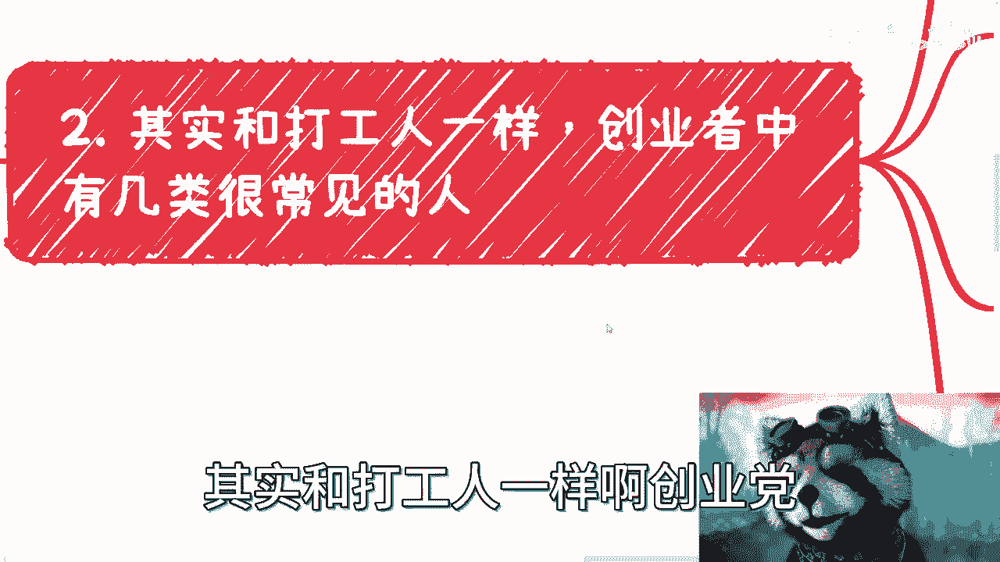
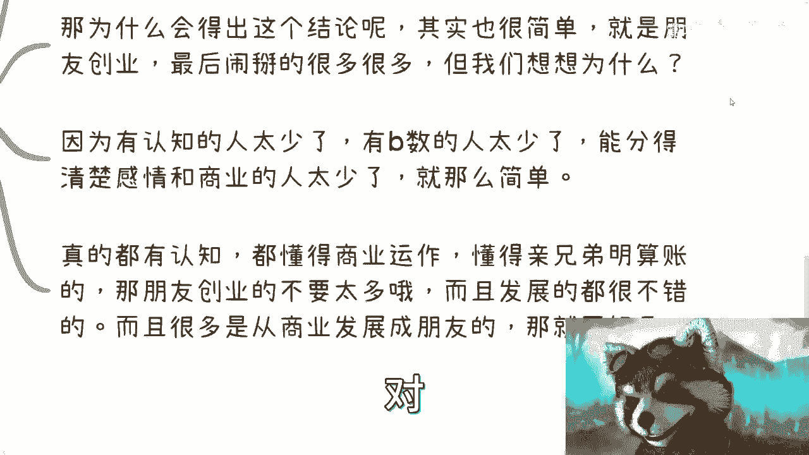
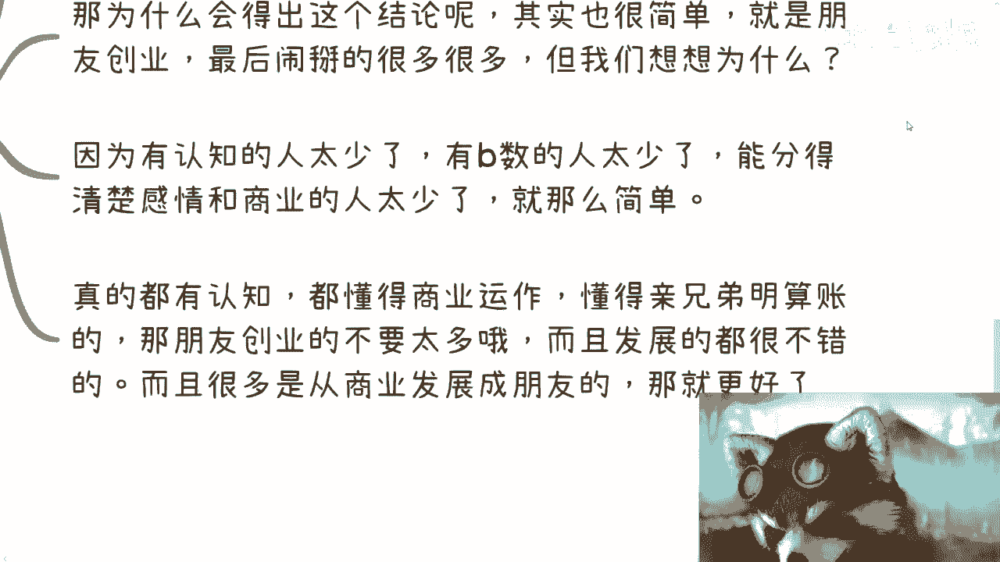
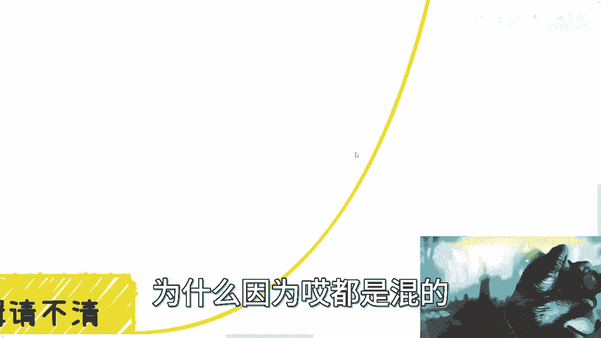

# 创业者中其实大多数人也还是电池思维 - P1 - 赏味不足 - BV19W4y1o7du

啊大家好啊，这个有小伙伴让我在有丝分裂成四个是吧，那也能分裂啊，也能分裂这个呃明后天我要去杭州哦，可能就没空更新了，反正先跟大家说一下啊，呃那么这一期呢我们来讲的是什么呢，是创业者啊。

这个很多人呢会觉得创业者老牛逼了啊，这穿越者是不是说这个都不是电池思维啊，就好像大家说我套了一个创业者的title啊，我就牛逼了，我跟你讲啊，并不是啊，那创业者要是都不是电视思维呢。

那他妈也就早就成功了啊，也不会说这个还有很多人被坑成狗是吧，那之所以被坑啊，之所以不成功，就是因为他们的想法没有更改过来啊，首先我们先分分类啊，其实啊我们来看创业者，并不是说看他做什么领域啊。

那现在很多人觉得哎呀这个AIGC对吧，以前什么什么做移动互联网的，反正老牛逼了是吧，然后问他做什么做共享经济是吧，其实不就做个自行车是吧，啊这啊并不是说看他做什么，这个并不重要啊。

也不是看他公司做多大啊，这个有人说我现在公司几千号人是吧啊，怎么样子没卵用啊，也不是看他态度多高，你要看的是什么啊，你要看的是他历史做过什么项目，以及包括现在对吧，他在这些项目里面的作用。

以及它具体到底做了什么啊，因为公司这种东西你懂的呀对吧，就是核心的人其实就那么一两个，剩下都是狐假虎威的好，那么他跟你一顿乱吹对吧，你上来就很牛，上来就被他唬住了啊，然后呢还有这个一顿崇拜对吧。

那基本上就是废了啊，所以说呢就是说你要去了解一个人，你要去合作一个人，你得跟对人，你知道吗，你得合作对人啊，你但凡合作的人不对，那没有用啊，那么这是第一点，第二点呢我们日常碰到那些创业者呢。

多数中的多数啊就是拉皮条的啊，但你会发现他们的皮条呢是断层的，就是拉皮条这件事情没有毛病，因为大家是为了赚钱嘛对吧，那你拉就拉呗，对不对，呃，那么什么叫皮条是断层的呢，简单来讲就是说他们的拼图啊。

不能拼出一个完整的变现链路啊，变现逻辑，那么再简单来讲，就是说他们的拼图不能完整的拼出一张图，那么中终究呢就是你会发现哎呀，东一块西一块对吧，就东一块呢跟你说我资源很牛逼，西一块呢跟你说资源很牛逼。

但是搞来搞去的吧，可能你刚才搞了一两个月，发现他妈的就不赚钱，你不知道也不知道为什么对吧，那这种是很多的啊，那么这是第二点啊，还有一类呢就是项目做的不错啊，融资呢也不错，各种都不错。

但是啊你依然会感觉到赚不到钱啊，那么主要原因有两个，一个呢就是这个日常碰到这个样子的多数啊，还是这个呃就是就是包装嘛，就我们说就纯吹啊，或者说就是包装出来的，那还有一类是什么呢，就是说我这边写到一半。

我发现我后来写到后面去了，就嗯这种项目做的不错，能做不做，还有一类是什么呢，就是说他可能赚到钱了，但是还是那句话，就是说你碰到的人可能不对啊，那当然也有一种可能性是他项目做的不错，融资也不错。

但是你会发现项目做的不错，融资不错，跟他能不能赚到钱，这两件事情其实是不划等号的哦，是不划等号的，所以说啊就是这个当中还是得要看它的，叫做变现的链路到底是怎么样子啊，呃这个事情其实很简单。

我随便给你们举个例子，就比如说你们现在你们现在比如说啊，公司100多号人对吧，那你可能出去说出去就会感觉爱自己，蛮牛逼的对吧，哎呀不行不行，这个小熊猫太丑了，换掉换掉换掉换掉换掉换掉换掉换掉换掉。

换掉换掉，哎呀好了好了对吧，就是你会发现啊。

就是说啊说出去蛮牛逼的，没毛病啊，但是呢你为什么没有钱呢。

就是因为哎员工五险一金要发吧，工资要发吧对吧，日常的开支要弄吧，你会发现很多人是倒贴的啊，所以说呢就是说这个东西呢也只能说啊，这个融资不错，项目不错，但不能代表他赚到钱啊。

那当然还有真正的那些做的不错的创业者对吧，就我们说的那些啊，不管是赚大钱的，赚小钱的对吧，就是说啊成功的那些人我就不放这边了，为什么不放这边呢，因为一般啊这种人我们在日常你是碰不到的。

人家哪有空去参加什么活动，人家哪有空去参加什么大会，人家哪有空去参加一些有的没的对吧，你最多就是大家熟悉的人对吧，弄弄个饭局对吧，四五个人，那也顶天了，已经对吧，我跟你讲，真正的创业者很忙的。

真的很忙的，你知道吗，就是就是我就这么说，你们所有经历过什么字节，阿里BT的这种这种忙都不算忙，你知道吗，就真的忙是连轴转的，就是那种我以前跟别人创业，我以前跟别人做东西，就是就是真的24小时不停的。

你知道吗，就连轴转的开会，这叫创业，你知道吗，这叫工作，你知道吗，嗯我我觉得很多人他对加班毫无认知，真的毫无人知啊，那么正常场合下面你见不到，因为真的忙成狗。

真的是用命在拼哦，所以呢我就不放在这里了，那么我们来说第二个啊，其实和打工人一样啊，创业啊。

创业者当中呢有几类是很常见的，就说白了他们的思维是不变的啊，一类呢就是一言堂啊，一言堂呢说是创业，其实呢他就是满足自己的控制欲的一种方式啊，就比如说我是一个一言堂的人啊，无论你们今天跟我合作啊。

还是创还还是合伙人啊，还是你们给我打工，你会发现呢，可能唉吕老，吕老师这个人平时沟通都蛮好的对吧，玩的也蛮好的啊，大家出去吃个饭也都蛮好的，一旦创业了，我跟你讲啊，就是你们随便说什么都好，对的也好。

好的也好，坏的也好，错的也好，我一律都不听，反正就是我说了算，我就是最牛逼的，你们都是垃圾，你知道吧，我跟你讲，这种人很多的哦，这种人日常看不出来的，但这种人不适合创业啊，不适合创业，这第一人。

第二类呢就是创，虽然尝试了很多，也失败了很多次啊，你会发现这是一个经验值非常丰富的，经验值非常高的这么一个创业者，但依然呢是不改正，什么意思呢，就是说它不复盘哦，他不去，他总在同一个坑里面去叠对吧。

那么这个所以说呢创业时间长短跟做项目多少，并不代表这个人商业思维的强弱啊，没有关系的，很多人你会发现一直在创业，称之为自己叫什么叫连续创业者，但没有卵用啊，然并卵啊，本质上呢还是说他思维没有改变。

你知道吗，你你你一直创业，那他妈我还说我一天到晚就打，比方说就是呃以前老话说得好，他说你把一件事情作为成千上万遍对吧，你就要成为专家，那成千上万变你得改变啊，你得改进啊对吧，你不改变，你老是在那边好。

我1+1=3，好不对，明天1+1还是等于三，那你改个啥呀，对不对，改个锤子哦，是不是啊啊，用电池的思维方式，在创业本质上是没有区别的啊，本质上就只不过就是换个场地去打工，对不对啊。

那么第三类呢就是坑蒙拐骗的啊，那么这个呢跟拉皮条跟我跟我跟你说，我跟你们说的那种包装还不太一样，什么意思呢，就拉皮条也好，包装也好，其实很多人他是懂得保证哦，懂得拉才能去做的啊，坑蒙拐骗是什么感觉呢。

就是他没有商业思维的，你知道吧，就是那种就是说靠包装之后纯忽悠，然后纯蒙，你知道吗，就是说白了就瞎猫碰死耗子，我能蒙多少算多少啊，而且呢他做事情方式呢非常的毫无底线啊，就比如说他可能认识不认识你啊。

他就跟别人说啊，就打个比方，就比如说他不在这个中科院，中科院的，他就跟人家说啊，你看我是中科院的啊，比如说他不是院士，他就跟别人说，你看我是院士是吧，这样子啊，就这样子，当然没这么傻是吧。

他可能说一些什么协会啊，什么东西啊对吧，就是说你有些合作在线，你跟别人说，哎你你可能是个协会的理事会单位啊，对会员单位啊对吧，或者说这个呃那个叫什么副会长啊，那也就算了对吧。

咱咱就退1万步来讲，你至少擦点边吧是吧，有很多我跟你讲这边都不擦的啊，那还有一类呢就是最多的一类啊，我跟你讲这种人是最最最最不合适的，是什么呢，就是那种我要做就要做大生意，哎老牛逼了，你知道吗。

这就动不动我要一个小目标，你知道啊，那么这类人呢我跟你讲就真的别去创业，为什么呢，就是我跟你说，这类人一般是有能力的，不是他没有能力哦，也不是纯属眼高手低，但是呢你一旦创业，说好听点叫做想法很多。

说不好听点就是眼高手低，而且这种眼高手低，如果他一个人无所谓，但是你创业这件事情，你要跟你的小伙伴，跟你的合作方，你得有交代的对吧，就说白了你自己做不好，做得好，这是一回事，你的合伙人。

你的小伙伴跟着你，你得对他们负责的对吧，那么千里之行始于足下对吧，你任何一件小事情都不愿意做，那就别做了，我跟你讲，你跟就是你在认识的人的时候，你会如果发现这种人，你就会发现他讲的东西都很有道理啊。

他的方向也很对啊，也没有不对，但是就是他的东西是不落地的，为什么，因为0~1没有的，他永远想的是我零怎么跨到100，那他妈怎么可能呢。

对不对，这不是扯淡吗，那么三我这地方提一点啊啊俗话说得好，他说啊很多人呢会说朋友不能创业啊。

我跟你讲，其实我们得要看清楚本质。

什么意思呢，就是说朋友不能创业，这两者是没有因果关系的对吧，你跟我说好，大家是朋友不能创业，那他妈是玄学对吧，这不是科学。

这是玄学啊，但是呢你会发现为什么会得出这个结论啊，其实也很简单，因为朋友之间创业最后闹掰的很多很多，对不对，那久而久之他就得出了这个结论，那么我们可能再往下想一想嘛，你们想想看。

为什么朋友之间创业闹掰很多很多，那好了，那这个时候有人要说了，他说那肯定是会分赃不均嘛，对吧啊。

这个就这个意思啊，肯定分赃不均了啊，但是我跟你讲，其实不是的啊，就是钱这个东西只是一个结果，但是你真正会闹掰，不是仅仅因为钱，你知道因为什么，因为有你从朋友角度之间啊，你们想想看所有人的朋友之间啊。

两个人，比如说两三个人一起合作，一起创业啊，这三个人得同时要有认知，同时要有逼数，同时要分得清楚朋友跟商业，同时又要拥有商业逻辑，你觉得这个概率有多大，你们自己想想看，就这个概率就他妈有点像什么。

有点像，就是说你说我今天找一个这个，五个手指头的人啊，不呸我今天找一个六个手指头的人，你说找不找得到，找得不是找不到的，你们去看啊，有的啊，但是你说我要在一个朋友里面，大家认识的啊，同时找出来三个人啊。

一个手上有六个手指头的，那这这是多大概率。

对不对，所以说呢这个事情就是到最后就变成什么呢，就是说我们说朋友啊不能一起创业，但是你会发现呢，真的如果有认知，真的就是懂得商业运作，懂得亲兄弟明算账的，他懂得分得清楚感情跟友情，还有跟商业的。

那么我跟你讲，朋友创业的不要太多啊，怎么会没有呢，而且发展都很好的对吧，而且很多是从商业发展到朋友的。

那就更好了，你知道吗，之所以说朋友不要去创业。

就是因为其实两个人都不成熟，两个人都没有认知，那你让这两个人怎么合作下去啊。

对不对啊，那么我们就说啊。

因为之前有个小姑娘啊，跟我咨询的时候也提到了啊，就是啊我们怎么判断一个商业逻辑清不清晰啊。

其实我跟你讲那简单啊，简单的很啊。

简单的一批啊，怎么简单呢，我跟你讲很简单，你跟对方去聊啊，不管你们问问题也好，还是讨论问题哈，但凡对方这个人是说不清楚自己有什么优势的，啊，怎么赚钱呢，为什么自己能赚钱，你的他的护城河是什么。

他壁垒是什么，对吧哦，或者说他说出来你听不懂的，我跟你讲，那就是逻辑不清晰啊，就他妈没有商业逻辑，就在忽悠你啊，就是自己也不清晰，那边东绕西绕啊，这是第一点，第二点呢就是商业合作，你得有主体吧是吧。

你是不是得有主体，你这个主体可以是个人所谓的个体工商户对吧，你也可以是企业，对不对，那企业里面也有法人吗，啊有股东吗，股东比例吧啊有有有监视吧对吧，尤尤你这个叫什么，就是就是子公司分公司吧对吧。

你总得有个主体吧，对不对，好你跟他聊啊，你就说啊，唉那个我们合作，那你用的主体是什么对吧，你问他主体营业范围是什么啊，交怎么交税的，企业怎么开，个人怎么开几个点，什么什么什么类型，对不对，我跟你讲。

他但凡是个创业者，都这都如果这都搞不清楚，这他妈就是个骗子，就这么简单。

这不难啊，第三个商业合作要签合同吗，啊我不管是跟合作网签，还是比如说今天你们来找我对吧，吕老师说我们要合作，那我第一我跟你讲第一件事情是什么，我一定会给你们国word先签，别逼逼，你知道吗，先签你不签。

别干活啊，对不对，因为这个事情是对你负责，也是对我负责，我跟你讲，不主动提出签合同的事的，肯定是商业逻辑不清晰的，就这么简单，或者就是他用名字来坑你，不就这么简单吗。

对不对，你们日常出去聊，我跟你们说一样的啊，就这么几件事情，就是你我不管你跟他熟不熟，我觉得你都可以问，对不对，因为什么，因为这个是很简单啊，我问你这些问题不是为了challenge。

你就不是为了挑战你，对不对，我问你这些问题是为了让我们更好的合作哦，你不回答我，或者你跟我绕圈子，那你就没想着合作吗，那有什么好合作的，对不对，我跟你说，你们但凡出去聊，我跟你们这么说，他妈的。

95%以上的创业者，对这些东西分不清楚的，为什么，因为都是混。

唉这是混谁不会啊，是不是啊，那我最后提了一点啊，在这样一个阿猫阿狗啊都能生孩子，当家长的时代啊，你们自己想想，真的哈想想就蛮惨的啊，以后都是巨婴啊，这满大街都是arm阿狗，你懂吗，什么意思呢。

就是以前我们说什么说中关村啊，这个咖啡馆啊，3W咖啡啊，这个里面随便这个这个坐坐几分钟就能听到，旁边是互联网的创业者创业者对吧，这个没毛病，大家当时是想做事情，但我跟你讲，你放到2023年，现在卧槽。

放到现在什么他妈的到处都是骗啊，到处都是忽悠，他妈到处都是阿猫阿狗啊啊就我跟你讲，就像那个前两天我做那个视频，就是的对吧，就是就是阿猫阿狗都能来challenge，我做区块链的，我也真的是服气了对吧。

哎我再怎么不济啊，我怎么地我也是给南大给交大啊，这个这个给给包括交代mm，我是上过课的人对吧，怎么滴对吧，苏州海南上海，中国各地方政府里面的很多的这个省厅领导，也是我做的培训啊。

这这还有人来牵着我做区块链，我也真的是服气的啊，你知道吗，所以说就是本质上你们要明白，不是说创业者，包括就是说啊，这个这个你比如说我们不说他创业者，比如说他今天是一些啊理事长啊对吧。

或者说是一些什么协会会长啊对吧，或者来说呃就各种开头啊，就是你们千万不要被任何title唬住，你知道吗，就是你看我判断人现在态度很明确，就是我不管他是谁，在我面前，你但凡说出来。

只要说出来让我觉得不合理的，不make sense的，你就是，就这么简单，我管你是谁，对不对啊，好吧，就这么着啊，这个有大家反正有这个叫什么，有有有创业不要创业啊，就是有任何的职业规划啊。

包括就是你们有副业上啊，或者说有些未来包括数字经济啊，或者其他的有什么想法的啊，然后最好我跟你讲，最好的是什么呢，就是有一些实际的东西的啊，有些实际方向的，你们整理好好吧，然后私信可以咨询我，好吧。

