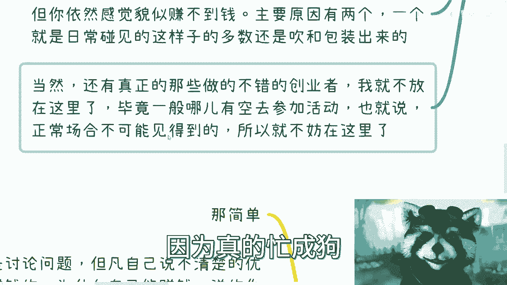

# 创业者思维认知课 P1：识别“电池思维”创业者 🔋

在本节课中，我们将要学习如何识别创业者中普遍存在的“电池思维”。很多人认为创业者必然拥有超越常人的商业思维，但事实并非如此。许多创业者依然在用“打工者”的思维方式进行创业，这直接导致了他们的失败或难以成功。本节课将帮助你拨开迷雾，看清本质。

## 如何正确评估一个创业者？🔍

上一节我们提到了“电池思维”的概念，本节中我们来看看如何在实际中评估一个创业者。评估的关键不在于其外在光环，而在于其内在实质。

评估创业者时，不应关注其从事的领域、公司规模或态度高低。真正需要关注的是其历史项目经历、在项目中的具体作用以及实际贡献。公司的核心往往只有一两个人，其余可能只是“狐假虎威”。若因对方的吹嘘而产生崇拜，合作便难以成功。合作的前提是“跟对人”。

以下是评估时需要关注的核心点：


*   **关注实质而非光环**：忽略其Title（如AIGC、共享经济创业者）、公司人数。重点考察其**历史项目**和**具体贡献**。
*   **警惕“核心人”陷阱**：公司的成功通常依赖于极少数核心成员。需要辨别对方是真正的核心，还是仅仅依附于光环。

## 常见的“电池思维”创业者类型 🧩



理解了评估原则后，我们来看看市场上常见的几种具有“电池思维”的创业者类型。认识这些类型，能帮助你有效避坑。


### 1. 资源“拉皮条”型
这类创业者占大多数。他们的特点是资源信息碎片化，无法整合成完整的商业变现链路。

他们的拼图是**断层**的。具体表现为：口中资源很多，但东一块西一块，无法拼凑出清晰的**变现逻辑**。合作数月后，往往发现项目不赚钱且原因不明。

### 2. “纸面繁华”型
这类创业者项目看似不错，融资也顺利，但参与者依然感觉赚不到钱。

原因主要有二：
*   **纯包装炒作**：项目成功仅是表象，经不起推敲。
*   **变现链路缺失**：项目成功与个人赚钱是两回事。公式可以表示为：
    `项目成功 ≠ 个人盈利`
    例如，一个拥有100多名员工的公司可能表面风光，但大部分收入用于支付**工资**、**五险一金**和**运营成本**，创始人可能实际在倒贴钱。


### 3. “隐形成功”型
真正成功、能持续盈利的创业者，在日常公开活动中几乎见不到。他们极其忙碌，工作强度远超常规大厂员工，是“用命在拼”。因此，在普通社交场合声称自己非常成功的，需要打一个问号。

## “电池思维”的具体表现与危害 ⚠️

除了上述类型，一些创业者的行为模式本身就揭示了其思维的局限性。这些表现与普通打工者的思维误区同源。


和打工人一样，创业者中也有几种常见的思维固化类型：


以下是几种典型表现：


*   **控制欲“一言堂”型**：创业是为了满足个人控制欲。日常沟通顺畅，但一旦开始合作，便听不进任何意见，独断专行。这类人不适合需要协作的创业。
*   **重复踩坑“不复盘”型**：虽是“连续创业者”，经验丰富，但从不复盘。总是在同一个问题上反复失败。这证明了：
    `创业时间长短 ≠ 商业思维强弱`
    用电池思维创业，只是换了个场地打工。
*   **毫无底线“坑蒙拐骗”型**：与有技巧的包装不同，这类人毫无商业思维和底线，靠虚假身份（如冒充权威机构头衔）纯忽悠，是“瞎猫碰死耗子”的心态。
*   **好高骛远“眼高手低”型**：最常见也最危险。他们有能力，但只想做“大生意”，动不动谈论“小目标”。其想法听起来有道理，但永远无法落地执行，因为他们幻想跳过从0到1的过程，直接达到100。这违背了基本规律：
    `商业成功：0 --> 1 --> 10 --> 100`


## 核心原则：如何判断商业逻辑是否清晰？ ✅


那么，在与创业者接触时，如何快速判断其商业逻辑是否清晰可靠呢？我们可以通过几个简单直接的问题来检验。


判断方法其实非常简单，只需在交流中确认以下几点：


以下是三个关键的检验问题：

1.  **能否说清盈利模式**：询问对方的核心优势、盈利方式、护城河是什么。如果对方说不清，或说得让你听不懂，大概率逻辑不清，是在忽悠。
2.  **是否明确合作主体**：询问合作以什么主体（个人、个体户、公司）进行，以及相关的股权、税务等基本问题。代码可以类比为：
    ```python
    # 一个清晰的商业主体应有明确定义
    class BusinessEntity:
        def __init__(self, entity_type, scope, tax_info):
            self.entity_type = entity_type # 主体类型
            self.business_scope = scope # 营业范围
            self.tax_registration = tax_info # 税务信息
    ```
    如果创业者对这些基础问题含糊其辞，基本不可信。
3.  **是否主动提及合同**：正规的商业合作必须签订合同。不主动提出签合同的一方，要么商业逻辑不清晰，要么就根本没打算正规合作。这是一个重要的风险信号。


**交流心法**：提出这些问题是为了推进合作，而非挑战对方。如果对方回避或绕圈子，则证明合作基础不存在。


## 总结与行动建议 🎯


本节课中我们一起学习了如何识别创业者中的“电池思维”。

我们首先明确了评估创业者应**关注实质而非光环**。随后，分析了四种常见的“电池思维”创业者类型：“拉皮条”型、“纸面繁华”型、“一言堂”型和“眼高手低”型。最后，我们掌握了通过**询问盈利模式、合作主体和合同意向**来快速判断对方商业逻辑清晰度的实用技巧。

在这个信息纷杂的时代，各种Title和光环很容易让人迷惑。核心在于保持清醒，坚持用基本的商业逻辑和常识去判断人和事。**不要被任何Title唬住**，任何让你觉得不合理、不make sense的言论，都值得高度警惕。

希望本课能帮助你在未来的创业或合作中，更好地识别伙伴，避开陷阱。