# 课程名称：信息差认知与商业实践 🧠 - P1

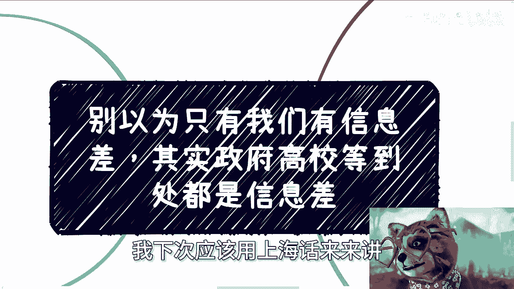

## 概述

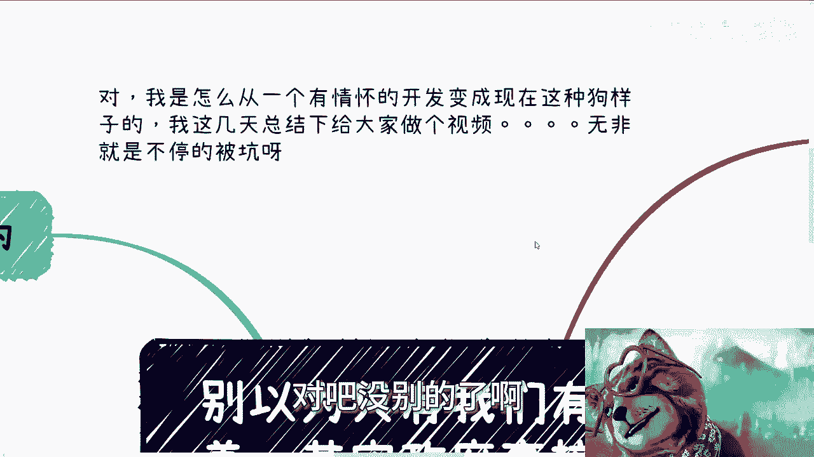

在本节课中，我们将要学习一个核心概念：**信息差**。我们将探讨信息差不仅存在于个人之间，更广泛存在于政府、高校、企业等各个层面。理解并利用这种普遍存在的信息不对称，是把握商业机会的关键。课程将结合具体场景，用简单直白的语言解释这一概念，并提供实用的思考角度。

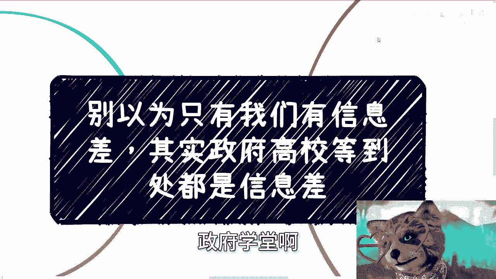

---

## 第一节：信息差无处不在 🌍

上一节我们介绍了课程主题，本节中我们来看看信息差的基本定义与普遍性。

信息差是指信息在不同个体或群体间的不对称分布。这种不对称并非个人独有。

例如，有学员询问如何学习“数字经济”这类新兴领域的知识。答案并非来自闭门造车，而是通过多方交流、观察与自我总结获得。在这个过程中，一个关键认知是：**你无法绝对确认自己掌握的信息是“正确”的**。

但这并不妨碍行动，因为其他人（包括客户、合作伙伴）同样不知道什么才是“绝对正确”。在信息模糊的领域，谁能率先提供一套能自圆其说的逻辑或方案，谁就占据了优势。这本质就是利用信息差。

所以，信息差源于两方面：
1.  **主观认知局限**：由个人教育背景、经验导致。
2.  **客观环境趋势**：在新兴领域，所有人，包括机构与政府，都处于探索阶段。

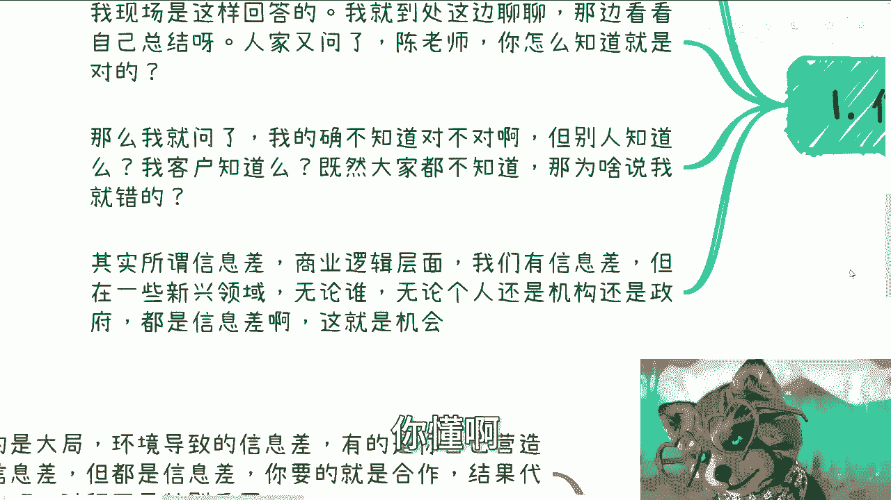

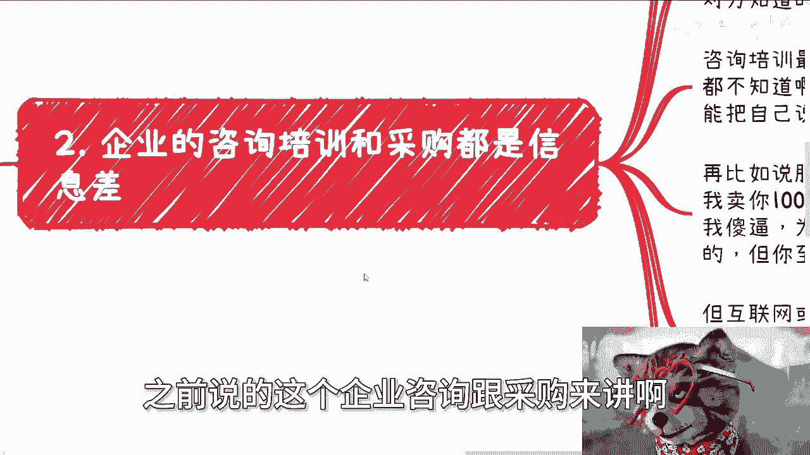

**核心公式**：
`机会 ≈ 存在信息差 ∧ 你能提供可信的解决方案`

---

## 第二节：咨询业务中的信息差实践 💼

理解了信息差的普遍性后，我们来看看它在商业咨询中的具体体现。

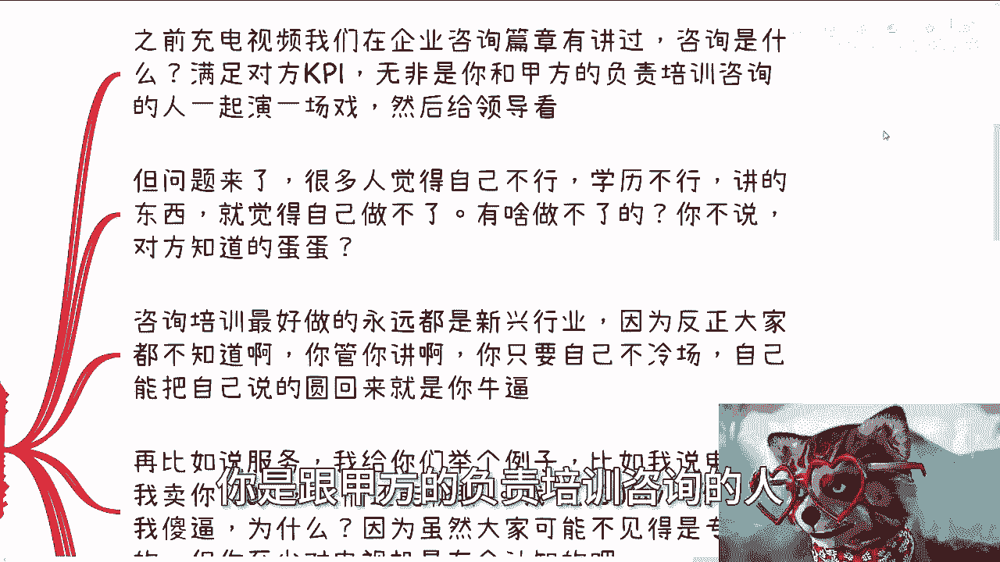

在为企业或政府提供咨询服务时，专业方案固然重要，但更关键的是理解对方的真实需求。通常，甲方并不完全懂你的专业领域，他们需要的是能帮其完成KPI、向上级汇报的“解决方案”。

以下是咨询场景中信息差运作的关键点：

*   **需求本质**：咨询常是乙方与甲方具体负责人共同“演绎”给上级看的过程，目的是让各方“满意”。
*   **自信的价值**：许多人因自觉学历或经验不足而退缩。但在新兴领域，大家起点相似。只要你能逻辑自洽地阐述观点，对方缺乏判断你背景真伪的能力和途径。
*   **最佳领域**：信息差红利最大的领域是**新兴行业**（如曾经的数字经济、当前的AIGC）。因为“大家都不懂”，你的知识就构成了稀缺价值。

**核心逻辑**：
```plaintext
如果（对方比你懂）那么 他不会找你咨询。
既然（他找你咨询）那么 他大概率不比你懂。
因此，你拥有信息优势。
```

---

## 第三节：定价与方案包装的艺术 🎨

上一节我们讨论了如何建立咨询信任，本节中我们来看看如何将信息差转化为具体的商业价值，尤其是在定价方面。

在产品或服务定价上，信息差的作用尤为明显。对于大众熟知的商品（如电视机），价格有公共认知区间。但对于专业化、数字化的产品或服务（如企业数字化改造、SaaS系统），客户往往缺乏价格基准。

以下是关于定价的几个要点：

*   **价格锚点的缺失**：当客户不清楚市场合理价格时，你的报价就成为了重要的参考锚点。
*   **专家角色的局限**：客户方的技术专家通常只评估方案可行性，很少深度参与商业定价。价格谈判涉及预算、商务等多重因素。
*   **定价的核心依据**：最终价格往往不取决于你的成本，而取决于**客户的预算范围**以及你如何**包装方案的价值**以匹配该预算。

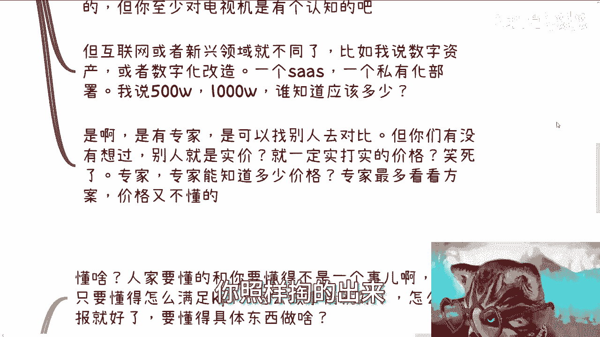

**核心要点**：
`最终成交价 ≠ 产品成本`
`最终成交价 ≈ f(客户预算， 方案价值包装， 谈判能力)`

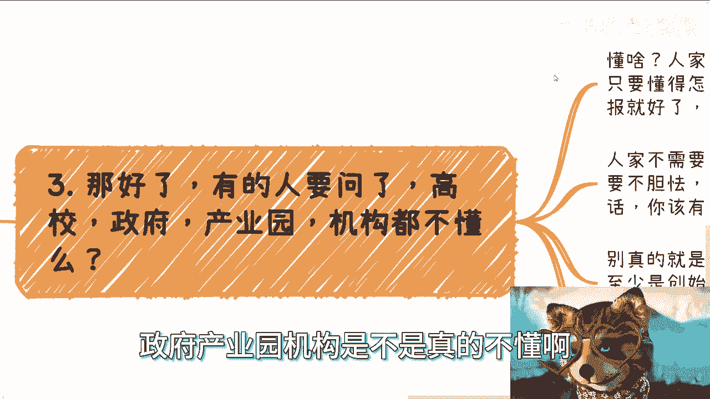

---

## 第四节：与机构合作的正确心态 🤝

我们了解了定价策略，现在来看看与政府、高校等机构合作时，应具备怎样的心态。

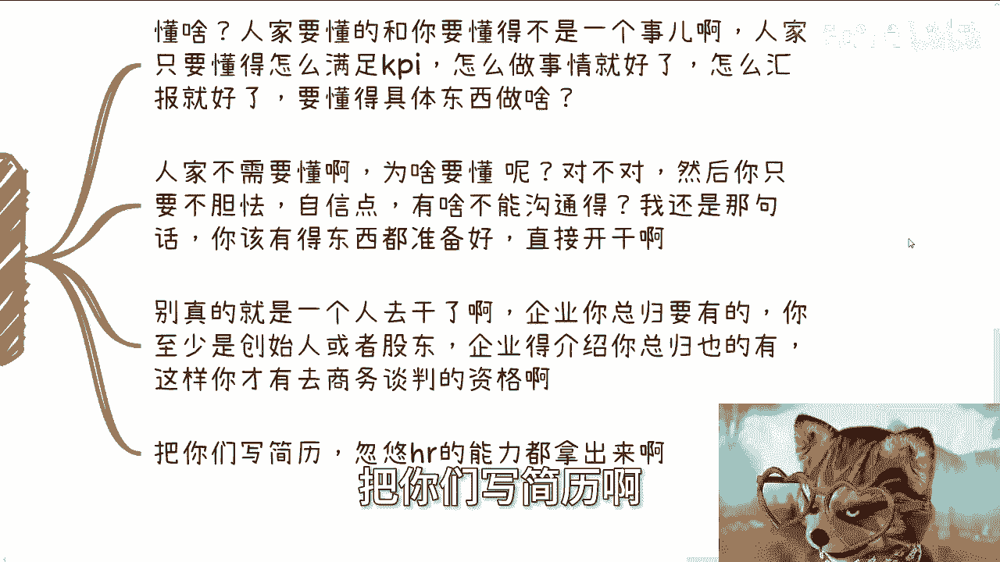

许多人误以为这些机构的决策者必须是技术专家。实则不然。他们的核心职责是履行职能、完成KPI、进行有效管理和汇报。

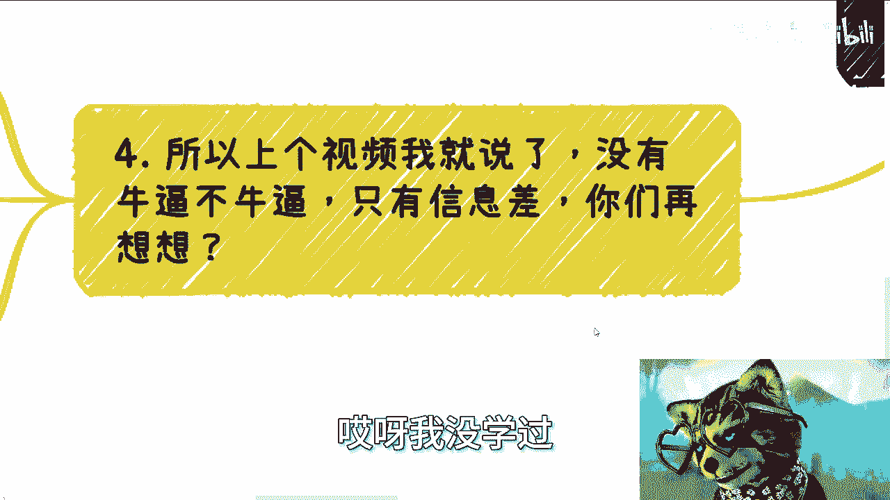

以下是与之合作时需要明确的几点：

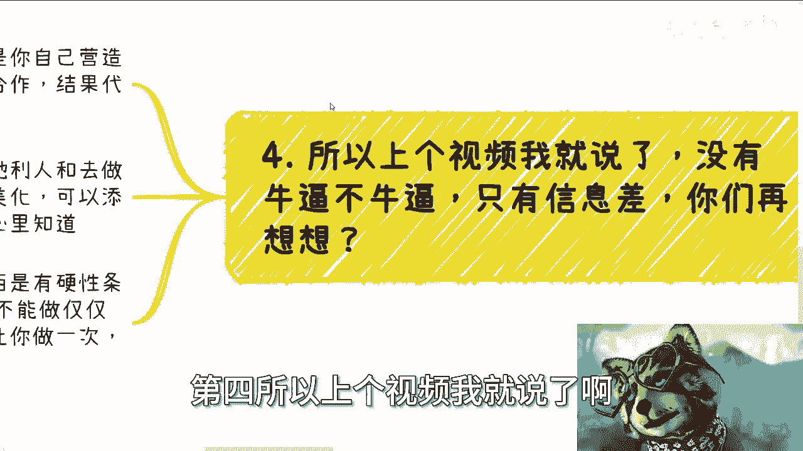

*   **对方懂什么**：他们精通的是行政管理、资源协调和流程把控，而非具体的技术细节。他们不需要成为AIGC专家，只需要知道谁能帮他们完成“引入AIGC技术”这个任务。
*   **准备的重要性**：尽管内核可能灵活，但表面功夫必须专业。你需要准备齐全的材料，例如：
    *   合法的公司实体
    *   精美的企业介绍PDF与网站
    *   清晰的团队背景介绍
*   **心态转变**：将找工作、包装简历时的那种“能力展示”心态，运用到商业合作中。自信、专业的呈现是敲门砖。

**行动建议**：
停止自我设限（如“我学历不行”、“我没经验”）。阻碍你的往往是自己，而非对方预设的苛刻条件。

---

## 第五节：利用信息差，专注行动 🚀

上一节我们打破了对于合作方的不必要敬畏，本节我们来总结如何将信息差思维转化为行动。

成功往往不是精密规划的结果，而是**天时、地利、人和**加上果断行动的共同产物。信息差提供了“地利”，而行动创造了“人和”。

以下是关于行动的关键总结：

*   **结果导向**：商业世界看重结果。你如何利用信息差达成结果是你的“商业机密”，过程本身不被过分关心。
*   **拒绝空想**：没有人能真正预知未来。所谓的“前瞻性”，很多时候是事后基于成功结果的总结与美化。真正的机会多在行动中涌现。
*   **识别硬门槛**：有些行业（如能源、医疗、军工）存在资质、资本等硬性门槛，个人难以突破。但大多数新兴的、服务型的领域没有这种绝对限制。
*   **核心任务**：与其空想或焦虑，不如去做一件事：**尽可能多地了解各行各业真实的赚钱模式**。拓宽认知，才能发现潜在的信息差机会。

**最终总结**：
`可行域 = 全部领域 - 有硬性门槛的领域`
`你的机会 = 在可行域内， 找到信息差并勇敢行动`

---

## 总结

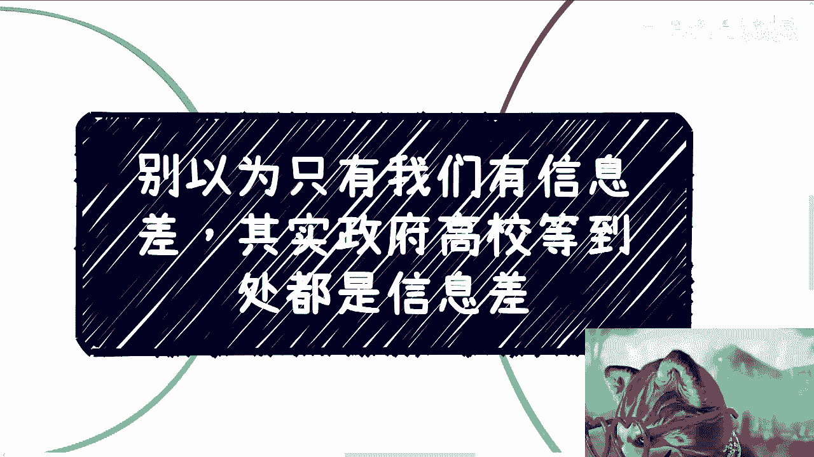

本节课中我们一起学习了“信息差”这一核心概念。我们认识到信息差无处不在，从个人认知到政府、高校等机构层面均广泛存在。在商业实践中，尤其是在咨询、新兴领域合作中，理解并善用这种信息不对称至关重要。关键在于建立自信、进行专业包装、理解对方真实需求（通常是完成KPI），并以结果为导向果断行动。请记住，大多数自我设限都是纸老虎，真正的障碍只存在于那些有法律或资质硬性门槛的行业中。拓宽视野，深入实践，是发现并利用信息差的最佳途径。