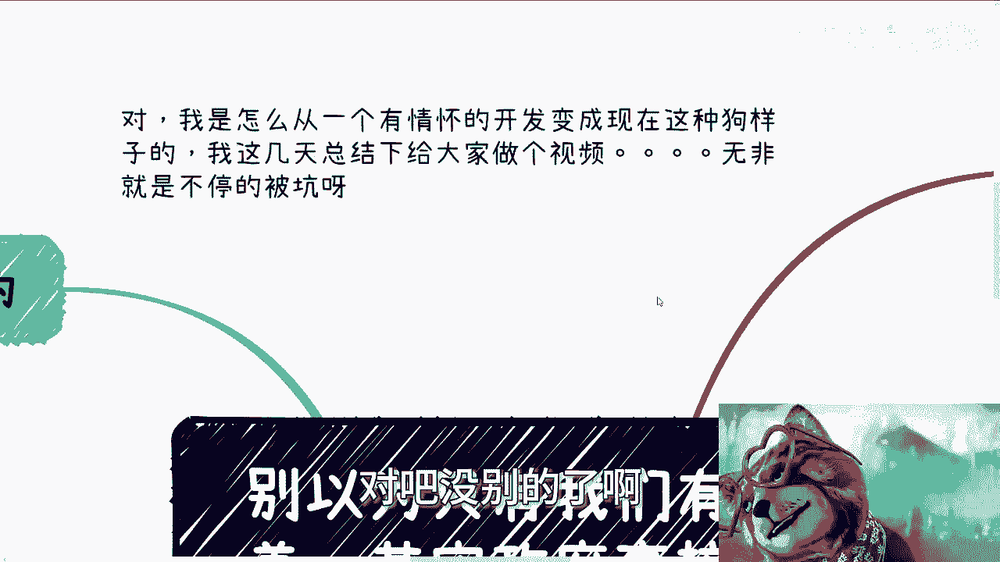
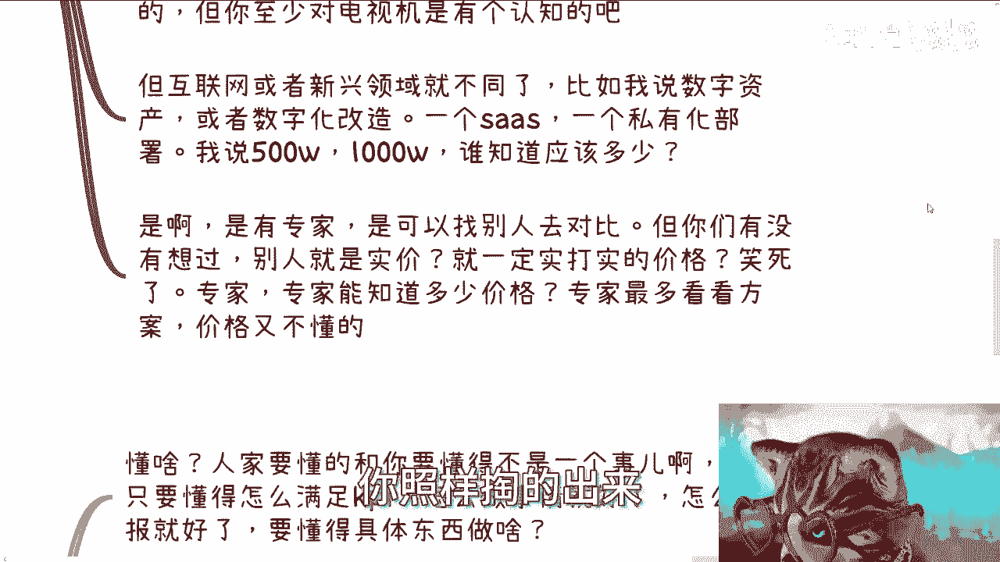
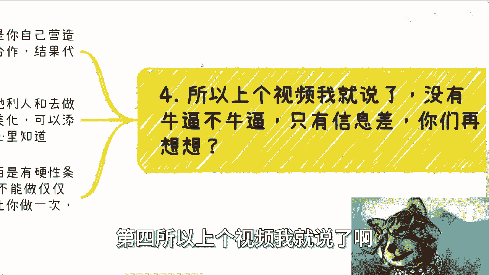

# 别以为只有我们有信息差，其实政府高校等到处都有信息差 - P1 - 赏味不足 - BV1L64y1K7YZ

哈喽大家好，我下次应该用上一话来讲是吧。

打个活啊，呃呃对啊，那个这个评论区有小伙伴表示，让我讲一下这个怎么过来的啊，呃这个主要是什么呢，主要是咨询的话，我可以讲公开呢，有很多东西讲不了，因为太敏感对吧，这个我总不好公开去喷一些什么东西是吧啊。

呃这个我是怎么从一个有情怀，有情怀的开发变成现在这种狗样子的啊，可以总结总结，无非就是不停的被坑对吧，没别的了啊。

朴实无华啊，真的朴实无华啊，呃本次这个主题啊啊别以为只有我们有信息差，就跟上次那个视频啊，跟昨天晚上那个视频一样，就是就是我跟你们讲啊，不是只有我们信息差，所有地方都有信息差，你知道吧。

我来帮你们翻译一下这句话怎么翻译啊，我以为只有i love you，要是信息差费不设计高度，政府扩张，导致在这哼飞不来啊。

飞不来翻不来啊，星期三翻不来，我也不知道怎么讲，第一啊，信息差是everywhere啊，什么意思，就是说你比如以前上海的活动，有小伙伴问我，他说陈老师，现在他说，因为那个上海活动是2023年嘛对吧。

他说现在我们学数字经济都不知道去哪学啊，他说你当时怎么学的，他说我们现在找，都不一定找得到啊，他说你当时怎么搞的对吧，很简单啊，我现场怎么回答呢，我就说我说我就这边跑跑那边跑跑，这边聊聊，那边聊聊。

这边看看那边看看，对不对，自己总结怎么滴啊啊，我坐在家里打坐冥想好，我想出来一套大纲不可能的呀，对不对啊，啊那你说我借鉴啊，我的确也借鉴了啊，我借鉴了一部分东西啊，但是，人家又要问了，他说那陈老师。

你怎么知道你看的就是对的呢，好问题啊，好问题，我当时现场是这么问的，我说我的确不知道是不是对的，但问题是不耽误，我不知道别人也不知道，who care啊，是不是哦，我我非要去找一个对的。

我咋知道什么是对的呢，对不对啊，那我就问你，我说我客户知道吗，我甲方爸爸知道吗，唉我我的我的乙方知道吗，那既然没人知道，那为什么说我是错的呢，对不对，那不一个道理嘛，啊所谓信息差，什么叫信息差。

那么信息差就是怎么讲呢，就是你们记住啊，没有对跟错这件事情啊对吧，那你所谓信息差，商业逻辑层面我们有信息差，但是啊你比如说你说我我就说很多人啊，很多人这个呃比如说应届生对吧，或者说这个本硕博。

包括工作了很多年了对吧，他对商业一无所知，这个是信息差，但是呢除了这个以外对吧，一些新兴领域，无论是谁，无论是个人还是机构还是政府，还是相关的一些东西，他都有信息差，那么这些信息就有机会，为什么。

因为一个是由于我们的教育，我们的认知所导致我们信息差，一个是由于客观的环境大局趋势导致的信息差，那既然都有信息差啊，难道那个按照还有一些小伙伴的说法，他说那男人就是我。

我的说法就是说难道按照他们的这个想法哦，只有老百姓有信息差，网上就没有信息差，我不是说网络上，我就说整个层面，比如说到高校到政府对吧，到比如说省厅对吧，到科委，你从上面看就没信息差嘛，我跟你们讲。

他妈网你你从上看他把信息差更大，你知道你懂啊啊啊。

那么你看啊，我们就拿这个之前说的这个，企业咨询跟采购来讲啊。

你比如说之前充电视频，我们在企业咨询篇章中有讲过，咨询是什么啊，咨询不是说你今天表现出来很专业啊，然后给别人非常专业的proposal啊，然后说我给一个solution对吧，你说我给一个建议。

给一个给一个方案对吧，怎么样，who care啊，对不对，为什么，因为你给出的建议跟你给出的方案，我就问对方懂不懂，大概率对方不懂啊，那对方懂还要你来咨询干什么对吧，那我们话又说回来，那大概率对方不懂。

那你给他的东西你给啥不是给，对不对，他他不懂啊，是不是啊，你说什么叫信息差，信息差就是你没吃过猪肉，也看过猪跑，但是很多东西是猪都没看到过，那那那怎么说啊，那你你你随便指一个东西对吧。

指一个东西说这是猪，那他也信啊，是不是，对我不是说大家一定要去骗人家，你懂吗，我不是说你们一定要去中间商怎么样子对吧，但是问题是什么，就是都是草台班子，你你懂吗，就是没有这么多专业的东西在里面啊。

你指一个就是人家希望比如说这只猪会跑，对不对，你要找只会跑的猪，那你找一只躺着的猪也行啊对吧，他至少是个猪就行了嘛，对不对啊，你不要太过分，你不要拿只鸡过来说，我这是猪哎不就好了吗对吧。

其实本质上是什么，是满足对方的KPI，无非你是跟甲方的负责培训咨询的人。

一起演一场戏，然后演给领导看，对不对，你抛开那些本质呃，呃抛开那些表面本质不就这样子吗，有什么区别呢，甲方满意了，领导满意了不就满意了吗，还得还想怎么样啊，是不是啊，好那问题来了，很多人觉得自己不行。

学历不行，讲的东西呢就觉得自己做不了，对吧好，你比如说我说前两天咨询了啊，我跟他说讲AIGC主要是我不懂的呀，我没做过呀，哎有没有做过，什么学历，什么样子，你只要不说对方知道个蛋呐。

啊诶为什么奇了怪了对吧，哎你只要不说对方怎么知道，怎么知道啊，天开天眼啊，不是你说是不是哎，我真的我有时候我真的觉得非常奇怪对吧，你除了自己在阻碍你自己，我没人阻碍你啊，对不对啊，所以我之前就说了啊。

咨询培训最好的永远都是新兴行业，为什么，因为反正大家都不知道，你跟你讲呗，对不对，你只要自己不能闯，你只要自己能把自己说的圆回来，就你牛逼，对不对，搞笑了，你说对方比你懂，那不好意思，对方懂个屁。

对方但凡比你懂，他找你咨询干什么，哎不奇了怪了，你们能多动动你们的本科生和硕士生的脑子，好吗啊，对不对啊，咳咳再比如再比如服务，我给你们举个例子，比如说我说电视机我卖你100万对吧，可能我们还能聊聊。

我要是说我他妈卖1000万，觉得我是，为什么对吧，因为虽然大家不见得是专业的，但是我没吃过猪肉，看过猪跑啊啊，电视机这个东西大家无论什么专业，多多少少明白一点嘛对吧，100万的电视。

我看到过他妈1000万的电视，我不好意思，我没看到过，对不对啊，好但是互联网领域或者新兴领域呢就不一样了，你比如说我们就随便讲啊，你们如果不是cs专业的，不是计算机，泛计算机专业的。

如果你们是一个别的专业的，我就问啊，我就问你们，比如说我今天我打个比方，比如说你们现在是领导，我就问你们，你们知道一个数字化改造要多少钱吗，你懂吗，你懂个屁，对不对啊，我就问你一个SARS。

一个私有化部署，你知道多少钱吗，连SARS是什么你都不知道，对不对，还他妈还还还还他妈的，还想跟我来讨论价格对吧，你懂个屁啊，所以你想想看啊，我说500万，我说1000万，谁知道应该多少，你有标准吗。

到网上去搜有吗，这个时候又有人说了，他说，网上虽然没有诶，但是政府啊企业啊，高校有很多专家对吧，甚至他也可以货比三家找别人啊对吧，好没问题没问题，你们仔细用你们的本科硕士，博士的脑子再想想看啊。

第一你们有没有想过，别人为什么给他的就是实价呢，啊别人给的就一定是实打实的价格吗，啊哦那你有人要跟我说，陈老师，那不知道，那说不定人家有自己人，没有供应商，没大哥，人家有供应商，人家还找你合作。

有这件事情早就没这个因果关系了呀，的你有机会报价，就说明人家没有呀，哎哟我的天嘞，是不是啊，笑死了，我跟你讲专家，我告诉你啊，专家能知道多少价格吗，专家最多就是看看方案，看看技术，专家能来谈价格吗。

我告诉你，专家都他妈没有资格谈价格，你懂吗啊好那么你说有有人还要说了，他说那你价格不会太离谱的呀，怎么会太离谱呢，我告诉你啊，价格离不离谱，取决于对方的预算有多少，你懂吗，取决于你的方案怎么包装啊。

你懂吗，所以说不是说这个东西跟你的成本有关，你今天成本再低，只要你没有超出对方的预算，只要你的方案够，OK你照样掏的出来。

这他妈就叫信息差，好我们来讲第三点，有人要问了，高校政府产业园机构是不是真的不懂啊。

他就说他说陈老师你这样讲啊，过于离谱，我不信了，我就问你，对方要懂啥，对方要懂啥，对方难道要跟你一样去懂AIGC吗，对方难道跟你一样去懂数字经济吗，对方难道一样要跟你写paper吗，啊我就问嘛。

对方懂这种东西，对对对，他们有什么好处啊，脑子瓦特啦，对不对，人家只要懂得怎么满足KPI，怎么做事情，怎么汇报就好了，这是人家懂的事情，懂具体的东西干什么，有毛病啊，搞笑呢，是不是，人家为什么要懂啊。

你只要不胆怯，自信一点，有啥不能沟通的啊，我还是那句话，你你该有的东西都准备好，直接开干了，别真的一个人去做，你懂吗，你该准备的是什么，企业，你总归应该有吧，你知道是创始人或者股东吗对吧。

企业的介绍你总得有吧，PDF得有吧对吧，网站得有吧，你该造的是得造好啊，你该有的东西得有啊，你不要让别人觉得真的就是个草台班子，虽然你是个草台班子，但是你不能明着跟人家来呀，对不对，哎真的啊。

我跟你们讲，把你们写简历啊。

把你们忽悠hr的能力拿出来啊，别一天到晚自欺欺人啊，就是啥都没干，开始在那边自己开始就在那边说，哎呀我不行，哎呀我没学过。

哎呀我学历不行，他妈你不行就不行嘛，爱咋地咋地吧啊第四所以上个视频我就说了啊。

没有牛逼不牛逼，只有信息差，你们再仔细想想看啊，有的是大局环境导致信息差，有的是你们自己营造的信息差，但本质都是信息差对吧，但是这些信息差你到底怎么利用，你到底怎么去合作，并不重要。

重要的是结果代表一切对吧，因为你最终拿出来的都是落地的东西，但是你怎么落地，这就是你那说的好听点知道，这就是你的商业机密，说的不好听一点，别人也不关心，对不对，但这就好像我跟他们咨询的时候。

我也跟他们讲，我说我说你们不要来跟我说，你们比如说之前做过什么，你们怎么样怎么样经历过哪些事情，我说你最终给我听下来，你最终就是没有积累，既没有积累，也没有赚到钱，那你说这些干什么，对不对，在我看来。

你除了抱怨跟自我感动，没有别的用，没有意义的呀，我们就是一粒尘埃，你想中它干嘛呢，对吧，我告诉你们啊，没有人能预知未来，很多事情都是天时地利人和的，你只有做了才会产生蝴蝶效应对吧，你当你未来成功了啊。

或者有些案有一定积累了，你跟别人说的时候，你可以美化，你可以添油加醋，但是事实真相怎么样子，我跟你讲，只有你自己心里清楚啊，你可以到时候回过头来说，的老子老子牛逼啊，有前瞻性啊，我预知未来你可以啊。

没问题啊，但是真的吗，能有几个人啊啊不好意思，我不信，我所有看到过赚钱的事情都是天时地利人和，说来就来的，说干就干的啊，没有人说站在一个地方说未来怎么样怎么样，然后然后呃这个我我就已经开始呃。

那个守株待兔等在这边没有的，啊我告诉你如果有，那就是信息差，什么意思，就是没有什么预知的，而是说他得到了明确的信息啊，所以说所有的事情你不是不能做，没什么东西是有硬性条件的，你不能做的，我跟你讲。

除了一些特殊的，什么叫特殊的，就比如说我跟他们说啊，光光伏啊对吧，呃呃双碳啊，碳中和啊对吧，然后那个那个那个那个那个呃呃呃呃，储能啊对吧，医疗啊啊养老啊，殡葬啊对吧，你这些东西你不要去包。

包括那个那个那个医疗器械对吧，各种各样的东西啊，就是你不要去一个人在那边浪或者怎么样，因为那些行业那些东西，他不是说你组一个团队或者注册一家公司，你就能去做的，因为这些东西在框架里面，它就是有硬性条件。

比如说有你，你你必须是家国企央企的吧，或者说你必须要有某些资质，那你浪不起来呀，你怎么浪呢，你一开始门槛就卡死了，但是很多别的行业不是这样子的，对不对，你不能做，仅仅是因为你觉得你不能做啊。

我就这么告诉你们，你们所有所谓你们不能做的事情，如果但凡有一个机会让你去做一次，指不定你比谁都爽，真的啊，没有什么不能做的啊，你把你逼到那个份上，有啥不能做对吧。

包括你跟包括还有很多人跟我说什么什么哎呀，我这个性格测试吧，测试下来怎么样怎么样，哎我说这些都他妈是屁话，你知道吧，就是你你但凡我把你推到这个舞台上，有什么不能做的对吧，只不过就是说你的试错成本有多高。

你明白吧，就是比如说我今天给你个小场合对吧，你说我冷场了或者讲不好，或者说我这个kiss做砸了，那最多就大家不合作嘛对吧，那如果来说，你今天一下子做了一个比较大的东西啊，然后呢对方把你坑了一下子。

甚至你要赔个几10万，甚至你还要什么什么去去去去，去里面蹲个一年半载的，那这个就说不好了对吧，但是问题是你往后的事情谁说得准呢，对啊，所以还是那句话，就是不要去想你网上的信息，你都是不真实的啊。

都是没有太大参考意义的，你想也想不出你知道的东西，你只有你只有一件事情，就是尽可能去知道别人到底怎么赚钱的，你知道吧，就这么一件事情，各行各业多去了解，没烂啊，千万不要觉得你不行啊，我跟你讲你们都行。

哎呦我操有什么不行啊，行啊，就这么着，别别别别啊啊那个对，然后有什么你们整理好问题啊，有什么详细我们要问的，或者我们这个规划啊，或者商业上面问题呢，你们整理好好吧。

我们在做咨询，随缘吧。