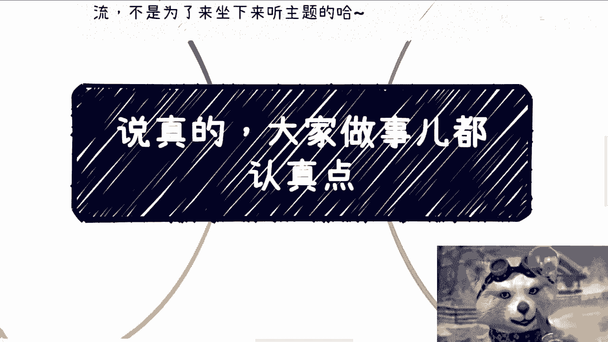

# 课程 01：从“眼高手低”到“脚踏实地”的实践指南 🎯

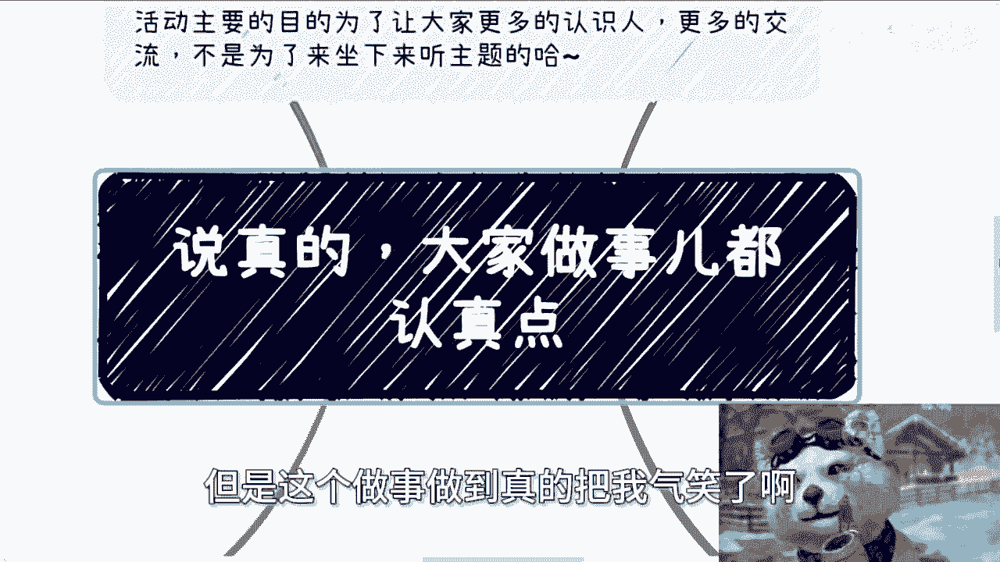

在本节课中，我们将探讨一个普遍存在于实践者中的问题：轻视看似简单的任务，但在实际执行时却困难重重、漏洞百出。我们将通过分析具体案例，学习如何避免“眼高手低”，将想法有效落地。

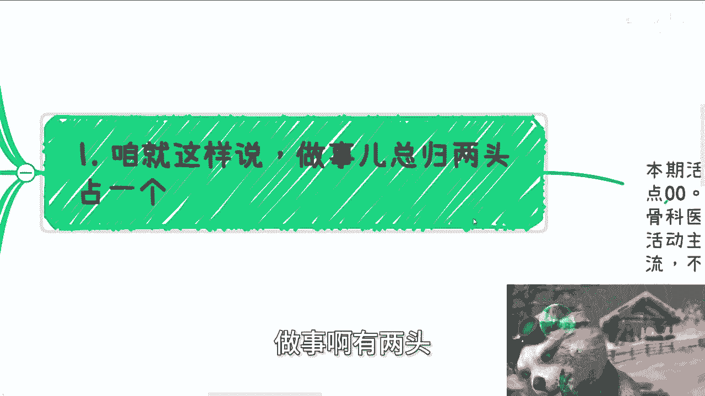

## 概述：实践中的常见陷阱

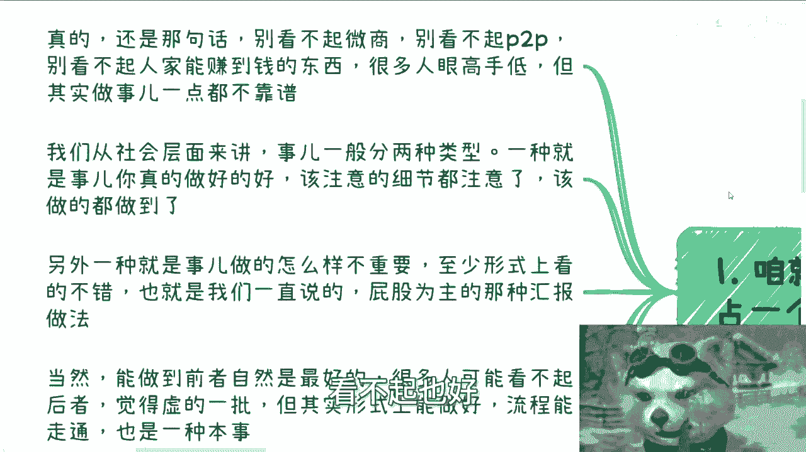

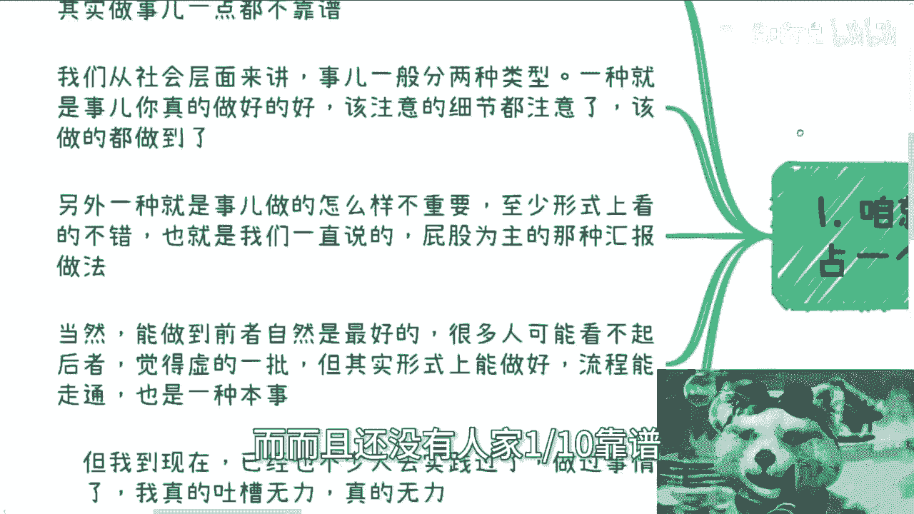

很多人拥有行动的热情，但在具体执行时却缺乏严谨性，导致结果不尽如人意。做事通常有两种路径：要么注重细节，把事情做到完美；要么注重形式，把“样子”做足。然而，许多实践者往往两头都不沾，既做不好细节，也做不好形式。

上一节我们概述了实践中的核心矛盾，本节中我们来看看具体在哪些方面容易出现问题。

## 活动组织：细节决定成败

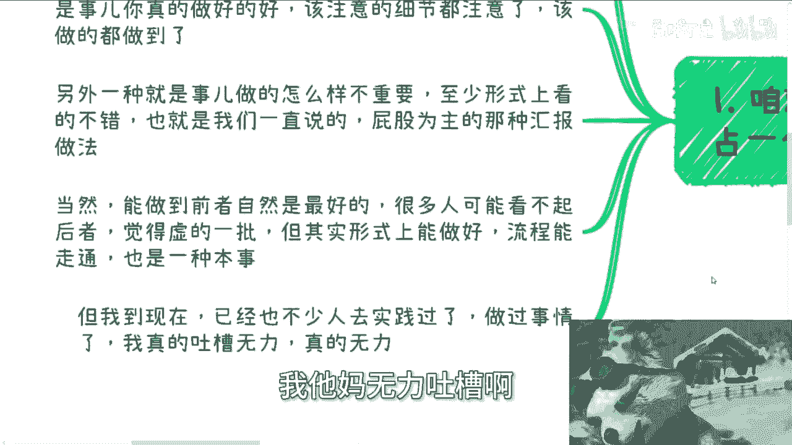

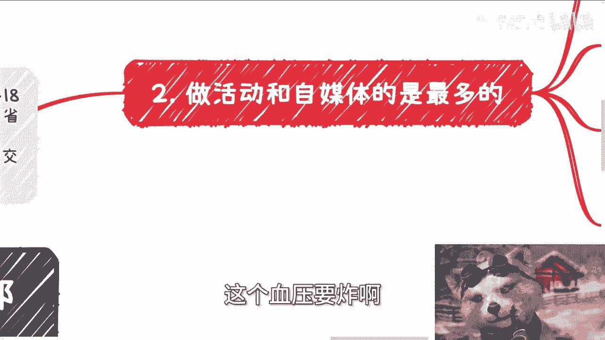

以组织线下活动为例，这是一个看似简单却极易出错的任务。网络上存在大量可参考的活动海报和流程详情，但许多人依然做不好。

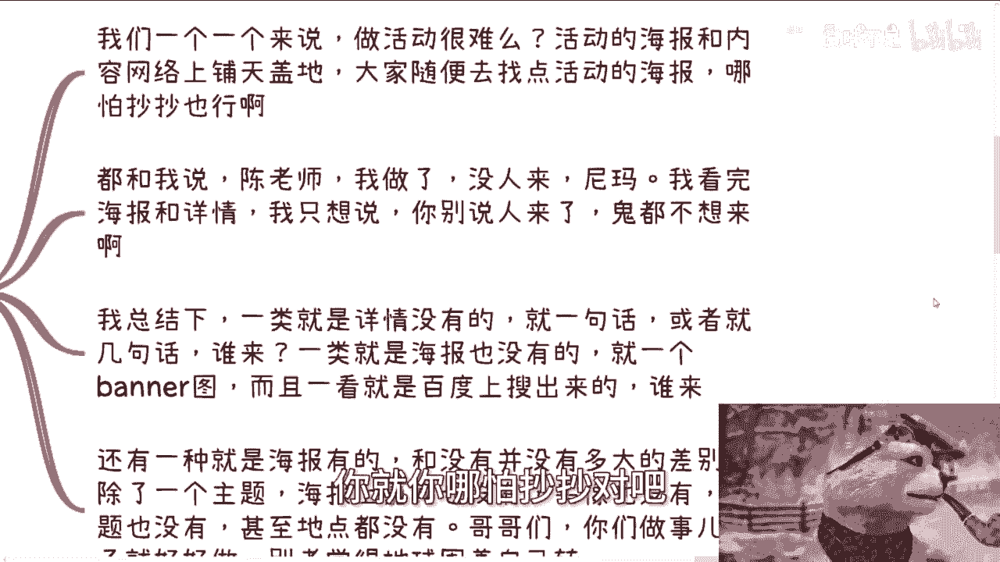

以下是活动组织中常见的三类问题：

1.  **详情缺失**：活动介绍只有寥寥数语，缺乏时间、地点、流程、嘉宾等关键信息，无法吸引参与者。
2.  **海报简陋**：使用从网络搜索得到的、粗糙的长条形图片作为宣传材料，缺乏设计感和专业性。
3.  **海报无效**：海报上仅有主题，缺少嘉宾头像、具体议题、地点等必要元素，信息传达效率极低。

组织活动的核心在于 **信息完整性与视觉吸引力**。一个成功的活动预告应包含：`活动主题 + 具体时间/地点 + 核心嘉宾/内容 + 清晰视觉设计`。在执行前，务必进行市场调研，了解同类活动的成功要素，而不是想当然地行动。

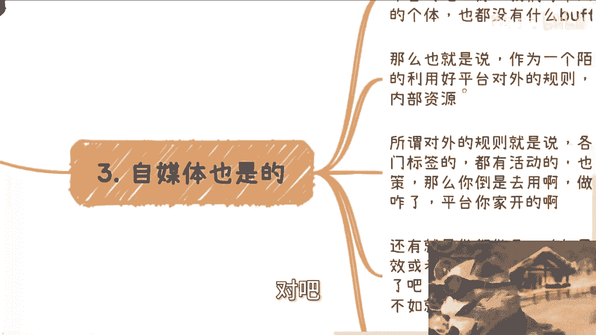

## 自媒体运营：善用规则与资源

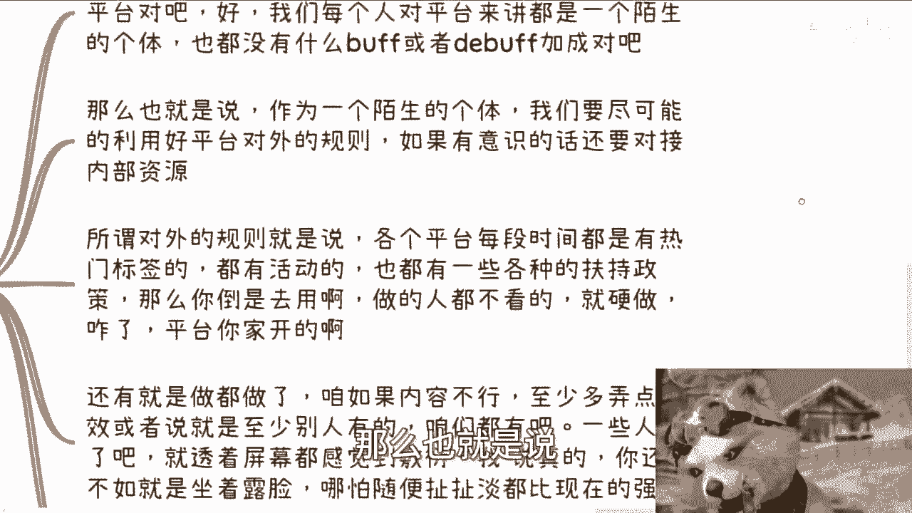

对于自媒体运营，许多新手忽略了平台规则和资源的重要性。每个创作者在初期都是平台的“陌生个体”，没有额外的增益效果。

因此，我们必须主动利用平台规则。这包括关注平台的热门标签、官方活动以及新人扶持政策。然而，很多人完全忽视这些，盲目创作。

以下是提升自媒体内容吸引力的两个基本方向：

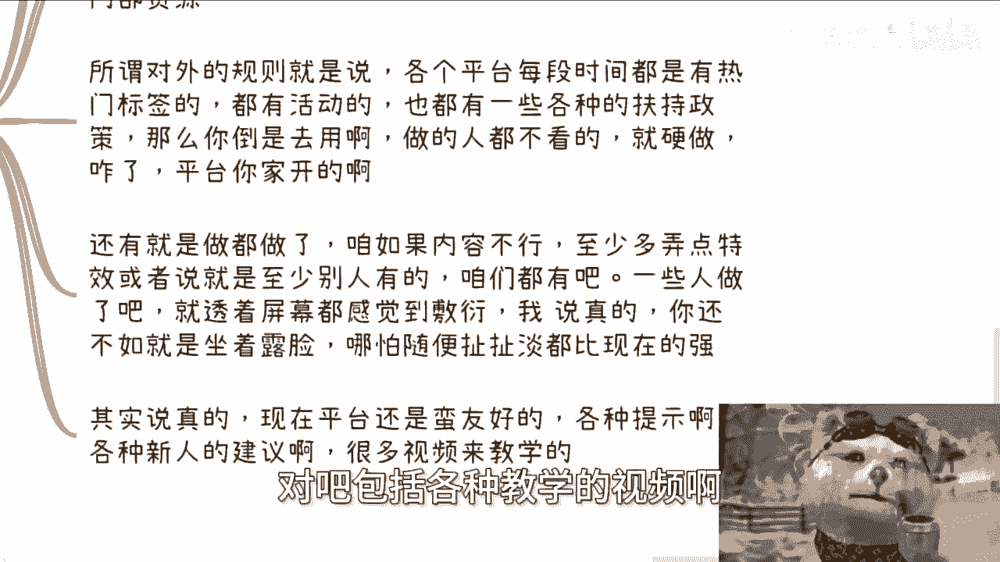

*   **内容质量**：确保内容有价值、有观点。
*   **形式呈现**：如果内容暂时无法出彩，至少要在形式上（如剪辑、特效、排版）向优秀同行看齐。

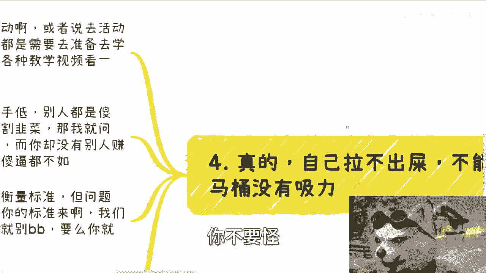

平台提供了丰富的教程和建议，但关键在于执行者是否愿意去学习和应用。一个敷衍的作品，其效果远不如一个虽然简单但真诚的分享。

## 心态调整：从批判者到建设者

许多人在实践中存在一种矛盾心态：既想获得成功（如赚钱），又看不起那些已经取得成果的模式或方法（如微商、知识付费）。这种“眼高手低”的心态是实践的大敌。

我们需要建立一种建设者心态：

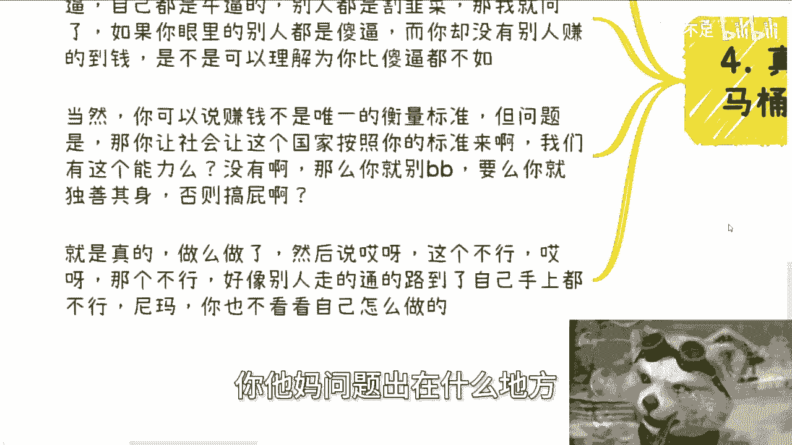

1.  **尊重结果**：无论是否认同其方法，一个能持续产生结果（如盈利）的模式，必然有其可取之处。
2.  **聚焦自身**：如果认为现有路径不符合自己的价值观，可以选择“独善其身”，但不应在既想参与又充满鄙夷的矛盾中内耗。
3.  **归因于内**：当行动遇到挫折时，首先应反思自身的准备是否充分、执行是否到位，而不是归咎于方法或环境。

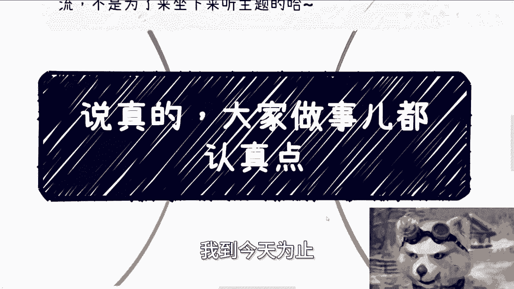

实践的基本逻辑是：**行动 (Action) + 学习 (Learning) = 改进 (Improvement)**。如果行动后结果不佳，就必须通过学习（调研、分析、请教）来找到改进点，而不是抱怨。

## 总结与行动建议

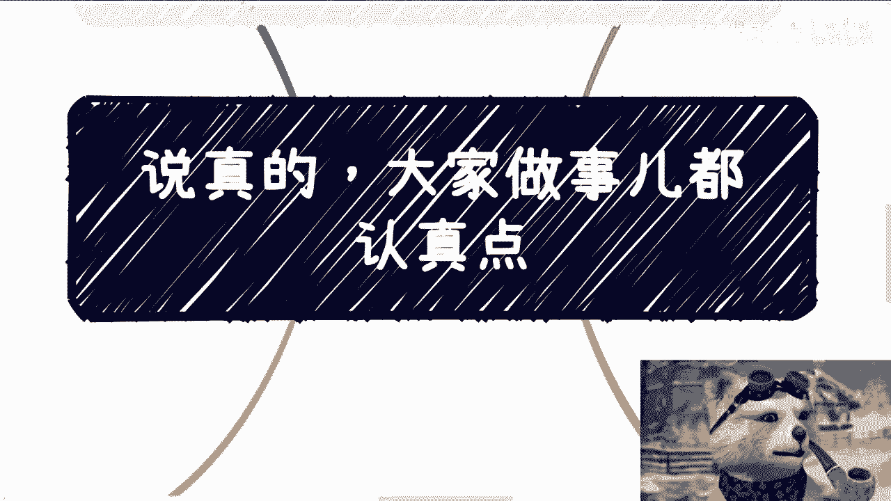

本节课我们一起学习了如何避免“眼高手低”，实现有效落地。关键在于**严谨的执行细节**、**对平台规则的善用**以及**建设性的实践心态**。

无论做什么事，最基本的准备和学习不可或缺。在行动前，花时间研究成功案例；在行动中，注重形式和细节；在遇到问题时，向内归因并积极寻求改进。记住，**“天作孽，犹可违；自作孽，不可活”**，许多困难恰恰源于自身前期的敷衍和准备不足。

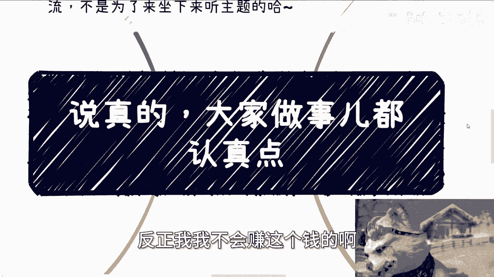

**附：实践自查清单**
在开始一个新项目或任务前，可以问自己以下几个问题：
*   我是否已经调研了至少3个同类成功案例？
*   我的产出物（如海报、文章、视频）是否包含了所有关键信息？
*   我是否了解并应用了所在平台/领域的基本规则和资源？
*   我的心态是专注于“如何做成”，还是纠结于“为何看不惯”？