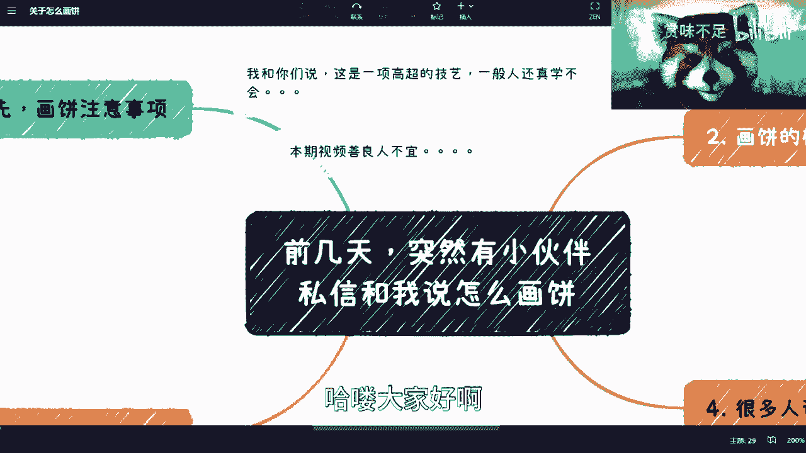
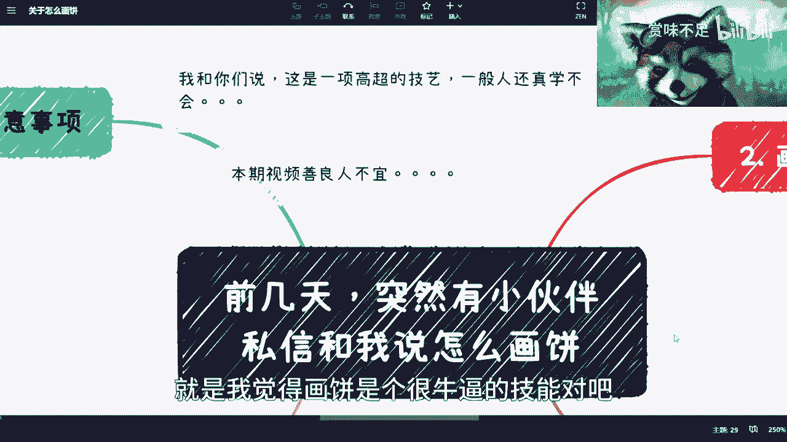
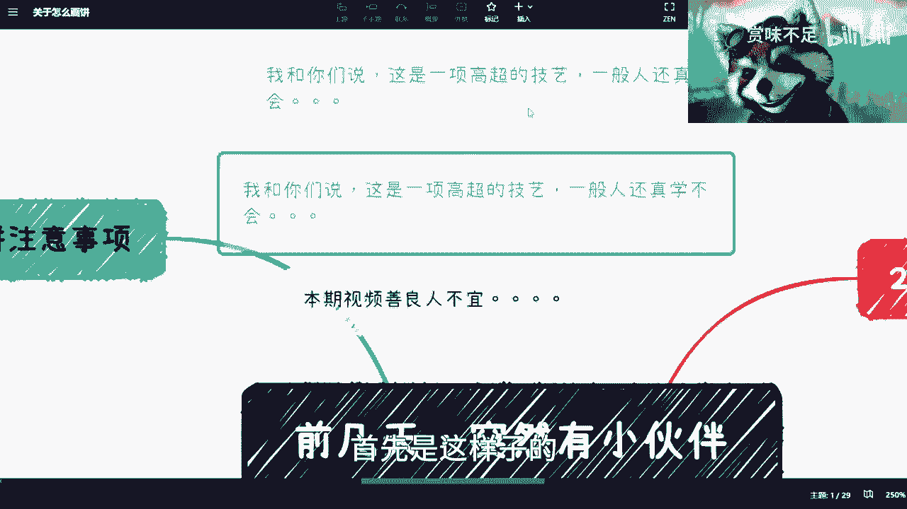
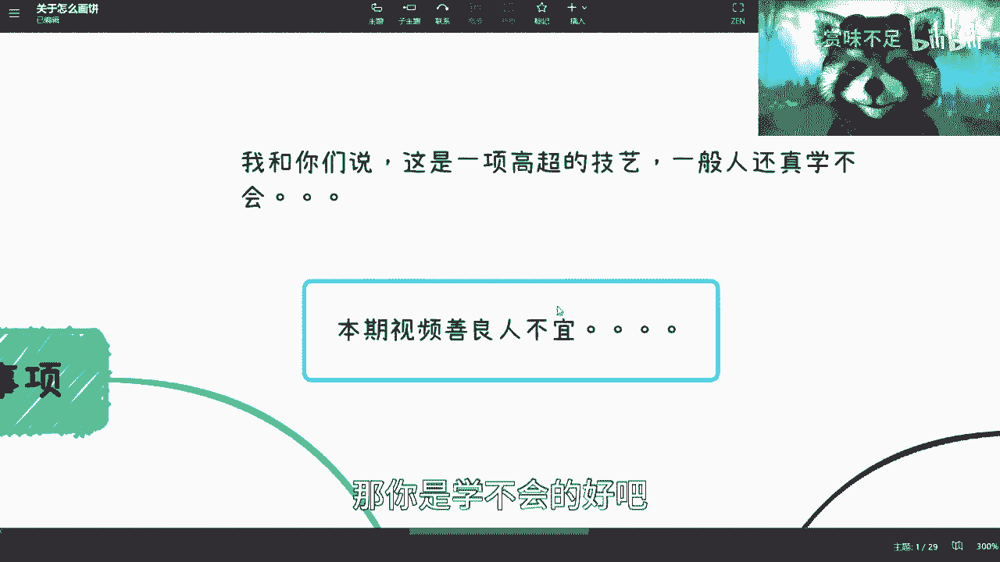
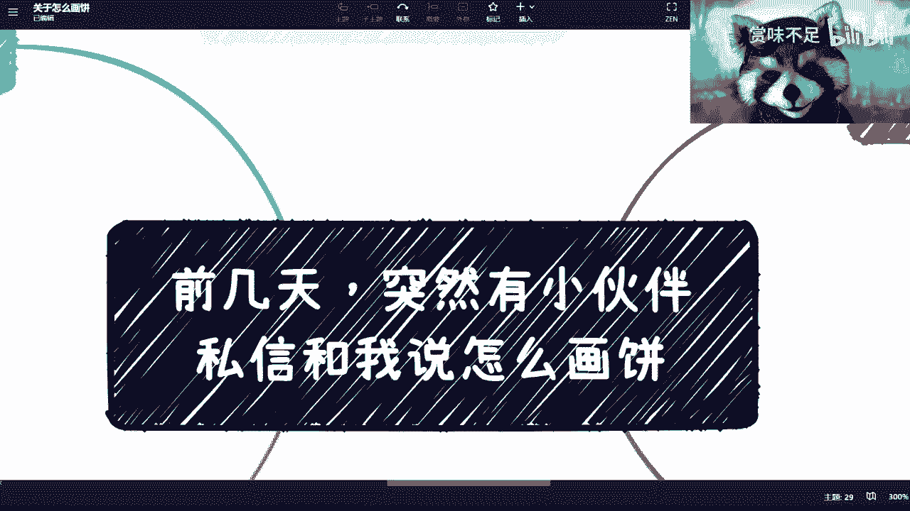
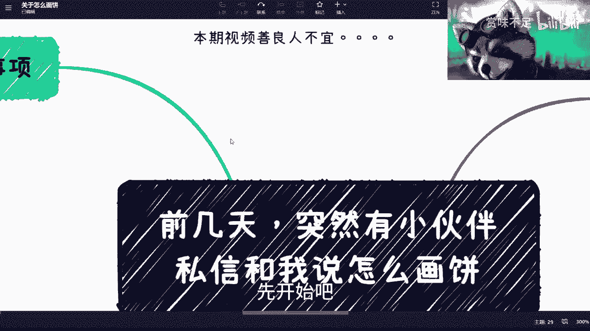
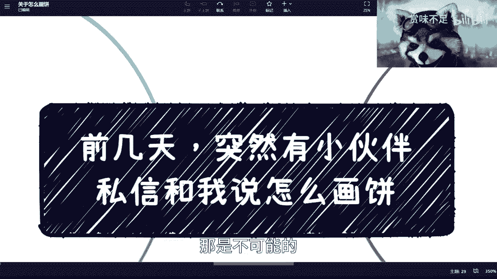

# 别矜持，点进来，这一期教大家如何画饼 - P1 - 赏味不足 - BV18a4y1M7M3

哈喽大家好啊，呃万万没想到，我最终还是给出了这么一个内容啊。

就是前两天突然有小伙伴私信我，问我怎么画饼对吧，我也愣了一下，我怎么说呢。

就是我觉得画饼是个很牛逼的技能对吧，但是我也没想过说我要去分享这么一个东西啊，而且我不知道B站能不能通过，首先是这样子的，你看我在这个地方写了两点对吧。

这是一个大前提啊，第一呢就是说我可以告诉你们，这是一场非常高超的记忆啊，你们别老师觉得就是说一直说画饼画饼啊，好像是一个什么什么人人都能学会，或者很low的技能，但并不是啊。

画饼你们可以理解为是一个初级技能书，点点完之后到中级技能书再点完，到高级技能书点完，然后解锁的一个技能啊，然后这是第一个，第二个呢就是本期视频，善良人不疑啊，我已经说的很清楚了。

别以为啊就咱们都能学得会啊，不好意思，你的底线如果很高，那你是学不会的，你的脸皮如果很薄，那你是学不会的好吧。

那么嗯我不知道我会讲多久啊。

那个啊好吧，先开始吧。

首先是这样子的，首先画饼的注意事项对吧，哎画饼注意事项，我可能应该把这个东西放上来，求都嘛得啊，A多讲的，你看啊，首先第一点你得有自信，你明白吗，就是说这种自信是你表情再加你的描述啊。

也就是说无论你对还是不对，无论你懂还是不懂你的所有的这种描述讲话，都不能让对方觉得你是不自信的啊，因为其实本质上就是，对方虽然不是不一定知道你在画饼，但是你一旦不自信了，他会对你产生怀疑。

对方首先是第一点，第二点你得确认画饼的对象，你一定要明白，对于不同的人画饼是不一样的对吧，你的领导，你的下属，你的合作伙伴，你的你的你的你的你的商业合作伙伴，你的合伙人对吧等等等。

这个后面我会帮你们细分的，对吧啊，我我果然也不要脸啊，这个帮你还帮你们细分操，然后第三个呢就是你需要，其实本质上你还是需要有丰富的商业知识，就是这么说，就说你今天这个饼。

不管画的是GPT还是啊是什么AI也好，物联网也好，什么乱七八糟也好，这不重要，重要的是，本质上你还是需要有丰丰富的商业知识啊，因为你的画饼最终的点是在于要给对方赚钱，或者让对方觉得他能赚钱。

那么你记住你一定是一个降维打击，就这个我后面会跟你们讲的啊，所以说你对于画饼内容你懂不懂，其实完全没有关系，你知道吗，完全没有关系，这根本不是事儿啊，根本不是事儿，包括面试也也是一样的，我待会讲的啊。

嗯这个对，反正待会儿如果有面试官看到我讲的这个东西，反正回头不要不要打我啊，然后第四个呢，就是说你完全需要掌握左手空和右手空的理论，我跟你们讲什么叫左手扣右手控啊，意思就是说你今天要去做一件事情。

对不对，我不管你今天是去面试也好，去做商业合作也好，你就想象一下，你如果今天是去面试对吧，你对于这家公司了解吗，不了解对吧，你右手是空的，公司对你了解吗，也不了解，你右手也是空的，那你左手是什么呢。

就是呃公司需要的就是JD，对方就是那个job description上面写的那些要求，你有吗，你也没有，对方啊，对方要求说啊，你要懂这个懂这个懂这个啊，你想想看啊，我也不懂对吧，那么你左手也是空的。

但这个时候你一定要明白，什么叫左手空和右手空的理论，就是你要用就是左手去套他的右手，然后用右手再去套他话的左手，然后想办法把这两者拼起来，你知道吗，那你比如说面试也好，商业合作也好，你怎么套呢。

商业合作上面很好套，商业合作上面就是说你直接就跟对方说啊，我这个什么就是比如说打个比方啊，比如说对方说哦，我需要有什么资质，对方或者有什么有什么技术能力，或者能不能落地，你就跟他说我都能落地啊。

对方跟你说web3啊，可以的啊，大数据啊，可以的啊，物联网可以的，反正说什么你都可以的，对不对，就都可以啊，然后你的左手是空的，但是呢你要把右手，也就是他的这部分资源套出来，然后呢。

你再用他的右手这部分资源去套，你刚刚要去找的那些什么区块链啊，我要不要三个大数据落地的公司对吧，那你不就套完了吗，对不对，我跟你讲，面试也是一样的，面试没有什么区别的，有很多人就说啊。

他说他说那你这样不行啊，这个回头他出一道题目，对方我就不会了，没事啊，你又不是面试一家公司海投嘛，对不对，100家公司嘛，瞎猫碰死耗子不行吗，对不对，你有点就不要稍微比要点脸嘛，这个你就不是这样。

是不是啊，我果然今天这个课上的我就很不要脸是吧，注意啊，我跟你讲，在这个地方你一定要千万注意，画饼的时候，往往双方都在画，你明白吗，就是高手对决对吧，叫什么画饼者胜，对方善于画饼者胜对方。

也就是说这个时候需要拼内力，什么叫内力呢，就是你已经知道他在给你画饼了，他也知道你在给他画饼了，那最终就看谁饼画的圆，谁饼画的大，谁愿意相信对方画饼，这时候就拼内力了，好，那么就是就是看吹嘛。

看你吹的好不好，就你吹一定要明白，你吹也要符合逻辑性的啊，这个我后面会来讲的，哎呀我就不交，好真的，我跟你们讲，为什么说这个这个很多游戏和动漫里面，黑化强三倍对吧，这个这个叫什么啊。

黑黑化战斗力翻倍对吧，然后那个什么归属于我方什么啊，我方角色对方，然后然后战斗力就下降。

极度下降，你们想想看，为什么不就是底线变高了吗，要脸了吗对吧。

当他作为敌方的时候不操，不要太牛逼了是吧，然后你比如说第二个啊啊画饼的核心啊，画饼的核心呢是什么，其实是一种PUA，你们想想看啊，呃如果今天有个培训跟你们说，你们培训完对方出了，比如说20万。

你们培训完能够学会什么，什么什么什么东西对吧，你们如果会取出这20万意味着什么，意味着你们觉得他讲的都是真的，那么你们以为他讲的都是真的，那么意味着什么，意味着就是他PUA已经成功了对吧。

那么你说这种PUA是什么呢，是一种让对方产生我们能够满足他们KPI，帮助他们晋升的错觉，那当然这里还有一个能帮助他们赚钱的错觉，对吧，所以说呢就是如果但凡你去买一个，就非常离谱的。

对方不是合理价格的一种商品，那其实你就是被PUA了，但是你被PUA，你肯定是不不知道的，因为如果你知道，那就不叫PUA了，对不对，那么这个时候呢就说你肯定会产生一种错觉，就是哦能够帮助你干嘛干嘛。

但其实蓝并卵啊，蓝并卵，你比如说啊画饼的这个核心，第二点就是你要合情合理，符合当下的实力水平啊，你一定要明白，就是比如说你现在就是一个level1的，这个这个新手村的人对吧，然后你在那边画饼，说我能打。

我能打败最终boss，那是不可能的，对方就说你这个饼画的得要符合逻辑，符合情理对吧，那这个时候你说怎么换呢，那很简单啊，我虽然是个LV的人，ALVE的人，但是我可以你就跟他说，你说啊。

我认识很多牛逼的人对吧，这些人都是什么100级的，200级的，对方就轻轻松松可以把最终boss干掉的对吧，那也行啊，对但是你千万不能说你能干掉对吧，因为这个PUA是不成立的啊。

那么那么你比如说我们举个例子吧，比如说驴老师说今天点赞这个视频，未来一个月都能够找到工作，你说这算不算画饼，那那当然算了对吧，但是你看看微博上，还有其他地方有很多那种什么微博叫什么，就是转发该微博。

什么七天内会出现你你什么什么幸运的事情，巴拉巴拉巴拉，你说这种叫PUA吗，这种叫不叫画饼，叫对吧，但是这种画饼对你来讲没有损失，什么意思呢，就是你给我点了个赞，你给我投了个币，对你来讲本质上没有损失。

对方本质上没有损失，但是你可能会觉得诶这个是一个这个叫什么，是一种玄学对吧，那我觉得也没问题，对不对，但是你说这个饼画的我能不能画，我能画，为什么呢，因为我毕竟讲的这么多期视频，如果我跟你们说。

今天我是一个一个视频都没有讲的，我是一个新人账号，第一篇我就来教你们说，来看看我怎么画饼啊，然后我就跟你们说，来点赞这个视频，未来一个月都能找好工作，没人我的，为什么你是谁，who are you是吧。

所以说呢我觉得就是说你画饼你也得有积累，当然这个积累你想想看啊，这个积累跟我给你们画饼这件事情，有没有本质关系，没有啊，对不对，你说我积累的是不是真的能给你们带来工作没，我没有说过这句话。

而且你们也没有得出这个因果关系，但是我的确可以画饼啊，是不是，那这是第一点，第二点，举个例子，比如说驴老师说未来我担保大家都有稳定收入，哎这个饼画的，你说你们信不信，反正我是不信的是吧。

那这个饼不不单单是我画，李嘉诚今天给你们换，你们都不信，elon musk给你们画，你们也不信，为什么呢，因为这不科学啊，对方这不符合人类社会的发展，这也不符合这个整个的叫什么，就是就价价值的等价交换。

它是完全不符合对吧，所以说这种饼画出来，对方就是不会信的，就是你画的画的再好，画的天花乱坠，对方对方也不会信，对不对，你们你们千万别跟我说，你们信啊，我我hold不住了啊，倾家荡产是吧，第三对吧。

举个例子，比如说驴老师说来上我的培训课，一个人10万上午，每个月可以每个月月入1万来，你会发现这个饼就很神奇，这个饼是什么呢，这个饼就是也许有的人真的会信你，比如说我开了一个课，我说10万块钱啊。

然后我说那个回头跟我一起创业，对方怎么样怎么样，哎你说有人会信吗，我觉得有人会信的，但是这个饼特殊在什么地方呢，这个饼特殊在它的商业逻辑，其实你会发现，我能保证你上完每个月月入1万吗，可以啊，没问题啊。

我把你的10万拆成十个月给你们怎么了呢，谁说不行呢对吧，但是问题在于什么呢，问题在于我拆除这10万给你，其实等于我借了一个10万块钱的一个长期呃，叫什么借款对吧，而且我不用付利息，对不对。

所以你会发现有些饼画出来，它既可以有人性，又充满了商业逻辑，诶，非常神奇，是不是，而且你说他不要脸吧，他也要点脸，你说他要点脸吧，你要我说他妈的什么什么脸都不要是吧，但是我跟你们讲的就是这个事情呢。

就是我也就是我这么说，从大部分的这个普通人老百姓来讲，他们看不出来这个问题，你知道吗，就好像我跟你们说，就好像我今天举这三个例子，你们懂吗懂的，但是我但凡换个方式，或者你们回头就看到了一个视频。

你们我跟你们讲就忘得一清一干二净，什么都不知道的啊，然后好，接下来就是重点啊，重点我们来区分一下角色啊，啊开始画饼了是吧，好，首先啊你看给领导画，给领导画怎么画，就是你需要针对不同的领导路线。

什么叫领导路线呢，有的领导是走技术路线的，有的领导是走管理路线，对不对，好，那技术路线管理权怎么怎么怎么那个叫什么呃，怎么画饼呢，那很简单，技术路线你就跟他说，你说好，我接下来对吧，我们这个项目啊。

我能够给你，因为技术路线这个上面，其实这个饼你得贴合他的KPI，你首先得要了解今年的，比如说这个bu，对方或者这个这个领导的这个这个mental，它的一个KPI到底是什么，那么不管他是什么。

反正你就给他画嘛，对方不要画的就是太这个这个叫什么，就是太太天马行空，对方他比如说跟你说，哎我今天要有一个技术创新，那没问题啊，我帮你接GPT4的API嘛，对不对，那还是那句话，你先给他画。

你管那他妈的你能不能解对方，你先给他画，而且这个饼画的非常的那个贴合实际，而且也不是那么天马行空，因为最终你就算搞不定也无所谓啊，你你淘宝上买一个总归可以吧对吧，那你总不能跟他画饼说啊，你看啊。

我这个帮你做一个超越吉利似的东西出来，那就不现实了对吧，那管理岗也是一样的，管理岗这个东西呢，就是说哎，他可能更多的是一个这个这个人员管理对吧，人员成长啊，然后说呃就是在这个项目当中怎么的。

怎么更好的去这个提升效率，那没问题啊，你就跟他说，哎我我可以帮你去做一套，比如说管理软件，或者来说持续集成软件，对方就是我通过ABCDEFG的方式，帮你去提升效率对吧，但是呢这个东西你一定要去明白。

就是这个东西呢对他来讲，可能是一个跳一跳能够到的，对你来讲可能是一个跳一跳都够不到的，但是不管怎么样，对他来讲是有价值的，你先把这饼画了，你管他372 11呢，对吧啊，就就这个给领导画饼。

就是其实就是给KPI给他的KPI画饼啊，给新手画饼哇，这太容易了对吧，涨工资换核心业务线近身对吧，别着急，年底就是你了，你就是下一个super star啊对吧，你我操真他妈画起来简直绝了，我跟你们讲。

对方随便换啊，呃第三个呢就是给面试官画，我跟你讲，别给面试官画呢，就是就是嗯我跟你们说，其实我是觉得蛮容易的啊，而且就是呃但是需要有一定技术含量啊，就是首先你看我之前出过一期面试的视频啊。

但是我估计看的人不多对吧，其实呢面试本身是很有技巧的，就是你会不会这个技能根本不重要，我跟你们讲啊，为什么呢，第一个就是你需要掌握主动权，比如说我举个例子，比如说你们今天要去面一个加班的工程师，对方好。

没问题的，我跟你讲，你别以为灭你这人，他把他调到什么地方去，你如果知识盲区是70%，他知识盲区是70%，只不过他的知识盲区跟你的知识盲区不在一个，就是知识点上面无所谓啊，就比如说你知识盲区可能是加班。

你只懂了30%，他知识盲区可能是，比如说啊MYSQL或者大数据或者别的东西，就是你擅长的东西他可能不知道对吧，那无所谓啊对吧，你你你我跟你说，你不要觉得你擅长的东西一文不值，你擅长的很多东西。

但凡你只要很自信的吹出来，他一样会觉得很牛逼，因为他不懂啊对吧，因为你在他的知识盲区，知识盲区里面就是就就什么叫知识盲区，就是你但凡跟任何一个人，不管他年龄多少，认知多少，只要在他知识盲区里的东西。

哪怕是个幼儿园知识，他也会觉得很牛逼，你知道吗，这是第一点，第二点是你要迎合他们的需求，也就是说你在面试之前，你你多多少少通过电话也好，通过呃，比如说boss直聘的这种沟通也好，你要去了解的是。

他们现在这个岗位大概是需求是怎么一个情况，比如说就是说有很多人已经有就在这个岗位了，还说这个岗位现在一个人都没有去缺这个岗位，缺这个技术，还是说现在缺的其实不是某些技术，缺的是整个的一个管理。

对方还是怎么样子，我跟你讲，你在去之前你就理论先补对吧，因为你我跟你们这么说，你去学一个技术很难，我也知道很难对吧，但是你去补一些理论，我跟你们讲的还是很很，怎么说呢，很快的就是你根本就不用理解他。

你就去相当于死记硬背是吧，到时候一顿输出猛如虎，他肯定会被你说蒙了，你知道吧，因为为什么，因为他不懂啊，他也是知识盲区，那当然有些人又要说了，你怎么知道他不懂，没关系啊对吧，你没有100家公司。

总有那么一两家不懂的嘛，对不对，就总有一两家被你唬住了嘛，是不是，只要不要脸，你记住不要脸，对不对啊，那么第三呢就是一定要站位打击，这个是非常重要的，什么意思呢，就是比如说你今天命的一个技术岗。

对方有技术人员来面临，你就从宏观角度去沟通，像我呀对吧，就是就是你技术岗垃圾对吧，我我就比如说他问你加班，这个东西你可以先绕啊，你说啊这个东西啊，这个东西是这样的，这个东西其实并不是很重要啊。

我觉得重要的是什么，你就开始这个掌握主动权啊，对啊，你别别被他带着走啊，对方你就跟他说这个东西啊，这个东西很简单的对吧，然后然后你你你大概扯两句对吧，然后你就跟他说哦，其实我觉得更重要的是。

比如说这个这个叫什么异步对吧，伊布的这些这个归呃叫什么，就是异步的这些设置啊对吧，包括这一些那个那个GC的回收啊，对方等等等，你就给他吹啊，对方那这是第一个，第二个是什么呢，就是如果来面对你的是管理岗。

那没关系啊，你不要去跟他刚正面啊，你去从业务大局去沟通啊对吧，你说啊这个东西啊，管理这个东西哎，我觉得其实大家其实都差不多的对吧，但是呢我觉得就除了管理以外，其实其实对于业务了解是更为重要的。

你开始一顿输出嘛，对不对，那好然后你就业务大于去沟通，那如果老板来面试，那你必须要用商业去沟通对方，就是我跟你说，因为什么，因为一样的，就是作为一个老板，他就是他作为一家四个一家公司的老板。

它一定有它的局限性对吧，因为他一定会集中在他的业务，和他的公司擅长一点，那你没关系啊，你就从别的方向嘛对吧，他公司比如说打个比方，他公司很会从电商赚钱，你就不要去当电商了，对方你去当电商干嘛呢。

你就跟他说，你说啊这电商这个东西现在大同小异的对吧，但是我觉得就是人工智能这个东西呢，肯定是要结合的好，那么人工智能这边呢，我是觉得他很容易赚很还是很容易赚钱的，比如说对方用GPT这边。

对方可能做一些这种啊，结合公众号，结合一些我们的这个企业的这个程序啊，我们能够给他去做自自动的这个客服呃，那个那个叫什么自动化的这个客服的这个呃，用户的沟通对方等等等，你别跟他去沟通，他做的东西。

他做的东西他肯定比你专业，你明白吧，你知道吧，所以说呢就是这个是核心对吧，但是前提你要不要脸啊，你别老觉得你讲的东西不对啊，没有什么不对的，他反正也不懂，你管他呢，真是对不对啊，然后你比如说商业伙伴。

对方商业伙伴话，我跟你讲的更简单了，就一个点，我能给你赚钱，我能给你赚大钱，我能给你赚到无数钱啊，就是你就是无论怎么去PUA他，你所有的点就告诉他我很牛逼，我也能给你赚钱对吧，当然你吹的也不能太过对方。

就是就是比如说你说啊，我打个比方啊，对方什么什么什么电标院啊，对方都是你的战略合作伙伙伴对吧，那他也不可能把你战略合作，战略合作合同给他看吧是吧，你就往里吹啊，我靠我跟你讲。

这种人我在市场上面碰到无数个对吧，你反正就给他吹啊，然后呢他做什么业务，你就对照对照着给他推给他吹啊，然后就是你一定要不假思索啊，也不假思索不行了，这个视频做完，我他妈要被喷死，是不是啊。

然后呢很多人说我说他说我画不来对吧，我跟你们讲的第一开始我就说了，善良人不疑，不是所有人都划得来的啊对吧，那画得来我早就说了，对不对，这第一点第二点呢就是你多画画其实也就会了。

但是呢你还是需要有很强的知识储备的，因为你要明白，你其实画饼很多，还是跟最终的这个赚钱利益相绑定的，那么别人其实可能不见得会对你的饼感兴趣，但是可能会对背后的商业运作不感兴趣，那么回头他就问你啊。

比如说哎你这个有是不是做个有限合伙啊，对方还是说这个公司组织架构怎么做啊，还是说VIE下架构啊对吧，你不要人家一问你，你什么都不知道，然后人家就知道你这个饼画的一点都哎呀，不够专业对吧。

人家就会觉得你明明就是别人是这样子的，别人也许会觉得你在AI在大数据，在技术面说画饼啊，但是别人关心的是你的商业储备，你对于比如说公司架构啊，对方公司怎么去开展啊，包括商业落地啊，对方怎么跟政府合作啊。

你懂不懂，如果你懂，他大概率会相信你，因为他也知道技术并不重要对吧，那你们别伤心啊，但我不会不好意思啊，技术真的不重要啊，真的不重要对吧，就是就是那个梗是怎么说呢，呃梗是怎么说呢，哦在座的都是垃圾啊。

对不好意思，做技术的确就是垃圾啊，然后第三呢你说他说你要明白一点，就是你要和韭菜，你记住啊，这件事情跟韭菜是一样的，我们有个理逻辑叫什么叫做你不割，别人也会割，对不对，好你明白一点，画饼这件事情你不画。

画饼这件事情你不画，别人也会画，什么意思呢，就是我们所有人出去做事情都是竞争的，对不对，不管你今天是打工面试还是出去创业，还是出去摆摊对吧，那我说的不好听点，你今天不会画，不会吹，你摆个珍珠奶茶。

你都卖，卖不过别人，为什么，因为别人都在画，那请问你拿什么跟人家竞争，你说哦，我实诚，不好意思，善良人时辰垃圾啊对吧，最后呢我来给你们举个例子，你比如说我以前看到过很多人融资是怎么融的。

就是他左手也是空的，然后他去套VC，对方套VC套风投，然后呢风投这边被他忽悠的一愣一愣的，然后呢他在用风投这边说，比如说已经有2000万要入账了，3000万要投资了对吧，然后再去找找左手。

卧槽这事情我屡见不行，我跟你们讲，但是有一点做，就但凡我看到这种人都是那种就是绝对是吹牛，不打草稿，毫无任何的，就是这种叫什么啊，完全看不出来有任何的这种画饼的感觉，在这里面。

我就感觉他好像完全已经做过十个上市公司，一样的，但是然而然而他一个公司都没做过，你知道吗，这是一种还有一种呢，面试呢也是一样的啊，我给你们举个例子，我以前在这个大厂，对方面别人的时候。

当时来了一个百度的，卧槽，就把我弄，就是我真的觉得就除了我以外，剩下所有的面试官就是被他忽悠的一愣一愣的，为什么呢，因为他很牛逼啊，他准备做的非常充分，不敢试，就他来面试嘛，他面试是一个产品经理吧。

还是一个那个叫什么项目经理，我忘了，反正他这样子的PPT全部打印出来，然后呢自己做了个网站，自己做了个脑图，然后呢一顿操作猛如虎，就是你不打断他，他可以在那边连续讲四四分，40分钟，不带重复的。

然后告诉你我在百度这边做任何做这个A平台，B平台，我多么牛逼，搞得这平台好像就他一个人做一样的，你知道吧，就是说反正说半天，然后呢就是就就很牛逼啊，你知道吗，就是因为我是负责技术面的，对方在我看来。

我所有问下去的技术细节，他其实都是不知道的，你们知道他怎么回我的吗，他这么说，他说啊，这个东西啊，这个东西啊不是我负责的，是我那个小伙伴负责的，这个东西肯定得问，主要是问我们小伙伴。

然后我就发现我无论问你个问题，他都是这么一个回答，但是呢我跟你们说，架不住老板喜欢，架不住manager喜欢，你们懂了没有，你们懂了，请问你们懂了没有。

好吧，那么我觉得呢就是说还是我刚刚一开始说的，就是你们听完，你们应该也大概多多少少应该明白了对吧，画饼无论是从情感上啊，从那个林场应变能力上面，还是从你的商业逻辑上面，还从你的智商上面。

各方面都是需要有一定的这个积累的，同时当然你也需要有一定的理论知识。

就好像我这边跟你说的与对，不同的角色做的不同的事情对吧。

那当然了，我觉得这不是一个贬义词，但是当然这也不是个褒义词啊，这个事情就看什么呢，就是你可以画饼，但这个饼你能不能实现呢对吧，那同样的你画饼了之后，到底是你一方赚钱，多方输钱呢，还是说多赢呢。

其实是看这件事情的，我觉得画饼本身没有问题，对不对啊，你就你我们最后来讲一个举你就举个例子，就比如说如果说吴晓波今天跟你们讲，哎你们每人交30万，我能保证你们这个以后对方每年找找到一个。

比如说年薪30万工作，那如果他只招了十个人，同时这十个人又的确找到了工作，我觉得这个饼画的就很有效对吧，但是可惜的是，但凡这种饼画出来，很有可能是报名有3000个人对吧，那最终找到工作就十个人对吧。

那这种饼就是割韭菜是吧，但是呢你要这么想不重要。

为什么，反正他赚到钱了，是不是，这B站是不是要把我封杀了，就这么着吧，好吧我也我真的我嗯你看你们说啥，我就讲啥是吧，下次要穿黑丝啊。

