# 画饼的艺术：从入门到精通 🥧 - P1

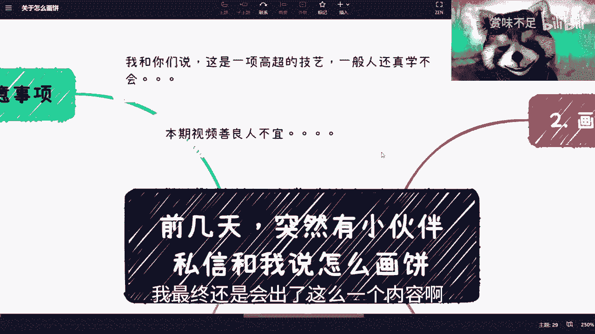

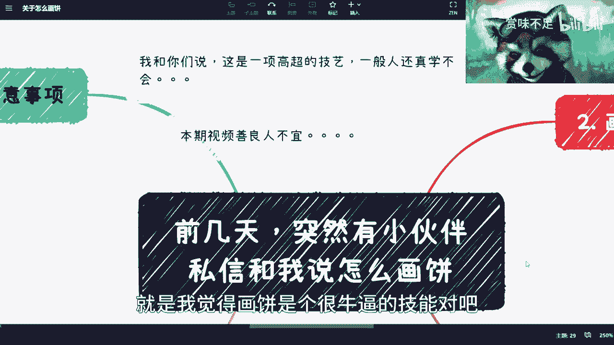

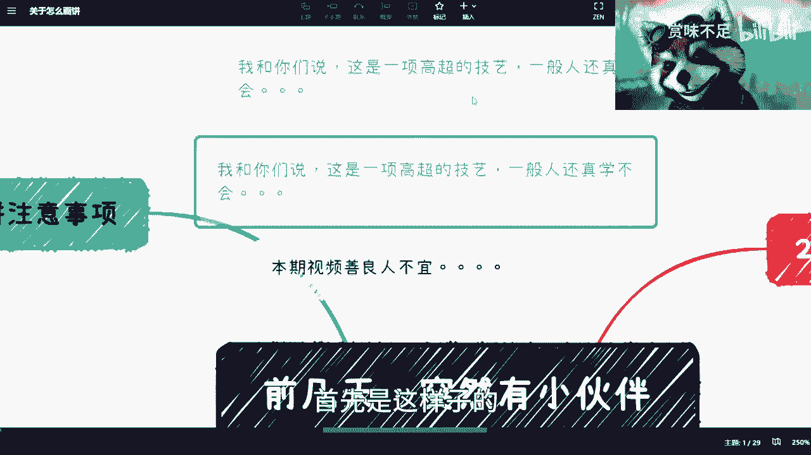

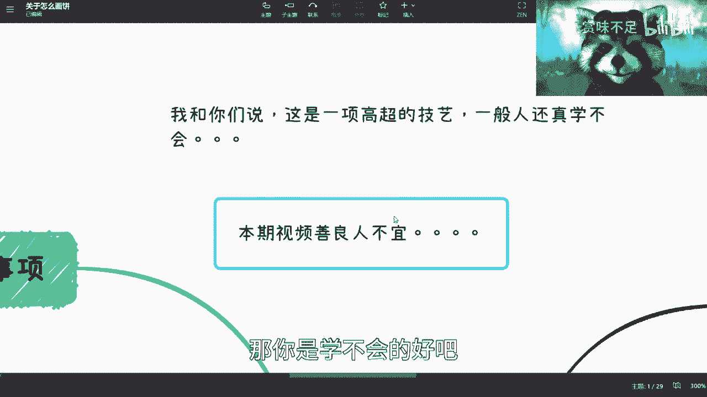

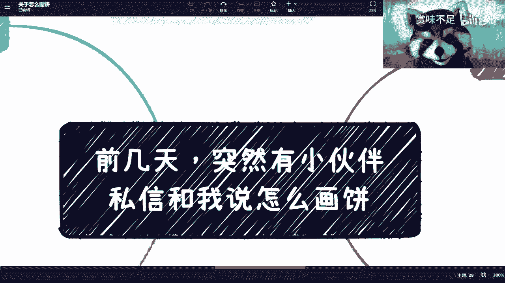

在本节课中，我们将要学习“画饼”这一沟通与说服技巧的核心要素。画饼并非简单的吹嘘，而是一门结合了心理学、商业知识与沟通策略的综合艺术。我们将从基本概念、核心原则到具体应用场景，系统地拆解如何有效地“画饼”。

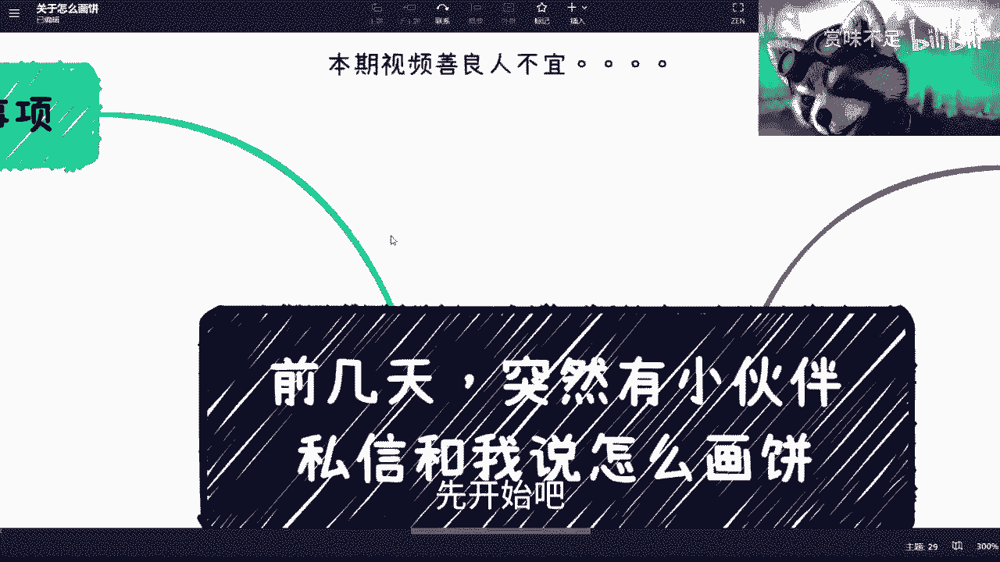

## 概述

画饼可以被理解为一个需要逐步解锁的高级技能。它并非人人天生就会，也并非一个低级的技巧。掌握它需要跨越从初级到高级的技能门槛，并具备一定的心理素质与知识储备。本教程旨在揭示其背后的逻辑与方法。

## 画饼的四大注意事项 🚨

在开始实践之前，了解画饼的基本前提和注意事项至关重要。以下是四个核心要点。

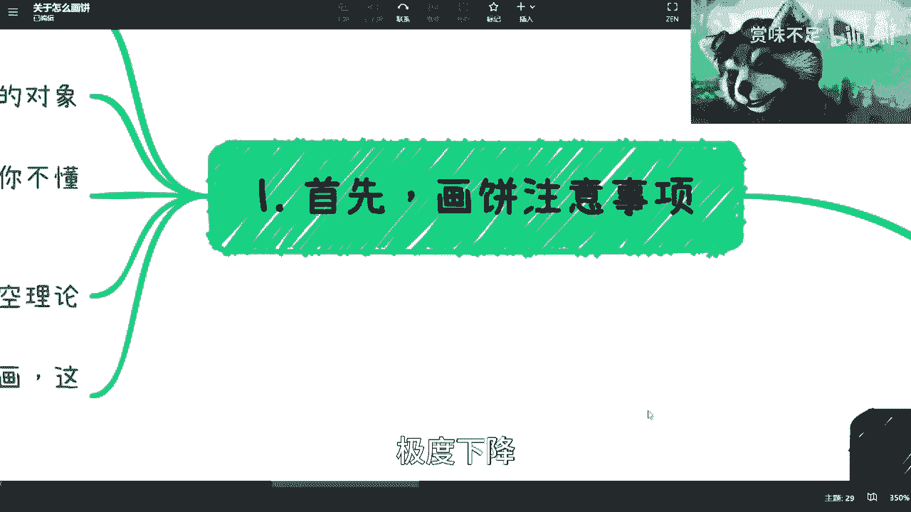

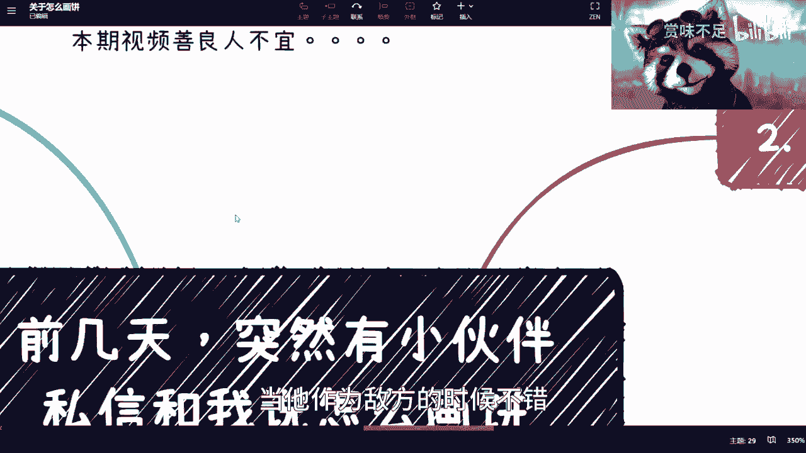

1.  **自信是基石**：无论内容对错，你的表情和描述都必须充满自信。一旦流露出不自信，对方就会产生怀疑。公式可以表示为：**成功画饼 ≈ 自信的外在表现**。
2.  **明确画饼对象**：画饼的策略需因人而异。面对领导、下属、合作伙伴或面试官，你需要采用完全不同的方法和侧重点。
3.  **需要丰富的商业知识储备**：画饼的最终目的是让对方看到利益（通常是赚钱）。因此，你需要具备降维打击的能力，即使对具体技术细节不懂，也要在商业逻辑和前景描述上让人信服。
4.  **掌握“左手空与右手空”理论**：在信息不对称的场合（如面试、初次合作），双方都不完全了解对方。关键在于用你已知的（或虚构的）信息去匹配对方的需求，再用对方透露的信息来填补和佐证你的描述，从而形成一个完整的“闭环”。

上一节我们介绍了画饼的基础注意事项，本节中我们来看看画饼的核心本质是什么。

## 画饼的核心本质：制造错觉与PUA

画饼的核心是一种高级的PUA（精神影响），其目的是让对方产生你能满足其核心需求（如完成KPI、晋升、赚钱）的强烈错觉。一个成功的画饼，会让对方心甘情愿地为这个“未来的可能性”付出当下的成本。

以下是画饼需要遵循的几个合理性原则：

*   **必须合情合理，符合当下实力**：所画的“饼”不能脱离实际太远。例如，一个新手不能声称能直接打败终极BOSS，但可以声称认识能打败BOSS的高手。
*   **需要一定的信任积累**：画饼者的身份和过往积累会影响“饼”的可信度。一个有粉丝基础的人画饼，比一个全新账号画同样的饼，更容易让人接受。
*   **符合基本的社会与商业逻辑**：所承诺的结果必须看起来在逻辑上有可能实现。违背基本价值交换规律或社会规律的“饼”无人会信。

接下来，我们将进入实战环节，看看如何针对不同角色进行有效的画饼。

## 实战演练：针对不同角色的画饼技巧 🎯

画饼需要因人施策，对症下药。以下是针对几种常见角色的具体策略。

### 给领导画饼：绑定KPI

你需要针对领导的类型（技术型或管理型）及其当年的KPI来画饼。
*   **对技术型领导**：围绕“技术创新”、“项目攻坚”等KPI，提出看似可行、有一定技术前沿性的方案（例如：集成GPT-4 API优化产品）。关键在于方案听起来贴合实际且能对其KPI产生直接贡献。
*   **对管理型领导**：围绕“团队效率提升”、“人才培养”等KPI，提出流程优化、引入管理工具等方案。重点在于描绘方案如何帮助他达成管理目标。

### 给下属（或新人）画饼：描绘个人成长蓝图

这通常较为容易，核心是给予对方短期内的希望和长期发展的想象空间。
*   常用话术包括：“好好干，年底晋升/加薪有你”、“这个核心业务线以后就交给你了”、“你就是我们团队未来的明星”。

### 给面试官画饼：掌握主动权与错位竞争

面试中的画饼技巧性很强，核心在于不要被对方牵着鼻子走。
1.  **掌握主动权**：不要只回答对方问题，要尝试将话题引向你熟悉的领域。例如，当被问到一个技术细节时，可以先简要回答，然后迅速转向你更擅长的相关宏观架构或设计理念。
2.  **错位打击（降维沟通）**：
    *   面对**技术面试官**，多从**系统架构、设计模式、行业趋势**等宏观层面沟通。
    *   面对**管理岗面试官**，多从**业务大局、团队协作、项目价值**等角度沟通。
    *   面对**老板**，则必须切换到**商业层面**，谈论市场机会、盈利模式、竞争优势，避免陷入具体的技术或业务细节，因为那是他的知识盲区。

### 给商业伙伴画饼：聚焦利益与资源整合

核心信息只有一个：**我能帮你赚大钱**。
*   策略是无限放大自身的优势和资源，同时对其业务表现出极大的兴趣和“匹配度”。需要不假思索地展示信心，并暗示你拥有强大的背景资源（如：与某某机构是战略伙伴）。关键在于，当对方深入询问商业落地、公司架构等细节时，你必须有足够的商业知识储备来应对，以维持专业形象。

本节课中我们一起学习了画饼的艺术，从核心心法到针对不同对象的实战技巧。

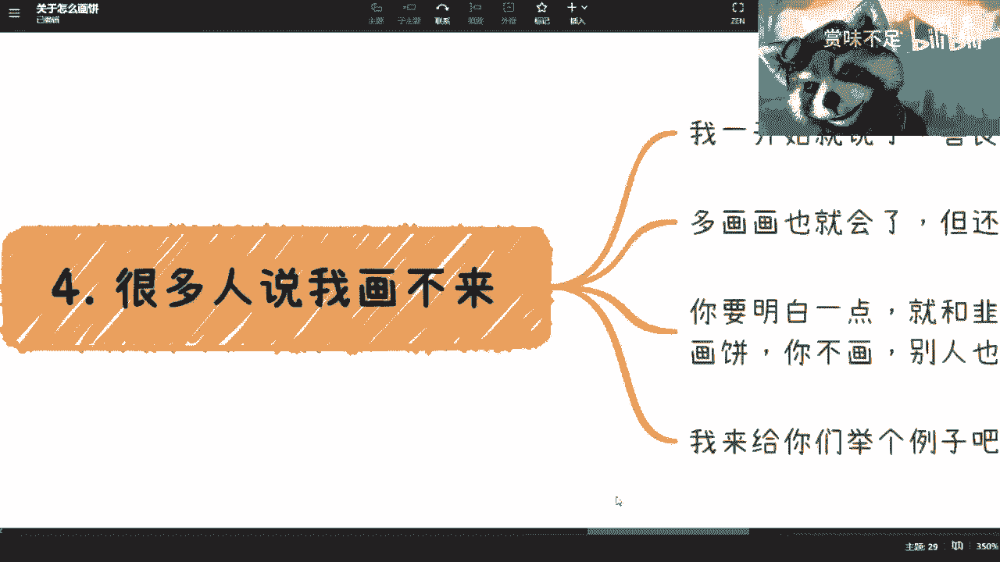

## 总结

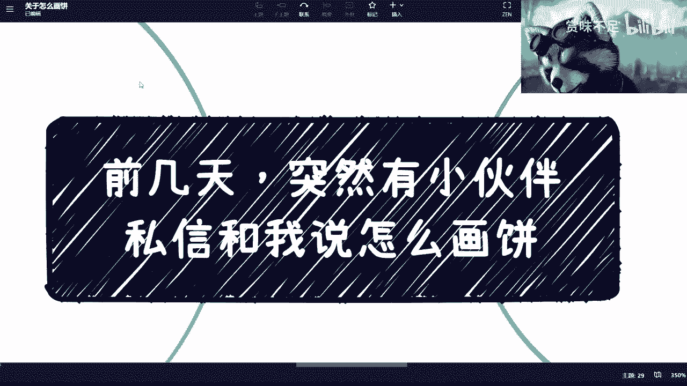

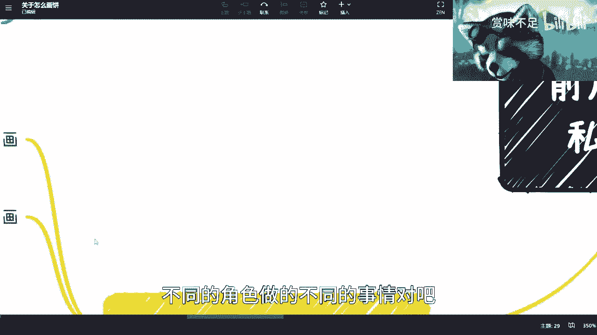

画饼是一门综合了情商、应变能力、商业逻辑和知识储备的沟通技术。它本身是一个中性工具，其价值取决于使用者的目的和结果：
*   **用于多方共赢、激励团队、促成合作**，它是有效的推动力。
*   **用于欺诈、割韭菜、损人利己**，它则是危险的骗术。

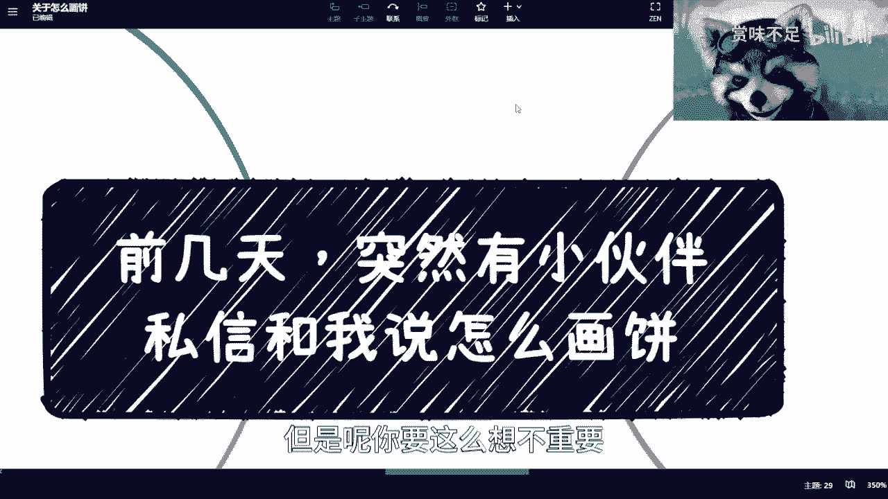

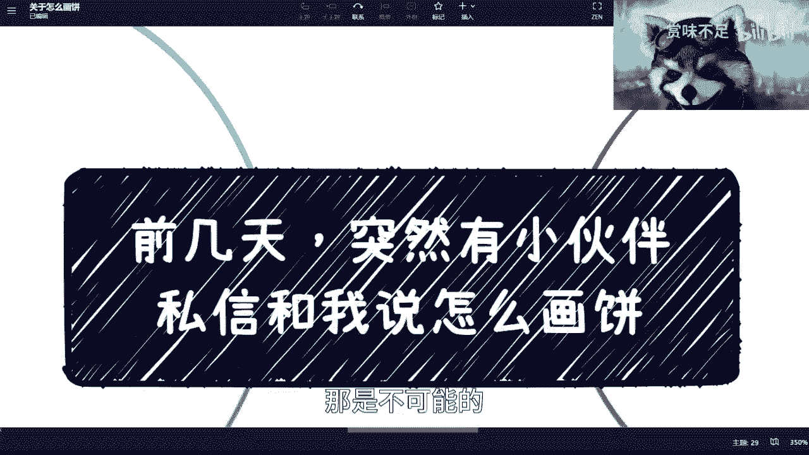

关键在于，你所画的“饼”最终是否能够部分或全部实现，以及这个过程是创造了价值还是仅仅转移了财富。理解其原理，方能善用或识破。