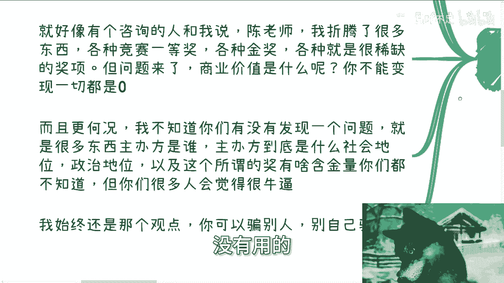
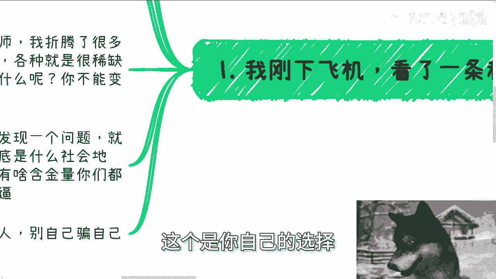
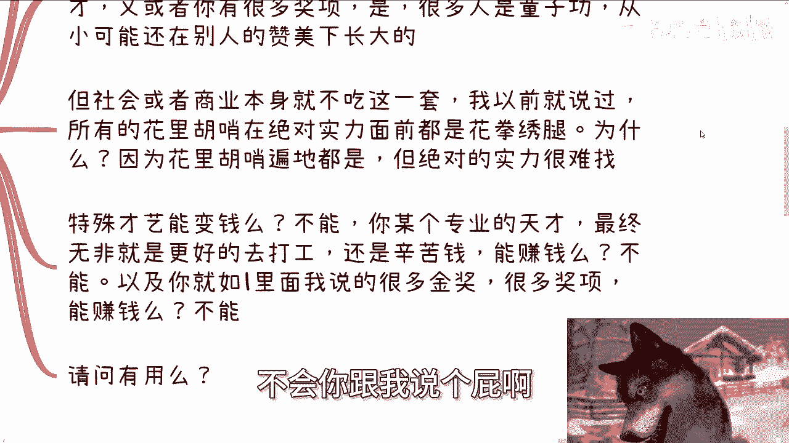
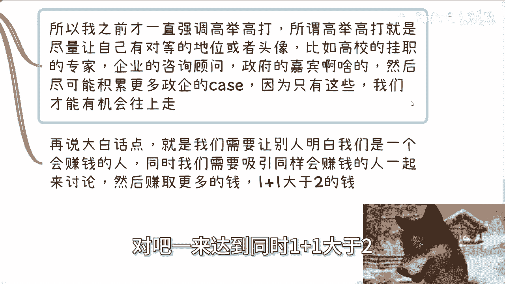
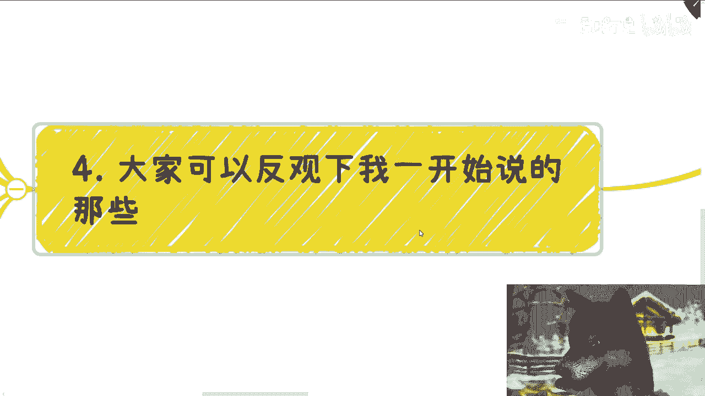
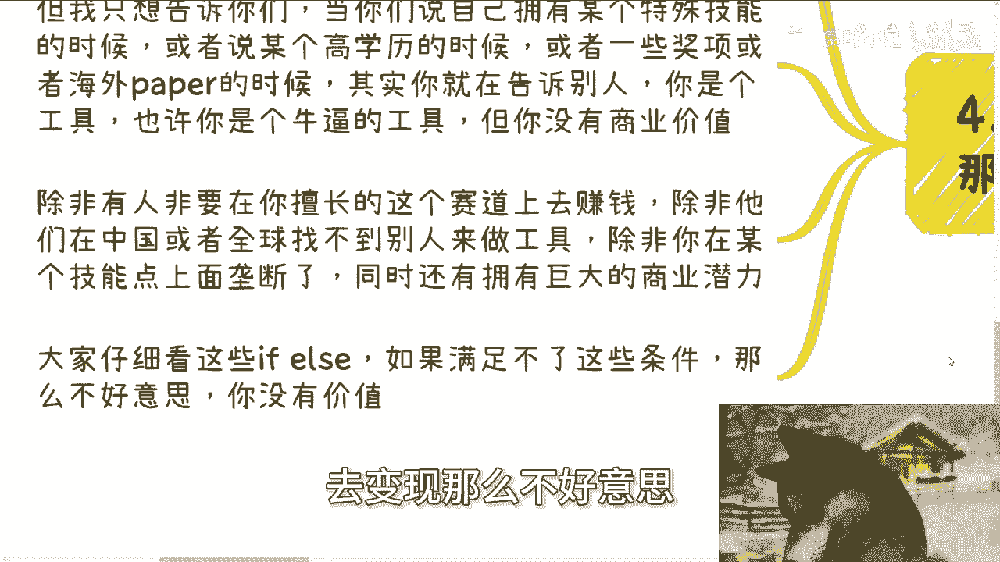
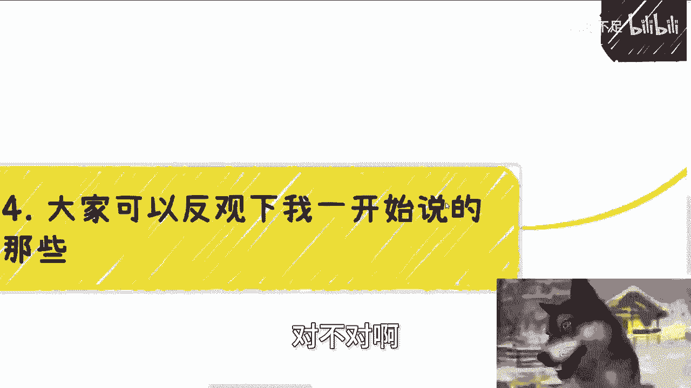
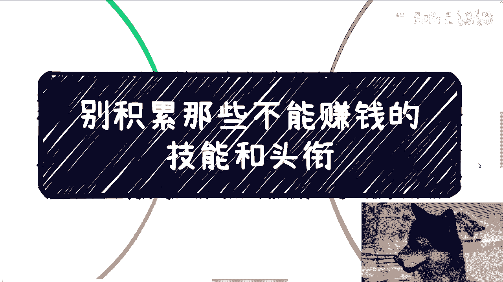
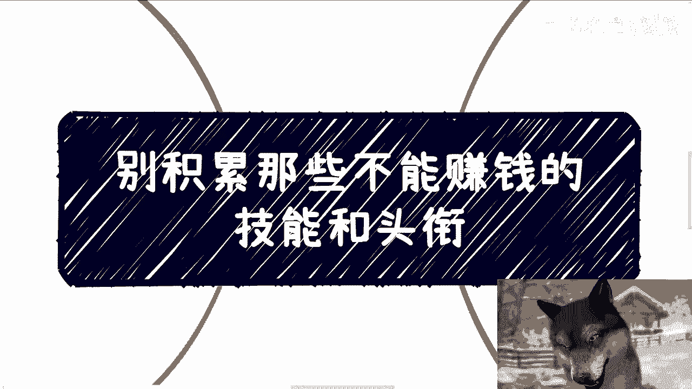

# 别积累那些不能赚钱的技能和头衔 - P1 - 赏味不足 - BV1mr421M7j7

啊大家好啊，我已经回上海了啊，这个今天我们来讲这个主题啊。

是这样子的啊，叫做别积累那些不能赚钱的技能跟头衔啊，我在这地方跟你们说的就说的清楚一点啊，只要没有商业价值，你们积累他妈的几张A4纸的头衔跟技能，都没卵用啊，而且我还得告诉你们啊，你们大部分人啊。

大部分人家庭老师，学校包括网络，包括呃短视频，自媒体，给你们所传达的很多东西就是没有价值的啊，就是没有用的，你们要是觉得有用，那我只能跟你们讲，很悲哀啊哈你们觉得有用。

可能更多的只是因为信息差啊。

首先啊今天我刚下飞机啊，看了一条私信啊，嗯他说什么呢，为了保护人家这个隐私我就不说了啊，但是就是说我跟你们说一下大概的意思啊，类似的私信呢我看到过不少啊。

很多人跟我说，他说我自己有什么技能，有什么头衔啊，然后就说啊怎么样怎么样，我今天就跟你们说的再直白一点，你积累的头像跟技能，在这个社会上他一定要变现，要有商业价值，否则没卵用啊，你要觉得有用。

你就是被PUA出来的啊，这就好像有的咨询人员跟我说，陈老师，我折腾了很多东西，然后给我列了一大堆啊，什么竞赛一等奖啦，什么江苏省啊，各种地方金奖啊对吧，各种什么很稀缺的奖项啊，我就这么问啊，问题来了。

你有这些东西，我就问你啊，如果今天你有啊，我就问你，你知道他的商业价值是什么吗，或者我说的再直白一点，能不能变现，你不能变现，不要跟我比比，对不对，你不能变现，你就不要骗自己，没有用的。

我告诉你，不好意思，没有用，真的哎你你你可能觉得很骄傲，你可能觉得很自豪，但不好意思，没有用呐，而且更何况啊，我不知道你们有没有发现过一个问题，就是很多东西你们甚至对整个社会的这种层级，对吧对。

很多就是政治啊，社会地位，很多东西你们甚至都不了解，也就意味着你们根本就不知道主办方是谁，或者主办方到底拥有怎么样的，社会地位或政治地位，而同时呢，你们也不知道这个所谓的奖，有所有什么含金量啊。

但是你们就会觉得很牛逼，有什么用呢，不就还是被骗出来的吗，对不对，我始终还是那个观点啊，我不关心你们是被骗的还是去骗别人，但是你可以骗别人，别自己骗自己啊，对不对啊，你骗不骗别人，这个是你自己的选择。

你的道德观，你自己的这个良心选择，但是你自己骗自己，我就表示不明白了。

对不对啊，第二有的人要说了啊，陈老师，你这样太武断了啊，我告诉你不好意思，社会就这样子的社会又不是你我决定的对吧，咱就这么说啊，假设你今天有个特殊的技能啊，一个special skill对吧。

然后呢特殊的才艺啊，你牛逼的很啊啊OK啊，然后呢要么就是你学历很高啊，你简直就是某个专业的天才啊，又或者你有很多的奖项啊，很多很多人呐这个练这种东西啊，都是童子功啊，啊从小可能就是在别人的赞美啊。

在在这种教练的，在各种各样的这个怎么说呢，这种讲下啊，这个这个这个成长出来的啊，但是问题是社会或者商业本身他不吃这一套，我以前早就说过，所有的花里胡哨在绝对实力面前都是花拳绣腿，都是没有用的，为什么。

因为你们要明白所谓绝对实力就是他能够变性，所谓花里胡哨，就是你们认为那些有用的东西都是花里胡哨，为什么，因为花里胡哨遍地都是啊，就比如说你今天是跟我说清北毕业的那一样的，清北毕业多了。

你跟我说长江商学院，那他妈长江商学院遍地也多了呀，你就是花里胡哨呀，花拳绣腿呀，你会变现吗，你会赚钱吗，不会你跟我说个屁啊。

对不对，你在绝对的那些懂得怎么变现，懂得赚钱的人面前，懂得赚钱的组织面前，你就是个屁，明白吗，奥特殊才艺能变现吗，不能你某个专业的天才，最终无非就是更好的去打工，你无非就是个高级电池。

你打工还是个辛苦钱，能赚钱吗，不能以及如果你在一里面，我说的那种什么很多金奖，很多奖项或者海外，你弄了很多paper，那我还是那句话，你能赚钱吗，不能对吧，你但凡告诉我，你懂得啊，我们打个比方。

你说OK陈老师，我知道国内某一条渠道哦，某一个组织某一个链路，我通过这个金奖，我通过海外这个paper啊，我能够申请他妈的什么什么什么什么，或者什么东西啊，你说我一次性能够从政府。

从企业从资本这边拿到500万，拿到1000万啊，那可以啊，诶你能够认识这些资本，认识这些企业，同时你还能拿到这个钱，这就是你的能力，而那些paper只是你的工具，你能明白吗，也就是说你认识这些人。

你知道怎么变现，这是你的绝对实力，而你手上那些paper那些学历就是我说的话，花拳绣腿，明白吗啊第三问个核心问题。

我们积累技能或者头衔是为了什么啊。

你想想看啊，无论你是谁，你都不可能一手遮天，你明白吗，我不管你今天有多高的级别啊，我不管你今天就算跟我说，我跟你讲也没用，明白吗，因为你要明白人类社会是什么，就是你不管是谁，你都会被制衡，你懂吗。

你都是会被上下牵制的，你不可能一手遮天对吧，因为你不是个superman啊，对吧啊，那么只要你在社会上，只要你在商会上啊，商业上你一定需要更多的帮手，更何况社会跟商业上面是没有永远的朋友。

跟永远的敌人的，我们积累头衔跟技能的核心目的是什么，很多人都会回答，为了赚钱，但是赚钱这个目的太宏观了对吧，就好像我问我问大家，大家活着啊，最终目的是什么，长生不老，那他妈长生不老也太宏观了，没有用啊。

那我就问细化具象化，我们为了什么，我告诉你们为了什么，为了吸引有价值的商业伙伴，以及吸引更多社有拥有社会地位，拥有商业地位，拥有政治地位的人，同时能够让他们觉得我们有价值来和我们合作。

这就是我们要去积累头衔，跟所谓的这个叫什么技能的这个目的，所以我之前才一直强调所谓的高举高打，所谓高举高打，就是尽量让自己要有跟别人对等的地位，或者头衔，我写错了或者头衔，比如说高校的挂职的专家。

比如说企业的咨询顾问，比如说政府的嘉宾，比如说你现在是个院士，是个教授对吧，海归呃，各种各样的什么高举高打的人才对吧，然后你要尽可能的再去在你身上积累更多的，政府企业资本的case啊，就所谓的案例。

因为只有有了这些东西，我们作为普通人，我们才有可能往上去走，你明白吗，才有可能往上去走，没了呀，你否则怎么去蹭呢，对不对啊，那么我再说的大白话一点，就是我们需要让别人明白，我们是一个懂得赚钱的人。

而不是一个只懂得把自己变成一个工具的人，你懂吗，哦如果你说了半天，你都是自己只是一个工具，别人为什么会跟你合作啊对吧，只有你是一个会赚钱的人，懂得赚钱的人，别人才会去找你合作。

同时我们要做的就是大家吸引在呃呃，合作在一起去合作，然后赚取更多的money对吧，一来达到同时1+1大于二。

甚至1+1大于三的结果，这就是人的目的啊啊哦我找你，难道是因为你学历高吗，卧槽我他妈遍地找学历高，找不到了，人死光了。

对不对，所以第四啊，大家可以反观一下，我一开始说的就是我不想去讨论哪些有用，哪些没有用，你们要觉得有用就有就有用对吧，哎我尊重他人命运嘛，我不想跟你们争论这些东西，但是我只想告诉你们。

当你们说自己拥有某个特殊技能的时候，或者说某个高学历的时候，或者有些奖项或者海外的paper的时候，其实你就在告诉别人，你是一个工具，maybe你是个牛逼的工具，但是不好意思，你再牛逼，你没有商业价值。

你懂吗啊，除非除非啊，有人非要在你擅长的这个赛道上去赚钱，并且他在中国或者全球，已经找不到跟你同样类型的人来做工具，以及你在某个技能点上面拥有垄断性的优势啊，同时还拥有非常强大的，有巨大的商业潜力。

那大家仔细看一下，我刚刚跟你们说的这些f else，你要同时满足才有可能去变现。

那么不好意思，你想想看这他妈是多大的概率，对不对啊。

所以不要再去骗自己了，你明白吗，没有用的啊，包括什么大学生创业竞赛或其他东西，包括各种各样的奖项，我还是那句话，maybe你们现在觉得很有价值，你们你们的认知，你们所在的环境，大家都热血沸腾。

觉得他很有价值，但是哎但是你们觉得有价值，是因为你们格局太低，是因为你们没有看到过，真正的是变现是什么样子，真正商业是什么样子，真正在社会上面哪些东西是有价值的，对不对，啊你不要再去，比如说你问我也好。

问别人也好，你说哎，我觉得自己好像已经有足够的头衔跟跟跟，跟那个叫什么，就是呃技能了，那你自己问问你自己，你的头像跟技能能变现吗，请问能吗，如果你跟我说，你不懂，你不会啊，你甚至就说爱陈老师。

我只要有流量就能变现，那不好意思，那说明什么，那说明你不会商业，你没有变现的能力，那你说个屁，明白吗。

我不care，就是我不关，你要明白啊，社会上所有的资本家，所有的商人，他根本就不关心你吃过多少苦，你吃多少苦，关我吊事啊，啊照你这么个说法，那他妈的所有世界上拉磨的驴，我都应该拉过来合作。

因为他们吃的苦比你多得多了，对不对，有关系吗。

啊好吧行啊，那么这个点我希望你们真的好好想想啊。

额剩下就是那个你们工作上面职业规划啊，包括你们跟别人合作啊，包括你们跟自己做了一些副业，商业上的一些规划，在这当中可能涉及到了合同啊，股份啊，期权啊啊分红分润啊，商业计划书啊，白皮书啊。

包括你们希望呃通过我的一些视角啊，结合你们个人的问题跟个人的背景，能够给你们一些更接地气的建议，以及让你们少走点弯路的话，那么你们可以整理好对应的问题跟个人背景，我们再来做咨询。

