# 课程 P1：别积累那些不能赚钱的技能和头衔 💼

在本节课中，我们将探讨一个核心观点：个人技能和头衔的积累，必须以具备商业价值和变现能力为前提。我们将分析为何许多看似光鲜的成就实际价值有限，并明确积累这些资源的真正目的。

---

## 核心观点阐述

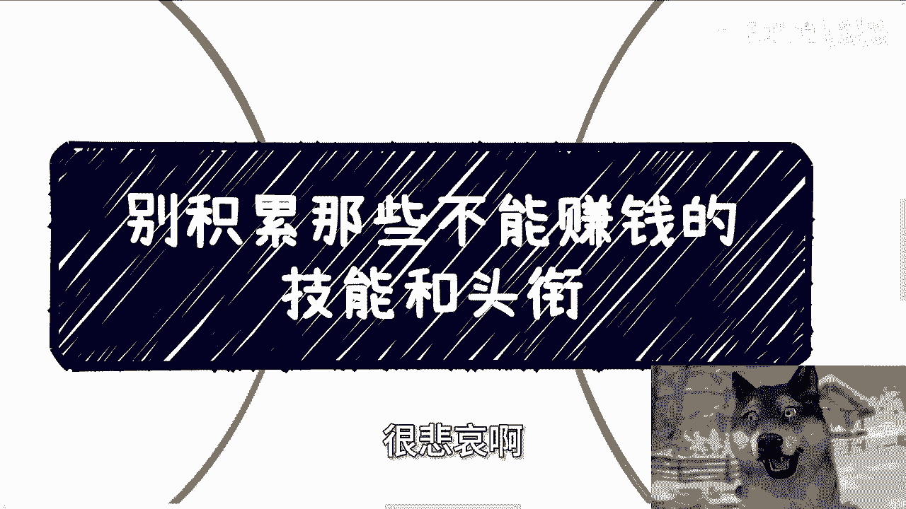

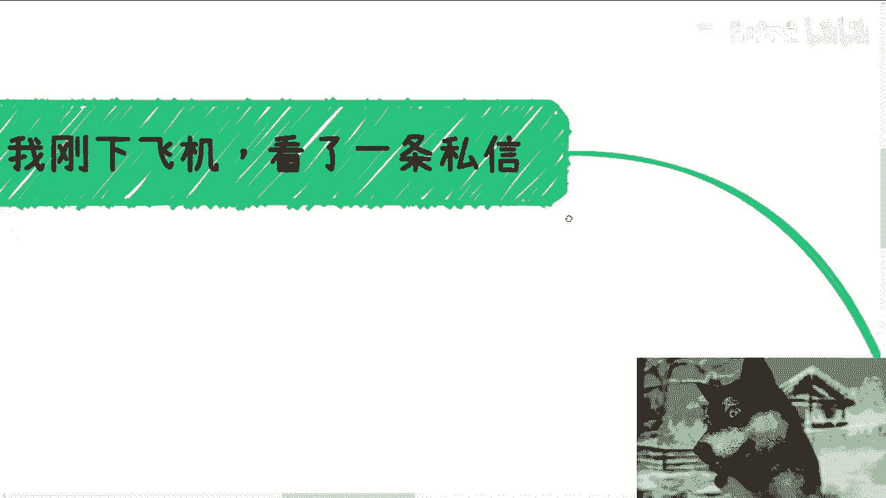

今天讨论的主题是：不要积累那些不能赚钱的技能和头衔。需要明确一点，只要不具备商业价值，积累再多的头衔和技能都毫无用处。

必须指出，家庭、学校、网络、短视频和自媒体向大部分人传达的许多信息，本身就没有价值。如果认为这些信息有用，那很可能只是因为存在信息差。

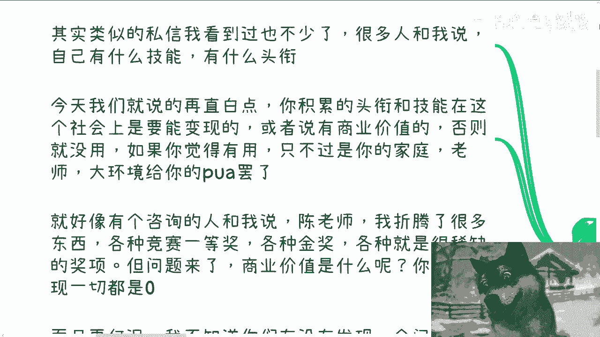

---

## 案例分析：私信中的普遍困惑

首先，分享一条具有代表性的私信。为了保护隐私，不透露具体内容，但其核心是许多人向我展示他们拥有的技能和头衔，并询问如何发展。

对此，我的观点非常直接：你积累的头衔和技能，在社会中必须能够**变现**，必须具备**商业价值**，否则毫无用处。如果认为有用，那可能是被外界观念塑造的结果。

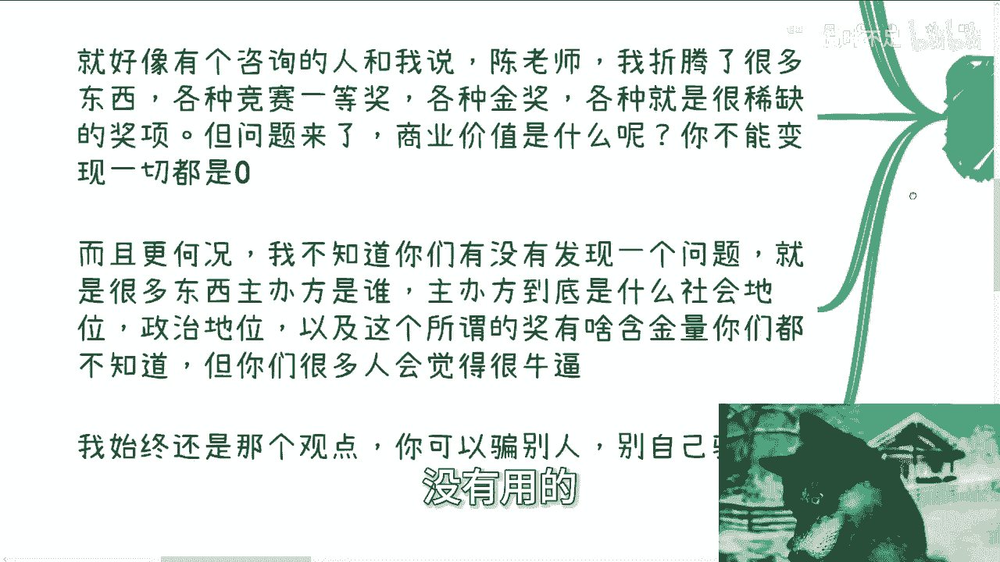

例如，曾有咨询者列举了诸多奖项，如竞赛一等奖、省级金奖等稀缺荣誉。我的问题是：你知道这些奖项的商业价值是什么吗？更直白地说，**它们能变现吗？** 如果不能，就不要自我欺骗。

---

## 对“荣誉”的理性审视

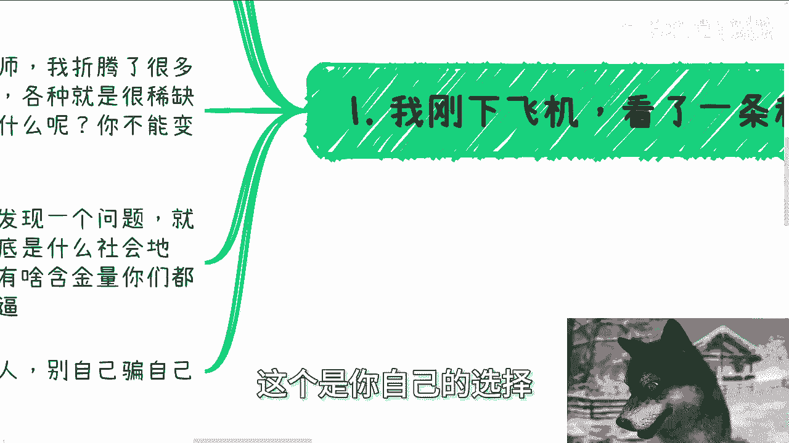

必须承认，许多荣誉没有实际用处。你或许感到骄傲和自豪，但现实就是没有用。

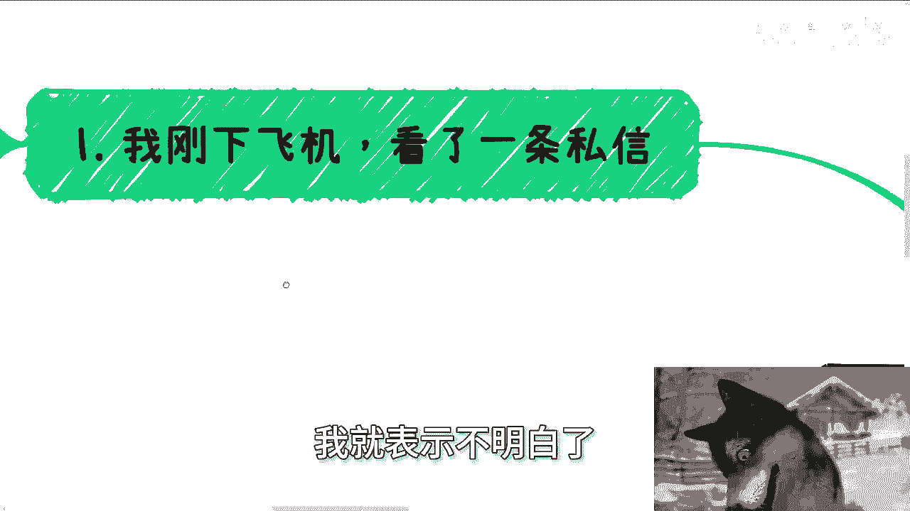

此外，许多人甚至不了解颁发奖项的主办方在社会或政治层级中的地位，也不清楚奖项本身的含金量。仅仅因为感觉“很牛”就认为有价值，这本质上是一种欺骗。你可以选择欺骗别人，但绝不要欺骗自己。

---

## 社会现实的残酷性：花拳绣腿 vs. 绝对实力

第二点，有人认为我的观点太武断。但社会规则就是如此，不由个人决定。

假设你拥有特殊技能、出众才艺、高学历或是某个专业的天才，又或者获得许多奖项。许多人从小苦练，在赞美和教练的指导下成长。

但社会和商业体系不认可这一套。早已说过，所有的花里胡哨在绝对实力面前都是花拳绣腿，没有用处。

**核心区别在于**：
*   **绝对实力** = **能够变现的能力**。
*   **花里胡哨** = **你认为有用但遍地都是的东西**。

例如，清华北大毕业、长江商学院背景的人很多。如果你不会变现、不会赚钱，在懂得赚钱的个人或组织面前，你就毫无价值。

特殊才艺能变现吗？不能。某个专业的天才，最终可能只是更高级的“打工电池”，赚的是辛苦钱。获得许多金奖、奖项或海外发表论文，能赚钱吗？不能。

除非你能告诉我，你通过某个金奖或论文，认识特定的资本或企业，并能从中一次性获得500万或1000万的资金。那么，**认识这些人并知道如何变现，才是你的绝对实力**，而那些论文和学历只是你的**工具**。

---

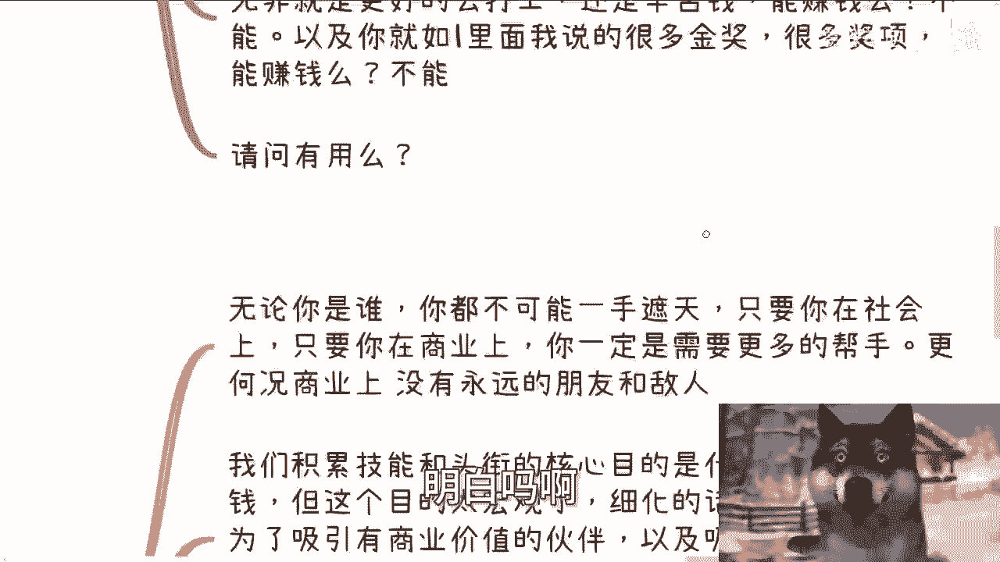

## 积累技能与头衔的真正目的

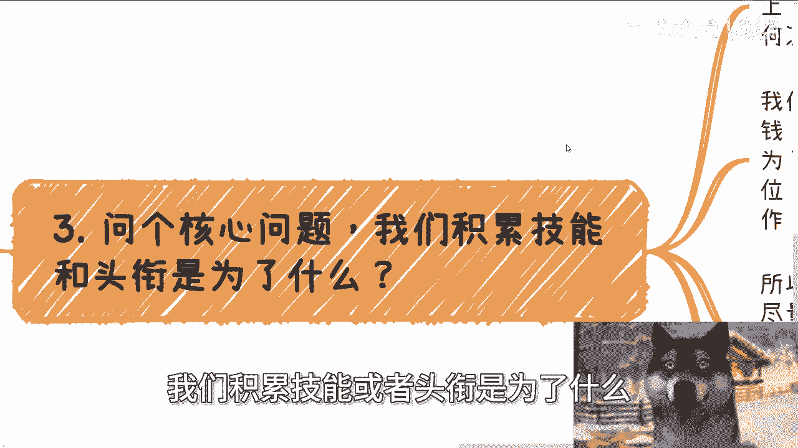

第三，问一个核心问题：我们积累技能或头衔是为了什么？

无论你是谁，都不可能一手遮天。在社会和商业中，每个人都会被制衡和牵制。只要身处其中，你就需要更多的帮手，况且这里没有永远的朋友或敌人。

那么，积累头衔和技能的核心目的是什么？很多人回答“为了赚钱”。但这个目的太宏观，就像问“活着的目的是长生不老”一样，没有实际指导意义。

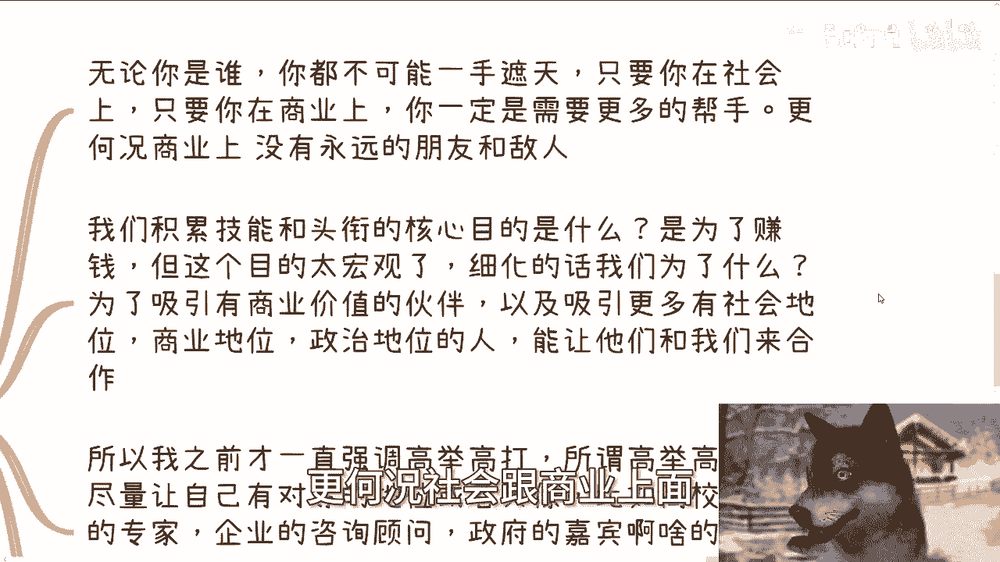

我们需要将其细化、具象化。目的是：**为了吸引有价值的商业伙伴，以及吸引更多拥有社会地位、商业地位或政治地位的人，并让他们觉得我们有价值，从而愿意与我们合作**。

这就是我们要积累头衔和所谓技能的目的。因此，我一直强调“高举高打”——尽量让自己拥有与别人对等的地位或头衔。

例如：
*   高校的挂职专家
*   企业的咨询顾问
*   政府的特邀嘉宾
*   院士、教授、海归等高层次人才

同时，要尽可能在身上积累更多来自政府、企业或资本的成功案例。只有拥有这些，作为普通人才有可能向上走。

说得更直白些：我们需要让别人明白，我们是一个**懂得赚钱的人**，而不是一个**只懂得把自己变成工具的人**。只有你是一个会赚钱、懂得赚钱的人，别人才会找你合作。我们要做的就是吸引大家合作，实现 **1+1 > 2** 甚至 **1+1 > 3** 的结果。

我找你合作，难道是因为你学历高吗？遍地都是高学历的人。

---

## 自我定位：是“工具”还是“创造者”？

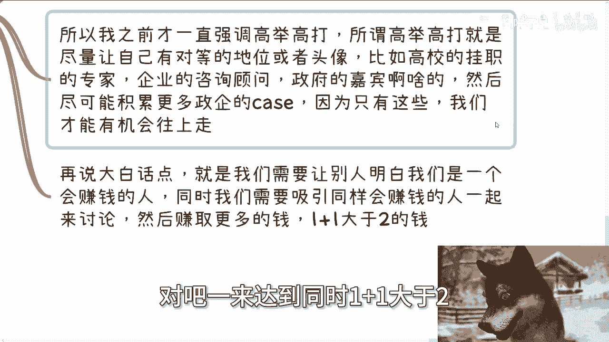

第四，大家可以反思一下。我不想争论哪些有用、哪些没用。如果你觉得有用，我尊重你的选择。

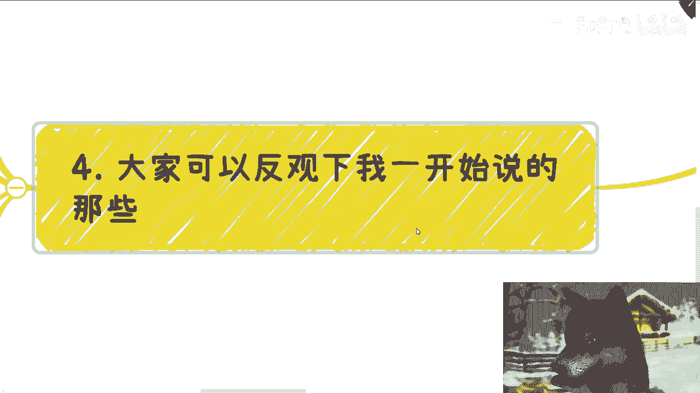

但我想指出，当你强调自己拥有特殊技能、高学历、众多奖项或海外论文时，你实际上是在告诉别人：**你是一个工具**。也许你是个厉害的工具，但如果没有商业价值，就毫无意义。

除非同时满足以下所有条件，才有可能变现：
1.  有人非要在你擅长的赛道上赚钱。
2.  他在中国或全球找不到与你同类型的人来做这个“工具”。
3.  你在某个技能点上拥有**垄断性优势**。
4.  该技能点拥有**巨大的商业潜力**。

请仔细看这些条件，需要**同时满足**才有可能。请想想，这是多大的概率？

---

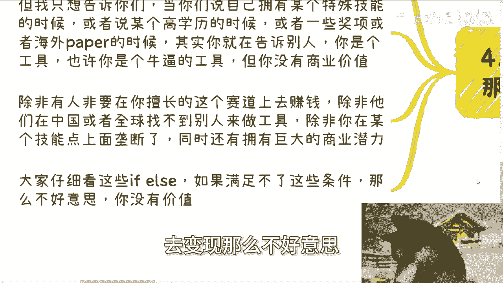

## 总结与忠告

所以，不要再欺骗自己了，没有用的。

这包括大学生创业竞赛等各种奖项。也许你现在觉得它们很有价值，在你的环境和认知里，大家热血沸腾。但你觉得有价值，很可能是因为格局不够，没有见过真正的变现和商业是什么样子，不清楚社会上哪些东西真正有价值。

不要再去问别人“我拥有的头衔和技能够不够”。你应该问自己：**我的头衔和技能能变现吗？**

如果你回答“不懂”、“不会”，或者说“只要有流量就能变现”，那恰恰说明你不懂商业，没有变现能力。

社会上的所有资本家和商人，根本不关心你吃过多少苦。照这个逻辑，世界上拉磨的驴吃的苦更多，难道都应该合作吗？没有关系。

---

## 本节课总结

本节课中，我们一起学习了技能与头衔积累的核心原则：**必须以商业价值和变现能力为导向**。我们分析了为何许多荣誉实际价值有限，明确了积累资源的真正目的是**吸引有价值的合作伙伴**，并区分了作为“工具”与作为“价值创造者”的根本不同。希望你能重新审视自己的积累，聚焦于真正能产生商业价值的路径。

---

**附：关于进一步咨询**

如果你在工作职业规划、与人合作、副业或商业规划中，涉及到合同、股份、期权、分红、商业计划书等问题，并希望结合我的视角获得更接地气的建议，以少走弯路，可以整理好具体问题和你的个人背景，再进行咨询。