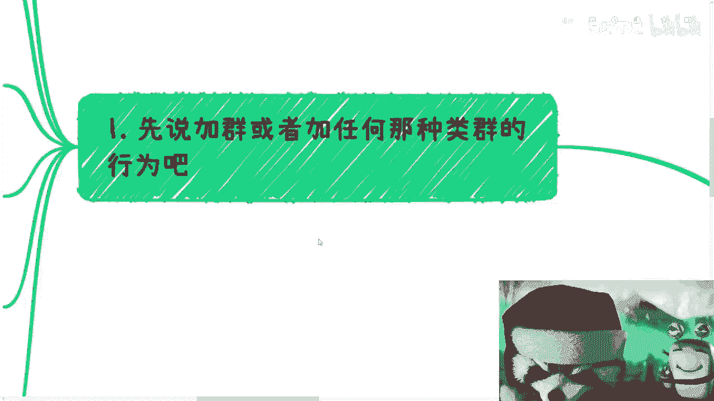
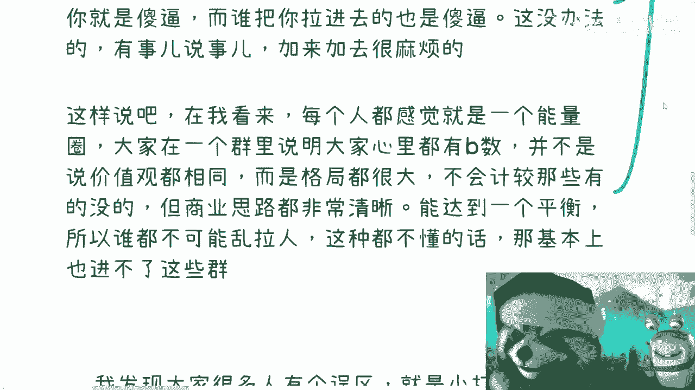
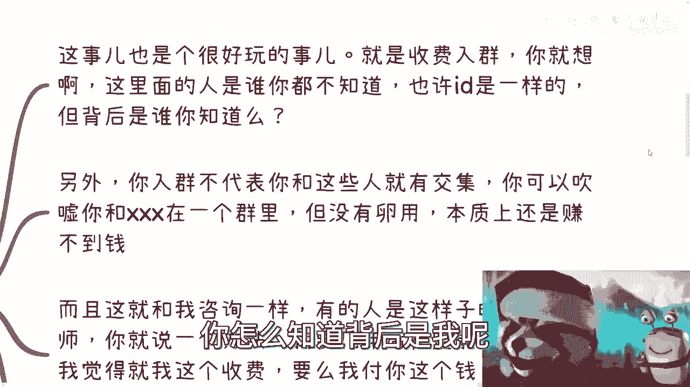
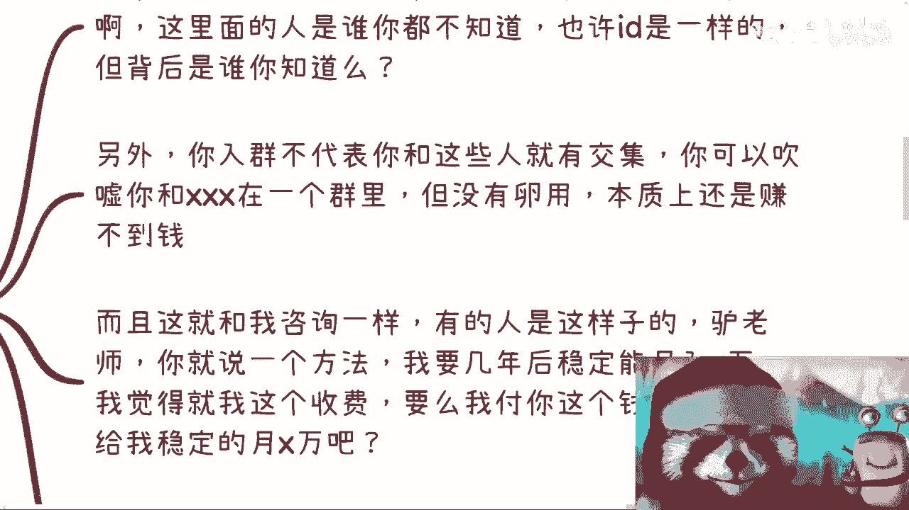
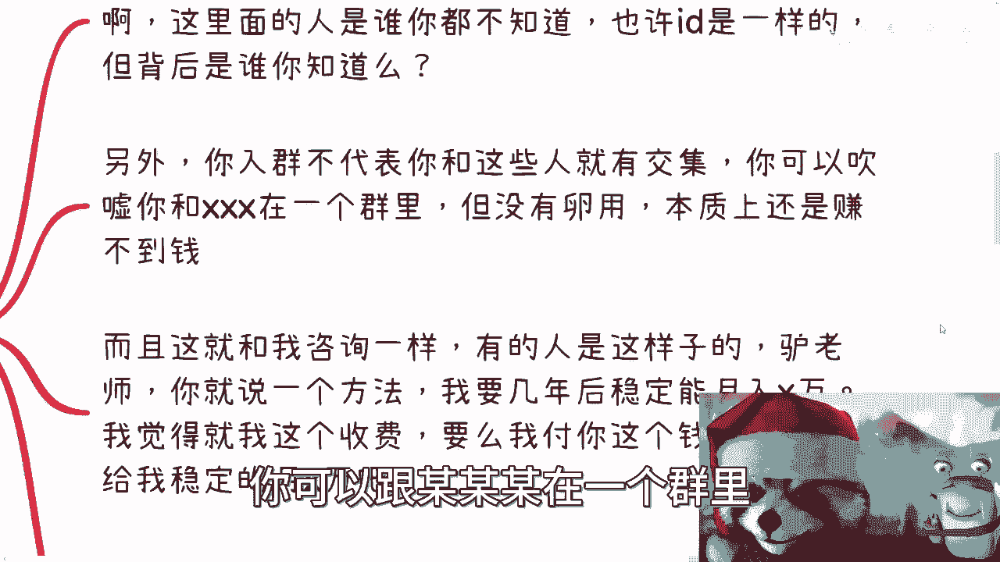
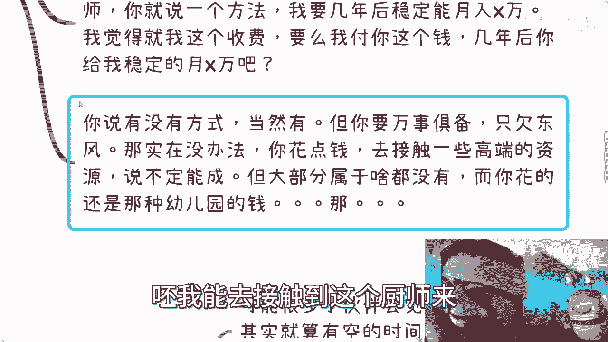
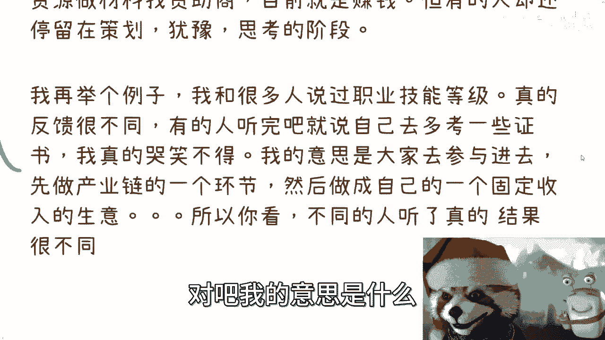
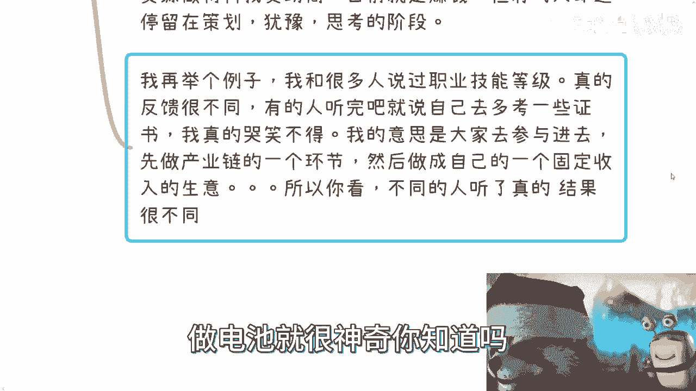

# 课程一：停止无效社交与空想，聚焦行动与认知提升 🚫🤔

在本节课中，我们将探讨两个常见的思维误区：过度追求加入“高端圈子”和陷入无效的“空想”。我们将分析这些行为的本质，并指出更有效的成长路径是**先行动，后复盘**。

---

## 一、关于“加群”的迷思

上一节我们概述了课程核心，本节中我们来看看第一个具体问题：追求加入所谓的高价值社群。

许多人希望通过加入微信群、QQ群或知识星球来扩展人脉、学习知识。然而，这种行为的实际效果往往与预期不符。

以下是关于“加群”的几个关键事实：

1.  **圈子的本质是能量匹配**：真正有价值的社群成员通常处于相近的认知与资源水平（`Level`）。大家因共同的格局和“默契”而聚集，不会随意引入不在同一水平或没有价值交换可能的人。
2.  **社群内不讨论“干货”**：高净值人群的日常交流多围绕生活、娱乐、八卦，而非具体的商业模式或技术细节。期望在群聊中学到“致富秘籍”是不现实的。
3.  **付费入群的价值存疑**：你无法验证群成员身份的真实性。即使加入，也并不意味着你与群成员建立了有效连接或获得了合作机会。付出的金钱与得到的价值往往不成正比，其关系可以概括为：
    **`付出的金钱 << 获得的价值`**
4.  **人脉的核心是价值交换**：在没有自身价值（如资源、能力、合作潜力）的前提下，单纯“加好友”或“在一个群里”毫无意义。人脉不是认识谁，而是你能为谁提供价值。

**简单来说，在你自身没有达到相应层次或准备好价值筹码时，盲目追求进入高阶圈子是无效的。**

---

## 二、关于“思考”的陷阱

理解了社交的误区后，我们再来剖析另一个问题：为什么单纯的“思考”往往没有结果？

很多人抱怨自己太忙（如996），没有时间思考。但问题的核心并非时间，而是**执行力**和**认知基础**。

以下是关于“思考”需要明确的两点：

1.  **空想不等于有效思考**：即使有空闲时间，很多人也会因执行力不足、杂事干扰或缺乏自驱力而无法进行深度思考。忙碌于没有成长性的琐事，与停下来进行无效空想，结果是一样的。
2.  **认知水平决定理解上限**：我们的所有学习、思考和交流，都受限于自身的认知框架。就像读书一样，如果认知不足，即使看到高深的内容，也只能理解字面意思，无法洞察背后的逻辑与本质。

**举例说明认知差异：**
当听到“做活动”这个建议时，不同认知的人行动截然不同：
*   **高认知行动者**：立即着手联系赞助商、制作招商方案，目标直接指向盈利。
*   **低认知空想者**：停留在“策划”阶段，反复思考活动细节如何更“完美”，试图更好地“服务”他人，却迟迟不行动。

当听到“职业技能等级”时：
*   **高认知思考**：研究其背后的产业链，思考如何成为其中的一个服务环节并获利。
*   **低认知思考**：理解为要去多考几个证书，让自己成为“更优质的电池”（即更具竞争力的打工人）。

**核心公式：`行动反馈 -> 提升认知 -> 指导更有效的行动`**
脱离行动的思考，如同无源之水，无法突破你原有的认知盲区。

---

## 三、提升认知的唯一路径：实践

既然空想和无效社交都行不通，那么提升认知的正确方法是什么？

答案是：**投身实践，在事上练**。

1.  **“滚一圈”才有体会**：只有亲自进入一个领域的生态中实践，才能看清其内核与规则。纸上谈兵或隔岸观火，永远无法获得真知。
2.  **跟随与蹭项目**：在自身能力不足时，最有效的方式是寻找机会跟随有经验的人做项目。可以主动提供辅助劳动（如运营、执行）而不计报酬，核心目的是**近距离观察、学习和理解**完整的商业逻辑。
3.  **警惕“数量不等于质量”**：社会上愿意真诚分享、指出你思维错误的人是少数。多数信息可能是无效或片面的。因此，需要在实践中保持批判性思维，不断验证和复盘。

**请注意**：许多人对打工和读书之外的世界（如法律边界、财务、公司运作）毫无认知。突破“电池思维”，正是要从为自己创造价值开始，而不仅仅是优化为他人打工的能力。

---

## 课程总结

本节课中我们一起学习了：

1.  **停止无效社交**：不要迷信“加群”。人脉基于价值交换，提升自身 `Level` 是进入更好圈子的前提。
2.  **停止无效空想**：脱离行动的思考是徒劳的。认知水平限制了对信息的理解深度。
3.  **坚持行动-复盘循环**：提升认知的唯一可靠路径是**实践**。通过具体项目积累经验，用实践结果反馈并修正认知，形成成长正循环。

**记住核心行动纲领：先干起来，在行动中遇到问题，再进行有针对性的思考和复盘。** 你的认知边界，将在一次次真实的挑战与解决中得以拓展。