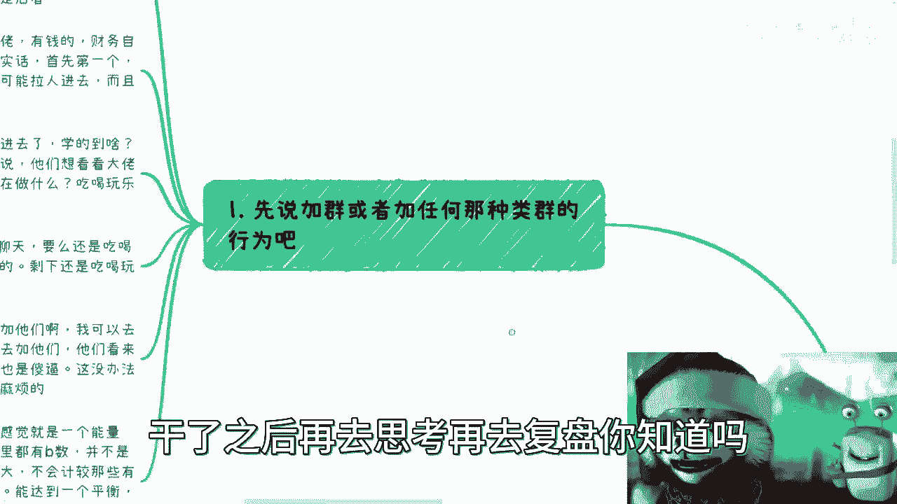
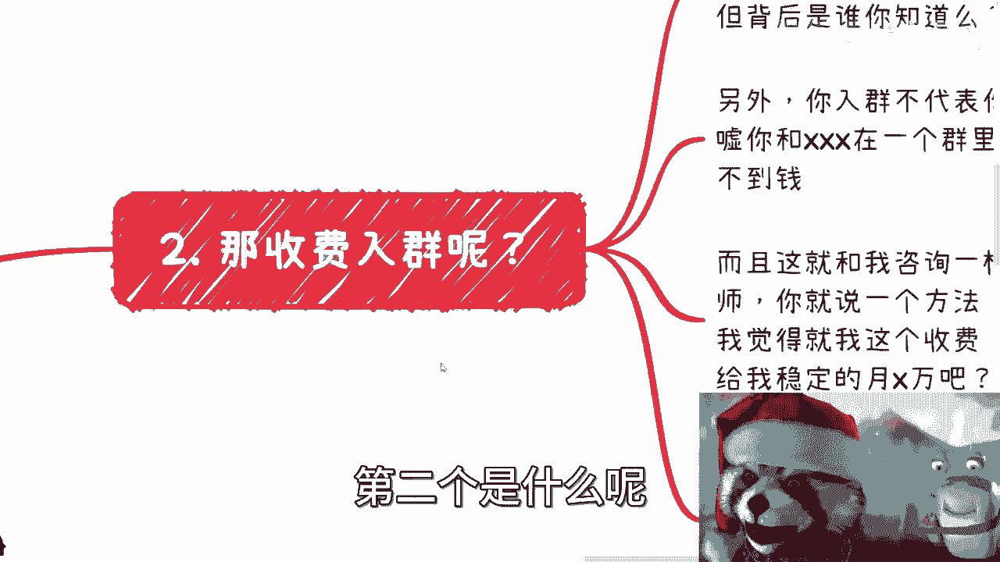
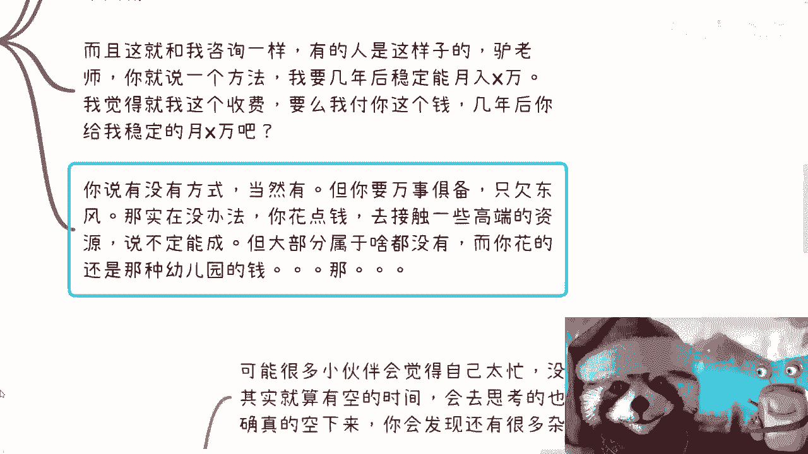
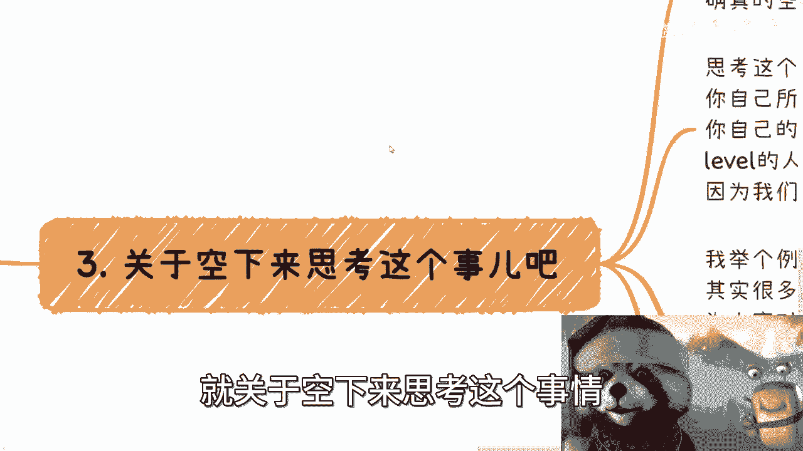
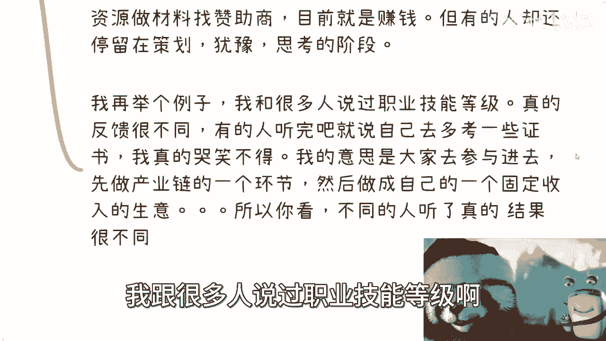
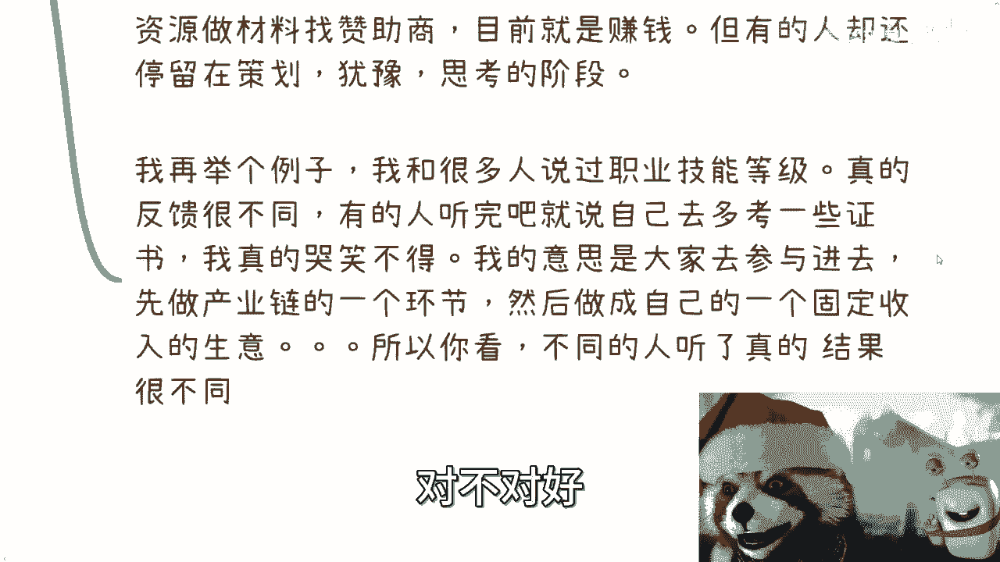

# 别老想着加群or去思考，我们思考不出认知外的东西 - P1 - 赏味不足 - BV1dX4y1a77U

哈喽大家好啊，今天其实今天不打算录，但是想想算了对吧，零点还没过，也算今天对吧，那就可以录一下，这一期呢这个内容是这样子的啊，因为最近呢好多人跟我说关于加群啊，然后呃关于说这个去思考对吧。

我就把它列在一起啊，呃核心是什么呢，就是不用老去想着加不加群，因为你们大部分人加来加去，还是同一个level的这个群啊，然后呢也别老去思考呃，所有人是思考不出来人之外的东西的，你知道吗。

就这两个东西不用去想，你知道吗，其实本质省流，我帮你们省是什么，就是干啊，干了之后要去，干了之后再去思考，再去复盘，你知道吗。

首先啊，先说这个加群或者加任何这种类似群的行为啊。

你看我这两天正好有小伙伴说要加群对吧，这事呢其实蛮好玩的啊，我想展开说说，为什么呢，就说群呢很多对吧，微信群啊，QQ群啊，知识星球啊，很多很多，其实有的人呢目标是去水的对吧。

有的人呢是真的想去扩展圈子的，我今天要讲的主要是后者啊，就是你水不水跟我没有关系，你爱吃水是水跟无所谓啊，我我就像有很多人说我就甘心做电池，那就算了，我也就不说什么了对吧。

那我主要是说大家真的是希望通过呃去群啊，去学习啊，这样一个情况啊，好巧不巧呢对吧，富二代啊，包括你们网络上各种网红啊，大佬啊，有钱的财务自由的对吧，这种群啊我正好也有那么一些啊，那么若干个若干个。

那么说实话呢，首先第一个啊这种群我肯定不是群主啊，所以呢我也不可能让人进去，而且呢我跟群主也不熟，那当然了，这种不熟就是说大家吃过饭对吧，喝过酒啊，但是不熟的点是在于说啊我没有合作过对吧。

所以我没有合作过，没有赚过钱的，我都不熟啊，那这个事情很简单，第二点呢要说实话，就是大家真的进去了对吧，你说你能学到啥，我跟你讲，你学不到啥，就像有很多人跟我说啊，有没有什么什么大佬群对吧。

有些什么东西，我其实真的我有时候很想说，你们去了，你也学不到什么。

为什么呢，因为每天群里面该干什么，就吃喝玩玩乐也没有了呀，那包括我在群里面每天发的什么，也就是吃玩对吧，然后跟大家说，你看啊我们今天赚了多少钱没了呀，你学习啥呢，我不明白了，你能学到啥呢。

这我就说不好听点，哪个哪些你们认为的大佬，你们认为的这种什么高净值人群，在群里面讨论技术的啊，讨论商业模式的有，不然没有的呀，讨论技术跟讨论商务模式都low爆了，唉哟对不啦啊，财富自由人来干什么。

那群里面聊天啊，还能干嘛呢，吃喝玩乐聊聊八卦，聊聊娱乐聊聊，偶尔聊聊，正直对了，剩下的还吃喝玩乐，你能学到啥呢，你学吃喝玩乐吗，那不好意思，你你既没时间也没钱，对，就是很现实的，就这么残，就这么残酷。

怎么办呢，对不对，那有的小伙伴要说了，他说哎那我可以加他们对吧，我可以去取经啊，对吧，我跟你讲问题来了，你去加他们，在他们看来你就是对吧，你就是没有逼数的，谁把你拉进来，谁他妈也是，这没有办法的。

因为有事说事啊，没有你说哪个人喜欢莫名其妙啊，没有来路说明的，我也不认识你的，加来加去有什么好讲的，对对对，你们真正的认为的那些人是不可能假的，除非你们就是前提有合作，那是没问题的，对不对。

那这样说好了，我觉得这种群里面每一个人其他都是个能量圈，就是说大家每一个人，其实就是都是有独立的一个领域，在这个群里面的，呃，然而呢就是说大家无论怎么说，大家其实是互不干涉的，你知道吗。

但是呢你大家在一个群里面，说明这些人心里是有逼数的，比如说这群一般啊，我跟你讲，这种群一般也就是六七十个人对吧，都是有逼数的，倒不是说大家价值观都相同，而是说格局都很大，什么叫格局都很大。

就是不会去计较那些有的没的，而且心里有逼数，什么意思呢，就是说嗯大家在很多事情的看法上面，会达到一个平衡，会达到一个默契对吧，尤其是在商业上面，所谓商业上面什么意思，就是没有人会去莫名其妙的拉人。

也不会有人去跟城主说，哎我们今天拉一个人进来，不会的，因为这些人原本就是这个圈子，你要外面再有人进来，除非是什么，除非就是说你已经达到了跟他们一样的label，或者说你有他们想要的东西，那可以。

那否则呢不可能的呀，对不对。

那这种如果都不懂的话，基本上也不可能进这些群了，你知道吗，那首先这是第一个，第二个是什么呢。

就是收费入群啊，这是我跟你讲也很好玩，就是收费入群，你就想啊，这里面的谁，这就这群里面的人是谁，你都不知道对吧，也许只是id一样，就比如说你在群里面看到我啊，你怎么知道背后是我的对吧。

你怎么知道背后不是别人呢，是吧，没有意义的啊。

另外呢就是说你入群，并不代表你就跟这些人有交集对吧，就像你比如说现在有很多人咨询我对吧，的确啊，我跟你讲，我微信后面就是我，我也没有小号哦，你们加我OK没问题，但是并不代表你跟我有合作嘛，对不对。

那我也不发朋友圈，其实你加我，我觉得对大家也没什么很直接的帮助对吧，那除了有些小问题，你们问我就随便问对吧，也可以，我只要有空我都会回，对不对，但是呢你去加了那些人，你说你可以吹嘘。

你可以跟某某某在一个群里。

但是本质上没有卵用啊，因为本质上你也赚不到钱对吧，而且我跟你讲，这就跟我咨询是一样的，有的人是这样子的，他说吕老师，他说你就说个方法，我要几年后稳定能月入几万对吧，那那我我这么说啊。

我说我男二觉得我觉得啊你要这么讲呢，我觉得我这个收费要不这样吧，我翻个倍啊，我翻个倍，我父亲给你啊，然后呢，你几年后给我个稳定的月入几万的方式好吧，要不这样子对不对，没有意义的呀，你知道吗。

就是说就是说很多的收费，咱不是说这个收费本身没有意义的，而是说很多时候大部分老百姓，大部分普罗大众所面临的这个收费，他还是纯格，你知道吗，就是说就是说你付出的钱跟你得到，完全是不成正比的对吧。

那么你说有没有方式，当然有，就是说你要万事俱备。

只欠东风，给我打个比方，比如说你说哎我现在这个资源也都找好了对吧，人也都找好了，合伙人也有对吧，产品也有对吧，但是呢你说哎，我可能对这个商业逻辑没有什么很大的想法啊，或者说我跟别人合作，我怕被别人坑了。

那怎么办呢，你可以花钱来找我对吧，你说哎刘老师，我花钱咨询你一下对吧，我现在这个方案啊，我的我的这个合作方怎么样子，我我现在这个情况怎么样对吧，你觉得靠不靠谱，那没毛病对不对，那你相当于去找我。

你说不定能成对吧，或者说你说我不能帮你，我可能有别的资源可以帮你，也说不定能成，但是你大部分人是属什么，大部分人是属于什么都没有对吧，就是我人也没有产品，也没有idea，也没有什么都没有对吧，然后呢。

而且你还花的是那种幼儿园的钱对吧，那点点点点点，对不对，就是我跟你说啊，就是大家客观的去看待这个问题，就是说你付出的钱，比如说你付500，付5000，哪怕付5万，你能得到什么服务，你能得到什么人脉。

你心里有逼数，你知道吗，千万不要去妄想说，哎，我今天花了1000块钱，2000块钱，我能去接触到乔布斯来啊呸，我能接触到这个厨师了。

那不可能的呀，你说对不对。

啊那么这个是第二个，第三个呢就是关于空下来思考这个事情。

是这样子的呃，可能很多小伙伴们会觉得自己太忙啊，996007啊，没有这个空余的时间，但是呢我跟你们说啊，这个事情呢跟你们有没有空时间根本没有关系，因为就算今天你有空的时间，很多人执行力是不够的。

他没有这个执行力，你就好像我跟你们这么说，你们大部分人是不知道我每天能做多少事情，就是我可能一天做的事情可以大于很多人，半个月甚至一个月做的事情对吧，当然你可以说我效率高。

但是大部分我觉得是我的自驱力比较强对吧，那么我觉得很多人他就算有空的时间，他会去思考的比较少，因为真的空下来了，一方面是他的自驱力可能比较弱，第二方面是你会发现，你可能还有很多的杂事需要处理。

也会影响你的心情，也就是说你会有就是当你空了之后，你会有可能1000种1万种借口，让你继续这个猛下去而不去思考，但是忙的事情本质上又不会有太大的，就是说就对你的这个这个这个这个label啊。

或者对你的这个思想啊不会有太大的提升，那么这个是第一点，第二点呢我们来看一下思考这个事儿啊，我跟你讲思考这个事呢，就跟这个看书是一样的啊，也就是说你看啊，我其实之前说到这个读书的这个时候，我也说。

我说我一直是觉得所有的这些我们的所想，所学所看其实都是一个机遇的，大前提就是你自己的认知，也就是说我们再去看高深的东西，再与高level的人去交流沟通，你你再去看那些就是非常牛逼的东西对吧。

就是浓缩精华的东西，你对你帮助是很少的，为什么，因为大部分人的认知限制了我们的吸收啊，就是你看这个东西，你只看到他的面，你只看到那几个字，但是它背后想要传达的东西你看不到啊对吧，你举个例子啊。

就比如说打个比方，就比如说我说我一直跟大家说做活动对不对好，但其实很多人真正落地的时候，做法很不同，为什么，因为你会发现大家对于我说的东西，认知是不一样的，你看啊，虽然我说的话都是同一句。

但是他结果是截然相反的，你看啊，有的人听完明白了，他他这个上个月就直接去找材料啊，找资源，就就直接就是说做这种二折页，三折页，找赞助商对吧，目标就是赚钱，然后呢有了赞助商，我再去办。

会对他思路很清楚对吧，但有的人呢就还停留在策划，有意思考，就在想哎呀我到底弄什么东西对吧，怎么样子，但是你会发现，我无论是我说做活动的意义是什么意义，就是你会什么并不重要，你要做什么也不重要。

你要做的其实就是去想办法找那些，就是说啊，比如说比如说那些老师啊，或者那些那些讲师啊，或者一些topic对吧，你就把它全部组组成一个word，组成个PDF，然后就说你要这些嘉宾。

这些嘉宾又不一定真要就要过来了，对不对，然后你就拿这些你要的东西再去找别人赞助商，你就说哎我可能比如第一次办对吧，可能就比如说什么呃，这个这个银牌铜牌赞助，比如说2000块钱对吧，银牌赞助5000块钱。

金牌赞助1万块钱，你就是套娃对了，你要有我跟你讲，到时候又有人要说了，他说那我掏不到啊，怎么办啊，你掏不动不停的套啊，我我昨天那个视频说的也很清楚，就是所有的事情你失败一次很正常，那就不停的去试啊。

又不代表这就是这不代表这个路走不通啊，对吧好好，然后我跟你们说，我再举个例子啊，我跟很多人说过职业技能等级啊。

就是我包括在之前视频里，我也说到过职业技能等级，对不对，好。

我跟你讲啊，就真的这个结果很不同，有的人听完啊，就跟我说，哎刘老师，你意思是不是说我多去考一些证书对吧，怎么样子，他说他说我要么什么什么什么什么，什么面点师啊对吧，花艺师啊，什么我都去考一下。

我就很哭笑不得，为什么我从头到尾都是一个告诉大家，不要做电池的这么一个人哦，我还会让你们去多考一些，为了让你更好去做电池的证书，这这你想想可能吗对吧，我的意思是什么。

我的意思是让大家去了解一下，职业技能等级，在中国这片土地上面是怎么运作的，对吧，你想办法让自己参与进去做，先作为产业链里面的一个环节，你先帮人家打打工，对不对，然后对于整个产业链有一定了解之后。

你可以把自己，就把这个业务做成你自己的一个固定的收入，这个是我的本意啊，但是你会发现你看到没有，就是我说完这个事情，每个人理解是不一样，为什么，因为大家认知不一样，我为什么一直跟所有的人啊。

说到现在我说为什么要改变拒绝这个电池，是电池思维，因为你们会发现一个点，就是每个人啊听一个东西，包括你们今天听新闻也好，听别人说话，听你们老板说话也好，你们的思维，你们把对方说的话翻译过来。

这个流程它是一个潜意识的，也就是说你会很顺其自然的反应过来，你不会去质疑你翻译过来的东西，对不对，但是你会发现这个电池思维，并不是说我们就仅仅打工叫电池思维啊，你知道吗。

就你看我这个地方写的不叫拒绝做电池，叫做拒绝电池思维，因为很多时候我们的想法就是那么的怎么说呢，就是我可能说的真不好听啊，就那么的贱，你知道吗，就是很多时候我们要做的事情，是为我们自己去做。

而不是老想着怎么帮别人做好更多的事情，你看啊你看啊，你看不管是这边停留在策划犹豫思考，他其实为什么犹豫啊，为什么思考啊，就是因为他觉得哎呀，我怎么做能够更好的帮到别人对吧。

我怎么做才能让别人有有吸引对吧，然后你比如说这个地方，他说我自己就多考一些证书，你会发现他的目的是什么，为了让自己以后更有竞争力，那他妈有竞争力干什么，做电池就很神奇，你知道吗。

就是这个逻辑，你你说对不对，对，没毛病，但是问题是你要这些逻辑，你财富自由了之后才有这些逻辑，你当下的那个逻辑是先赚钱啊，对不对，你下面这个也是一样的呀对吧，我希望大家能够依赖这个东西去背靠大树。

背靠政府的去赚钱，而不是说去考证书，然后去做更好的电池，你明白吧啊，但是你会发现当你们把我的话翻译过来的时候，你们自己是不会觉得有问题的，除非哪天是吧，你们跟我讲了之后，我真的我就会骂骂娘，你知道吗啊。

然后第四个就是认知这个事，除了自己去实践，没有别的方式，我在上一个视频说的也很清楚，就是我发现很多人啊他有一个误区，这个误区是什么呢，就是说啊啊我们做很多东西就是有全职，有兼职啊。

小打小闹可以去聊就做了，比如说我今天做了，我就可能去了解很多事情的内核，可可能可以看到很多本质，然而我跟你讲啊，除非你冲进去这个水池，这个整个生态里面滚一圈，否则你是看不透的啊。

我和很多人在线上咨询或者线下咨询的时候，我发现已经用了最直接的语言进行描述了，但是还有很多人呃可能听不懂，为什么，因为大家对我说的商业逻辑毫无认知，大家对就是也不知道对我说的。

就但你会发现你会发现大家对打工和读书以外，就是打工和上学以外的所有东西都毫无认知，就是这样子的，就是我为什么说很多人其实啊不要老说的创业，不要老说的去做东西呃，有很多坑呢，为什么呢。

因为你会发现他们对法律也毫无认知，法律边界也毫无认知，然后对财务对吧，法务公司运作，股东架构一一就一无所知，你就会发现你一个人活了三四十年对吧，30多岁，40多岁对吧，然后他除了打工还是打工。

他除了读书还是读书，对这两个东西没有了，但是就好像世界上除了这两个东西，就没有别的商业逻辑一样，啊那么当然了，我相信很多人也知道对吧，就是其实最有效的方式就跟着人去做项目，或者做多次沟通啊。

其实这样就都是一次一次一次一次这样出来的，我跟你们这么说，我最早的时候都是蹭别人项目，因为我没这个能力啊，我攒不起来项目，对不对，我垃圾啊对吧，那有谁攒攒项目了对吧，不管全职不全职啊，我都蹭哎。

我就跟他说，哎你到哪我能不能跟你去对吧，这个当然了，我不是单纯的蹭啊，我在这里面也会跟他说，我这个可能帮你做做运营啊对吧，我帮你出点力对吧，但虽然我也不要钱啊，我就跟着听对吧，跟着蹭。

毕竟我什么都不懂啊，我一年呢可能蹭几十个项目啊，但是呢你们要明白一点啊，就是说啊数量并不代表质量，就是很多时候呢，毕竟社会上愿意跟你去分享的人毕竟是少数的，也就是说指出你的思维的错误。

指出你的问题的人是少数的，多数人就是来坑你的啊，也不要坑你吧，就多数人就是来坑你的啊，好吧，所以呢我觉得啊是这样子的，就是说呃因为我以前我承认我也有这种想法，就是我大概刚毕业，可能20多岁的时候。

我也有这个想法，就老老觉得就说哎呀，我要去看看别人到底怎么样的对吧，加点群对吧，然后我我老在想我到底自己还能做什么，你知道吧，但其实没有用，你你回过头来会发现就是一场空，就真的就是一场空，除了浪费时间。

就是浪费时间啊，然后包括我跟你们这么说好了，就是我就这么跟你们讲啊，包括昨天评论区还有人说他说啊，这个B站上有没有更多一些说商业的，我就明确告诉你们没有哦，我可以给你们打保票，没有啊，为什么。

因为你们去看好了，但凡我不是说别人不好啊，但凡有你们看到过，说商业的，要么就是old fashion，就是非常的老套，要么就是不接地气，就是他可能已经是个蛮牛逼的人，但是他完全不接老百姓的地气。

我就这么跟你们讲啊，我可以非常保证的说，你们要在任何网络平台，找到一个跟我这样一样的人，没有就这么简单，好吧O，行吧，那就这样吧啊呃有这个副业啊，或者有这个职业规划啊，有对未来计划打算的啊。

反正大家整理好自己的背景，整理好自己的问题，整理好自己的idea啊，然后你们可以啊。