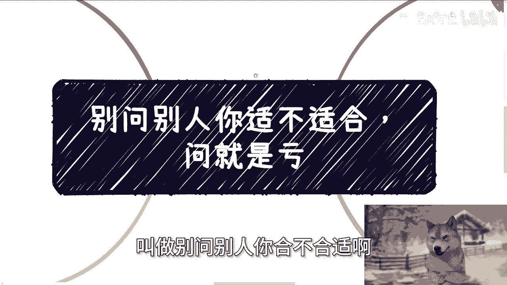
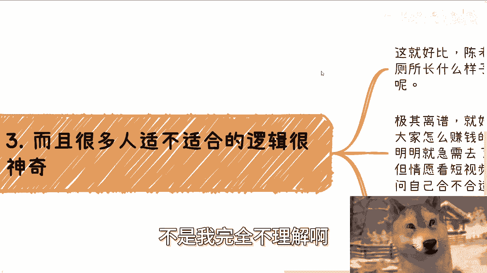
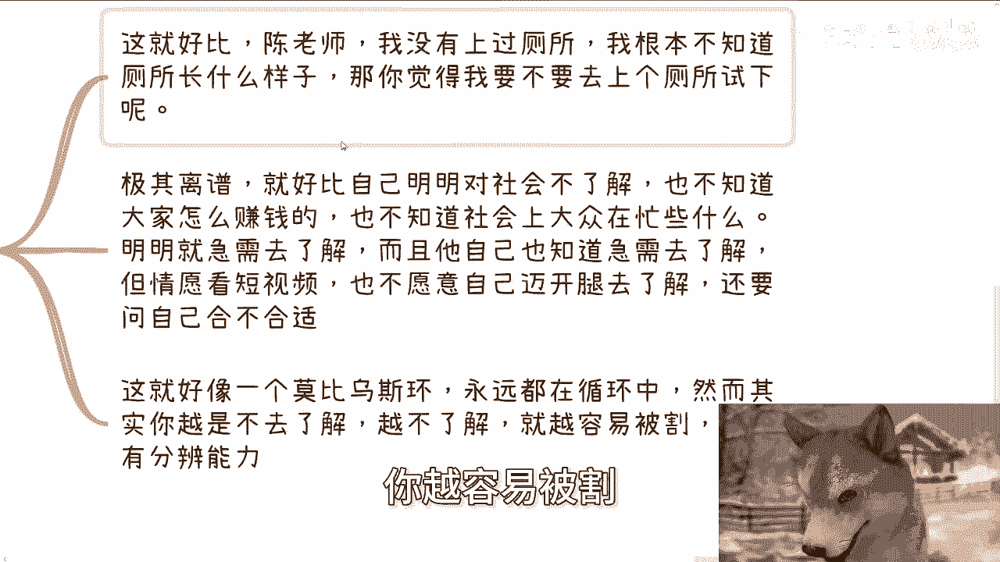

# 别问别人你适不适合，问就是亏 - P1 - 赏味不足 - BV1zM4m1y7bn

啊今天这个主题啊叫做别问别人。

你合不合适啊，问他妈就是亏，我跟你们讲这个事，我他妈忍了很久了。

真的无语了，我跟你们讲，这是几乎啊每次都是这样子的，就是比如说活动对吧，或者咨询啊，或者来说他们私信啊，哎我我我今天这只汪怎么这么小呢，我放大一点对吧啊，就是他每次这样子，他说陈老师我现在这个情况啊。

那个情况我觉得啊，你觉得这个活动我适不适合参加啊，那陈老师我现在啊什么什么情况啊，你觉得我要不要选这个offer啊，你觉得我要不要做这个咨询啊，你觉得我要不要去参加这个培训班啊，我就这么跟你讲啊。

你觉得我是不是要去干嘛啊，他妈说真的啊，我是不知道这，我是真不知道大家是多单纯和多天真啊，你你们竟然相信别人对吧，就相当于是把你们的选择权给到别人，你问别人有意义吗，没有意义对吧，你任何事情我告诉你。

只要有利益关系在这里面，你问就是亏，你问就是割，有啥好说的，对不对，为什么我来跟你们说一下，假设啊，我是这个项目的主导者或者既得利益者，你问我，不就好像兔子问狮子哎，你觉得我好不好吃，你觉得你要不要吃。

我这这他妈有意义吧啦，这就好像你问张雪峰，哎，张老师啊，我我要不要做个这个这个这个专业的这个咨询，怎么滴啊，他妈人家有钱不赚，我跟你说，哎你不用做，你妈，会不啦啊哦，你指望既得利者从你的角度去出发考虑。

那我就这么问啊，今天中国的高校招生啊，他他妈开了一个新的专业，叫什么叫什么数字叉叉对吧，或者以前有些新的专业，就我就这么跟你们讲，在这个行业里面，在他这个所在的行业里面，他们的从业人员肯定都知道。

比如说3年后4年后你读个专科，读个本科对吧，你3年后4年后大概率都找不到工作，那怎么地呢啊这学校招生办啊，老师校企合作跟你说，哎哎同学你你不要不要来啊，不要来哎，这个东西后面不太好好好做的，不太好。

就业的，我操有毛病啊，脑子瓦特啦，对不对，诶，美他们做事情要么为了赚钱，要么为了KPI，谁他妈管你啊，是谁啊，啊你是人吗啊，你问既的利益者合不合适吗，没有意义啊，问他妈就是合适，我管你合不合适。

交钱再说对吧啊，而且另外一方面，如果我不是基德理解，那他妈就更了啊，比如你问我爱陈老师，这个专业要不要报这个培训班，要不要去这个offer要不要接，那我就问你，你想让我怎么回答，对吧哦。

我但凡回答你别报啊，别去好了，我他妈闭着眼睛，用用他妈的脚趾头都想的出来，你现在就要问问为什么哎我他妈吃饱了撑的，我来回答你啊啊对不对，所以说问了多了，我为了节省时间。

或者any any any anybody对吧，随便哪个人为了节省时间，但凡有脑子的，他肯定就回答合适，为什么，因为没有下文量就无脑回答呀，管合不合适啊，对不对，你那你对你对于你来讲。

你问了更没有意义了，因为对方没有过脑子，的我就得到一个一个一个答案对吧。

你无论问什么东西，反正都合适啊，你无论是问什么东西啊，都是对，都对，你说的都对，这不是我完全不理解啊对吧。

而且很多人合不合适这个逻辑啊，他也很神奇，这就好比陈老师，我上厕所从来没有去过厕所啊，我都是就地解决的，我根本就不知道厕所长什么样子，那你觉得我要不要去上个厕所试一下，唉他妈这种问题有什么好问的。

对不对，就是你想怎么解决都可以明白吗，就是OK有可能法律上有问题，有可能道德上有问题对吧，但是从你角度来讲，从你个人角度来讲，你怎么选，风险都在，你又不在我妈跟我吊关系啊，对不对，哎极其离谱。

他就好好比啊，自己明明对这个社会不了解，也不知道大家怎么赚钱，也不知道社会上的上的大众呃对吧，就是就是所有的这种呃从从商的，从政的，也不知道大家在忙些什么，明明他就很急需要去了解对吧。

而且他自己可能也知道，自己就是很急需要去了解，但是他情愿去看短视频啊，情愿去看别人，就是就是那种就是说啊张口就来对吧，22222次包装的信息，也不愿意自己迈开腿去了解，还他妈要要要要表。

要假装自己好像哎呦很主动，哎超说你觉得我合不合适，问就是不合适，我告诉你对吧，你问就是被割，有什么好说呢，你问你但凡问你把选择权交给别人的时候，就是一个韭菜对吧，你就好像一个莫比乌斯环啊，很搞笑。

永远在循环当中，然而啊你会发现你越不去了解，你，越不了解你，越没有分辨力，分辨能力，你越容易被割对吧。

这这个就是一个循环呀啊所以我还是那句话，你要把选择权交给别人，没问题，你怎么选都是没问题的，没有这个这个在这个社会上没有什么东西，一定对一定不对的对吧。

我们说了很多遍啊，但是你别假装好像自己很想改变啊，好像好像就是说选择权交给别人，然后还还假装自己好像他妈有选择权对吧，这就好像明明很多人在那边找工作，明明很多人在那边就是寻求所谓的这个工作。

那我早就说了，工作是什么，工作就是选择权在老板手上，在资本手上，在hr g手上跟吊关系啊，啊你选择工作，你选择在那边打工，不就是每天在那边冒着风险嘛，就每天冒着，就是说第二天太阳升起的时候。

这工作还在不在，你还能不能做的风险吗，别搞得好像自己他妈的很有选择权，卧槽我好牛逼，你牛逼啥玩意啊，啊你做工作你就是块肉啊，还是块臭肉，有什么区别啊，对不对，你有选择权吗，你毫无选择权啊。

要不要你跟你吊关系对吧，哎很多人非要说了，哎呀跟我学历有关，跟我能力有关，有因果关系吗，有直接因果关系吗，你只能说你年轻的时候学历好，能力强，你能够让你找到一份工作的概率更高对吧，但同时等你年龄大了。

你找不到工作概率也会更高，这一样的吗，有什么区别，你有选择权，没有选择权呀对吧，我为什么之前有个专辑叫做叫做那个呃电池，不要不要做，拒绝做电池的这个这个专辑啊，就是因为本身所有的人就跟电池一样的。

你有电的时候我来用你，你等你没电了滚啊，那你有选择权吗啊做任何事情都是一样的，你的人生你把选择权交给别人的那一刻，你就是自己不尊重自己，那他妈的你指望别人尊重你可能吗，那啊所以我就这么说啊。

你们所有问过我问题的人，咨询过我，我问题的人都很清楚，当你们问我一个选择的时候，我从来不帮你们做选择，为什么，因为我不配，我也没有资格，而且没有人配对吧，我只给你们分析客观的环境。

跟可能出现的分支路线哦，包括就是说可能从你们的个人的这个情况来讲，更成功概率更高，或者说更平稳更安全的一些道路，但是选择是你们自己去做的，对你包括就是有很多人说哎，我要不要去申个博对吧，怎么样子。

那么我就会告诉他，哎你你你你博士读出来可能有哪些，在这个社会上有哪些，就是说博士可以变现的方式，那你自己去选对吧，你合不合适，那个我又不了解你，我怎么知道合不合适对吧，那么你们往往做不了选择。

是因为信息不够充足，我尽量就帮你们补足这些信息对吧，让你们更好的去做当下选择，那他妈哪里有选择交给别人的。

没有的呀，对吧哦哎呦，我他妈真真的跟你们讲啊，每次都这样子的，哎我合不合适，我跟你们说，我一开始我还回的，我后面我就不回了，你知道吗，就是如果你后面比如说有有些人问我，他说爱创手，我合不合适，来参加。

你别来参加，真的你来参加干嘛呢，我都不想回，我不管你报不报名，你哪怕给我三倍四倍的钱，你也别来参加对吧，我之前我有一期视频，我就跟你们讲过，就是所谓的价值是双方认可的对吧，那我认为我做的事情有价值。

而你自己都不知道你要什么，那你来了，你不会在我这得到价值，那我要你这个钱干嘛，对吧，但是我今天是这么跟你们讲，你们碰到别人不会这么说的呀，谁他妈管你们，对不对，你不要真的，我跟你们讲。

就这种问题以后再也不要问啊，不要问你，不要问你们父母，你有什么好问的呢，哎问你们父母唉，你觉得我要不要去考个研，有什么好问的呢，对吧行吧啊，然后下一期活动我正在定啊，这两天正在定嗯。

反正定完了我再通知你们好吧，然后剩下的话就是说职业规划，商业规划，你们呃在工作上，或者你们跟别人做一些什么副业啊，你们在这当中碰到一些比如说合同啊，分红分润啊，商业计划，说白皮书啊，股权股份啊。

期权啊对吧，包括其他的一些这未来规划啊对吧，希望通过呃我的一些视角，或者通过我的一些这个对于社会的一些认知，能够让你们更少走一些弯路，或者给你们一些更贴近于当下社会发展的，一些道路的话。

那么你们可以整理好对应的问题跟个人背景，我们再来走咨询。

