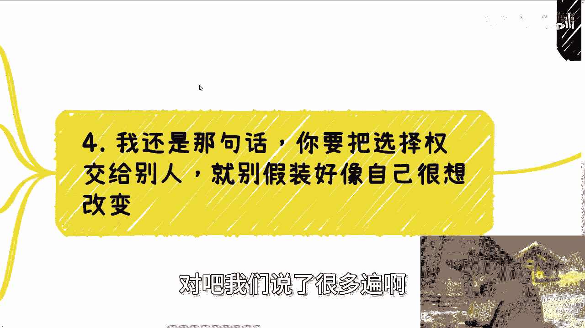

# 课程 P1：别问别人你适不适合，问就是亏 🚫

在本节课中，我们将探讨一个核心观点：不要将个人选择权交给他人。我们将分析为什么向他人询问“我是否适合”这类问题往往无效且有害，并学习如何将决策权掌握在自己手中。

## 为什么询问“是否适合”是无效的

上一节我们介绍了课程主题，本节中我们来看看向他人询问“是否适合”的根本问题。

向项目主导者或既得利益者询问你是否应该参与，这本身存在利益冲突。这就像兔子询问狮子自己是否好吃一样，对方的答案必然倾向于其自身利益。

**公式：询问既得利益者 = 获得倾向性答案**

如果询问的对象并非利益相关方，情况同样不乐观。为了节省时间或避免后续追问，对方很可能给出一个未经深思的、笼统的肯定答复。

**公式：询问无关者 ≈ 获得无意义答案**

因此，无论询问谁，你都很难得到一个真正为你着想的客观答案。

## “是否适合”背后的逻辑误区

理解了询问的无效性后，我们进一步剖析这种提问方式背后的思维误区。

许多人提问“是否适合”，是希望将决策的责任和风险转移给他人。这源于对自身情况不了解，却又缺乏主动探索的意愿。

以下是这种思维模式的典型表现：

*   对社会运行规则和行业现状缺乏基本了解。
*   宁愿消费二次加工的、碎片化的信息（如短视频），也不愿迈出脚步进行一手调研。
*   通过提问制造“我很主动”的假象，实则逃避自主决策的责任。

这种将选择权交给他人的行为，会形成一个恶性循环：越不主动了解，就越缺乏分辨力；越缺乏分辨力，就越容易做出错误选择或被人利用。

## 掌握人生的选择权

认识到问题所在后，最关键的一步是收回并掌握自己的选择权。

工作本质上就是选择权在资方手中。打工意味着每天承担着失业的风险，个人在其中并无绝对的选择权。年轻时的学历和能力或许能提高找到工作的概率，但年龄增长后，失业的概率同样会升高。

**核心概念：个人价值 ≠ 永久的选择权**

因此，将人生重大选择权交给他人，是对自己的不尊重，也无法换来他人的尊重。正确的做法是，基于充分的信息，为自己做出决策。

以下是自主决策的正确路径：

1.  **收集客观信息**：尽可能全面地了解目标领域、行业现状、潜在风险与收益。
2.  **分析个人情况**：清晰认知自身的优势、劣势、兴趣点和风险承受能力。
3.  **评估不同路径**：列出各种可能的选择，并分析每条路径的潜在结果。
4.  **自主做出选择**：综合以上信息，由自己做出最终决定，并为之负责。

## 如何获取有效的决策支持

我们强调了自主决策的重要性，但并不意味着要完全拒绝外部信息。本节我们来看看如何正确获取决策支持。

有效的支持不是让别人替你选择，而是帮你补足信息缺口，看清不同选择可能导向的分支路线。

例如，在考虑是否读博时，有效的咨询应提供“博士学位的常见变现途径”、“不同行业对博士的需求现状”等信息，而非简单地回答“适合”或“不适合”。

如果你需要在职业规划、商业合作（如合同、股权设计）、副业发展等方面获得更贴近社会现实的视角，以减少试错成本，可以遵循以下步骤进行有效咨询：

*   **整理个人背景**：清晰说明自己的现状、经历与资源。
*   **明确具体问题**：将模糊的“是否适合”转化为具体、可被分析的问题。
*   **寻求客观分析**：寻找能提供行业信息、路径分析和风险提示的交流，而非一个简单的“是/否”答案。

本节课中我们一起学习了“别问别人你适不适合”这一核心原则。我们分析了向他人寻求“是否适合”答案的无效性与危害，指出了这背后逃避责任的思维误区。关键在于，我们必须收回人生的选择权，通过主动收集信息、分析自身情况来为自己做决策。记住，**真正的成长始于为自己做出的每一个选择负责**。有效的求助是获取信息与分析，而非得到一个替你做好的决定。