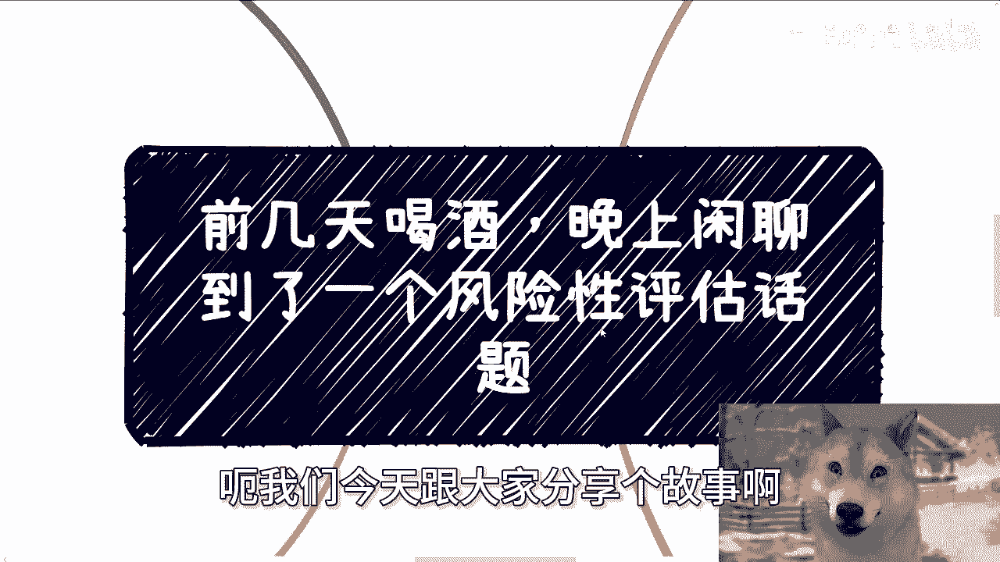
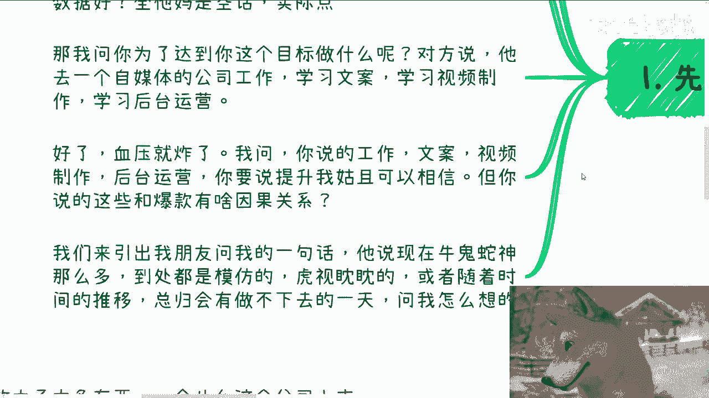
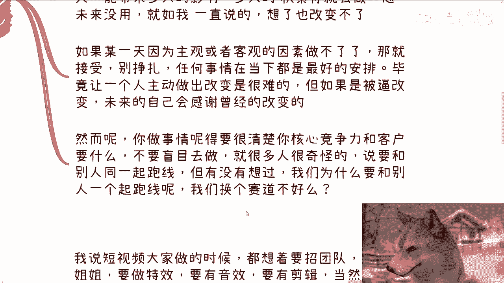
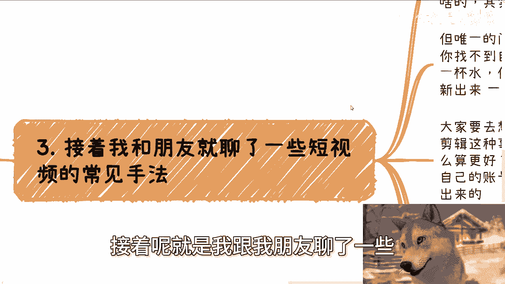
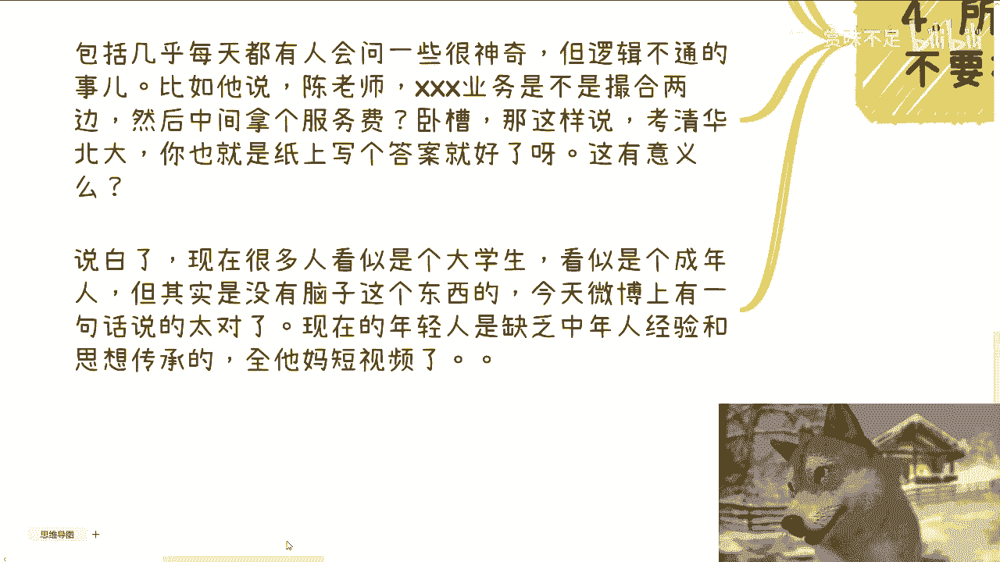

# 前几天，朋友问我为什么视频做的那么朴实无华 - P1 - 赏味不足 - BV1njxwecExD

哦大家好呃，我们今天跟大家分享个故事啊。

就前两天在杭州晚上喝酒的时候闲聊啊，闲聊就我朋友也跟我提到了一个怎么说呢，就是跟我有关的一个风险性评估的话题，咳咳咳，我觉得跟你们分享分享啊。

也算应该有些启发，这样子啊，呃先说这两天的几个故事啊，就是对于老百姓来讲啊，能想到的第一个副业大概率都是自媒体，这个事情我也很早就说过了，然而呢就说逻辑呢都非常模糊啊，你比如说啊，你说我问他们。

我说你们做自媒体的目标是什么呢，他们说要做爆款，要输就好，我跟你们讲啊，我他妈每次听到这种话，我妈血压都高了，就是我是觉得大家又不是官员对吧，也不是什么二代对吧，不要端着，你说话要直接一点啊，当然了。

我知道很多人不是不直接，是他们不知道什么叫直接对吧，那爆款数据好，全他妈是空话，我就问他大哥，你说爆款，你说数据好，然后呢，请问你知道爆款跟数据好是什么吗，就是你把这话说出来，对你有任何指导意见吗。

没有用啊，对不对，那我问问他，我说那为了达到你这个目标要做什么呢，对方说他说他要去一个自媒体公司工作，学习本案，学习视频制作，学习后台运营好了，我跟你讲，至此血压就炸了，我问我说，你工作文案视频制作。

后台运营，你要说你能力上技能上有提升，我姑且相信，但你说这些东西跟你要做一个爆款，所谓的这个目标有他妈半毛钱因果关系对吧，好那么至此啊，我们就引出我朋友问我的那句话，他说现在满地都是牛鬼蛇神。

到处到处都是模仿的虎视眈眈的啊，当然不是说我啊，就其他也是一样啊，或者呢他意思就是说随着时间的推移呢，总归会有一天做不下去对吧。

那问我怎么想的，他说是不是说啊需要在那个啊，就是怎么说呢，就是效果上啊，或者其他地方啊对吧，各都再拓展拓展啊，那么我们接下来说这个事啊，首先变化最大的事情。

而变化其实就是最大永远不变的事情，对不对，那其实我们仔细想想看，国家跟着全球变，各个地方政府关注的东西，跟着中央变化，企业跟着产业变化，个人跟着市场跟热点变化，谁他妈的到现在为止是不变的，对不对。

我就这么说，你们身边我身边只要能赚到钱的人，一定都是变的不变，哪个人能赚到钱不可能的啊，那再说个笑话，毕竟这两天A股都能到3100点，对不对啊，的确啊，谁都希望不变，为什么呢，因为这样稳定。

而且也所谓长久嘛对吧，那我说句不恰当的，比喻啊，历年历代，任何一个古代的皇帝不都是这么想的吗，结果呢结果呢对不对，就呵怎么说呢，就是说人类社会它是有固定固然规律的，我们不要去抗争，对吧啊，你就像。

你就像啊我们就一直说这个我觉得怎么说呢，就是说那种修仙电视剧啊，或者其他地方吧，他对这种呃人的怎么说呢，这种年龄啊生命我觉得有句话说的是蛮对的，就是人之所以不是长生不老的，是为什么就死亡对吧。

迭代它是一个社会发展，你对死亡有了畏惧，有了敬畏之心，你才懂得进步对吧，你才懂得去珍惜，那否则呢是不是啊，那么嗯如果某一天，因为主观或者客观的因素做不了，我觉得那就接受啊，别挣扎啊，有什么好挣扎的。

任何事情在当下就是最好的安排，因为你没得选对吧，或者你不敢选，但是你不敢选，也是你没得选的一部分，对不对，那一样的道理，你不敢选，你未来会后悔，但是这也是你做出的选择啊。

毕竟让一个人主动做出改变是很难的，但是如果是被逼改变，那么未来的自己我跟你讲，一定会感谢曾经的改变，因为你要明白，不管改变之后好跟坏，其实都是好的对吧，然而呢你做事情呢。

要就是很清楚你的核心竞争力和客户要什么，你不要盲目去做，你就像一开始我跟你们讲的那个故事，跟我说，哎我要爆款啊，我要那个数据很好对吧，我要怎么样子，那跟你有什么关系呢，对不对。

就是我我们每个平台都有爆款，但是你按照这个目标去怎么说呢，发展的话，那跟你吊关系啊，对不对，你的竞争力是什么，没有那么很多人很奇怪啊，他说要和别人在同一起跑线，但是你们有没有想过有没有想过一个问题啊。

哎我们就像我们曾经说过，就是说我们如果想做出点事情，我们难道不应该是在别的赛道吗，我们为什么一定要去跟别人在同一个起跑线呢，这不是有毛病吗。

是不是啊，那么第三接着呢，就是我跟我朋友聊了一些。

短视频的这个常见手法，我说短视频大家做的时候呢，都想着招团队，招小姐姐，做特效，要有音效，要有剪辑，当然也会去做一些自己感兴趣的或者擅长的，比如说游戏啊，动漫啊对吧，这土味视频啊，但其实都没有错。

但这个当中有一个问题，你随便举个例子，比如说PAPI酱，PAPI酱做了这么长时间，他有他的风格，你包括以前那个追一带，他也有他的风格，对不对，那你有看到过他放弃自己的风格，然后就不停的去模仿别人嘛。

不太会的，你或者我们就这么说，你有看到过哪个很鲜明的人，他去模仿另外一个很鲜明的人，那没必要啊，对不对，但是我唯一的问题，你想大部分人做这种东西，唯一的问题是什么，就如果你没有自己特别的地方。

同时你找不到自己的受众，那么就相当于你往大海里面倒了一杯水，你就是那杯水，然后呢，然后就就完了，大家分不清楚啊，对，对吧你你说你说无非用户就看到啊，有个新的账号出来，那你这个账号其实就是怎么说呢。

大海里面所有水滴里面的一部分，那结果呢有什么用呢，论用户怎么区分的出来呢，区分不出来，那大家想去想一个，大家要去想一个问题啊，团队小姐姐特效音效剪辑这些事情，你要做好，他是没有底的对吧。

就就就你去卷这个事情，他是一个没有上限的，你怎么卷怎么卷都卷，不就是没有是无止境的对吧，因为你怎么算好，怎么算不好呢，怎么算更好呢，你不知道啊啊，但是你做出来其实并不是你自己的账号，它更像就我们说的。

你要是去追求一些有的没的，那么你更像一个大海里的一个水滴对吧，你区分不出来，那么我跟我朋友说，我说那我为什么从来不去搞一些音效特效，你看我到现在我连他妈剪辑都不剪，为什么，因为一方面是是我懒，我承认的。

那另外一方面就是我也没这个技术，我我跟你们这么讲，我可以去捡，我可以去加特效，你们看完之后，你们就会觉得他妈的哎，根本就不会啊，还他妈装装懂哎，对不对啊，那么另外一方面要看受众要什么啊。

我说用户如果想要看特效账号多了去了，要看音效账号也多了去了，要娱乐的情绪价值，无数的账号可以做，我甚至我说我穿黑丝，人家还不如看小姐姐，对不对，一样的就是人他都有需求，账号都有细分对吧。

当然就像我刚刚说的，不是我不能做，我做了，就是所谓的跟别人在一个起跑线，但是我卷不过别人啊，因为我没这个技术对吧，那用户从别人那边都能获取自己想要的，那从我这边能获得什么，我告诉你们获得什么。

三个字四不像对吧，你们我虽然是我我我虽然是跟你们阐述，我跟我朋友讲的，但是你们可以反观一下，你们做的事情其实都一样的对吧，第四啊。

所以其实我一直说啊，无论做什么，你不要被互联网影响太大，因为互联网放大了太多东西，一会嘛这个公司上市了，哎呀一会嘛那个人嘛什么一年几个亿，一会嘛这个人嘛一晚上直播多少钱，然后搞得全民都他妈的眼高手低。

但是你有没有想过，就是说无论我们是to c还是to b还是to g对吧，我们要的是什么，你你作为个老百姓，你想怎么样是吧，你我觉得要的就是一亩三分地嘛，那当然啊不是说你分散不行，你说我今天啊既做二次元。

又做动漫又做什么，行不行行啊，但是你有还是那句话嘛，你们也好我也好，我们作为一个普通人，我们没这个能力，你明白吗对吧，就就我们得客观的评估自己，别不要就我们一直说的眼高手低。

就觉得他妈的老子老子是superman没有意义的，你散了之后，你不会像别人一样做的很好，你最终只能做出来个四不像来对吧，你包括几乎每天都有人会问我，一些很神奇的问题，但逻辑不通，你知道吗。

你比如说他说陈老师，某某某业务是不是撮合两边，然后中介拿个服务费，哎你这话说这你让我怎么回，那我就很想回我操，那你按照你这么说法，考清华北大，你无非也就是纸上写个答案对吧，你拿张草纸来也行啊。

哎你这话说的有意义吗，你想想看对吧，就是所以说我就说啊，就看似现在很多是大学生，看似是成年人，但其实他没有脑子，他没有逻辑性，所以我觉得今天微博上有句话说的很对，他说现在的年轻人缺的是什么。

咳我我觉得真的说的很对啊，我觉得他缺的是什么，缺的是中年人的经验和思想的传承，就断档的，然后全他妈是短视频，然后那个人那个人的话是怎么说的，他我我印象当中是这么说的，就是说他说在不懂得谈恋爱的时候。

在谈恋爱，不懂得结婚的时候再再结婚，那不懂得人生当中该做什么事情时候呢，在那边做什么事情，比如说买房啊，或者别的，就是就是就是就是就怎么说呢，就是说其实都你你说吧，都是被这个社会倒推逼的。

或者说呃被被这个社会嗯强迫的往前走的是，但是就是你你可以理解为综合原因吧，比如说家庭的教育缺失啊，学校教育缺失啊对吧，或者说互联网的这种很多东西放大对吧，或者舆论的放大等等等。

反正就是给于现在大部分人的这种感觉，就是属于那种哎呀，我好像是要做很多东西对吧，就像我们刚刚说的，每个年龄段，你们可能都会做很多东西，但是其实你们根本就不知道为什么做那些东西，而且你们也不懂。

但这个东西就是很缺失的，但但这个东西就是我们说的，就是说你们可能在你们父母身上，在老师身上，在别人身上得不到很难非常难嗯对吧。

所以说我以前在咨询的时候，我也跟他们讲，我说你们在中国碰到很多人，你要真的聊点事情是很难的，因为你会发现对面这个人要么就是PUA，你要么就是低位很重，要么就是他妈的跟你装逼，就是就是你真的想聊点就是大。

就大家就是觉得我的哎，哎就就不能讲点讲讲，怎么也不叫实话吧，就讲点稍微接地气的对吧，大家不要端着，卧槽难如登天，嗯嗯好吧啊行啊，那就先这么着呃，然后就是工作上好吧，职业规划，然后咳咳商业上副业上叫什么。

就是赚钱上面啊，包括你们在这里面有一些嗯注册公司啊，股权啊，分红分润啊，或者其他的各个方面，你们觉得有任何需要我这边给你们一些建议的，或者让你们少走点弯路的，你们可以整理好对应的个人问题跟个人背景。

我们再来做咨询，好吧啊，随缘啊。