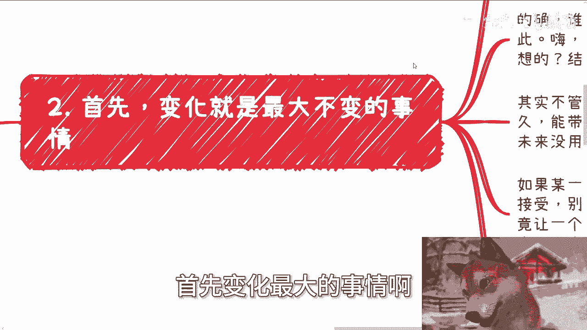

# 前几天-朋友问我为什么视频做的那么朴实无华---P1---赏味不足---BV1njxwecExD_n

在本节课中，我们将通过一个真实的故事，探讨普通人从事自媒体创业时常见的思维误区，并学习如何建立清晰、有效的行动逻辑。我们将重点分析目标设定、核心竞争力识别以及如何避免无效竞争。

---

前几天，一位朋友在聊天时向我提出了一个问题。他观察到如今自媒体领域竞争激烈，模仿者众多，担心随着时间的推移，自己的内容会失去吸引力，最终难以为继。他问我，是否需要在视频效果或其他方面进行拓展和升级。

这个故事引出了一个普遍现象：许多人将自媒体视为副业首选，但其行动逻辑往往非常模糊。接下来，我们将深入剖析其中的几个关键问题。

## 1. 模糊的目标与无效的行动 🎯

上一节我们提到了朋友关于自媒体可持续性的担忧，本节中我们来看看问题的起点——目标设定。

许多人被问及做自媒体的目标时，通常会给出“要做爆款”、“要数据好”这类回答。然而，这类目标本质上是空话，无法提供任何具体的行动指导。

以下是这类模糊目标的典型问题：
*   **缺乏定义**：“爆款”和“数据好”是模糊概念，没有量化标准。
*   **缺乏因果关联**：许多人认为达成目标的方法是“去自媒体公司工作，学习文案、视频制作、后台运营”。但这些技能提升与“做出爆款内容”之间，并不存在直接的因果关系。这就像认为“学习写字”就一定能“写出畅销小说”一样。

**核心公式**：无效目标 = 模糊期望 + 无因果关联的行动计划。

## 2. 拥抱变化：唯一的不变就是变化本身 🔄

我们分析了模糊目标的危害，那么面对朋友关于“未来可能做不下去”的担忧，正确的应对心态是什么？本节探讨“变化”的本质。

世界上唯一不变的就是变化本身。国家、产业、市场、个人热点都在持续变化。能够持续获得收益的人，往往是那些能够主动或被动适应变化的人。

渴望稳定和长久是人性使然，但抗拒社会发展的固有规律是徒劳的。这类似于生命因为有了“死亡”的终点，才让人懂得珍惜与进步。

因此，如果未来因为主客观原因导致当前模式无法继续，接受它并做出改变是更优选择。被迫改变虽然痛苦，但改变后的自己往往会感谢这段经历。关键在于，改变需要方向，而非盲从。

## 3. 寻找你的赛道：核心竞争力与受众定位 🏁

上一节我们确立了拥抱变化的心态，那么具体应该向哪个方向改变呢？本节的核心是：避开红海，找到属于自己的蓝海。

做任何事情，都必须清楚两件事：自己的**核心竞争力**，以及目标客户（受众）**真正需要什么**。盲目跟随“爆款”模式是无效的，因为那是在别人的主场上，用别人的规则竞争。

许多人错误地认为必须和所有人站在“同一起跑线”。但更聪明的策略是寻找甚至开创一个**不同的赛道**。

以短视频创作为例，常见的做法是组建团队、聘请出镜者、添加复杂特效和音效、进行精细剪辑。这些做法本身没有错，但问题在于：
*   **成本无上限**：在制作精度上“内卷”是一场没有终点的军备竞赛。
*   **丧失独特性**：如果缺乏鲜明的个人风格和明确的受众定位，你的内容就像**往大海里倒入的一杯水**，无法被区分和记住。

我的内容风格朴实，很少使用特效和剪辑，原因正在于此：
1.  **能力边界**：我在华丽制作上不具备比较优势。
2.  **受众需求**：如果用户想看特效、娱乐或情绪价值，有无数更专业的账号可以选择。我的受众来到这里，寻求的是不同的价值。

**核心逻辑**：与其在别人的赛道上做一个平庸的模仿者（四不像），不如在自己的赛道上做一个独特的存在。

## 4. 回归本质：抵御干扰与脚踏实地 🌱

我们讨论了定位独特性的重要性，但外界充斥着各种干扰信息，如何保持专注？本节我们将回归创业与个人成长的本质。

互联网放大了成功案例，容易让人眼高手低。但无论是面向消费者（To C）、企业（To B）还是政府（To G），对于大多数普通人而言，核心诉求是经营好自己的“一亩三分地”。

多元化尝试并非不可，但必须基于一个清醒的认知：**普通人精力有限，能力有边界**。盲目分散战线，很可能在每个领域都做得不深，最终结果仍是“四不像”。

当前许多年轻人面临的一个困境是：在缺乏相应认知和经验的时候，就被社会潮流推着做出重大决策（如恋爱、结婚、买房、创业）。这源于家庭、学校教育的部分缺失，以及互联网信息过载导致的判断混乱。

其结果是，很多行动背后缺乏深刻的“为什么”，人们只是模糊地觉得自己“应该”做很多事。真正的、接地气的、摆脱了“端着”或“装逼”的深度交流变得非常稀缺。

---

### 总结 📝

本节课中我们一起学习了自媒体创业与个人发展中的核心逻辑：

1.  **目标必须清晰具体**，并与行动计划有强因果关系，避免“爆款”这类空泛口号。
2.  **变化是常态**，应对未来的不确定性，需要具备接纳变化并主动调整的心态。
3.  **竞争的关键是差异化**，要分析自身核心竞争力与受众真实需求，找到或开创属于自己的赛道，避免在无优势的领域进行无效“内卷”。
4.  **回归本质、脚踏实地**，抵御互联网的浮躁信息干扰，认清自身能力边界，专注经营好基本盘，并寻求真正有深度的经验与思想交流。

对于个人职业规划、商业副业或公司运营等相关问题，建议在系统梳理个人背景与具体问题后，再寻求有针对性的建议。