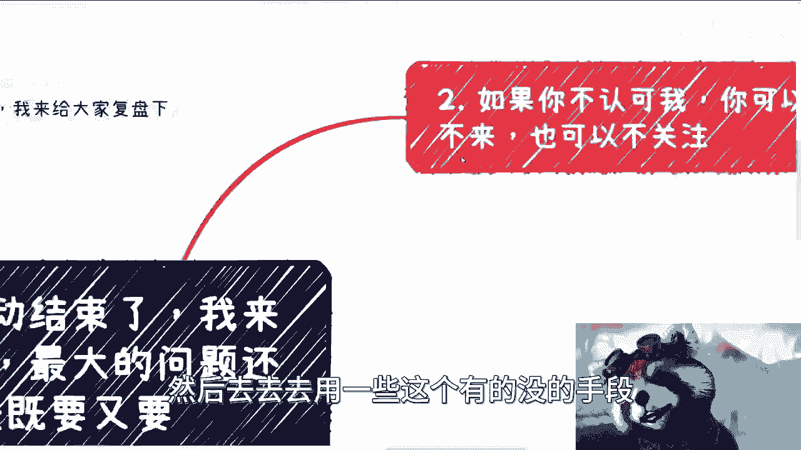
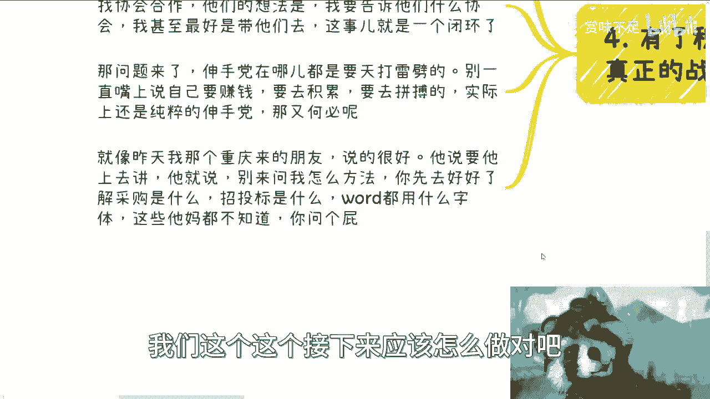

# 北京活动复盘，最大的问题还是既要又要 - P1 - 赏味不足 - BV1Ea4y197zD

哈喽大家好，今天白天昨天的活动还是很顺利的啊。

呃这个有很多人呢也没有在就没有机会啊，这次就是因为微软限制的那个人数嘛，我来给大家复盘一下啊。

呃首先先说这么个事，就是关于充电视频mind的事情啊，呃我就直白点说，我不打算给，为什么呢，因为实在不可能这些内容只值30块钱啊，那么市场上各种乱七八糟什么课程啊，都是几千几万十几万呢。

我觉得也都不值得，那么当然我也不会打算去卖对吧，比如说有小伙伴说我花钱买，我也不想卖啊，我也没这个想法啊，毕竟呢我觉得大家根据视频也是可以自己写的，也没必要花钱来买对吧，呃第二点呢。

北京活动结束了，我来给大家这个复盘一下啊，然后我觉得这次活动呢还是很好的，而且大家呢相互之间也聊了很多啊，然后也有很多小伙伴这个现场呢就告诉我，其实他们也有很多的实践啊，包括还有现场。

就是说给我给我那个和张老师送的那个T恤衫，我觉得也很好。

呃，我总结下来啊，核心的问题在于还是既要又要啊。

我们先来看一下啊，第一就是别急功近利。

你该做的铺垫呢，还是要做的什么意思呢，就是说首先啊我跟你讲啊，每个人的路径都是不一样的，你别老想着别人给路径呃，这个跟我没有关系啊，就是说你你可能都想着说我们花点钱，包括培训班对吧。

你别人给的那无论谁给都不靠谱，因为他不是你啊，他不知道你有什么技能，他也不知道你经历过什么对吧，也就是说你可以去参考所有这种东西，但是你不可能说就希望别人给啥嘛对吧，你如果真的要做什么呢。

就是你肯定得必须自己去摸索，适合什么行业，适合做什么，适合什么角色，这个摸索中呢，也是积累自己关系跟经验的这么一个过程，这就像很多人问我，我都会私信回答，意思就是说我说你先想好你要干嘛对吧。

那有很多小伙伴呢他其实是着急对吧，他就觉得哎呀，我好像这个也不愿意去积累对吧，也也也没空去积累，但是我跟你讲，你该做的铺垫就还是要做的，因为这种时间你省不掉的，你省掉了未来你还是会付出代价的。

其实没有区别的啊，然后这次活动当中呢，有些小伙伴呢这个呃就反馈问题啊，我在这个地方也可以公开跟大家说一下啊，就我说句不好听的，我活动呢也就收300，我不收3000对吧，我这当然3000他妈的，你问我。

我也不可能告诉你对吧，就是说之前咨询过我的对吧，我还是打对折对吧啊你说你花个300到现场，你是希望从我这儿，还是希望从别人那边得到实现赚钱的路径呢，对吧，还是说你能够希望别人。

或者我给你一套定制化的方案呢，啊那如果来说300我就给你定制一套方案，而且你还能赚钱，首先第一点，那中国的老百姓早就均富了对吧，第二点，那我觉得中国所有的学校就可以倒闭了，什么9年制义务教育。

什么高等教育，东方狗屁对吧，那你觉得现实不来，你为什么不去买，不去买双色球呢，啊我们我跟你讲啊，我们社交无非是增加啊，对于这个社会和世界的认知，然后自己不停的去增加经验或者去摸索啊。

而不是到处去问别人啊，我们应该怎么赚钱啊，然后去去去用一些有的没的手段对吧啊。

关于第二点呢，活动当中我也听到了一些声音啊，就是我觉得就公开一点啊，如果你不认可我，你可以选择不来，你也可以不关注对吧，我以前做业务的时候就一直这么说过，就是我说交不交钱，这是你们自己决定的。

我我又没有拿着连连那个刀架在你脖子上，你说对不对啊，我觉得评论区啊就是从以前到现在，评论区啊很多其实不关注的啊，说的也很有道理，我也会就是很认真的去回复啊，但很多关注的呢阴阳怪气，那我也是拉黑的。

没有什么区别的呀，啊我就这么跟你们讲啊，企业端跟政府端，就是我们做商业，只要是无非老百姓多难啊，非老百姓端的，那么你要知道付钱的是乙方啊，付钱的是乙方啊，那么我们就说或者说大部分情况付钱是乙方。

到了老百姓这边，到了C端这边不一样，就是就是很多人会觉得我交了钱，我哪怕交了一块钱，他妈的老子就是爸爸，那我跟你讲，不好意思啊，你越是这种格局，你走不远的啊，那么就如我第一点所说的对吧。

我本身活动是为了让大家能有个相互认识机会，同时呢我就当当去线下各地方走走，和大家见见面对吧，本质上是教学相长啊，那么如果来说呢，你就有些小伙伴啊，你不是为了社交或者认知更多的东西，你可以选择不来啊。

什么意思呢，意思就是说如果你不是为了社交啊，你是为了说我就付了300块钱啊，同时呢得到了一些赚啊，想要得到一些赚钱技巧，或者甚至呃有来还要就是骚扰别人的啊，那么我只能说啊，那你以后就别来啊。

你该去干嘛干嘛，那么说的直白一点呢，就是说你不认可我，你就不要交钱，你交钱了，你就不要来搞那些有的没的对吧，同样的你不认可我，你想通过我的活动或者别的积累呃，呃别的一些东西来积累自己的关系和赚钱。

可能性，你如果就这个格局也是走不远的啊，这有这就是我跟你们讲的，就是说中国的C端老百姓就这个样子，就是就像我说昨天活动也是一样，其中95%可能都很好，但是很有可能就是5%的，那那个老鼠屎坏了整锅汤对吧。

那么这个就像什么呢，这个就像很多人跑出去说哎呀，为什么别人不信任我们或者怎么样子，我就这么跟你们讲嘛对吧，就中国本身很多的C端，不是因为你们的原因，是因为个别人，他已经把整个这个环境已经搞烂掉了。

那你让别人怎么相信你对吧，那么第三点啊，不要畏首畏尾，就好多小伙伴呢昨天聊的时候呢，就还是核心点，就是说觉得呢做一件事情呢就一定要有结果，这个事情是这样子的啊，我们既然开始要去赚钱，既然要去自己赚钱。

就不要去想这些，为什么，因为赚钱本身就不是一个，一定，因为某个因就能得出某个果的这么一个逻辑，这就好比你跟我说，陈老师我们做了一些事情对吧，两三次都没有成功，或者说有的问啊，做了以后万一没有结果怎么办。

这种事情呢，你在工作上，你在学校当中你都可以问没有问题，但在你自己赚钱这个道路当中呢，你你不要去问，因为没有结果，而且没有结果是正常的，为什么，因为商业市场本来它就是这个样子，就是你是成功的少。

不成功的多嘛，对如果来说成功是多，那现在也不是这样子，就我跟你们说了，早就均富了啊，那么如果往往你如果很容易就得到一个结果呢，那么大概率我觉得还是被骗的啊，所以呢我觉得就是说你别怕没有结果。

这都是常态啊，而且这件事情呢我觉得嗯你们大家都要想明白，就是你要么就永远当工具人帮别人去赚钱，你但凡想要选择自己赚钱这条路啊，呃你不要再去想这些有的没的，你想这些有的没的啊，或者说要考虑说啊。

我怎么风险低对吧，或者怎么样子，你既要自己赚钱。

又想赚的多，然后又想没有风险，那是不可能的好吧，你就不要再去想这些事。

那么还有一点呢，最后一点呢就是关于这个积累啊，我们大部分情况呢其实都是这个纸上谈兵啊，有了我们得要去有了实践，有了积累，有了经验，其实后面才是真正的这么一个战斗啊，也就是说嗯你就像之前前几期那个视频啊。

你说好多一群可能还在学校对吧，甚至工作一两年的人对吧，在呃去讨论说啊，工作对商业有没有意义对吧，或者说工作和商业是不是在一根线上面对，那工作得到什么，那本身这人生就没有意义。

因为他都没有任何的相关经验对吧，那他去讨论这个问题就没有任何的意义啊，那么我发现一些人的思维呢是这样子的，就比如说啊就说啊我们跟他讲啊，要去找一些会合作啊，或者说找这个微软对吧。

或者找各种各样的这种场地方合作啊，那么他们听到这句话呢，他们的想法就是说啊，我们不但要告诉他们要去找这个协会合作啊，还得告诉他们找哪个协会合作，而且呢最好是带他们去这个协会啊。

那么这个事就整个不就闭环了嘛，对吧不就落地了吗，对吧啊，那么问题来了啊，那么从所有的逻辑当中，不管是你嗯去参加什么私董会也好，还是参加活动也好，参加各种各样的东西也好，呃你付多少钱。

你觉得对方会带你去一个实际的啊，比如说商业合作的合作伙伴，然后呢还是从头到尾给你伺候好的，那我觉得你呃，但凡没有一些政治地位跟设置社会地位，你就不要去想了啊，这个跟你付多少钱没有关系。

而且更何况大部分人呢，他也不觉得自己要付钱啊，那么这个在我们互联网以前叫什么，叫伸手党对吧，所以说别一直在嘴上呢说你要赚钱对吧，你想更高效率的赚钱对吧，而是要去积累，要去拼搏，去怎么样。

那实际上纯粹的就是伸手党，那你本身到最后，那那还是永远都是顺手党啊，那么就像我昨天重庆来的那个朋友对吧，他也说了，他说我本来昨天想让他上去讲的，他不上去讲啊，他说他但凡上去讲呢，他就会跟大家这么说对吧。

他说啊，你们所有人啊都不要来问那些什么，有的没的对吧，比如说你先去这个了解好，比如说采购是什么对吧，招投标是什么对吧，整个的那个运作规则对吧，就像我之前跟你们讲的，你在所有的这个合作当中对吧。

你避不开跟这种政府啊，企业啊对吧，高校啊或者说协会啊，或者商会啊等各种各样的这种机构打交道，那么你得去知道这种机构，它原本的运作模式和运作运作规则是什么对吧，那你说这些东西都不知道嗯，那你上来说啊。

问一些问题，问说啊，我们怎么跟他们对接对吧，我们这个这个接下来应该怎么做对吧。

或者怎么样子，那你都不了解，你问这些东西有啥用啊。

好吧，那么所以基本上呢我觉得核心点啊，嗯我看看现在多少了，现在啊差不多啊，那么北京这次活动呢就就还是结束了。

那么之后的话理论上北京上海，杭州这个地方应该是蛮多的，但是杭州最近的话没有这个计划，我估计得要到年后，因为毕竟后面还有圣诞节，还有元旦，就时间可能比较紧张，然后下周的话在上海，然后上海现在人差不多了。

所以我就不打算再在扩了啊，不但在扩了，然后今天好多报名小伙伴，我也我也也也已经都拒绝了啊，所以说我们后面的话可以在，反正上海这边都方便嘛啊，都都比较好做好。

那么我觉得北京这次的整个活动交流下来呢，核心点我觉得就在于说，第一呢其实大家想的都蛮清楚的啊，然后第二呢就是说啊，实践呢可能还有待提提高啊，就是说得要多实践。

那么第三呢就是说在这个过程当中，如果碰到任何问题，也欢迎大家都来沟通的啊，所有东西呢不要自己去YY啊，不要自己去想着说啊，我这个做还没做呢，我就得出个结论，然后用这个结论来PUA你自己，好吧嗯行。

那么就先这样对，然后那个同样的啊，我现下周吧，下周我回来定那个深圳的时间好吧，然后深圳这边的话应该会放在1月份，等到时候时间再定呃，然后剩下的话就大家同样的，你们要是有什么就是简单的问题。

就我以前也都说啊，你们有简单问题呢，你们就私信就直接说啊，你们要是说有一些比较复杂的对吧，然后又有一些各种各样的合同啊，或者商业上合作啊，不清楚的或者怎么样的，那么你们整理好整理好。

