# 课程名称：独立开发者与商业思维精讲 第01课：北京活动复盘与核心问题剖析 🧠

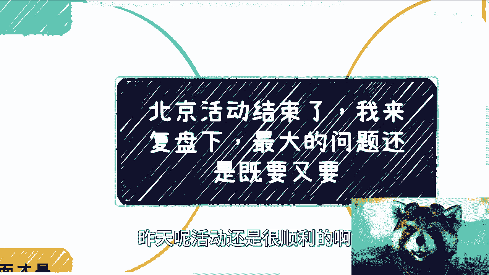

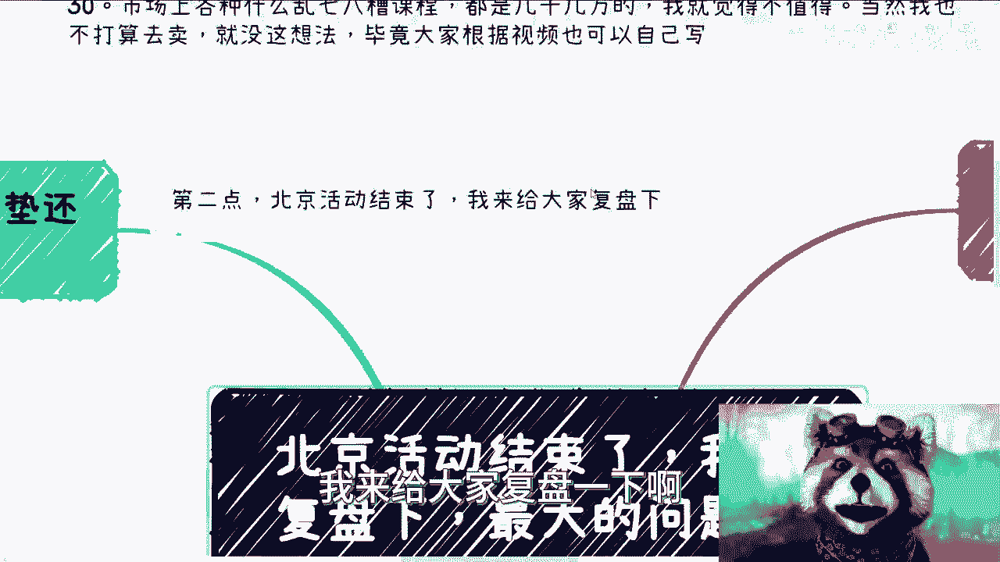

在本节课中，我们将复盘一次线下活动，并深入探讨活动中暴露出的、许多人在追求商业成功时普遍存在的核心思维误区。我们将聚焦于“既要又要”的心态，并学习如何建立更务实、更有效的行动框架。

---

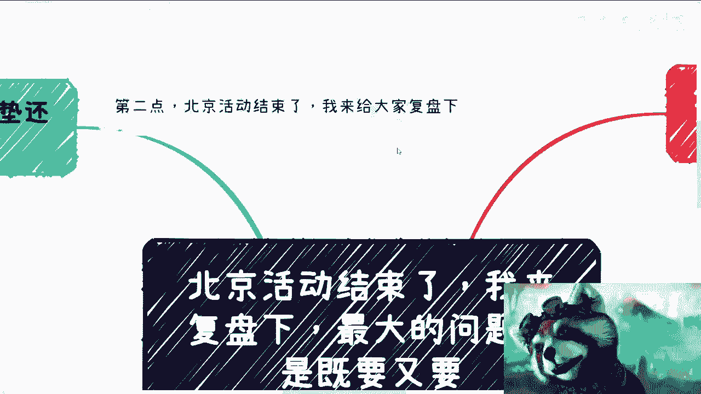

昨天的北京线下活动总体进展顺利，参与者之间进行了充分的交流，也分享了许多有价值的实践经验。

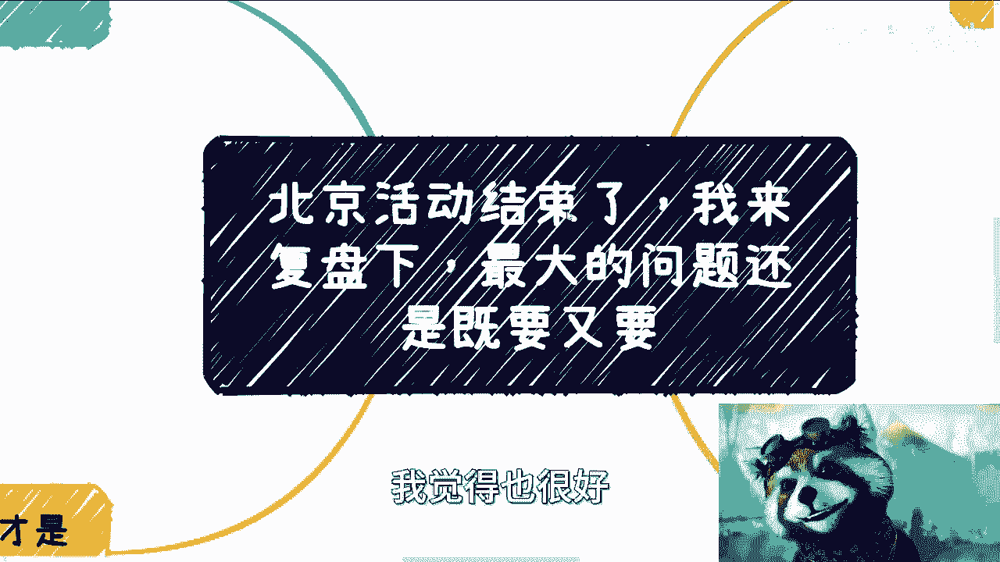

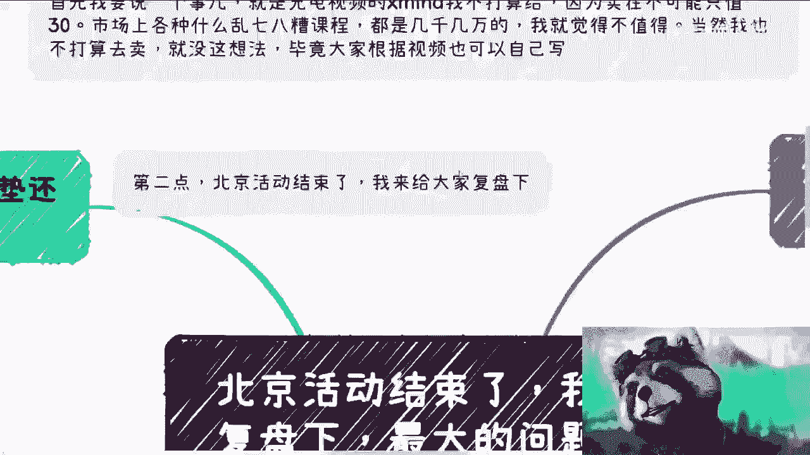

由于场地人数限制，很多朋友未能到场。因此，我将通过本次复盘，与大家分享活动中的核心观察与思考。

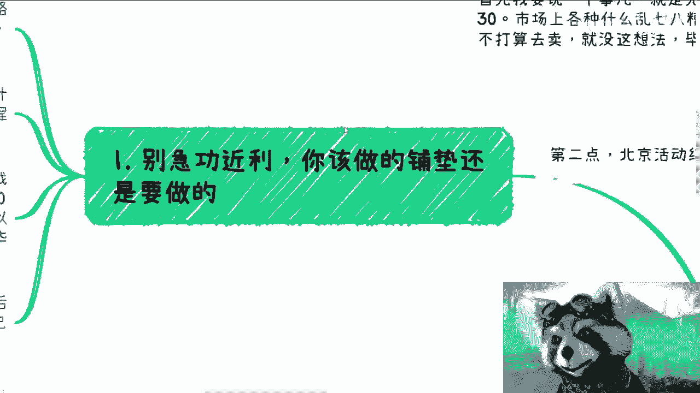

首先，需要明确一点：本次活动不提供所谓的“充电视频”或现成的“思维导图”。市场上此类课程可能标价数千甚至数万，但其实际价值存疑。更重要的是，依赖他人提供的现成路径并不可取，大家完全可以根据公开内容自行总结与实践。

活动结束后，经过总结，我认为最核心的问题在于许多人存在“既要又要”的矛盾心态。这种心态具体体现在以下几个方面。

## 一、摒弃急功近利，完成必要铺垫 🧱

上一节我们指出了核心问题，本节中我们来看看第一个具体表现：急功近利。

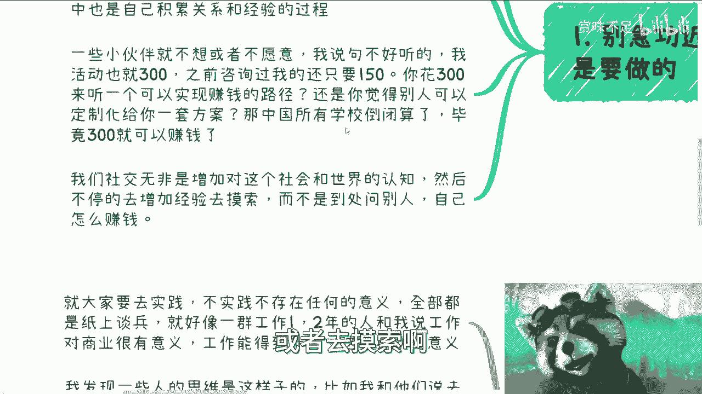

每个人的人生路径都是独特的。指望他人提供一条现成的、保证成功的路径是不现实的。因为他人不了解你的技能、经历和具体处境。

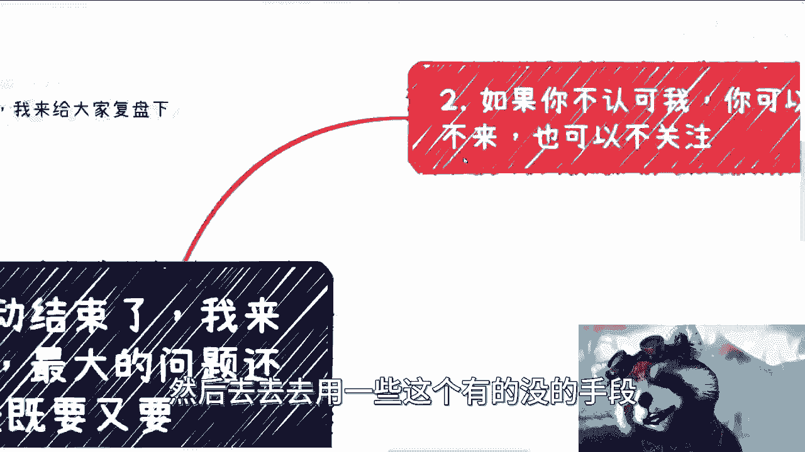

**核心公式：成功路径 ≠ 他人提供的通用模板**

你可以参考各种信息，但最终必须亲自探索适合自己的行业、角色和方向。这个过程本身就是积累经验和人脉的过程。试图跳过必要的积累阶段，未来很可能需要付出更大代价。

在活动中，有反馈希望用300元的成本获得定制化的赚钱方案。这并不现实。如果如此低的成本就能获得确保成功的方案，那么教育体系就失去了意义。社交活动的价值在于**拓宽认知**和**积累经验**，而非直接获取“赚钱秘籍”。

## 二、明确参与目的，保持同频交流 🤝

理解了积累的重要性后，我们需要明确参与此类活动的正确心态。

如果你不认可活动组织者的理念，可以选择不参与或不关注。商业世界中有清晰的规则：在B端（企业/政府）市场，付费方是“甲方”；但在C端（个人消费者）市场，部分人容易产生“我付费我就是上帝”的心态。

**核心逻辑：付费 ≠ 购买无条件服从的服务**

本次活动的本质是提供一个**社交场景**和**认知交流**的平台，是教学相长的过程。如果你参与的目的不是社交或提升认知，而是单纯认为付费就必须获得即时可用的赚钱技巧，甚至因此产生不当言行，那么这类活动可能并不适合你。选择与自己理念一致的环境，对双方都更有效率。

## 三、拥抱不确定性，避免畏首畏尾 🚀

调整好心态后，在行动层面需要克服的障碍是“畏惧失败”。

许多人在考虑独立赚钱时，总希望每一步都有确定的结果。然而，商业世界的本质恰恰充满不确定性。

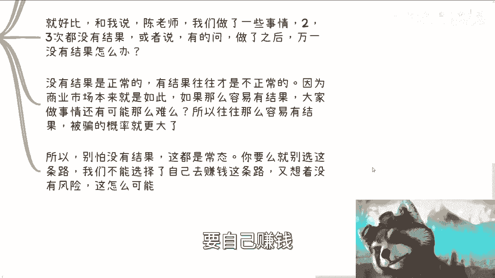

**核心认知：商业成功 ≠ 线性因果逻辑**

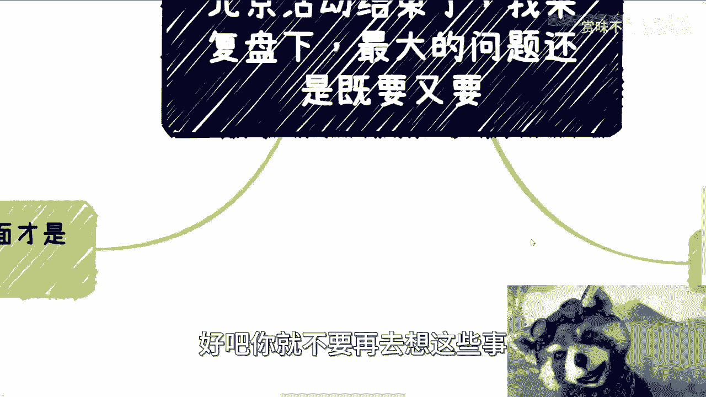

成功是少数，失败是常态。如果你轻易就获得了一个“保证成功”的结果，那更需要警惕。一旦选择独立赚钱这条路，就必须接受风险与不确定性。幻想“低风险、高回报、自己主导”三者兼得，是不切实际的。

## 四、重在实践积累，拒绝纸上谈兵 📚

最后，也是最关键的一点，是从“想”到“做”的跨越。

我们的大部分讨论容易停留在理论层面。真正的战斗始于实践、积累和经验。例如，当建议“可以寻找协会合作”时，部分人的思维是希望被直接告知“找哪个协会、具体联系人、并带领完成对接”。这形成了不现实的闭环。

**这种行为模式在互联网上被称为：`伸手党`。**

真正的积累意味着你需要主动去了解合作对象的运作规则，例如政府采购、企业招投标的流程等。在尚未了解基本规则的情况下，追问具体操作步骤是无效的。所有有效的合作都建立在理解对方游戏规则的基础之上。

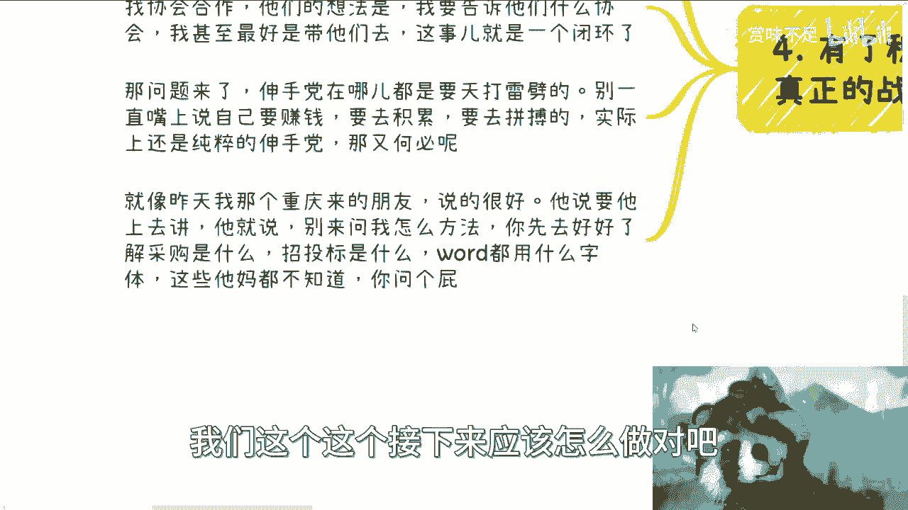

---

## 总结与后续安排 📅

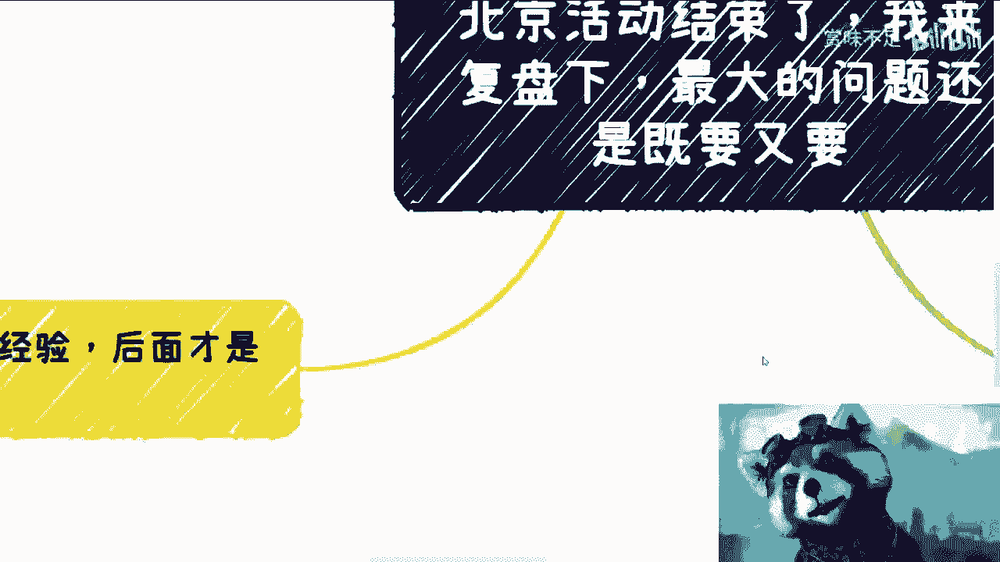

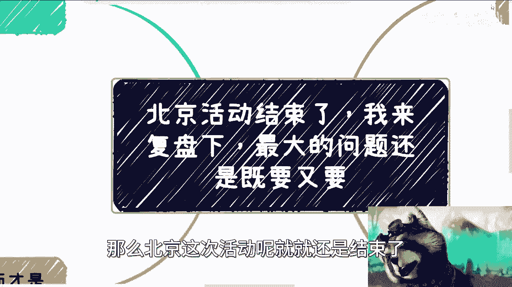

北京活动已圆满结束。后续活动将主要安排在上海、北京等地，杭州计划可能在年后。上海近期活动报名已截止。

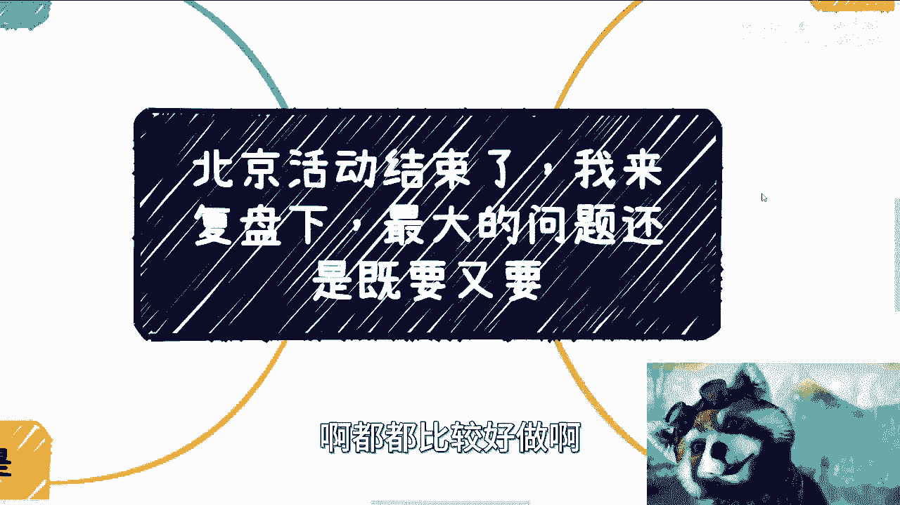

本次北京活动交流的核心收获在于：
1.  大家的目标和想法都很清晰。
2.  **实践能力有待提高**，需要更多实际行动。
3.  遇到问题时应积极沟通验证，避免自我设限和空想。

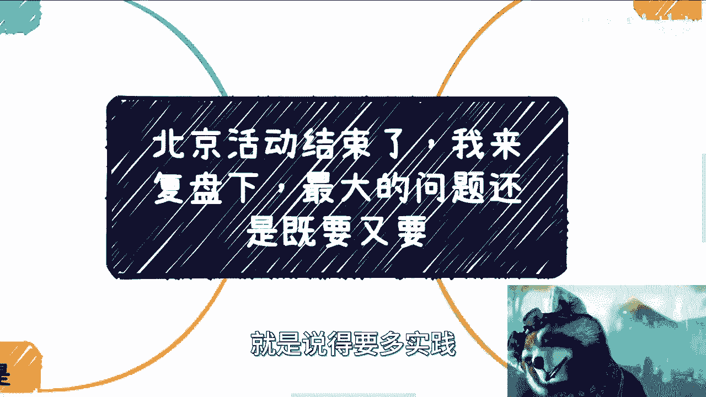

深圳活动预计在1月举行，时间待定。如有简单问题，可通过私信交流；若有复杂的商业合作或合同问题，请整理好具体材料后再进行咨询。

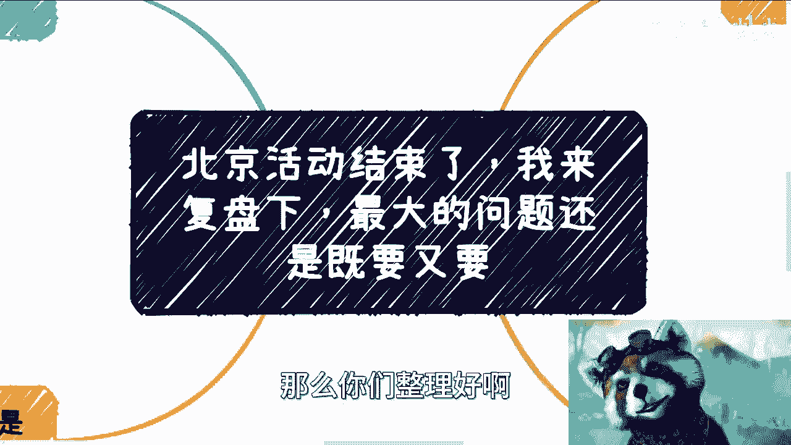

**本节课总结**：我们一起剖析了“既要又要”心态的四种表现：**急功近利、目的错位、畏惧失败、缺乏实践**。解决之道在于：**独立探索完成铺垫、明确目标同频交流、拥抱风险果断行动、深入实践积累真知**。记住，商业之路没有标准答案，真正的成长源于持续的认知更新与亲身体验。